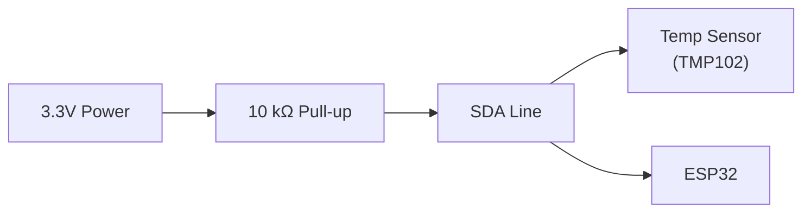

# CLAUDE.md

This file provides guidance to Claude Code when working with this repository.

## Repository Overview

**Exploring Electronics** teaches electronics and physical computing to software developers and engineers through a progressive learning journey—from understanding a resistor to designing and building real circuits. It follows the same editorial standards and progressive structure as the other exploring_* sites.

**Target Audience:** Software developers, platform engineers, and DevOps professionals who want to understand the hardware side of computing—Arduino, Raspberry Pi, ESP32, sensors, circuits, and the electronics underlying IoT and embedded systems.

**Teaching Philosophy:** Every article starts with a software engineer's mental model (code, variables, functions, APIs) before introducing electronics theory. Hardware concepts are connected to things they already know: GPIO pins as function arguments, voltage dividers as analog data, serial protocols as network packets.

## Content Architecture: Topics

This site has no tiers and no paywall — it's organized purely by **topic**: the subject of the article (circuit foundations, microcontrollers, etc.). Depth within a topic progresses naturally as articles accumulate, but that progression is signaled with a lightweight per-article difficulty tag, not a tier structure.

**The six stable topics** (each grows over time as articles are added):

1. **Circuit Foundations** — voltage/current/resistance, series & parallel, dividers, capacitors
2. **Reading Circuits** — schematics, symbols, datasheets
3. **Components** — resistors, LEDs, transistors, diodes, ICs
4. **Microcontrollers** — digital I/O, analog/PWM, sensors, serial, interrupts
5. **Communication** — I²C, SPI, UART
6. **Power** — supplies, regulators, batteries

**Navigation rules:**

- Nav is **topic-first**: each topic is its own top-level nav group (`Circuit Foundations`, `Reading Circuits`, `Microcontrollers` …). No tier wrapper above them.
- Add a topic to the nav **only once it has a published article** — never show empty groups.
- **Practical Tools** is a cross-cutting reference shelf (breadboards, arduino-cli, multimeter, soldering…), **not** a topic. Keep it as its own top-level section.
- **Directory stays flat for now** (`docs/*.md`, plus `tools/`). Defer splitting into topic subdirectories (e.g., `microcontrollers/`) until a topic has ~3+ articles — grouping today is nav-label only.

**Difficulty tags:** Each article carries a small `!!! abstract "Beginner"` / `"Intermediate"` / `"Advanced"` admonition right under the H1, with a line or two of framing (prerequisites, what topic it's in). This replaces tier badges — it's a per-article depth signal, not a site section or funnel stage.

**Development phases:** No fixed phase order — build out topics as interest allows. Start each topic with a Beginner article before going deeper into it.

## Important Preferences

**Git Operations**: The user handles all git operations (commits, pushes, etc.) themselves. Do not commit or push changes.

**MkDocs Operations**: The user handles running `mkdocs serve` and `mkdocs build` themselves. Do not run these commands.

## Audience and Difficulty Tags

**IMPORTANT**: A Beginner-tagged article is NOT software-developer-specific. It targets any serious adult beginner — no software background assumed, no software analogies. Software analogies only enter once the article assumes some electronics literacy (Intermediate and up) — see below.

**Who reads this site:**
- Anyone who wants to learn electronics properly: hobbyist, career-changer, retiree, maker, curious professional from any field, or a software developer/platform engineer wanting the hardware side of computing (Arduino, Raspberry Pi, ESP32, IoT, embedded systems)
- Some readers stop at wiring a breadboard and blinking an LED; others go on to design their own circuits, read datasheets, or ship production hardware — the site should serve all of them as they grow, without gatekeeping any of it behind a tier

Every article carries a **difficulty tag** — `Beginner`, `Intermediate`, or `Advanced` — as a one-line admonition under the H1. Pick the tag by what the article assumes the reader already knows, not by some predetermined publishing phase:

- **Beginner** — no prior electronics knowledge required, no software or coding background assumed. Mentor-to-learner voice, warm but serious, adult-to-adult. Safety-first: explain consequences before risky steps. **No software analogies** — anchor explanations in physical reality (water pressure, pipe flow, household wiring). Reassuring: mistakes are recoverable at these voltages.
- **Intermediate** — assumes basic circuit concepts (voltage, current, resistance), wiring a breadboard, using a multimeter, and microcontroller basics (GPIO, PWM, serial) on at least one platform. Peer-to-peer, no hand-holding, treat them as engineers. Connect electronics to their software engineering context. Safety warnings still apply, framed professionally rather than reassuringly. **Required section: "Where You've Seen This"** — bridges their software experience to the electronics concept (e.g., I2C handshake → TCP connection setup).
- **Advanced** — assumes circuit design, component selection, power electronics, and communication protocols (I2C, SPI, UART, USB) at the register level are second nature. Colleague-to-colleague, skip the basics, focus on professional concerns: cost, reliability, regulatory compliance (CE, FCC, RoHS), production reliability. Deep technical depth, no apologies for complexity.

**Safety is never optional at any tag** — only the framing (reassuring vs. professional vs. regulatory/standards) changes.

---

## SEO Strategy and Publication Process

**CRITICAL**: This site uses a draft/publish workflow to ensure only vetted content appears in search engines and the sitemap.

### SEO Configuration Overview

The site has comprehensive SEO optimization:

1. **Sitemap**: Auto-generated by MkDocs at `/sitemap.xml` when `site_url` is configured
2. **robots.txt**: Located at `docs/robots.txt`, points to sitemap
3. **Meta plugin**: Injects canonical URLs to prevent duplicate content
4. **Social cards**: Open Graph images auto-generated for social media sharing
5. **Google Analytics**: Configured with tracking ID
6. **Exclude plugin**: Prevents unpublished content from appearing in builds and sitemap

### Required Metadata for Every Article

**MANDATORY**: Every article MUST have frontmatter metadata before being published:

```yaml
---
title: "Title With a Colon: Must Be Quoted"
description: Compelling description for search results (150-160 chars ideal)
---
```

**CRITICAL**: If the title contains a colon (`:`) it **must** be quoted — unquoted colons cause PyYAML to misparse the frontmatter silently.

**Rules:**

- **Title**: Should be unique across the site, descriptive, include key terms
- **Description**: Summarize what the reader will learn, compelling call-to-action
- **No keywords needed**: Modern search engines don't rely on keyword meta tags
- **Check length**: Titles >60 chars and descriptions >160 chars get truncated in search results

### The Exclude Plugin Strategy

**Problem**: MkDocs by default includes ALL `.md` files in builds and sitemaps, even draft/unpublished content.

**Solution**: The `mkdocs-exclude` plugin configured in `mkdocs.yaml` excludes unpublished directories from:
- Site builds
- Sitemap generation
- Search indexing
- Navigation (even if accidentally uncommented)

**Current exclude configuration** (as of 2026-07-12):

```yaml
plugins:
  - search
  - meta
  - exclude:
      glob:
        - "tools/multimeter.md"
        - "tools/soldering.md"
        - "tools/bench_power_supply.md"
  # ... other plugins
```

**Published articles (not in exclude list):**
- `what_is_electricity.md`
- `series_and_parallel.md`
- `reading_schematics.md`
- `resistor_color_codes.md`
- `what_is_an_arduino.md`
- `digital_io.md`
- `blink_an_led.md`
- `pull_resistors.md`
- `tools/breadboards.md`
- `tools/arduino_cli.md`

**What this means:**
- Draft articles can exist in `docs/` without appearing in search results
- Articles can be worked on incrementally without affecting SEO
- Only vetted, published content appears in sitemap and builds

### How to Publish an Article

When an article is ready for publication (passes all quality checks), follow these steps **in order**:

#### 1. Pre-Publication Checklist

Complete the [Quality Standards Checklist](#quality-standards-checklist) below. Do NOT proceed until all items are checked.

#### 2. Remove from Exclude List

Edit `mkdocs.yaml` and remove the directory from the exclude plugin:

**Before (draft):**
```yaml
- exclude:
    glob:
      - "intro_to_circuits.md"  # Article is excluded
```

**After (published):**
```yaml
- exclude:
    glob:
      # intro_to_circuits.md is now published
```

**IMPORTANT**:
- Remove the ENTIRE line, don't just comment it
- Since articles are flat in `docs/`, exclude entries are always individual file paths, not directory globs

#### 3. Add to Navigation

Uncomment the article in the `nav:` section of `mkdocs.yaml`.

#### 4. Verify Publication

```bash
# Build the site
poetry run mkdocs build --strict

# Check sitemap includes the new article
grep -o '<loc>[^<]*</loc>' site/sitemap.xml | grep the-article-slug
```

#### 5. Update CLAUDE.md Exclude List

Update the "Current exclude configuration" section above to reflect what's NOW excluded.

### SEO Checklist for Published Articles

Before removing an article from the exclude list, verify:

- [ ] **Frontmatter metadata present** - Title and description in YAML frontmatter
- [ ] **Title is unique** - Not duplicated across other published articles
- [ ] **Description is compelling** - 150-160 chars, summarizes value
- [ ] **All images have alt text**
- [ ] **All links work** - Internal links point to published articles only
- [ ] **No "coming soon" dead links** - Replace with plain text or link to overview
- [ ] **External links are valid** - Use WebFetch to verify important URLs
- [ ] **Headings are hierarchical** - One H1, logical H2-H6 structure
- [ ] **No duplicate content** - Cross-link instead of repeating other articles

### Common SEO Mistakes to Avoid

1. **Linking to unpublished articles** - Always check if target article is in exclude list before linking
2. **Forgetting to update exclude list** - When publishing, remove from exclude glob
3. **Missing metadata** - Every article needs title and description
4. **Publishing incomplete articles** - Follow full quality checklist before publishing
5. **Leaving articles in navigation but excluded** - Navigation and exclude list must align

---

## CRITICAL: No Repetition - Respect Reader's Time

**This is an absolute deal-breaker for content quality.**

### The Principle

Avoid duplication and repetition at all costs. Every time we repeat information, we waste the reader's time and make the content feel bloated.

### The Rules

1. **Cross-link instead of repeating** - If a concept is explained elsewhere, link to it
2. **Only repeat for significantly different perspectives** - Brief intro vs. deep dive is acceptable; same explanation twice is not
3. **Progressive depth, not repetition** - Each article builds WITHOUT re-explaining previous articles
4. **Audit before publishing** - Search for repeated concepts across published articles

### Before Explaining Any Concept, Ask:

1. Have we explained this elsewhere in the same topic?
2. If yes, is my perspective SIGNIFICANTLY different?
3. If no, add a cross-link: "Remember X from [Article]? Now let's see how..."
4. If yes, explicitly state the new angle: "Earlier we covered voltage conceptually — now let's measure it"

### Required: Pre-Publication Repetition Audit

Before marking any article complete, use the Explore agent to search for repeated concepts across published articles in the same topic. If found, consolidate and cross-link.

---

## Project Structure

- `docs/` - Markdown content, flat (grouped by topic in nav, not in directories — see Content Architecture above)
  - `tools/` - Practical Tools cross-cutting reference shelf (not a topic)
  - `images/` - Diagrams and circuit photos
    - `images/schematics/` - generated schematic SVGs (output of `schematics/`; committed and served)
  - `stylesheets/` - Custom CSS (`extra.css`)
- `schematics/` - schemdraw source for circuit schematics (see `schematics/README.md`)
- `mkdocs.yaml` - Site configuration and navigation
- `pyproject.toml` - Poetry dependencies

**Important:** Topic articles live flat in `docs/`; topic grouping is nav-label only (see Content Architecture above). `tools/` remains its own subdirectory. Articles reference each other using relative paths (e.g., `filename.md`, `tools/filename.md`).

## Common Commands

```bash
# Install dependencies
poetry install

# Serve locally (http://localhost:8000)
poetry run mkdocs serve

# Build static site (ALWAYS use --strict for link validation)
poetry run mkdocs build --strict

# Regenerate circuit schematics (only when a schematic source changes)
poetry install --with schematics   # one-time, installs schemdraw
poetry run python schematics/build.py
```

**Link Validation:** The project uses `mkdocs-htmlproofer-plugin` to validate all internal links. Always build with `--strict` flag to catch broken links.

**Schematics:** Real circuit schematics are generated from Python (schemdraw) into `docs/images/schematics/`. See the [Schematics Workflow](#schematics-workflow-schemdraw) section and `schematics/README.md`. The committed SVGs are served directly, so a normal `poetry install` / CI build needs nothing from the `schematics` group.

---

## Content Guidelines

### Tone and Style

Tone varies by each article's difficulty tag. See **Audience and Difficulty Tags** above. The key rule:

- **Beginner** → mentorship voice, safety-first, physical (not software) analogies, reassuring
- **Intermediate** → peer-to-peer, no hand-holding, expects electronics literacy, software analogies bridge in
- **Advanced** → colleague-to-colleague, production focus, full technical depth

**Core Principles (every article):**

- **Safety-first**: Electronics can injure (mains voltage), start fires (lithium batteries), destroy components. Never omit safety context.
- **Software analogies for Intermediate/Advanced**: this audience codes for a living — use that once the article isn't Beginner-tagged. GPIO = function parameter. Voltage = pressure. Pull-up resistor = default parameter value.
- **Purpose-driven**: Always explain the "why" before the "how"
- **Practical focus**: Real components, real values, real circuits — not vague theory
- **No emoji spam**: limit to 1-3 per article, used strategically

**Beginner tone specifically:**

- Empathetic openings anchored in physical experience: "You've seen a fuse blow. Here's why."
- Safety-first: explain what can go wrong and why, before any risky steps
- Mentorship voice: "I'll show you..." not "You must..."
- Physical analogies: water pressure, pipe flow, household wiring — no software comparisons

**Intermediate tone specifically:**

- Peer-to-peer: assume they've wired a breadboard and can use a multimeter
- Required: **"Where You've Seen This"** section — connects electronics concept to software engineering experience (e.g., I2C handshake → TCP connection setup)
- Safety warnings still apply, but framed professionally — not reassuringly

**Required Sections (every article):**

1. Opening hook with real-world context (Beginner: empathetic; Intermediate/Advanced: scenario-based)
2. **"Where You've Seen This"** — **(Intermediate/Advanced required)** bridges software knowledge to electronics concept
3. Core content with circuit examples, component values, and code snippets
4. Safety warnings where appropriate
5. Practice exercises with expandable solutions (`??? question`)
6. Quick Recap / Key Takeaways
7. What's Next — progression to next article
8. Further Reading — organized by category

---

### Electronics-Specific Writing Guidelines

#### Safety Warnings — NEVER Skip These

Use the `!!! danger` admonition for life-safety hazards:

```markdown
!!! danger "Mains Voltage (120V / 240V AC)"
    Never connect mains voltage to a breadboard or to any circuit without proper isolation and
    enclosures. Lethal current levels begin at 50mA. Always use a GFCI outlet and appropriate
    fusing when working near mains power.
```

Use `!!! warning` for equipment-destroying risks:

```markdown
!!! warning "Reverse Polarity"
    Connecting a component backwards can destroy it instantly. Always double-check polarity
    before powering a circuit. Electrolytic capacitors and diodes are polarized components.
```

**Safety escalation by difficulty tag:**

- Beginner: Full explanation with WHY it's dangerous, not just "be careful"
- Intermediate: Professional callout — brief, assumes competence
- Advanced: Regulatory/standards context (IEC 60950, UL listing, etc.)

#### Component Values and Units

**ALWAYS use standard SI prefixes in prose:**

- Resistance: Ω, kΩ, MΩ (not "ohms" or "kohm" in value notation)
- Capacitance: pF, nF, µF (not "microfarads" inline; use µF symbol)
- Inductance: nH, µH, mH
- Voltage: mV, V
- Current: µA, mA, A
- Frequency: Hz, kHz, MHz, GHz
- Power: mW, W

**Component value formatting in prose:**

- ✅ Correct: "a 10 kΩ resistor", "a 100 µF capacitor", "3.3V supply rail"
- ❌ Wrong: "a 10k resistor", "a 100uf cap", "3.3 volts"

**Component names in prose:**

- ✅ Correct: "Use a `74HC595` shift register"
- ✅ Correct: "The `ESP32` module"
- ❌ Wrong: "Use a 74HC595 shift register" (chip names get backticks like command names)

#### Code Examples

Electronics articles include both **circuit diagrams** and **code**. Both must be treated as first-class teaching tools.

**Code formatting:**

```markdown
``` python title="Read a Temperature Sensor (MicroPython)" linenums="1"
from machine import I2C, Pin
import time

i2c = I2C(0, scl=Pin(22), sda=Pin(21))  # (1)!
addr = 0x48  # (2)!

while True:
    raw = i2c.readfrom(addr, 2)
    temp = ((raw[0] << 8) | raw[1]) >> 4  # (3)!
    print(f"Temperature: {temp * 0.0625:.1f}°C")
    time.sleep(1)
```

1. I2C bus 0, with GPIO22 as clock and GPIO21 as data
2. Default I2C address for the TMP102 sensor
3. The 12-bit temperature value is left-aligned in the two bytes
```

**Code language priority for electronics articles:**

- **MicroPython** — default for microcontroller examples (most accessible, Python syntax)
- **Arduino C/C++** — when hardware library support is better or more common
- **Python (host-side)** — for data collection, serial communication, Raspberry Pi scripts
- Provide tabs when both MicroPython and Arduino C are relevant

**Tab format for multi-platform examples:**

```markdown
=== ":material-language-python: MicroPython"

    ```python title="Blink LED" linenums="1"
    from machine import Pin
    import time

    led = Pin(25, Pin.OUT)
    while True:
        led.toggle()
        time.sleep(0.5)
    ```

=== ":simple-arduino: Arduino C"

    ```cpp title="Blink LED" linenums="1"
    const int LED_PIN = 13;

    void setup() {
        pinMode(LED_PIN, OUTPUT);
    }

    void loop() {
        digitalWrite(LED_PIN, HIGH);
        delay(500);
        digitalWrite(LED_PIN, LOW);
        delay(500);
    }
    ```
```

#### Circuit Diagrams

Three distinct visual types, each with a specific job — do not substitute one for another:

- **Mermaid** — logical/block diagrams: power rails, signal paths, protocol flow, architecture. NOT real schematics (no component symbols).
- **schemdraw schematics** — true schematic symbols (resistor zig-zag, LED triangle, battery, etc.). This is the standard symbolic notation. See the schematics workflow below.
- **Photos** — real breadboard builds, oscilloscope screenshots, physical components.

**When to use which:**
- Mermaid: block diagrams, architecture, data flow, protocol timing concepts
- schemdraw schematic: any time you'd otherwise draw or screenshot a real circuit schematic
- Photo: actual breadboard layouts, the physical build, scope captures

In Beginner-tagged articles, pair a **photo first, then the schematic** (concrete board → symbolic notation), and have the caption decode the symbols — it teaches beginners to read schematics. See `series_and_parallel.md` for the established pattern.

**Mermaid block diagrams for electronics:**

```markdown

```

#### Schematics Workflow (schemdraw)

Real schematics are generated with [schemdraw](https://schemdraw.readthedocs.io/) — Python source in `schematics/`, rendered to committed SVGs under `docs/images/schematics/`. The committed SVGs (not the Python) are what the site serves, so articles reference them like any other image and never depend on the tooling. Full details in `schematics/README.md`.

**Layout:**

```
schematics/
  style.py            # shared dark-theme styling — the ONLY place colours live
  build.py            # regenerates every SVG
  circuits/<name>.py  # one circuit per file, exposes build(path)
docs/images/schematics/<name>.svg   # generated output (committed, served)
```

**Add a schematic:**

1. Create `circuits/<name>.py` with a `build(path)` function (copy an existing circuit as a template).
2. Build EVERY drawing through `dark_drawing()` from `style.py` — never `schemdraw.Drawing` directly, or it renders black-on-white and looks broken on the slate theme.
3. Regenerate: `poetry run python schematics/build.py`
4. Reference it in an article inside a `<figure markdown>` block, e.g. `{ width="500" }`.

**Dependency:** schemdraw lives in the optional `schematics` Poetry group — build-time only, not installed by CI (which just serves the committed SVGs). Install locally with `poetry install --with schematics` only when regenerating diagrams.

**Mermaid color scheme for this site (slate + amber accent):**

- Standard Node (Slate 800): `fill:#2d3748,stroke:#cbd5e0,stroke-width:2px,color:#fff`
- Highlighted Node (Amber 600): `fill:#d97706,stroke:#cbd5e0,stroke-width:2px,color:#fff`
- Darker Node (Slate 900): `fill:#1a202c,stroke:#cbd5e0,stroke-width:2px,color:#fff`
- Warning/Danger (Red 600): `fill:#c53030,stroke:#cbd5e0,stroke-width:2px,color:#fff`
- Success/Output (Green 700): `fill:#2f855a,stroke:#cbd5e0,stroke-width:2px,color:#fff`

#### Read-Only vs Risky Operations

Label every operation clearly for Beginner-tagged readers:

```markdown
- ✅ **Safe (Non-Destructive):** Reading voltages with a multimeter, measuring continuity, reading datasheets
- ⚠️ **Caution (Can Damage Components):** Applying voltage without checking polarity, exceeding GPIO current limits, hotplugging I2C devices
- 🚨 **DANGER (Can Injure or Destroy):** Mains voltage, lithium battery shorts, capacitor discharge
```

#### Datasheets and Official Sources

Always link to manufacturer datasheets when introducing a component:

```markdown
The `NE555` timer IC is one of the most produced chips in history.
([Datasheet](https://www.ti.com/lit/ds/symlink/ne555.pdf))
```

Validate all datasheet URLs with WebFetch before publishing — TI, Microchip, and others reorganize their documentation.

---

### Article Layout and Visual Structure

**CRITICAL**: Articles must not be simple circuit references. They must teach skills with context and serve multiple audiences through varied layout.

#### Visual Elements Required

1. **Mermaid Diagrams** (when circuit/protocol architecture exists)
   - Place at article top to show the big picture
   - Use for: block diagrams, protocol flows, power rails, signal paths
   - Follow the amber/slate color scheme above

2. **Card Grids** (for categorization)
   - Use `<div class="grid cards" markdown>` for grouping related components or concepts
   - Each card should explain "Why it matters" BEFORE showing circuit values or code
   - Format:
     ```markdown
     <div class="grid cards" markdown>

     -   :material-resistor: **Resistors**

         ---

         **Why it matters:** Every digital circuit uses resistors to limit current and set voltage levels.

         **Essential value:** Know Ohm's Law — `V = I × R`

         **Rule of thumb:** When in doubt, use 10 kΩ for pull-up resistors

     </div>
     ```

3. **Content Tabs** (for platforms, protocols, or complexity levels)
   - Use `=== "Tab Name"` for different microcontroller platforms or approaches
   - Examples:
     - "MicroPython" vs "Arduino C"
     - "ESP32" vs "Raspberry Pi"
     - "Breadboard Prototype" vs "Production Circuit"

#### Layout Patterns by Article Type

**Component Introduction Articles (like Resistors, Capacitors, LEDs):**

1. Opening — Software engineer's analogy hook
2. "Where You've Seen This" — connect to something they know
3. Mermaid Diagram — block diagram showing where this component fits
4. Card Grid — component types or common use cases
5. Core explanation with values and formulas
6. Code example (if component interfaces with a microcontroller)
7. Safety warnings
8. Practice Exercises
9. Quick Recap
10. What's Next
11. Further Reading

**Hands-On Project Articles (like "Blink an LED", "Read a Sensor"):**

1. Opening — "Here's what you'll build"
2. Parts list with exact component values
3. Wiring diagram (image or mermaid block diagram)
4. Step-by-step — wiring, then code
5. Verification — how to know it's working
6. Troubleshooting (collapsible)
7. Practice Exercises
8. What's Next
9. Further Reading

**Protocol/Communication Articles (like I2C, SPI, UART):**

1. Opening — Software bridge (protocols they already know: HTTP, TCP, serial)
2. "Where You've Seen This" — required
3. Mermaid Diagram — protocol timing or bus architecture
4. Technical details — addresses, timing, registers
5. Code Example — sending and receiving data
6. Common Issues and debugging
7. Practice Exercises
8. What's Next
9. Further Reading

#### Context Before Code

**NEVER start with code or circuit values.** Always provide context first:

- ❌ Bad: "Connect a 10 kΩ resistor between GPIO4 and 3.3V"
- ✅ Good: "GPIO inputs float to unpredictable values when disconnected. A pull-up resistor connects the pin to a known voltage (3.3V) through a high-resistance path, so the pin reads HIGH unless actively pulled LOW..."

---

### Cross-Linking Strategy

**Internal links:** Connect concepts progressively. Each article should link forward and backward in the learning path.

**Cross-link to cs.bradpenney.io** for computer science fundamentals:
- Serial protocols → How parsers work, FSMs
- Binary and hex → Computer science essentials

**Cross-link to other exploring_* sites:**
- Linux articles for Raspberry Pi GPIO via the command line
- Kubernetes articles when deploying IoT data pipelines
- Software Dev Tools articles for git workflows on embedded projects

---

## Quality Standards Checklist

Before uncommenting an article in `mkdocs.yaml`:

**✅ Content Quality:**

- [ ] **NO REPETITION AUDIT** - Searched for repeated concepts across published articles in the same topic (CRITICAL!)
- [ ] Opening hook with real-world relevance (Beginner: empathetic dev persona; Intermediate/Advanced: scenario-based)
- [ ] Clear learning objectives
- [ ] Circuit values and component specs are correct (verify against datasheets)
- [ ] Code examples tested (or clearly marked as illustrative)
- [ ] Safety considerations addressed (NEVER skip, regardless of difficulty tag)
- [ ] Practice exercises with nested solutions (`??? tip "Solution"` inside question)
- [ ] Key takeaways or quick recap
- [ ] What's Next progression
- [ ] Further Reading organized into categories (Datasheets, Official Docs, Deep Dives, Related Articles)

**✅ Technical Accuracy:**

- [ ] Component values are correct and practical
- [ ] Code compiles/runs (or validated syntax)
- [ ] Safety warnings for hazardous operations
- [ ] Datasheet links verified with WebFetch
- [ ] Platform-specific differences noted (3.3V vs 5V logic, ESP32 vs Arduino pin numbering)

**✅ Tone and Style:**

- [ ] Correct tone for the article's difficulty tag (Beginner vs Intermediate vs Advanced)
- [ ] "Where You've Seen This" section present (Intermediate/Advanced only, required)
- [ ] Software analogies used for unfamiliar hardware concepts (Intermediate/Advanced) / avoided in favor of physical analogies (Beginner)
- [ ] Safety-conscious throughout
- [ ] Emoji usage limited (1-3 max, strategic)
- [ ] No over-the-top marketing language

**✅ Layout and Structure:**

- [ ] Article is NOT a simple parts list or command reference — teaches skills with context
- [ ] Uses visual elements appropriately (mermaid block diagrams, card grids, tabs)
- [ ] Mermaid diagram at top (if circuit/protocol architecture exists)
- [ ] Card grids explain "Why it matters" before values/code
- [ ] Platform tabs for multi-platform examples (MicroPython vs Arduino C)
- [ ] Context provided BEFORE circuit values or code (never starts with syntax)

**✅ Formatting:**

- [ ] All code blocks have `title=` attribute (and `linenums="1"`)
- [ ] Component chip names in backticks in prose (e.g., `NE555`, `ESP32`, `74HC595`)
- [ ] Component values use correct SI units (kΩ not "kohm", µF not "uf")
- [ ] **CRITICAL: Blank lines before ALL lists** (recurring MkDocs rendering issue)
- [ ] Mermaid diagrams follow slate/amber color scheme
- [ ] Internal links use relative paths
- [ ] **External/datasheet links validated with WebFetch before publishing**

**✅ Integration and Links:**

- [ ] Pre-publication link audit completed
- [ ] **NEVER link to unpublished articles** - only link to articles uncommented in mkdocs.yaml
- [ ] Cross-links added between published articles in the same topic
- [ ] Referenced in "What's Next" from previous article
- [ ] Datasheet links included for every component introduced
- [ ] Cross-links to cs.bradpenney.io and other exploring_* sites where relevant

---

## Final Notes

This site teaches **electronics to software engineers and any serious adult beginner alike**. Once an article assumes some electronics literacy (Intermediate and up), ground concepts in something the reader already knows from software; below that (Beginner), ground them in physical experience instead.

**Beginner**-tagged articles — err on the side of:
- More safety context rather than less
- More physical, hardware-first analogies rather than software ones
- Simpler circuits before complex ones
- Reassurance that mistakes are recoverable (components are cheap; mains is not)

**Intermediate**-tagged articles — err on the side of:
- Peer-to-peer directness
- Connecting hardware behavior to software engineering principles
- Datasheets and primary sources over simplified summaries

**Advanced**-tagged articles — err on the side of:
- Production realities (cost, tolerances, regulatory)
- Deep technical depth
- Referencing standards and specifications

The goal: readers who can **confidently design, build, and debug real electronic circuits** — and understand the hardware underneath the software they ship.
