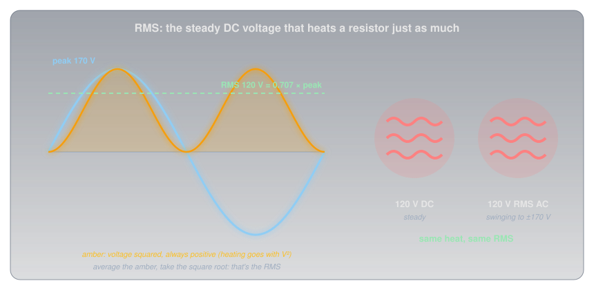
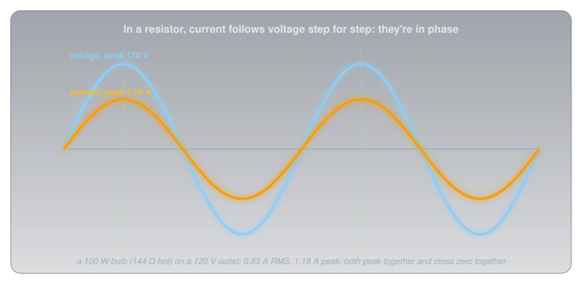
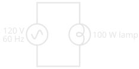
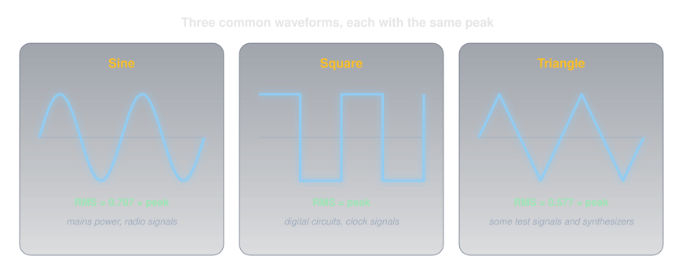

# AC vs DC

!!! abstract "Beginner"
    This article is in the **Circuit Foundations** topic. It builds on [Voltage](voltage.md), [Current](current.md), and [Ohm's Law and Power](ohms_law.md). It uses the prefixes from [Metric Prefixes and Units](metric_prefixes.md) for frequency.

A Canadian wall outlet is called "120 V". But measure its voltage moment by moment and it never sits at 120 V for long: it swings up to about **+170 V**, falls through zero, swings down to about **−170 V**, and comes back, sixty times every second. It passes through zero volts 120 times a second. So where does the "120" come from?

Two ideas answer it:

1. **Alternating current reverses direction over and over.** How often it repeats is its **frequency**, measured in hertz, and the smooth shape it follows is a **sine wave**, which is exactly what a spinning generator produces.
2. **RMS is the honest way to give an AC voltage one number.** It's the steady DC voltage that would heat a resistor just as much. For a sine wave it's 0.707 times the peak, which is where 120 comes from.

---

## DC: One Direction

Everything on this site so far has been **direct current** (DC): current that flows one way, steadily, like the current from a battery. [Current](current.md#one-way-or-back-and-forth) mentioned the alternative only in passing.

Direct current has a fixed polarity: the battery's + terminal is always +. That steadiness is exactly what electronics wants, which is why nearly every circuit, from an Arduino to a phone, runs on DC internally, even when it's plugged into the wall.

---

## Idea One: Alternating Current Reverses

**Alternating current** (AC) reverses direction at a regular rate. For half the time it flows one way around the circuit, and for the other half it flows the other way. The voltage that drives it rises to a peak, falls through zero, reverses to a negative peak, and returns.

<figure markdown>
  { width="760" }
  <figcaption>DC holds still; AC swings between two peaks and back, over and over.</figcaption>
</figure>

### Cycles, Period, and Frequency

One complete swing, up, down, and back to the start, is a **cycle**. The time one cycle takes is its **period**, and the number of cycles per second is its **frequency**.

???+ info "Definition: Hertz"

    **Frequency** is measured in **hertz** (Hz): one hertz is one cycle per second. The unit is named after Heinrich Hertz, the physicist who first demonstrated radio waves. Frequency and period are each other's reciprocal: period = 1 ÷ frequency.

Canadian mains power runs at **60 Hz**: 60 cycles every second, so each cycle lasts 1 ÷ 60 ≈ 16.7 milliseconds. Each cycle crosses zero twice, once on the way down and once on the way back up, so the voltage passes through zero 120 times a second.

### Where AC Comes From: The Generator

AC isn't an arbitrary choice. It's what a generator naturally makes. Turn a loop of wire between the poles of a magnet and the loop's own movement through the magnetic field pushes the electrons in it along (the magnetism source from [Voltage](voltage.md#where-voltage-comes-from)).

<figure markdown>
  { width="760" }
  <figcaption>One turn of the loop is one cycle of the wave.</figcaption>
</figure>

As the loop turns, the push changes smoothly:

- **At 0°** the sides of the loop move along the field lines, cutting none of them: no voltage.
- **At 90°** they cut straight across the field: maximum voltage.
- **At 180°** they're moving along the lines again: zero.
- **At 270°** they cut across again, but moving the opposite way: maximum voltage, reversed.

The voltage follows the sine of the loop's angle, which is why the wave is called a sine wave. Turn the loop 60 times a second and the result is 60 Hz.

### Why 60 Hz, and Why AC at All?

The first generators at Niagara Falls, built by Westinghouse in 1895, ran at 25 Hz, and some 25 Hz units there weren't retrofitted to 60 Hz until 2006. Westinghouse had already chosen 60 Hz in 1890, partly because lamps on low frequencies visibly flickered as their filaments cooled between peaks. North America settled on 60 Hz; most of Europe settled on 50 Hz.

The grid uses AC at all because of what [Ohm's Law and Power](ohms_law.md#why-power-lines-run-at-such-high-voltages) showed: long lines waste far less power at high voltage. A **transformer** can step a voltage up for transmission and back down for the home efficiently, but a transformer only works with a current that keeps changing. That made AC the practical choice for the grid. (Modern power electronics can now convert DC to very high voltages too, and some of the longest lines, including some of Hydro-Québec's, carry high-voltage DC.)

---

## Idea Two: RMS, One Honest Number for AC

An AC voltage is never one number for long, yet appliances, outlets, and meters all quote one. The useful question is: what does this AC do, compared with DC?

Heat answers it. A resistor heats according to the square of the voltage across it (P = V² / R, from [Ohm's Law and Power](ohms_law.md#two-more-forms)), and the square is positive whether the voltage is positive or negative. Average that heating over a whole cycle, and you can ask what steady DC voltage would produce the same heat. That equivalent is the **root-mean-square** (RMS) voltage: the square **root** of the **mean** (average) of the **squared** voltage.

<figure markdown>
  { width="760" }
  <figcaption>120 V RMS of AC heats exactly as much as 120 V of DC.</figcaption>
</figure>

For a sine wave, the RMS value works out to the peak divided by √2:

\[ V_{\text{RMS}} = \frac{V_{\text{peak}}}{\sqrt{2}} \approx 0.707 \times V_{\text{peak}} \qquad V_{\text{peak}} \approx 1.414 \times V_{\text{RMS}} \]

That's the opening puzzle solved. A Canadian outlet's "120 V" is its RMS value, the DC equivalent for heating, and its actual peak is 120 × 1.414 ≈ **170 V**. From the positive peak to the negative peak is about 340 V. Unless a voltage is labelled otherwise, AC voltages are always quoted as RMS, and a multimeter on its AC setting displays RMS. Many meters calculate it by assuming the wave is a sine; a meter marked **true-RMS** measures it properly for any shape.

### AC in a Resistor

Ohm's Law still holds for AC through a resistor, moment by moment: at every instant, the current is the voltage at that instant divided by the resistance. So voltage and current rise, peak, and cross zero together. They're **in phase**.

<figure markdown>
  { width="720" }
  <figcaption>In a resistor, current and voltage keep perfect step.</figcaption>
</figure>

With RMS values, all the familiar formulas carry straight over. The 100 W bulb from [Ohm's Law and Power](ohms_law.md#the-bulb-solved), 144 Ω hot, draws 120 V ÷ 144 Ω ≈ 0.83 A RMS on a 120 V outlet, and 120 V × 0.83 A = 100 W, exactly its rating. (Components that store energy, like coils and capacitors, can push current and voltage out of step; that's a later article's story.)

<figure markdown>
  { width="300" }
  <figcaption>The AC source symbol is a circle with a tilde (~) inside, the sine wave in miniature.</figcaption>
</figure>

### Other Waveforms

A sine wave isn't the only shape a changing voltage can take, and each shape has its own relationship between peak and RMS.

<figure markdown>
  { width="760" }
  <figcaption>Same peak, different shapes, different RMS values.</figcaption>
</figure>

- **Sine waves** come from rotating generators and from radio transmitters. Mains power is a sine wave.
- **Square waves** jump between two levels. An Arduino pin switching on and off ([Digital Pins](digital_io.md)) makes one. Since a square wave sits at its peak (positive or negative) the whole time, its RMS equals its peak.
- **Triangle waves** ramp steadily up and down, with an RMS of about 0.577 times the peak.

---

## Frequencies You'll Meet

Alternating current isn't only mains power. Any voltage that reverses is AC, and the same ideas of frequency and cycles cover everything from the grid to radio.

<figure markdown>
  { width="760" }
  <figcaption>From the grid to Wi-Fi, a span of a hundred million times.</figcaption>
</figure>

A radio signal is simply alternating current at a very high frequency: millions of cycles per second in the amateur bands, billions in Wi-Fi.

---

## Safety: Mains AC Is Lethal

The thresholds from [Current](current.md#safety-current-is-what-hurts) were measured for exactly this kind of current, 60 Hz AC, and the reversals make it worse: above about 16 mA, 60 Hz current clamps the muscles of the hand shut so the victim can't let go.

!!! danger "Respect the Peak"
    A 120 V outlet peaks at about 170 V, and a 240 V circuit at about 340 V. Insulation, capacitors, and other parts connected to mains must be rated for the peak, not the RMS. Never work on mains-powered circuits; every project on this site runs from batteries or USB.

---

## Practice

??? question "1. Peak From RMS"

    A European outlet supplies 230 V RMS. What's its peak voltage?

    ??? tip "Solution"
        \( 230 \times 1.414 \approx 325\ \text{V} \).

??? question "2. RMS From Peak"

    An AC signal on an oscilloscope peaks at 10 V. What's its RMS voltage, if it's a sine wave? If it's a square wave?

    ??? tip "Solution"
        Sine: \( 10 \times 0.707 \approx 7.07\ \text{V} \) RMS. Square: **10 V** RMS, because a square wave spends all its time at its peak level.

??? question "3. Period"

    What's the period of 60 Hz mains? Of 50 Hz mains?

    ??? tip "Solution"
        \( 1 / 60 \approx 16.7\ \text{ms} \) and \( 1 / 50 = 20\ \text{ms} \).

??? question "4. A Radio Frequency"

    A radio operates on 7,040 kHz. How many cycles per second is that, and what's its period?

    ??? tip "Solution"
        7,040 kHz is 7,040,000 cycles per second (7.04 MHz). Its period is \( 1 / 7{,}040{,}000 \approx 142\ \text{ns} \), about 142 billionths of a second.

??? question "5. Household Waveform"

    What shape is the voltage waveform from a household outlet, and what produces that shape?

    ??? tip "Solution"
        A **sine wave**, produced by the rotating generators at the power station: a loop turning steadily in a magnetic field makes a voltage that follows the sine of its angle.

??? question "6. A 60 W Bulb"

    A 60 W bulb is used on a 120 V RMS outlet. What RMS current does it draw, and what's the peak current?

    ??? tip "Solution"
        \( I_{\text{RMS}} = 60 / 120 = 0.5\ \text{A} \). Peak: \( 0.5 \times 1.414 \approx 0.71\ \text{A} \).

---

## Quick Recap

-   **DC and AC**

    ---

    DC flows one way. AC reverses direction over and over.

-   **Frequency**

    ---

    Cycles per second, in hertz. Canadian mains: 60 Hz, a period of 16.7 ms.

-   **The generator**

    ---

    A loop turning in a magnetic field makes a sine wave: one turn, one cycle.

-   **RMS**

    ---

    The DC voltage that heats a resistor just as much. Sine: RMS = 0.707 × peak.

-   **120 V means 170 V peak**

    ---

    AC voltages are quoted as RMS unless stated otherwise. Parts on mains must handle the peak.

-   **In phase in a resistor**

    ---

    Voltage and current peak and cross zero together; Ohm's Law works moment by moment.

---

## What's Next

The generator in this article worked because a moving magnet pushes electrons along a wire. **[Magnetism and Electromagnetism](magnetism.md)** explains why, and how the same idea builds electromagnets and transformers.

---

## Further Reading

**History and Reference**

- [Utility Frequency — Wikipedia](https://en.wikipedia.org/wiki/Utility_frequency) — why North America uses 60 Hz, Niagara's 25 Hz, and Europe's 50 Hz
- [Root Mean Square — Wikipedia](https://en.wikipedia.org/wiki/Root_mean_square) — the RMS of sine, square, and triangle waves

**Deep Dives**

- [Alternating Current — Wikipedia](https://en.wikipedia.org/wiki/Alternating_current) — generation, transmission, and transformers

**Related Articles**

- [Ohm's Law and Power](ohms_law.md) — why the grid runs at high voltage, and the bulb used here
- [Current](current.md) — the body's thresholds for 60 Hz current
- [Metric Prefixes and Units](metric_prefixes.md) — kilohertz, megahertz, and gigahertz
