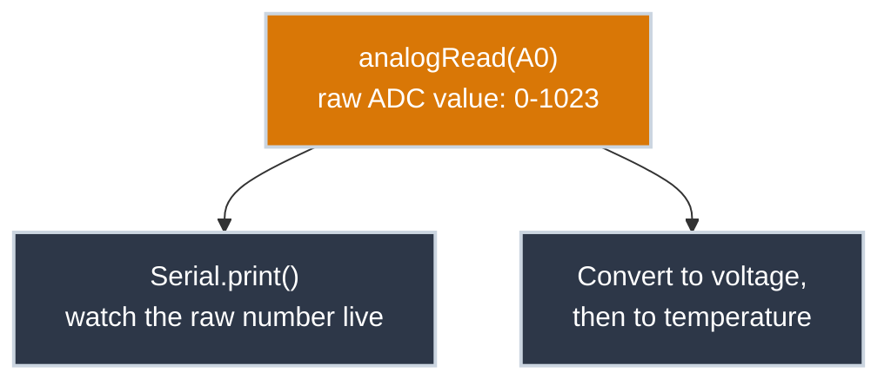
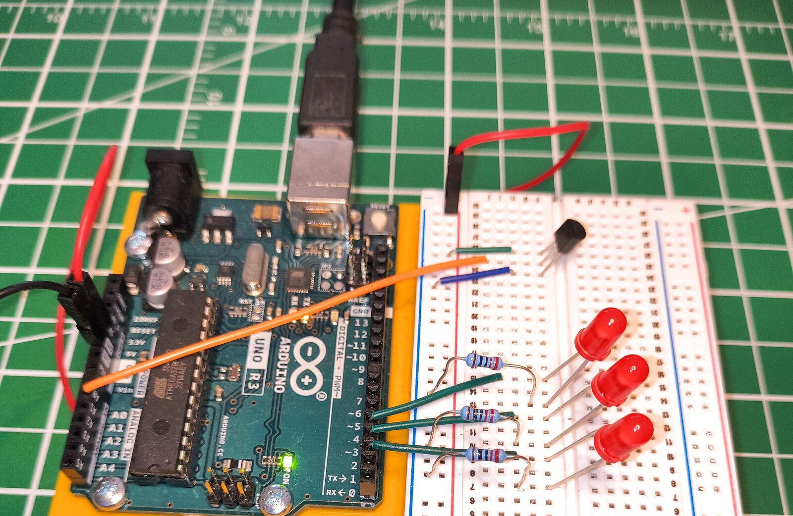
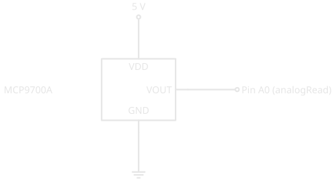

# Reading an Analog Sensor

!!! abstract "Beginner"
    This article is in the **Microcontrollers** topic. It follows [Pull-up and Pull-down Resistors](pull_resistors.md) and assumes you're comfortable with [Digital Pins](digital_io.md). It wires up the sensor explained in [Temperature Sensors](temperature_sensors.md) — read that first if you haven't, since this article leans on its formula without re-deriving it.

Say you've tucked a switch, a small server, or anything else that shouldn't overheat into a closet, a cabinet, or some other space you don't walk past every day. The only way to know it's gotten hot in there is to open the door and check — by which point it may have been cooking for hours. What you actually want is a sensor sitting in there that can tell you the temperature without you ever opening the door.

Every microcontroller project so far on this site has read the world in exactly two states: a button is pressed or it isn't, a pin is HIGH or LOW. Temperature doesn't work that way — it's a continuous value, and a digital pin genuinely can't represent "22.4 degrees." This article wires up the `MCP9700A` from [Temperature Sensors](temperature_sensors.md) and introduces the tool that reads it: an **analog pin**.

---

## From Two States to 1,024



A digital pin's `digitalRead()` can only ever return two answers. An **analog pin** — on an Arduino Uno, the pins labelled `A0` through `A5` — measures the actual voltage present on the wire and reports *where* it falls between 0V and the supply voltage, as a number.

The circuit inside the microcontroller that does this measuring is called an **ADC** — an **analog-to-digital converter**. The Uno's ADC has 10 bits of resolution, meaning it divides the 0–5V range into 1,024 discrete steps and reports which step the voltage landed closest to: `0` for 0V, `1023` for the full 5V, and everything else somewhere in between. That raw number is what `analogRead()` hands back — not a voltage, not a temperature, just a position in that 1,024-step scale.

!!! info "Why 1,024 and not some rounder number"
    1,024 is \( 2^{10} \) — ten binary digits' worth of precision, which is what "10-bit ADC" means. The chip literally represents the reading as a 10-bit binary number internally; 1,024 is simply every value that number can hold.

---

## What You'll Build

<figure markdown>
  { width="600" }
  <figcaption>The MCP9700A wired straight to an Arduino: VDD to the 5V rail, GND to ground, VOUT to A0. No resistor needed — the pin is only measuring a voltage, not driving current through anything. (The three LEDs are for [Building a Threshold Ladder](threshold_output.md) — ignore them for now.)</figcaption>
</figure>

Drawn as a schematic:

<figure markdown>
  { width="480" }
  <figcaption>Three wires, no resistor. VOUT feeds A0 directly, since analogRead() only measures voltage — it draws essentially no current.</figcaption>
</figure>

Notice what's missing compared to every LED circuit so far: no current-limiting resistor. A resistor's job is limiting current through something, and here nothing is being driven — the pin is just listening to a voltage the sensor is already producing on its own.

---

## Reading and Converting the Value

Two conversions turn the raw ADC number into a temperature: first ADC steps to voltage, then voltage to temperature using the formula from [Temperature Sensors](temperature_sensors.md).

``` cpp title="Read the MCP9700A and print temperature" linenums="1"
const int sensorPin = A0;

void setup() {
  Serial.begin(9600); // (1)!
}

void loop() {
  int sensorVal = analogRead(sensorPin); // (2)!

  float voltage = (sensorVal / 1024.0) * 5.0; // (3)!
  float temperature = (voltage - 0.5) * 100; // (4)!

  Serial.print("Raw: ");
  Serial.print(sensorVal);
  Serial.print(", Volts: ");
  Serial.print(voltage);
  Serial.print(", Celsius: ");
  Serial.println(temperature);

  delay(100);
}
```

1. Opens a serial connection to your computer at 9600 baud — this is what the Serial Monitor listens to.
2. Reads the raw ADC value on A0: an integer from `0` to `1023`.
3. Scales the raw value against the 1,024-step range and the 5V supply to recover the actual voltage.
4. Applies the `MCP9700A`'s formula from [Temperature Sensors](temperature_sensors.md): subtract the 500 mV offset, then divide by 10 mV/°C — done here as `× 100` since the voltage is already in volts, not millivolts.

The `sensorVal` is declared as an `int` because `analogRead()` always returns a whole number — there's no fractional ADC step. `voltage` and `temperature`, by contrast, are `float`, because a fraction of a degree is a meaningful, real answer once you're doing the math instead of counting discrete steps.

---

## Verifying It Works

Upload the sketch with [arduino-cli](tools/arduino_cli.md), then open the Serial Monitor. You should see a new line roughly every tenth of a second, something close to:

```
Raw: 148, Volts: 0.72, Celsius: 22.00
```

Hold the sensor gently between two fingers for a few seconds — body heat is well above room temperature, so the number should climb noticeably within a couple of seconds. Let go and it should drift back down. That live response is the entire point: you're watching a physical quantity move in real time, not just a fixed printed value.

??? note "Troubleshooting"

    **Raw value stuck at 0** — check that VOUT is actually connected to A0, not left floating, and that GND is genuinely connected to the Arduino's ground, not just to the sensor's own leg.

    **Raw value stuck at 1023** — usually VDD and VOUT swapped. Recheck the pinout against [Temperature Sensors](temperature_sensors.md) before applying power again.

    **Readings jump around wildly** — a loose breadboard connection is the most common cause. The `MCP9700A`'s TO-92 body sits proud of the board on three stiff legs, which makes it easy for one leg to seat fully while another barely makes contact; reseat the sensor and press each leg down individually.

    **Temperature reads plausible but off by several degrees** — this is normal. Revisit the [accuracy note](temperature_sensors.md#inside-an-analog-temperature-ic) in the sensor article; an `MCP9700A` isn't a precision instrument.

---

## Practice

??? question "1. Reading the raw value"

    Your Serial Monitor shows `Raw: 205`. What voltage does that correspond to, and what temperature?

    ??? tip "Solution"

        Voltage: \( (205 / 1024.0) \times 5.0 = 1.00\text{V} \). Temperature: \( (1.00 - 0.5) \times 100 = 50°C \) — this reading would mean the sensor is quite hot, worth double-checking if you weren't expecting it.

??? question "2. Resolution limits"

    Two consecutive ADC steps are 1 apart — say `147` and `148`. How many volts, and how many degrees, does that one-step difference represent?

    ??? tip "Solution"

        One step is \( 5.0 / 1024 \approx 0.0049\text{V} \), about 4.9 mV. At 10 mV per °C, that's roughly **0.49°C per ADC step** — the finest temperature change this setup can actually distinguish.

??? question "3. Why an int, not a float"

    Why does `analogRead()` return an `int`, when the voltage it's measuring is a continuous, fractional quantity?

    ??? tip "Solution"

        The ADC itself only has 1,024 discrete steps — there's no such thing as "step 147.3." The hardware fundamentally can't report anything finer than one whole step, so the value it returns is, and can only ever be, a whole number.

---

## Quick Recap

<div class="grid cards two-col" markdown>

-   **Analog vs. Digital**

    ---

    A digital pin reports HIGH or LOW. An analog pin's ADC measures the actual voltage and reports a position on a 1,024-step scale (0-1023 on the Uno).

-   **No Resistor Needed**

    ---

    `analogRead()` only measures voltage — it draws essentially no current, so nothing needs current-limiting the way an LED does.

-   **Two Conversions**

    ---

    Raw ADC value → voltage (`(value / 1024.0) × 5.0`) → temperature (the `MCP9700A`'s formula from [Temperature Sensors](temperature_sensors.md)).

-   **Resolution Has a Floor**

    ---

    One ADC step ≈ 4.9 mV ≈ half a degree on this sensor. Finer changes than that simply aren't visible to this setup.

</div>

---

## What's Next

You can watch the temperature climb in the Serial Monitor, but that means someone has to be looking at a laptop. [Building a Threshold Ladder](threshold_output.md) takes this exact circuit and adds three LEDs, so the closet itself can show you when it's gotten too warm — no monitor required.

---

## Further Reading

**Official Docs**

- [analogRead() — Arduino Reference](https://docs.arduino.cc/language-reference/en/functions/analog-io/analogRead/) — the full function reference, including notes on reference voltage and conversion time

**Related Articles**

- [Temperature Sensors](temperature_sensors.md) — why the MCP9700A's output voltage means what it means
- [Digital Pins](digital_io.md) — the HIGH/LOW model this article extends into a continuous range
- [arduino-cli](tools/arduino_cli.md) — compiling and uploading this sketch
