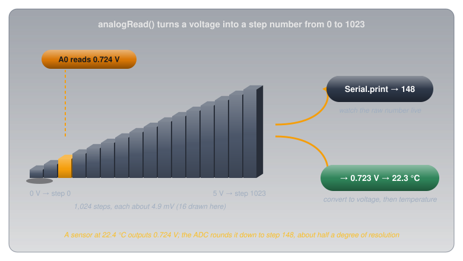
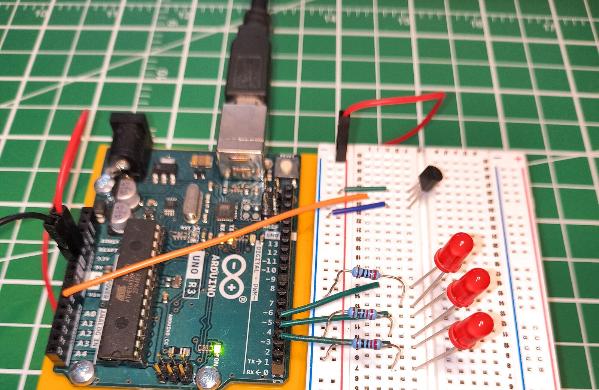
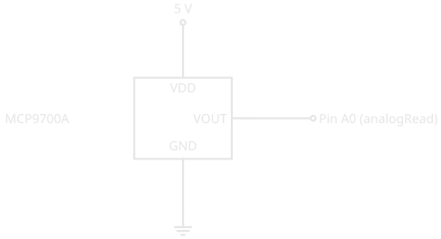

# Reading an Analog Sensor

!!! abstract "Beginner"
    This article is in the **Microcontrollers** topic. It follows [Pull-up and Pull-down Resistors](pull_resistors.md) and assumes you're comfortable with [Digital Pins](digital_io.md). It wires up the sensor explained in [Temperature Sensors](temperature_sensors.md) — read that first, since this article uses its formula without re-deriving it.

Things that shouldn't overheat tend to live where nobody looks: a battery charger in a cupboard, electronics in a closet, a pump in a crawlspace. The only way to know it's hot in there is to open the door and check, by which point it may have been cooking for hours. What you want is a sensor in there that reports the temperature without anyone opening the door.

Every microcontroller project so far on this site has read the world in two states: a button is pressed or it isn't, a pin is HIGH or LOW. Temperature is a continuous value, and a digital pin can't represent "22.4 degrees." This article wires up the `MCP9700A` from [Temperature Sensors](temperature_sensors.md) and introduces the tool that reads it: an **analog pin**.

---

## From Two States to 1,024

<figure markdown>
  { width="720" }
  <figcaption>A sensor at 22.4 °C becomes step 148. Converting back gives 22.3 °C: the ADC can only resolve about half a degree.</figcaption>
</figure>

A digital pin's `digitalRead()` can only ever return two answers. An **analog pin** (on an Arduino Uno, the pins labelled `A0` through `A5`) measures the actual voltage on the wire and reports, as a number, *where* it falls between 0V and the supply voltage.

The circuit inside the microcontroller that does the measuring is an **analog-to-digital converter (ADC)**. The Uno's ADC has 10 bits of resolution: it divides the 0–5V range into 1,024 steps of about 4.9 mV and reports which step the voltage falls in, from `0` at 0V to `1023` at the top of the range. That raw number is what `analogRead()` returns: a position on the 1,024-step scale, not yet a voltage or a temperature.

!!! tip "Why 1,024 and not a rounder number"
    1,024 is \( 2^{10} \): every value a 10-digit binary number can hold, which is what "10-bit ADC" means. The chip stores each reading as a 10-bit binary number.

---

## What You'll Build

<figure markdown>
  { width="600" }
  <figcaption>The MCP9700A wired straight to an Arduino: VDD to the 5V rail, GND to ground, VOUT to A0. No resistor is needed, because the pin only measures a voltage. (The three LEDs are for [Building a Threshold Ladder](threshold_output.md); ignore them for now.)</figcaption>
</figure>

Drawn as a schematic:

<figure markdown>
  { width="480" }
  <figcaption>Three wires, no resistor. VOUT feeds A0 directly: analogRead() only measures voltage and draws essentially no current.</figcaption>
</figure>

Compared with every LED circuit so far, the current-limiting resistor is missing. Nothing here needs its current limited: the pin is only listening to a voltage the sensor already produces.

---

## Reading and Converting the Value

Two conversions turn the raw ADC number into a temperature: first ADC steps to voltage, then voltage to temperature using the formula from [Temperature Sensors](temperature_sensors.md).

``` cpp title="Read the MCP9700A and print temperature" linenums="1"
const int sensorPin = A0;

void setup() {
  Serial.begin(9600); // (1)!
}

void loop() {
  int sensorVal = analogRead(sensorPin); // (2)!

  float voltage = (sensorVal / 1024.0) * 5.0; // (3)!
  float temperature = (voltage - 0.5) * 100; // (4)!

  Serial.print("Raw: ");
  Serial.print(sensorVal);
  Serial.print(", Volts: ");
  Serial.print(voltage);
  Serial.print(", Celsius: ");
  Serial.println(temperature);

  delay(100);
}
```

1. Opens a serial connection to your computer at 9600 baud, which is what the Serial Monitor listens to.
2. Reads the raw ADC value on A0: an integer from `0` to `1023`.
3. Scales the raw value against the 1,024-step range and the 5V supply to recover the actual voltage.
4. Applies the `MCP9700A`'s formula from [Temperature Sensors](temperature_sensors.md): subtract the 500 mV offset, then divide by 10 mV/°C, done here as `× 100` because the voltage is in volts, not millivolts.

`sensorVal` is an `int` because `analogRead()` always returns a whole number: there's no fractional ADC step. `voltage` and `temperature` are `float` (decimal numbers), because once the arithmetic starts, a fraction of a degree is a real answer.

---

## Verifying It Works

Upload the sketch with [arduino-cli](tools/arduino_cli.md), then open the Serial Monitor. You should see a new line roughly every tenth of a second, something close to:

``` text title="Serial Monitor output"
Raw: 148, Volts: 0.72, Celsius: 22.27
```

Hold the sensor gently between two fingers. Skin is well above room temperature, so the number should climb within a couple of seconds, and drift back down when you let go. That live response is the point: a physical quantity moving in real time.

??? warning "Troubleshooting"

    **Raw value stuck at 0:** check that VOUT really reaches A0, and that GND connects to the Arduino's ground, not just to the sensor's own leg.

    **Raw value stuck at 1023:** usually VDD and VOUT swapped. Recheck the pinout against [Temperature Sensors](temperature_sensors.md) before applying power again.

    **Readings jump around wildly:** a loose breadboard connection is the most common cause. The `MCP9700A`'s TO-92 body sits proud of the board on three stiff legs, which makes it easy for one leg to seat fully while another barely makes contact; reseat the sensor and press each leg down individually.

    **Temperature reads plausible but off by a degree or two:** that's normal. Revisit the [accuracy note](temperature_sensors.md#inside-an-analog-temperature-ic) in the sensor article; an `MCP9700A` isn't a precision instrument.

---

## Practice

??? question "1. Reading the raw value"

    Your Serial Monitor shows `Raw: 205`. What voltage does that correspond to, and what temperature?

    ??? tip "Solution"

        Voltage: \( (205 / 1024.0) \times 5.0 = 1.00\text{V} \). Temperature: \( (1.00 - 0.5) \times 100 = 50°C \). That's hot enough to double-check if you weren't expecting it.

??? question "2. Resolution limits"

    Two consecutive ADC steps are 1 apart — say `147` and `148`. How many volts, and how many degrees, does that one-step difference represent?

    ??? tip "Solution"

        One step is \( 5.0 / 1024 \approx 0.0049\text{V} \), about 4.9 mV. At 10 mV per °C, that's roughly **0.49°C per ADC step**, the finest change this setup can distinguish.

??? question "3. Why an int, not a float"

    Why does `analogRead()` return an `int`, when the voltage it's measuring is a continuous, fractional quantity?

    ??? tip "Solution"

        The ADC has 1,024 discrete steps, and there's no such thing as "step 147.3." The hardware can't report anything finer than one whole step, so the value it returns is always a whole number.

---

## Quick Recap

<div class="grid cards two-col" markdown>

-   **Analog vs. Digital**

    ---

    A digital pin reports HIGH or LOW. An analog pin's ADC measures the actual voltage and reports a position on a 1,024-step scale (0-1023 on the Uno).

-   **No Resistor Needed**

    ---

    `analogRead()` only measures voltage and draws essentially no current, so nothing needs current-limiting the way an LED does.

-   **Two Conversions**

    ---

    Raw ADC value → voltage (`(value / 1024.0) × 5.0`) → temperature (the `MCP9700A`'s formula from [Temperature Sensors](temperature_sensors.md)).

-   **Resolution Has a Floor**

    ---

    One ADC step ≈ 4.9 mV ≈ half a degree on this sensor. Finer changes than that simply aren't visible to this setup.

</div>

---

## What's Next

You can watch the temperature climb in the Serial Monitor, but that means someone has to be looking at a laptop. [Building a Threshold Ladder](threshold_output.md) takes this exact circuit and adds three LEDs, so the circuit itself shows when the space has got too warm, with no laptop required.

---

## Further Reading

**Official Docs**

- [analogRead() — Arduino Reference](https://docs.arduino.cc/language-reference/en/functions/analog-io/analogRead/) — the full function reference, including notes on reference voltage and conversion time

**Related Articles**

- [Temperature Sensors](temperature_sensors.md) — why the MCP9700A's output voltage means what it means
- [Digital Pins](digital_io.md) — the HIGH/LOW model this article extends into a continuous range
- [arduino-cli](tools/arduino_cli.md) — compiling and uploading this sketch
