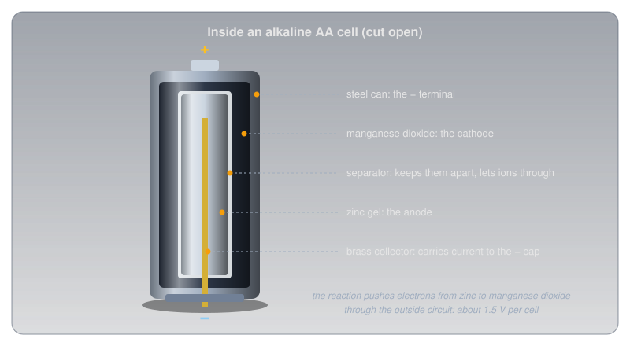
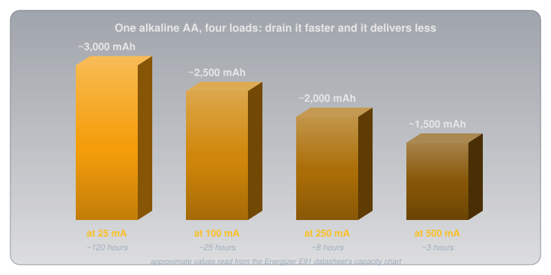
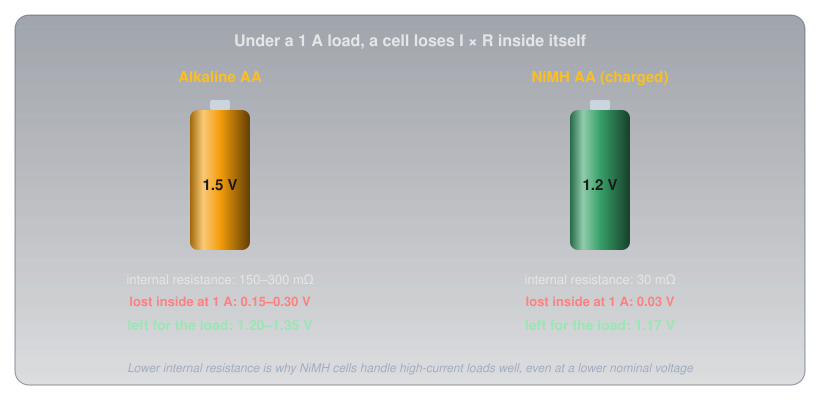
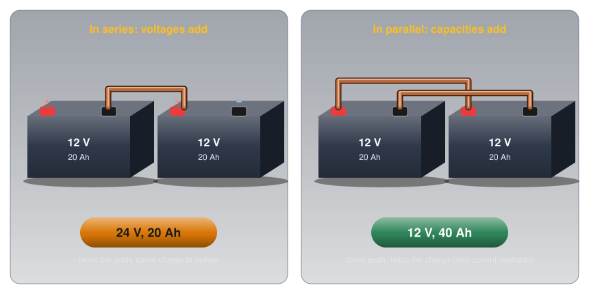
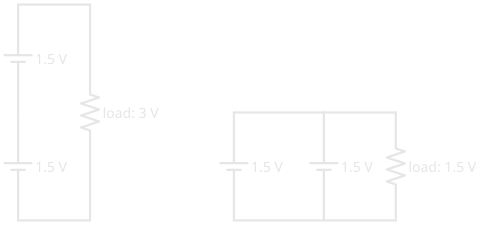

# Cells and Batteries

!!! abstract "Beginner"
    This article opens the **Power** topic. It builds on [Voltage](voltage.md), [Current](current.md), and [Ohm's Law and Power](ohms_law.md). No other prior knowledge required.

A digital camera with a hungry flash gets more shots from a set of rechargeable nickel-metal hydride (NiMH) AA cells than from fresh alkalines, even though the NiMH cells are marked **1.2 V** and the alkalines **1.5 V**. The cells with the lower voltage do the better job.

Two ideas explain it:

1. **A cell is a chemical pump with three numbers.** Its chemistry fixes its voltage, its size fixes how much charge it holds, and every cell hides a small internal resistance that steals voltage when current flows. Cells combine into batteries in series (voltages add) or in parallel (capacities add).
2. **Every chemistry is a trade-off.** Single-use or rechargeable, energy per kilogram, internal resistance, shelf life, cold tolerance, and safety all pull in different directions, and the right cell depends on the job.

The camera puzzle comes down to the third of those numbers, internal resistance, and it gets solved in the second half.

---

## Cells, Batteries, and EMF

A **cell** is a single electrochemical unit: two different materials and an electrolyte, arranged so a chemical reaction pushes electrons through any circuit connected across it. A **battery**, strictly, is several cells connected together, though everyday speech calls an AA cell a battery too.

The voltage a cell produces with nothing connected is called its **electromotive force** (EMF), or open-circuit voltage. It's one of the sources of charge separation from [Voltage](voltage.md#where-voltage-comes-from): chemistry doing the pushing. Once current flows, the voltage at the terminals, the **terminal voltage**, drops a little below the EMF. Why it drops is the key to the camera puzzle.

---

## Idea One: Three Numbers That Describe a Cell

### Voltage: Set by the Chemistry

Inside an alkaline AA, zinc gives up electrons and manganese dioxide takes them, with a separator between them that lets ions through but not electrons. The only way for the electrons to get from one material to the other is the long way: out of the cell and through whatever is connected to it.

<figure markdown>
  { width="720" }
  <figcaption>Two materials, a separator, and a path for electrons that only exists outside the cell.</figcaption>
</figure>

How hard the reaction pushes depends only on the pair of materials, which is why every alkaline cell is about 1.5 V whether it's a tiny AAA or a large D. A bigger cell holds more material, which changes how *long* it lasts, not how hard it pushes.

Cells come in two families:

- **Primary cells** are single-use. Once their reaction has run its course, it can't be reversed by charging. Zinc-carbon, alkaline, and lithium primary cells are primary.
- **Secondary cells** are rechargeable: pushing current back through them reverses the reaction. They're also called **storage batteries**, the older name. Lead-acid, NiCd, NiMH, and lithium-ion are secondary.

### Capacity: How Much Charge, and How Fast

[Current](current.md#capacity-is-current-time) introduced capacity, rated in milliamp-hours (mAh) or amp-hours (Ah): current multiplied by time. A 2,500 mAh cell can, in principle, supply 250 mA for 10 hours or 25 mA for 100 hours.

In practice the rating depends on how fast the cell is drained. Energizer's datasheet for its alkaline AA shows the usable capacity falling as the current rises:

<figure markdown>
  { width="720" }
  <figcaption>Twenty times the current gets roughly half the total charge out of the same cell.</figcaption>
</figure>

Draw more than a battery's rated current and it discharges faster than its rating suggests, for two reasons: the obvious one (more charge per second) and the hidden one (less total charge available).

### Internal Resistance: Where Voltage Goes Missing

Every real cell behaves like a perfect EMF with a small resistor hidden inside it. [Open Circuits, Short Circuits, and Fuses](open_short_fuses.md#what-a-short-circuit-really-is) showed how that resistance limits a short. Under a normal load it does something quieter: it takes a share of the voltage before the load gets any. By Ohm's Law the share is I × r, so the harder the cell works, the more voltage it loses inside itself:

\[ V_{\text{terminal}} = \text{EMF} - I \times r \]

<figure markdown>
  { width="720" }
  <figcaption>At a camera-flash current, the alkaline cell's head start mostly disappears inside it.</figcaption>
</figure>

### Series and Parallel: Building Batteries

A single cell is rarely the right voltage or capacity for the job, so cells are combined:

- **In series** (positive of one to negative of the next), the voltages add and the capacity stays the same. [Voltage](voltage.md#cells-in-series-add-their-voltages) showed a 9 V battery is six 1.5 V cells in series.
- **In parallel** (positive to positive, negative to negative), the voltage stays the same and the capacities add, along with the current the battery can comfortably supply.

<figure markdown>
  { width="760" }
  <figcaption>Series adds push; parallel adds charge.</figcaption>
</figure>

<figure markdown>
  { width="520" }
  <figcaption>The same two layouts as schematics. Each cell symbol's long plate is its positive terminal.</figcaption>
</figure>

Only combine identical cells at the same state of charge. Mixing a fresh cell with a tired one, or two different chemistries, makes the stronger cell force current into the weaker one, which wastes energy and, with rechargeable cells, can damage them.

---

## Idea Two: Every Chemistry Is a Trade-Off

With the three numbers in hand, the differences between chemistries become easy to read. The chart compares how much energy each stores per kilogram, alongside each cell's nominal voltage.

<figure markdown>
  { width="760" }
  <figcaption>Energy per kilogram, in watt-hours (Wh/kg). Grey bars are single-use; green are rechargeable.</figcaption>
</figure>

Our own datasheet numbers sit inside those ranges: Energizer's alkaline AA stores about 3.1 Wh in 23 g (about 136 Wh/kg), and its NiMH AA about 2.8 Wh in 28 g (about 99 Wh/kg).

-   :material-battery-outline: **Zinc-carbon (1.5 V, primary)**

    ---

    **Why it matters:** the cheapest cell, and the original "dry cell".

    **Trade-off:** low capacity, high internal resistance, prone to leaking. Fine for a clock; poor for anything hungry.

-   :material-battery: **Alkaline (1.5 V, primary)**

    ---

    **Why it matters:** the everyday default, with a 10-year shelf life (Energizer's AA datasheet).

    **Trade-off:** 150–300 mΩ internal resistance and capacity that falls at high current.

-   :material-battery-alert-variant-outline: **Mercury (1.35 V, primary)**

    ---

    **Why it matters:** held its voltage almost flat until empty, which once made it a reference cell in test equipment.

    **Trade-off:** mercury is toxic, and these cells have largely disappeared from sale.

-   :material-snowflake: **Lithium primary (1.5 V AA, 3 V coin cells, primary)**

    ---

    **Why it matters:** Energizer's lithium AA is rated from −40 °C to 60 °C, weighs 15 g against an alkaline's 23 g, and has a 25-year shelf life.

    **Trade-off:** costs more. Coin cells such as the 3 V CR2032 power memory backup and small devices.

-   :material-battery-charging-outline: **Nickel-cadmium, NiCd (1.2 V, rechargeable)**

    ---

    **Why it matters:** very low internal resistance and rugged; once the standard in handheld radios.

    **Trade-off:** cadmium is toxic, energy per kilogram is low, and cells can develop a "memory" under some charging patterns. Largely replaced by NiMH.

-   :material-car-battery: **Lead-acid (2.1 V per cell, rechargeable)**

    ---

    **Why it matters:** delivers huge surge currents cheaply: a car battery is six cells, about 12.6 V when full.

    **Trade-off:** heavy, contains corrosive sulphuric acid, and gives off hydrogen gas while charging. Charge it only where the gas can disperse.

-   :material-battery-charging: **Nickel-metal hydride, NiMH (1.2 V, rechargeable)**

    ---

    **Why it matters:** reusable hundreds of times, with very low internal resistance (about 30 mΩ charged, per Energizer's NH15 datasheet).

    **Trade-off:** standard NiMH cells lose charge sitting on a shelf faster than alkalines. Charge only with a charger designed for NiMH.

-   :material-battery-high: **Lithium-ion (3.6–3.7 V, rechargeable)**

    ---

    **Why it matters:** the most energy per kilogram of any common rechargeable; inside every phone and laptop.

    **Trade-off:** needs a matched charger and built-in protection circuitry, and fails dangerously if damaged, overcharged, or shorted.

### The Camera Puzzle, Solved

A camera's flash charges in bursts of heavy current; Energizer's own digital-camera test pulses 1.5 W from each cell, roughly an amp at these voltages. At that current an alkaline cell's 150–300 mΩ of internal resistance throws away 0.15–0.30 V inside itself, leaving the camera 1.2–1.35 V, and the alkaline's usable capacity shrinks under the heavy load as well. The NiMH cell's 30 mΩ loses only 0.03 V, so it delivers a steady 1.17 V and keeps most of its capacity. The 1.5 V label describes the cell at rest; the camera only ever sees the cell at work.

That's also why NiMH cells are the usual choice over alkalines for heavy, repeated use: they can be recharged hundreds of times, and they hold up better under load.

### Energy per Kilogram: Why Portable Gear Went Lithium

For anything carried, weight matters as much as capacity. Lead-acid stores roughly 30 to 50 Wh per kilogram; lithium-ion stores around 195. For the same weight, a lithium-ion pack holds roughly four to six times the energy of a lead-acid one, which is why portable radios, tools, and laptops moved to lithium, while cars, which need cheap surge current more than light weight, kept lead-acid for starting.

---

## Charging, Storage, and Care

Rechargeable cells reward a little care, and punish the wrong charger:

- **Match the charger to the chemistry.** A NiMH charger, a lead-acid charger, and a lithium-ion charger end the charge in different ways. The wrong one can overcharge a cell.
- **Never mix cells.** Same chemistry, same capacity, same age, same state of charge, especially in series.
- **Take cells out of stored equipment.** A cell left for years in a device in a drawer can leak corrosive electrolyte onto the contacts.
- **Mind the cold.** Most chemistries deliver less in the cold; lithium primary cells are the exception, which makes them the choice for winter outdoor gear.
- **Recycle them.** Batteries contain metals that don't belong in landfill. In Canada, Call2Recycle runs more than 15,000 free drop-off sites for household batteries. Taping the terminals of lithium cells before dropping them off keeps them from shorting against each other in the bin.

---

## Safety: Lithium-Ion Needs Respect

Every cell can be dangerous when shorted, and a shorted lithium-ion cell is the most dangerous of all: it can go into **thermal runaway**, where heat inside the cell drives a reaction that produces more heat, until it vents flame. Health Canada warns of burn, chemical, fire, and explosion hazards, and asks people to charge and store lithium-ion batteries away from anything that can catch fire, such as beds and couches, and to stop charging once they're full.

<figure markdown>
  { width="760" }
  <figcaption>The warning signs, from the Canadian Forces Fire Marshal's lithium-ion guidance.</figcaption>
</figure>

!!! danger "Never Short, Puncture, or Overcharge a Lithium-Ion Battery"
    A shorted, crushed, punctured, or overcharged lithium-ion battery can burst into flame within seconds, and the fire is hard to put out. Use only the charger made for the battery, don't charge damaged or swollen packs, and never short the terminals. If a battery shows any of the warning signs above, move it away from anything that can burn and call the fire department. If it's already burning, get everyone out, close the door behind you, and call 9-1-1.

Lead-acid batteries carry their own hazards, separate from lithium's.

!!! warning "Lead-Acid: Acid and Hydrogen"
    A lead-acid battery contains sulphuric acid, which burns skin and eyes, and gives off hydrogen while charging, which can explode with a spark. Charge in a ventilated space, connect and disconnect the charger with it switched off, and wear eye protection when working near one.

---

## Practice

??? question "1. Series or Parallel?"

    What voltage and capacity do you get from two 12 V, 20 Ah batteries connected in series? In parallel?

    ??? tip "Solution"
        In series the voltages add and the capacity stays the same: **24 V, 20 Ah**. In parallel the voltage stays the same and the capacities add: **12 V, 40 Ah**.

??? question "2. How Long Will It Run?"

    A handheld radio draws an average of 400 mA from a 2,000 mAh battery. Roughly how long will it run? Why might it run for less?

    ??? tip "Solution"
        \( 2{,}000 / 400 = 5 \) hours. It may run for less because capacity shrinks at higher currents, the radio draws much more when transmitting than when listening, and cold weather reduces capacity.

??? question "3. Terminal Voltage"

    A cell has an EMF of 1.5 V and an internal resistance of 0.2 Ω. What's its terminal voltage while supplying 0.5 A?

    ??? tip "Solution"
        \( V = 1.5 - 0.5 \times 0.2 = 1.4\ \text{V} \). The missing 0.1 V is dropped across the cell's own internal resistance, as heat.

??? question "4. Winter Field Day"

    You're operating a portable station outdoors at −25 °C. Which AA chemistry is the best choice, and why?

    ??? tip "Solution"
        **Lithium primary** (lithium iron disulfide). Energizer rates its lithium AA for use down to −40 °C, while alkaline and NiMH cells lose much of their capacity in the cold. It's also lighter.

??? question "5. Storage Battery"

    What is a "storage battery", and is a zinc-carbon cell one?

    ??? tip "Solution"
        A storage battery is a **secondary** (rechargeable) battery: one whose reaction can be reversed by charging, like lead-acid or NiMH. A zinc-carbon cell is a **primary** cell: single-use, not a storage battery.

??? question "6. Why Lithium for Portable Gear?"

    What's the main advantage of lithium-based batteries over lead-acid for portable operation?

    ??? tip "Solution"
        **Much more energy per kilogram:** roughly 195 Wh/kg against 30 to 50 for lead-acid, so the same weight carries four to six times the energy.

---

## Quick Recap

-   **Cell and battery**

    ---

    A cell is one electrochemical unit; a battery is several connected together.

-   **EMF and terminal voltage**

    ---

    EMF is the open-circuit voltage; under load the terminal voltage drops by I × r.

-   **Primary and secondary**

    ---

    Primary cells are single-use; secondary (storage) cells recharge.

-   **Series and parallel**

    ---

    Series adds voltage; parallel adds capacity. Combine only identical cells.

-   **Chemistry trade-offs**

    ---

    Voltage, energy per kilogram, internal resistance, shelf life, cold tolerance, and safety.

-   **Lithium-ion safety**

    ---

    Right charger, never short or puncture, watch for heat, swelling, smell, or hissing.

---

## What's Next

Batteries supply steady direct current. **[AC vs DC](ac_dc.md)** covers the other kind: the alternating current from a wall outlet, and why a "120 V" outlet peaks near 170 V.

---

## Further Reading

**Datasheets**

- [Energizer E91 Alkaline AA](https://data.energizer.com/pdfs/e91.pdf) — capacity versus current, internal resistance, and shelf life
- [Energizer L91 Ultimate Lithium AA](https://data.energizer.com/pdfs/l91.pdf) — the lithium iron disulfide cell's temperature range and 25-year shelf life
- [Energizer NH15 NiMH AA](https://data.energizer.com/pdfs/nh15-2300.pdf) — 2,300 mAh and its low internal resistance

**Safety and Recycling**

- [Misuse or Modification of Lithium-Ion Batteries — Health Canada](https://recalls-rappels.canada.ca/en/alert-recall/misuse-or-modification-lithium-ion-batteries-e-mobility-devices-can-be-extremely) — hazards and safe charging and storage
- [Charge into Fire Safety — Canadian Forces Fire Marshal](https://www.canada.ca/en/department-national-defence/maple-leaf/defence/2025/10/charge-into-fire-safety.html) — warning signs of a failing lithium-ion battery
- [Call2Recycle Canada](https://www.call2recycle.ca/) — free battery drop-off locations across Canada

**Deep Dives**

- [Comparison of Commercial Battery Types — Wikipedia](https://en.wikipedia.org/wiki/Comparison_of_commercial_battery_types) — voltages and energy densities for every common chemistry

**Related Articles**

- [Voltage](voltage.md) — EMF as one of the ways to separate charge, and cells in series
- [Current](current.md) — capacity as current multiplied by time
- [Open Circuits, Short Circuits, and Fuses](open_short_fuses.md) — what limits a battery's short-circuit current
