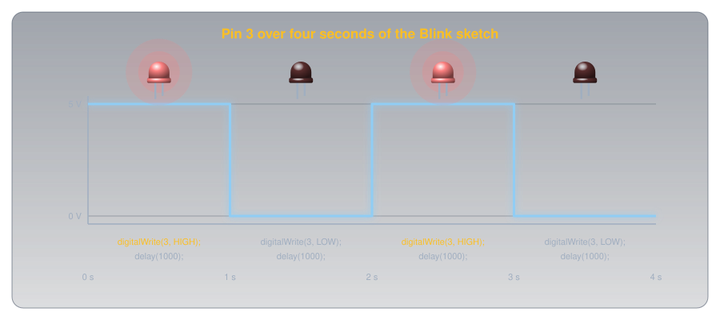
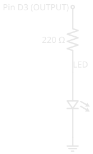

# Blink an LED

!!! abstract "Beginner"
    This article is in the **Microcontrollers** topic. It puts [Digital Pins](digital_io.md) into practice and uses [arduino-cli](tools/arduino_cli.md) to load the code. If you've never wired a breadboard, read [Breadboards](tools/breadboards.md) first, and if you've never seen an Arduino before, [What Is an Arduino?](what_is_an_arduino.md) covers the board itself.

Blinking an LED is the first thing nearly everyone builds on a microcontroller, and for a practical reason: one blinking light proves the entire chain works. The circuit is wired correctly, the board is talking to the computer, and the code you compiled is running on the chip. It's also the first time code you wrote makes something happen in the physical world.

It happens in two stages. First you blink a light that's already on the board, with no wiring at all, to confirm the toolchain works. Then you wire your own LED on a breadboard and blink that.

---

## What You'll Need

Everything here comes in any starter kit:

- An [Arduino](what_is_an_arduino.md) Uno (or compatible board) and its USB cable
- A [breadboard](tools/breadboards.md)
- One LED (any colour)
- One 220 Ω resistor: its bands read red-red-brown-gold ([Resistor Color Codes](resistor_color_codes.md) explains how to read them)
- Two jumper wires

You'll also need `arduino-cli` installed with the AVR core added, and your board's **port** and **FQBN** (fully qualified board name) to hand. [arduino-cli](tools/arduino_cli.md) covers both terms and the one-time setup. This article assumes you can already compile and upload.

---

## Stage 1: Blink Without Wiring Anything

Every Arduino Uno has a small LED already wired to pin 13, labelled `L` on the board. The code can reach it by the name `LED_BUILTIN`. Blinking it needs no breadboard and no resistor, which makes it the perfect first test: if it blinks, the board and toolchain work, and any later problem is in the wiring.

Create a sketch folder called `BlinkTest` with a file `BlinkTest.ino`:

``` cpp title="BlinkTest.ino — blink the built-in LED" linenums="1"
void setup() {
  pinMode(LED_BUILTIN, OUTPUT);   // the on-board LED is an output
}

void loop() {
  digitalWrite(LED_BUILTIN, HIGH); // LED on
  delay(1000);                     // wait 1000 ms = 1 second
  digitalWrite(LED_BUILTIN, LOW);  // LED off
  delay(1000);                     // wait another second
}
```

If `pinMode`, `digitalWrite`, and the HIGH/LOW states are unfamiliar, [Digital Pins](digital_io.md) explains exactly what they do. The one new piece is `delay(1000)`, which pauses the program for 1000 milliseconds (one second) so each state lasts long enough to see. Without the pauses the LED would switch far too fast to notice.

From inside the `BlinkTest` folder, compile and upload:

``` bash title="Compile and upload from the sketch folder" linenums="1"
arduino-cli compile --upload -p /dev/ttyACM0 --fqbn arduino:avr:uno .
```

Within a few seconds the `L` LED on the board should start blinking: one second on, one second off. That's the whole toolchain proven. If it doesn't, see [Troubleshooting](#troubleshooting) and fix it here, where there's no wiring to blame.

<figure markdown>
  { width="760" }
  <figcaption>Each delay(1000) holds the pin where the line before it left it, for one second.</figcaption>
</figure>

---

## Stage 2: Blink Your Own LED

Now make it real with an LED you place yourself. The circuit is one output pin, a current-limiting resistor, and an LED to ground:

<figure markdown>
  { width="280" }
  <figcaption>One output pin driving one LED through a 220 Ω resistor to ground: the output circuit from Digital Pins, now built for real.</figcaption>
</figure>

Wire it on the breadboard:

<figure markdown>
  { width="760" }
  <figcaption>Long leg to the pin, short leg and flat edge to ground.</figcaption>
</figure>

1. Put the **LED** across the centre gap. The **longer leg is the anode** (positive side) and goes toward the pin; the shorter leg (cathode) goes toward ground. If the legs have been trimmed to the same length, look at the rim around the base of the LED: it has a **flat edge on the cathode side**.
2. Connect the **220 Ω resistor** from the LED's anode row to a separate row. It could go on either side of the LED: in a single loop the same current flows everywhere, so the resistor limits it wherever it sits.
3. Run a jumper from the Arduino's **pin 3** to the resistor.
4. Run a jumper from the LED's cathode to a **GND** pin on the Arduino.

!!! warning "An LED always needs its resistor"
    Never wire the LED straight from the pin to ground with no resistor. Without it the LED draws far too much current: it can burn out in an instant and damage the pin driving it. One 220 Ω resistor in the loop keeps both safe; [Diodes and LEDs](diodes_and_leds.md#sizing-an-led-resistor) works out where the value comes from.

The code is the same as before, except that it drives **pin 3** instead of the built-in LED:

``` cpp title="Blink.ino — blink the external LED on pin 3" linenums="1"
void setup() {
  pinMode(3, OUTPUT);        // pin 3 drives the external LED
}

void loop() {
  digitalWrite(3, HIGH);     // LED on
  delay(1000);
  digitalWrite(3, LOW);      // LED off
  delay(1000);
}
```

Upload it the same way, and your own LED blinks in time. You're now running a circuit you designed and built, on code you wrote and flashed yourself.

---

## How to Know It's Working

Three things confirm it:

- **The LED blinks evenly**, one second lit and one second dark. That's `delay(1000)` doing its job.
- **The brightness is clear and steady**, neither painfully bright nor flickering. The 220 Ω resistor is holding the current at about 14 mA.
- **The on-board `L` LED has stopped blinking.** It's wired to pin 13, and the new sketch only drives pin 3, so a dark `L` confirms the new code replaced the old.

---

## Troubleshooting

??? warning "The LED doesn't light at all"

    Most often the LED is in **backwards**. An LED only conducts one way: the **longer leg (anode)** must face the pin, the shorter leg (cathode) must face ground. Pull it out, flip it, and try again. At 5V with its resistor in place, a backwards LED simply doesn't light; it isn't damaged.

??? warning "The upload fails before the LED ever blinks"

    This is a toolchain problem, not a wiring one. Check the **port** (`arduino-cli board list`), and on Linux make sure you have permission to use the serial device. [arduino-cli](tools/arduino_cli.md) covers both, including the `dialout` group fix.

??? warning "The LED flares brightly, then dies"

    The **resistor is missing or bypassed**. Too much current flowed through the LED and burned it out. Add a 220 Ω resistor in the loop and replace the LED.

??? warning "Nothing happens, but Stage 1 worked"

    Your **wiring and your code disagree** about which pin. The jumper must run from the same pin number your code drives — pin 3 in the example. Confirm the jumper is in pin 3 and the code says `3`.

---

## Practice

??? question "1. Blink faster"

    You want the LED to blink twice as fast — on and off every half-second. What do you change?

    ??? tip "Solution"

        Change both `delay(1000)` calls to `delay(500)`. The delay is in milliseconds, so 500 ms is half a second. The LED now spends half a second on and half a second off, blinking twice as fast.

??? question "2. A heartbeat"

    How would you make the LED flash a quick double-blink and then pause — on, off, on, off, then a longer rest — like a heartbeat?

    ??? tip "Solution"

        Inside `loop()`, write two short on/off pairs followed by a long delay:

        ``` cpp
        digitalWrite(3, HIGH); delay(150);
        digitalWrite(3, LOW);  delay(150);
        digitalWrite(3, HIGH); delay(150);
        digitalWrite(3, LOW);  delay(800);
        ```

        Because `loop()` repeats forever, that pattern plays over and over — two quick blinks, then a rest.

??? question "3. Why pin 3 and not pin 13?"

    Stage 1 used the built-in LED on pin 13; Stage 2 used pin 3 for the external one. Could you have used pin 13 for the external LED too?

    ??? tip "Solution"

        Yes. Pin 13 is an ordinary output pin that *also* happens to be wired to the on-board `L` LED. You can drive an external LED from it just like pin 3, and both LEDs would blink together. Pin 3 was used only to keep the external circuit separate and clear.

---

## Quick Recap

<div class="grid cards two-col" markdown>

-   **Prove the Toolchain First**

    ---

    Blink `LED_BUILTIN` with no wiring. If the on-board `L` LED blinks, your board and `arduino-cli` work, so any later problem is in your circuit.

-   **The Output Circuit**

    ---

    Pin → 220 Ω resistor → LED → ground. The longer LED leg (anode) faces the pin. The resistor is never optional.

-   **The Code**

    ---

    `pinMode(3, OUTPUT)` once, then `digitalWrite()` HIGH and LOW in `loop()`, with `delay(1000)` between them to make the change visible.

-   **Upload**

    ---

    `arduino-cli compile --upload -p PORT --fqbn arduino:avr:uno .` from inside the sketch folder flashes it to the board.

</div>

---

## What's Next

You can drive an output and watch it run. The other half of a microcontroller is *reading* the world, and reading reliably needs one more idea: **[Pull-up and Pull-down Resistors](pull_resistors.md)** adds a button to this circuit and has the board respond to it. With that, the full circuit from the top of [Digital Pins](digital_io.md), a button controlling three LEDs, is within reach.

---

## Further Reading

**Official Documentation**

- [Arduino Language Reference — Digital I/O](https://docs.arduino.cc/language-reference/) — `pinMode()`, `digitalWrite()`, and `delay()` in full

**Related Articles**

- [What Is an Arduino?](what_is_an_arduino.md) — the board itself, and how to read a sketch's `setup()`/`loop()` structure
- [Digital Pins](digital_io.md) — what `pinMode` and `digitalWrite` actually do to a pin
- [Resistor Color Codes](resistor_color_codes.md) — confirm the 220 Ω resistor in this circuit by its bands
- [arduino-cli](tools/arduino_cli.md) — installing the toolchain and uploading sketches from the terminal
- [Breadboards](tools/breadboards.md) — how the rows and rails you wired this circuit into connect
