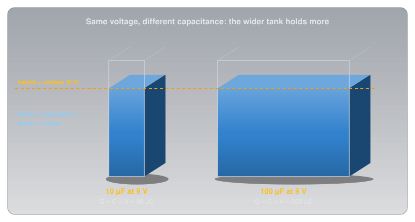
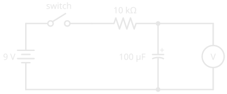
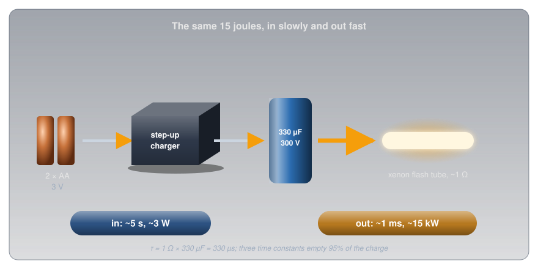

# Capacitors

!!! abstract "Beginner"
    This article is in the **Circuit Foundations** topic. It builds on [Voltage](voltage.md), [Current](current.md), [Ohm's Law and Power](ohms_law.md), and [Series and Parallel Circuits](series_and_parallel.md). No other prior knowledge required.

A camera flash runs on two AA cells. Those cells can comfortably supply a few watts, yet the flash tube fires at something like fifteen thousand watts for about a thousandth of a second. Nothing about the batteries changes between shots; there's a few seconds' whine, then the flash is ready again.

The part that bridges the gap is a **capacitor**, and two ideas explain how it does it:

1. **A capacitor stores charge in proportion to its voltage.** Push charge onto its plates and the voltage across it rises in step. How much charge it holds per volt is its **capacitance**.
2. **Filling and emptying take time, and resistance sets the pace.** Through a large resistance a capacitor fills slowly; through a small one it empties almost at once. The time scale is resistance times capacitance.

The flash fills its capacitor slowly and empties it fast, and the numbers come out in the second half.

---

## Inside a Capacitor

A capacitor is about the simplest component there is: two conducting plates facing each other, separated by an insulator called the **dielectric**.

<figure markdown>
  { width="720" }
  <figcaption>No charge crosses the gap. The battery moves electrons off one plate and onto the other, and the field between them holds them there.</figcaption>
</figure>

Connect it to a battery and the battery's push moves electrons off one plate and around the circuit onto the other. One plate ends up with a shortage of electrons (positive charge), the other with an equal surplus (negative charge). No charge ever crosses the dielectric; it's an insulator. What crosses is an **electric field**, and that field is where the capacitor's energy is stored. Disconnect the battery and the charge stays parked, held in place by the attraction across the gap.

---

## Idea One: Charge in Proportion to Voltage

The more charge the battery pushes onto the plates, the stronger the field between them, and the harder it pushes back. Charging stops when the capacitor's voltage equals the battery's. For any given capacitor, the charge stored is simply proportional to the voltage across it.

???+ info "Definition: Farad"

    **Capacitance** is the charge a capacitor stores per volt across it. One **farad** (F) stores one coulomb at one volt. A farad is enormous, so real capacitors are measured in microfarads (µF), nanofarads (nF), and picofarads (pF).

\[ Q = C \times V \]

A tank of water is the physical picture. The height of the water is the voltage, the width of the tank is the capacitance, and the water is the charge. Two tanks filled to the same height hold very different amounts if one is ten times wider.

<figure markdown>
  { width="720" }
  <figcaption>Same voltage, ten times the capacitance, ten times the charge.</figcaption>
</figure>

The picture also shows the big difference from a battery. A battery's voltage is fixed by its chemistry and stays roughly constant as it delivers charge ([Cells and Batteries](batteries.md)). A capacitor's voltage *is* its charge, scaled: take half the charge out and the voltage halves. And the amounts are small. A large 1 F capacitor at 5 V holds 5 coulombs; the alkaline AA in [Voltage](voltage.md#voltage-is-not-energy-stored) delivers about 9,000.

### What Sets the Capacitance

Three things decide a capacitor's capacitance, and they mirror the things that set a wire's resistance in [Resistance and Conductance](resistance.md#idea-one-four-things-set-a-wires-resistance):

- **Plate area.** Bigger plates have room for more charge at the same voltage.
- **The gap.** Closer plates pull harder on each other's charge, so more fits per volt.
- **The dielectric.** Some insulators strengthen the effect. How much, compared with empty space, is the material's **relative permittivity**, written εr.

\[ C = \varepsilon_0 \, \varepsilon_r \, \frac{A}{d} \]

Here A is the plate area in square metres, d the gap in metres, and ε₀ a constant of nature, 8.854 × 10⁻¹² farads per metre. Put real sizes in and the farad's scale becomes obvious:

<figure markdown>
  { width="760" }
  <figcaption>Two plates the size of a coaster make 89 trillionths of a farad.</figcaption>
</figure>

So how does a can the size of a thumb hold 100 µF? By pushing all three factors to extremes. An aluminium electrolytic capacitor uses aluminium foil coated with aluminium oxide (εr 9.6), and the oxide *is* the gap: about 1.4 nanometres thick for every volt it's rated to withstand. For a 16 V part that's roughly 22 nm, a few hundred atoms. Even so, 100 µF needs about 260 cm² of plate, so the foil is etched into a sponge-like surface many times its flat area and rolled up tight inside the can.

### Energy: Half of Q × V

Charging a capacitor takes work, because every extra coulomb has to be pushed onto plates that already push back. The first coulomb goes in against almost no voltage; the last goes in against the full voltage. On average, each coulomb is pushed against half the final voltage, so the energy stored is half of charge times voltage:

\[ E = \tfrac{1}{2} Q V = \tfrac{1}{2} C V^2 \]

<figure markdown>
  { width="720" }
  <figcaption>The energy is the area of the triangle: half the box that Q × V would fill.</figcaption>
</figure>

The squared voltage matters. Double the voltage and the energy goes up four times, which is why the flash charger works so hard to raise two AA cells' 3 V to 300 V. Wikipedia's article on flashtubes gives 330 µF at 300 V as typical for a camera, and the formula turns that into the flash's energy:

\[ E = \tfrac{1}{2} \times 330\ \mu\text{F} \times (300\ \text{V})^2 \approx 14.9\ \text{J} \]

### Capacitors in Series and Parallel

Combining capacitors works the opposite way round from combining resistors, and the plate picture shows why.

<figure markdown>
  { width="720" }
  <figcaption>Parallel adds plate area; series adds gap.</figcaption>
</figure>

- **In parallel**, every capacitor sees the same voltage and their plates act as one larger plate, so capacitances simply add: two 10 µF capacitors make 20 µF.
- **In series**, the charge on each is the same and the gaps effectively stack, so capacitances combine like resistors in parallel: two 10 µF capacitors make 5 µF. The shortcuts from [Series and Parallel Circuits](series_and_parallel.md#current-divides) carry straight over, product over sum for two and C ÷ n for n equal ones. The voltage across the string divides between them, which is why capacitors are sometimes put in series to handle a higher voltage than either could alone.

---

## Idea Two: Filling Takes Time

Connect an empty capacitor to a battery through a resistor, and at the first instant the capacitor's voltage is zero, so the resistor has the full battery voltage across it and the current is as large as Ohm's Law allows. As charge builds, the capacitor's voltage rises, the voltage left for the resistor shrinks, and the current falls. The capacitor fills quickly at first, then more and more slowly, approaching the battery voltage without ever quite getting there.

<figure markdown>
  { width="460" }
  <figcaption>Close the switch and watch the meter: the voltage across the 100 µF capacitor climbs toward 9 V, fast at first and then slowly. The curved plate and the + mark show which way round the electrolytic goes.</figcaption>
</figure>

The shape of that climb is the same for every resistor and capacitor; only the time scale changes, and the time scale is the product of the two.

???+ info "Definition: Time Constant"

    The **time constant** of a resistor-capacitor (RC) circuit is \( \tau = R \times C \), in seconds when R is in ohms and C in farads. After one time constant a charging capacitor has reached 63.2% of the supply voltage; after five, over 99%, which is treated as full.

<figure markdown>
  { width="760" }
  <figcaption>Every RC circuit follows these two curves. Only the length of τ changes.</figcaption>
</figure>

With the circuit above, 10 kΩ × 100 µF = 1 second. The meter reads about 5.7 V after one second and 8.9 V after five. Swap the resistor for 1 kΩ and the whole thing happens ten times faster; swap the capacitor for 1,000 µF and it's ten times slower. Discharging through a resistor follows the mirror-image curve: down to 36.8% after one time constant.

### The Flash, Solved

Now the camera flash makes sense. The flash circuit has two very different paths in and out of the same capacitor:

- **In:** a small step-up converter, a transistor switching a little transformer of the kind described in [Magnetism and Electromagnetism](magnetism.md#transformers), raises the cells' 3 V toward 300 V and trickles charge into the capacitor. The whine is that converter, and the few seconds' wait is the capacitor filling. Delivering 15 J over about 5 seconds is about 3 W, comfortably within what two AA cells can supply.
- **Out:** the trigger turns the xenon gas in the flash tube into a conductor of about 1 Ω (the resistance Rubycon specifies for testing its photoflash capacitors). The time constant is now 1 Ω × 330 µF = 330 µs, so three time constants, about 1 ms, empty 95% of the charge.

<figure markdown>
  { width="760" }
  <figcaption>The batteries never deliver 15 kW. They deliver 3 W for five seconds, and the capacitor delivers it all again in a millisecond.</figcaption>
</figure>

Fifteen joules in a millisecond is about 15,000 W. The capacitor doesn't make energy; it collects it slowly through a high-resistance path and releases it through a low-resistance one, and the ratio of the two time constants is the ratio of the powers.

### Blocking DC, Passing AC

The RC curve has a consequence that matters far beyond flashes. Once a capacitor is charged, current stops: a capacitor in series **blocks steady DC**. On [AC](ac_dc.md), the supply keeps reversing, so the capacitor charges one way, discharges, and charges the other way, every cycle. Current flows back and forth in the wires on both sides even though no charge ever crosses the dielectric.

The faster the AC, the less each half-cycle has to fill the capacitor before the direction reverses, so the more easily the current passes. A capacitor's opposition to AC falls as the frequency rises, and that frequency-dependent opposition has its own name, **capacitive reactance**. It's what lets a capacitor pass audio between the stages of an amplifier while blocking their DC voltages, and it's one of the two halves of every radio's tuning circuit.

---

## Kinds of Capacitors

Every capacitor is two plates and a dielectric. What differs is the dielectric, and with it the range of values, the size, and whether polarity matters.

<figure markdown>
  { width="780" }
  <figcaption>Polarity matters on the three to the right. Note that the electrolytic's stripe marks the negative lead and the tantalum's marks the positive.</figcaption>
</figure>

-   :material-circle-medium: **Ceramic**

    ---

    **Dielectric:** a ceramic. Class 1 types (C0G, also called NP0) have a relative permittivity of 6 to 200 and are very stable; class 2 types (X7R and similar, based on barium titanate) reach 200 to 14,000, which packs more capacitance in, at a price: their capacitance changes with temperature and can drop by as much as 80% under a high DC voltage.

    **Use:** the everyday small capacitor, from tuning to decoupling. Marked with a three-digit code: `104` is 10 followed by four zeros in picofarads, 100 nF ([Metric Prefixes and Units](metric_prefixes.md#prefixes-on-real-parts) has more).

-   :material-rectangle-outline: **Film**

    ---

    **Dielectric:** a thin plastic film such as polyester or polypropylene.

    **Use:** stable, low-loss, and tolerant of high voltage, so they turn up in audio, timing, and mains filtering. No polarity.

-   :material-battery-outline: **Aluminium electrolytic**

    ---

    **Dielectric:** the nanometre-thin oxide described above, which is why it reaches large values in a small can.

    **Use:** power supplies and energy storage. **Polarized:** the stripe of minus signs and the shorter lead mark the negative side. Tolerance is wide: Rubycon's photoflash series is rated −10% to +20%.

-   :material-water-outline: **Tantalum**

    ---

    **Dielectric:** tantalum pentoxide (εr about 27), giving more capacitance per cubic millimetre than aluminium.

    **Use:** compact, stable bulk capacitance. **Polarized**, and the marking runs the opposite way: a tantalum's stripe or + marks the *positive* lead.

-   :material-flash-outline: **Supercapacitor**

    ---

    **Dielectric:** no conventional one; charge sits in a layer only molecules thick at the surface of porous carbon.

    **Use:** farads at a few volts: keeping a clock or memory alive through a power cut, or absorbing bursts of energy. Polarized and low-voltage.

---

## Where You'll Find Them

Capacitors are among the most common parts on any board, and almost every one is doing one of a handful of jobs, each a direct use of the two ideas:

- **Decoupling.** A 100 nF ceramic sits beside the power pin of nearly every chip. When a chip's transistors switch, it draws current in sudden gulps, faster than the supply's wiring can deliver. The capacitor, millimetres away, supplies each gulp from its own charge and refills between them. Datasheets for almost every digital chip ask for one.
- **Smoothing.** Converting AC to DC starts with diodes that let the current through in one direction only ([Diodes and LEDs](diodes_and_leds.md#rectification-ac-to-dc) covers them), which leaves a row of humps. A large electrolytic fills at each peak and feeds the load between them:

<figure markdown>
  { width="760" }
  <figcaption>The bigger the capacitor, or the lighter the load, the less it sags between peaks.</figcaption>
</figure>

- **Timing.** An RC time constant is a built-in clock. Blinking circuits, debounce delays, and the classic `NE555` timer chip ([Package Types](package_types.md#two-families) shows one) all set their timing with a resistor and a capacitor.
- **Coupling.** Blocking DC while passing AC lets an audio signal travel from one amplifier stage to the next without carrying the first stage's DC voltage with it.
- **Energy bursts and backup.** Camera flashes, and supercapacitors that keep a real-time clock running when the power goes out.
- **Tuning.** A capacitor and a coil together resonate at one frequency, which is how a radio picks one station out of all the others.

---

## Measuring Capacitance

Many multimeters have a capacitance range, marked with the capacitor symbol. The meter charges the capacitor with a known small current and times how quickly its voltage rises, the RC idea run in reverse. Three habits keep the reading honest and the meter safe:

- **Discharge first.** A charged capacitor across the meter's input can damage it, and gives a meaningless reading anyway (see Safety below).
- **Take it out of the circuit,** or at least lift one lead. Anything else connected across it, including other capacitors in parallel, adds to the reading.
- **Expect wide tolerances.** An electrolytic that reads 15% high is normal. A reading far below the marked value, or a can whose top has domed, means a worn-out part.

---

## Safety: Charge Outlasts the Power

A capacitor's whole job is to keep its charge after the supply is gone, and that's exactly what makes the large ones dangerous.

!!! danger "Large Capacitors Stay Charged"
    A camera flash capacitor holds about 15 J at 300 V, and capacitors inside mains-powered equipment (microwave ovens, power supplies, televisions, amplifiers) can hold far more, for minutes or days after the equipment is unplugged. Wikipedia's flashtube article notes that shocks of around 1 J have been reported as lethal. Never open mains-powered equipment. On a high-voltage capacitor, discharge it through a resistor rated for the job (for the flash capacitor, a 10 kΩ, 5 W resistor gives a time constant of 3.3 s, so wait at least 20 s), then confirm 0 V with a meter. Never short it with a screwdriver: the current welds and spatters metal.

On a hobby bench the hazard is to the part rather than to you.

!!! warning "Polarity and Voltage Ratings"
    An electrolytic or tantalum capacitor connected backwards, or run above its rated voltage, breaks down its own dielectric, heats up, and can vent or burst; that's what the scored cross on top of an electrolytic can is for. Match the stripe to the schematic's polarity, and choose a voltage rating comfortably above the highest voltage the capacitor will see.

---

## Practice

??? question "1. Charge Stored"

    A 47 µF capacitor is charged to 12 V. How much charge does it hold?

    ??? tip "Solution"
        \[ Q = C \times V = 47\ \mu\text{F} \times 12\ \text{V} = 564\ \mu\text{C} \]

        About half a millicoulomb: tiny next to a battery, which is why capacitors are for bursts and buffering rather than for running a project for hours.

??? question "2. Energy Stored"

    A 1,000 µF capacitor in a power supply sits at 25 V. How much energy does it hold, and how much would it hold at 50 V?

    ??? tip "Solution"
        \[ E = \tfrac{1}{2} C V^2 = \tfrac{1}{2} \times 0.001 \times 25^2 \approx 0.31\ \text{J} \]

        At 50 V it would hold four times as much, 1.25 J, because energy goes with the square of the voltage.

??? question "3. Time Constant"

    A 10 µF capacitor charges through a 1 MΩ resistor. What's the time constant, and roughly how long until the capacitor is fully charged?

    ??? tip "Solution"
        \( \tau = 1{,}000{,}000\ \Omega \times 0.000\,010\ \text{F} = 10\ \text{s} \). It reaches 63% after 10 s and is considered full (over 99%) after five time constants, about 50 s.

??? question "4. Combining Capacitors"

    What's the total capacitance of a 22 µF and a 47 µF capacitor in parallel? In series?

    ??? tip "Solution"
        Parallel: 22 + 47 = **69 µF**. Series, by product over sum:

        \[ C = \frac{22 \times 47}{22 + 47} = \frac{1{,}034}{69} \approx 15\ \mu\text{F} \]

        In series the total is always smaller than the smallest capacitor.

??? question "5. Riding Through a Dropout"

    A 1,000 µF capacitor charged to 5 V supplies a circuit that draws a steady 20 mA. The circuit keeps working down to 3 V. If the supply drops out, roughly how long does the capacitor keep it running?

    ??? tip "Solution"
        Rearranging Q = C × V, the charge the capacitor can give up while falling 2 V is \( 0.001\ \text{F} \times 2\ \text{V} = 0.002\ \text{C} \). At 0.020 C per second, that lasts

        \[ t = \frac{0.002\ \text{C}}{0.020\ \text{A}} = 0.1\ \text{s} \]

        A tenth of a second: enough to ride through a glitch, nowhere near enough to replace a battery.

??? question "6. Two Equal Capacitors"

    Two identical capacitors are connected first in parallel, then in series. Compared with one capacitor alone, what's the total each time?

    ??? tip "Solution"
        In parallel, **double**: the plate area doubles. In series, **half**: the gap effectively doubles. It's the reverse of resistors, where series doubles and parallel halves.

---

## Quick Recap

-   **Two plates and a gap**

    ---

    Charge parks on the plates; only the field crosses the dielectric.

-   **Q = C × V**

    ---

    Capacitance is charge per volt, in farads. Practical values are µF, nF, and pF.

-   **What sets C**

    ---

    Bigger plates, a smaller gap, and a better dielectric all raise it.

-   **Energy = ½ C V²**

    ---

    Doubling the voltage stores four times the energy.

-   **Series and parallel**

    ---

    Parallel adds; series combines like parallel resistors. The reverse of resistors.

-   **τ = R × C**

    ---

    63% after one time constant, full after five. Slow in, fast out is how a flash works.

-   **Blocks DC, passes AC**

    ---

    Once charged, no steady current flows; AC passes more easily as the frequency rises.

-   **Charge outlasts power**

    ---

    Discharge large capacitors through a resistor and check with a meter. Mind polarity and voltage ratings.

---

## What's Next

A capacitor resists changes in voltage. Its partner resists changes in current, stores its energy in a magnetic field instead of an electric one, and mirrors nearly every property in this article: **[Inductors](inductors.md)**.

---

## Further Reading

**Datasheets**

- [Rubycon FW Series Photoflash Capacitors (PDF)](https://www.rubycon.co.jp/wp-content/uploads/catalog-aluminum/FW.pdf) — rated voltage, tolerance, and the flash-tube discharge test used in this article

**Deep Dives**

- [Capacitor — Wikipedia](https://en.wikipedia.org/wiki/Capacitor) — the physics, the history, and every type
- [Electrolytic Capacitor — Wikipedia](https://en.wikipedia.org/wiki/Electrolytic_capacitor) — the oxide dielectric, its permittivity, and its thickness per volt
- [Ceramic Capacitor — Wikipedia](https://en.wikipedia.org/wiki/Ceramic_capacitor) — class 1 and class 2 dielectrics, and why class 2 loses capacitance under voltage
- [Flashtube — Wikipedia](https://en.wikipedia.org/wiki/Flashtube) — typical camera flash capacitor values and the energy they store

**Related Articles**

- [Voltage](voltage.md) — charge, the coulomb, and energy per coulomb
- [Ohm's Law and Power](ohms_law.md) — the current through the resistor at every moment of the RC curve
- [Series and Parallel Circuits](series_and_parallel.md) — the combining rules that capacitors reverse
- [Cells and Batteries](batteries.md) — the other way to store electrical energy, and how it differs
