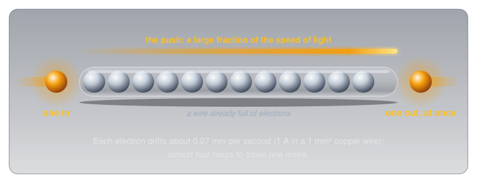

# Conductors, Insulators, and Semiconductors

!!! abstract "Beginner"
    This article opens the **Circuit Foundations** topic. No prior knowledge required. It explains what electricity is moving through, which makes [What Is Electricity?](what_is_electricity.md) easier to follow.

Almost every wire in a house, a car, or a phone charger is copper. The contacts on a computer's memory slots and on good audio connectors are plated with gold. Silver conducts electricity better than either of them, and almost nothing is made of it.

Those three facts look like trivia, but each one follows from the same two questions about a material:

1. **How many of its electrons are free to move?**
2. **How far does each free electron get before it bumps into something?**

A material with plenty of free electrons that travel a long way between collisions is a good conductor. A material with almost no free electrons is an insulator. This article builds both questions from the atom up, then uses them to explain why the wire is copper, the contacts are gold, and the silver stays in the jewellery box.

---

## Inside the Atom

Both questions are about electrons, so the place to start is where electrons live.

Every atom has a small, heavy centre called the **nucleus**, made of positively charged **protons** and uncharged **neutrons**. Around the nucleus are negatively charged **electrons**, one for every proton, so the atom as a whole is electrically neutral. Opposite charges attract, and that attraction is what holds the electrons to their atom.

Atoms rarely stay alone. They bond together into **molecules**, groups of atoms that share or swap electrons: a water molecule is two hydrogen atoms bonded to one oxygen. An atom or molecule that has gained or lost an electron no longer balances its protons, so it carries an overall charge. That's an **ion**, and ions turn up again at the end of this article, as the reason salt water conducts.

The electrons sit in layers called **shells**. The inner shells sit close to the nucleus and are held tightly. The outermost shell, the **valence shell**, sits farthest away, partly screened from the nucleus's pull by all the electrons underneath it. The electrons out there are the only ones that ever take part in electricity.

???+ info "Definition: Valence Electrons"

    **Valence electrons** are the electrons in an atom's outermost shell. They are the most loosely held, and they decide how the material behaves electrically: whether it conducts, insulates, or does something in between.

A copper atom has 29 electrons, arranged in shells of 2, 8, 18, and **1**. Silver has 47 (2, 8, 18, 18, **1**), and gold has 79 (2, 8, 18, 32, 18, **1**). All three end the same way, with a single electron alone in the outer shell, far from the nucleus and loosely held. That shared ending is the first clue.

<figure markdown>
  { width="640" }
  <figcaption>Copper, silver, and gold all end with one lonely electron in the outer shell. The 28 electrons underneath screen it from most of the nucleus's pull.</figcaption>
</figure>

---

## Question One: How Many Electrons Are Free?

Knowing where the loose electrons are, the next step is to see what happens when billions of atoms sit side by side in a solid.

In a metal, the atoms pack together so closely that each one's loose outer electron is no longer really attached to it. The electron drifts off and is shared by the whole piece of metal. What's left is a fixed grid of positive atom cores sitting in a "sea" of free electrons that wander through the entire block.

Copper gives up one electron per atom to that sea. A cubic metre of copper holds about 8.47 × 10²⁸ free electrons: 84.7 billion billion billion. Put a voltage across a copper wire and the whole sea shifts along together. That shift is current.

An insulator works the opposite way. In glass, porcelain, rubber, or plastic, every outer electron is locked into a chemical bond holding two atoms together. None are left over to wander, so a voltage has almost nothing to push.

<figure markdown>
  { width="700" }
  <figcaption>Same voltage, two materials. In copper the free electrons drift together; in glass every outer electron is already spoken for.</figcaption>
</figure>

Valence electrons predict which way most materials fall:

<figure markdown>
  { width="740" }
  <figcaption>How tightly an atom holds its valence electrons sorts most materials into three families.</figcaption>
</figure>

The rule of thumb is useful, and it is also where most explanations stop. It can't be the whole story, though. Copper, silver, and gold all have exactly one free electron per atom, yet silver conducts 50% better than gold. Something besides the count is at work.

---

## Question Two: How Far Do They Get?

Counting free electrons answers the first question. The second is about what happens to those electrons once they start moving.

A free electron doesn't glide through the metal unimpeded. The atom cores it passes are never perfectly still: they vibrate in place, and the hotter the metal, the harder they shake. Every so often an electron collides with a vibrating atom, or with an impurity (a stray atom of something else), and loses the progress the voltage gave it. Resistance is the sum of all those collisions.

A crowd crossing a room is a good picture of this. How many people reach the far wall each second depends on two things: how many people are crossing, and how often each one gets bumped and has to start over. A big crowd in a room full of obstacles can move fewer people per second than a smaller crowd in a clear room.

Both factors can be measured for real metals. This table puts each metal beside copper, using measured resistivities and free-electron counts (sources in [Further Reading](#further-reading)):

| Metal | Valence electrons | Free electrons (relative to copper) | Time between collisions (relative to copper) | Conductivity (relative to copper) |
|---|---|---|---|---|
| Silver | 1 | 0.69× | 1.53× | **106%** |
| Copper | 1 | 1.00× | 1.00× | **100%** |
| Gold | 1 | 0.70× | 0.99× | **69%** |
| Aluminum | 3 | 2.14× | 0.28× | **60%** |

<figure markdown>
  { width="640" }
  <figcaption>Every point on a dashed curve has the same conductivity. Silver sits above copper's curve by trading electron count for longer trips; aluminum has the most electrons and still lands on the 60% curve.</figcaption>
</figure>

Each row tells its own story once both factors are on the table:

- **Silver** has fewer free electrons per cubic metre than copper (its atoms are bigger and sit farther apart), but each electron travels about half again as long between collisions. It wins overall by about 6%.
- **Gold** has almost exactly silver's count of free electrons, but its electrons collide as often as copper's. It finishes well behind both.
- **Aluminum** breaks the simple rule outright. With three valence electrons it has more than twice copper's free electrons, yet its electrons collide almost four times as often, so it conducts only 60% as well.

So "one loose valence electron" is a good first answer to why copper, silver, and gold conduct, and an incomplete one. They are the best conductors because they combine a full sea of free electrons with unusually few collisions. Why their electrons collide so rarely comes from quantum mechanics (the field is called **band theory**), which is well beyond this article. The two-question picture is enough to predict how real conductors behave.

### Heat Makes Every Metal Worse

The collision picture makes a prediction: heat the metal, the atoms shake harder, collisions get more frequent, and resistance goes up. Metals do exactly that.

Copper's resistance rises by about 0.39% for every degree Celsius. That sounds tiny until a wire warms up a lot. A 10 m run of household-size copper wire (2.08 mm² cross-section, the size known as 14 AWG) measures about 0.081 Ω at 20 °C. Run enough current through it to warm it to 70 °C and it measures about 0.096 Ω, close to 20% more.

That leads straight to a feedback loop. A wire carrying too much current heats up, the heat raises its resistance, and more resistance turns even more of the current into heat:

<figure markdown>
  { width="720" }
  <figcaption>Each lap around the loop turns more of the current into heat.</figcaption>
</figure>

That loop is the reason wire sizes come with current ratings, covered in [Safety](#safety-insulation-has-limits) below.

---

## Why the Light Comes On Instantly

The electron-sea picture raises an obvious question. If current is electrons moving through a wire, how fast are they actually going?

The answer is surprisingly slow. In a copper wire with a 1 mm² cross-section carrying 1 A, the electron sea drifts along at about 0.07 mm per second. At that pace a single electron would need almost four hours to travel one metre.

A light still comes on the instant the switch closes, because the wire is already full of electrons from end to end. A tube packed with marbles behaves the same way: push one marble in at one end and a marble drops out of the far end at the same moment, even though no single marble moved more than a fraction of a millimetre. What travels quickly is the push, not the electrons. That push races along the wire at a large fraction of the speed of light, while the electrons themselves barely creep.

<figure markdown>
  { width="700" }
  <figcaption>The wire is the tube and the electrons are the marbles. The push arrives at once; no individual electron makes the trip.</figcaption>
</figure>

This is the deeper meaning of the definition in [What Is Electricity?](what_is_electricity.md): current is the flow of charge, and in a metal that flow is the whole electron sea shifting together, not individual electrons sprinting from the battery to the bulb.

---

## Insulators: Every Electron Spoken For

Conductors are only useful because insulators keep current where it belongs. Every wire is a conductor wrapped in an insulator.

In an insulator, the outer electrons are all locked into the chemical bonds that hold the material together. Glass and porcelain are built from silicon and oxygen atoms, bonded tightly in every direction. Plastics and rubber are long chains of carbon atoms, each bond holding its electrons firmly. With no free electrons to push, a voltage produces almost no current.

The difference between a conductor and an insulator is not small. Copper's resistivity (the resistance of a standard one-metre cube) is 1.68 × 10⁻⁸ Ω·m. Ordinary glass sits somewhere from 10⁹ to 10¹³ Ω·m, and fused quartz is about 7.5 × 10¹⁷ Ω·m. Quartz resists current roughly 45 million billion billion times as strongly as copper. Few physical quantities span a range like that.

<figure markdown>
  { width="720" }
  <figcaption>Each tick is a factor of 1,000. Copper and quartz sit about 25 powers of ten apart, with semiconductors in the gap between.</figcaption>
</figure>

Air is an insulator too, which is why the two prongs of a plug can sit a few millimetres apart without current jumping between them. But every insulator has a limit. Push the voltage high enough and the electric force tears electrons out of their bonds, the material suddenly conducts, and current arcs through it. Dry air gives way at roughly 3,000 V per millimetre. A spark from a doorknob is a small example of air breaking down. Lightning is the same thing on a massive scale.

---

## Semiconductors: The In-Between

Between conductors and insulators sits a third family, and it is the one every modern electronic device is built from.

Silicon has four valence electrons. In a silicon crystal, each atom shares one electron with each of its four neighbours, so every outer electron is locked into a bond, just as in an insulator. The difference is that silicon's bonds are weak enough for ordinary heat to break a few of them. At room temperature a small number of electrons shake loose, and silicon conducts a little.

That gives semiconductors a behaviour that is the opposite of metals. In a metal, the count of free electrons is fixed, and heat only adds collisions, so resistance rises. In a semiconductor, heat frees more electrons, and the extra free electrons far outweigh the extra collisions, so resistance **falls** as temperature rises. Silicon's resistance drops by about 7% per degree Celsius, nearly twenty times as fast as copper's rises.

<figure markdown>
  { width="640" }
  <figcaption>The same heat, opposite results. Copper gains a few percent; a semiconductor thermistor loses most of its resistance.</figcaption>
</figure>

That property is exactly how many [thermistors](temperature_sensors.md#three-ways-to-sense-heat) work: their resistance falls sharply and predictably as they warm, which turns temperature into something a circuit can measure.

Semiconductors become far more useful when engineers add a pinch of a different element on purpose, a process called **doping**. A few atoms with five valence electrons (like phosphorus) add spare free electrons. A few atoms with three (like boron) leave gaps where an electron is missing. Joining the two kinds of silicon is how diodes and transistors are made; [Diodes and LEDs](diodes_and_leds.md) picks up the story at that junction.

<figure markdown>
  { width="740" }
  <figcaption>One spare electron or one missing electron per dopant atom, and the boundary where the two kinds meet.</figcaption>
</figure>

---

## Choosing a Conductor

Back to the opening puzzle. Conductivity is only one factor when a material gets picked. Cost, weight, and how the surface behaves in air matter just as much:

<figure markdown>
  { width="740" }
  <figcaption>Each metal wins on a different question.</figcaption>
</figure>

-   :material-cable-data: **Copper**

    ---

    **Why it matters:** the default conductor for wire, cable, and the traces on circuit boards.

    **The numbers:** 94% of silver's conductivity at a small fraction of the price.

    **The catch:** its surface slowly oxidizes in air, which matters at contacts that must make a clean connection for years.

-   :material-diamond-stone: **Silver**

    ---

    **Why it matters:** the best conductor of any element at room temperature.

    **The numbers:** only about 6% better than copper.

    **The catch:** it costs far more and tarnishes (sulphur in the air forms a dark film on its surface). It shows up as plating on some high-end connectors and relay contacts, almost never as solid wire.

-   :material-gold: **Gold**

    ---

    **Why it matters:** the contact metal, because it doesn't corrode or tarnish at all.

    **The numbers:** only 69% of copper's conductivity.

    **The catch:** too costly to use in bulk. A plating thinner than a hair on a copper contact keeps the connection clean for decades, and in a contact, a clean surface matters more than a few percent of conductivity.

-   :material-transmission-tower: **Aluminum**

    ---

    **Why it matters:** the conductor for long overhead power lines.

    **The numbers:** 60% of copper's conductivity, but copper is more than three times as heavy. For the same weight of metal, aluminum carries about twice the current.

    **The catch:** on a line stretched between towers, weight is everything, so aluminum wins. Inside equipment, where space matters more than weight, copper wins.

That's the opening puzzle solved. The wire is copper because copper scores almost as high as silver on both questions at a fraction of the cost. The contacts are gold because gold's surface stays clean. Silver wins on conductivity alone, and conductivity alone rarely decides anything.

---

## Safety: Insulation Has Limits

Everything above has a safety side, because the same physics that makes a good conductor makes a dangerous one.

!!! danger "Insulation Is Only Rated for So Much"
    An insulator stops current only up to its breakdown voltage, and only while it is intact and dry. Cracked, scorched, or wet insulation can conduct at voltages it would normally block. Never trust damaged insulation on anything connected to mains power: a wall outlet in Canada supplies 120 V AC, which can kill. Replace the cable instead of taping it.

Heat is the other way insulation fails, and an overloaded wire supplies the heat itself.

!!! warning "Undersized Wire Is a Fire Risk"
    The heat feedback loop from [Heat Makes Every Metal Worse](#heat-makes-every-metal-worse) is why every wire size has a maximum current. A wire that's too thin for the current it carries runs hot, its resistance climbs, and it runs hotter still, until the insulation melts or catches fire. When a project draws real current (motors, heaters, LED strips), check the wire's rating before powering up.

The human body is a conductor, too, though not in the way metal is. The body has no electron sea. It conducts because it is mostly salt water, and dissolved salt splits into charged particles called **ions** that can carry current. Pure water is actually a poor conductor; the salts dissolved in tap water, sweat, and the body are what make them conduct. That's why wet skin is so much more dangerous than dry skin, worked through with real numbers in [What Is Electricity?](what_is_electricity.md#safety-where-the-numbers-matter).

---

## Practice

??? question "1. The Penny and the Glass Rod"

    A copper penny-sized disc and a glass rod of the same size are each connected across a 9 V battery. Explain, in terms of electrons, why current flows through one and not the other.

    ??? tip "Solution"
        Copper's outer electron leaves its atom and joins a sea of free electrons shared by the whole disc, so the battery's voltage has something to push: the whole sea shifts, and that's current. In glass, every outer electron is locked into a chemical bond between silicon and oxygen atoms. There are essentially no free electrons, so the voltage has almost nothing to move, and almost no current flows.

??? question "2. More Electrons, Worse Conductor?"

    Aluminum has three valence electrons per atom and copper has one, and aluminum ends up with more than twice copper's free electrons per cubic metre. Why is aluminum still the worse conductor?

    ??? tip "Solution"
        Conductivity depends on two things: how many electrons are free, and how far each one gets between collisions. Aluminum wins the first question by about 2×, but its electrons collide almost four times as often as copper's. Multiply the two effects and aluminum ends up at about 60% of copper's conductivity. Counting valence electrons alone predicts the wrong answer.

??? question "3. Hot Wire, Cold Wire"

    A copper wire measures 0.50 Ω at 20 °C. Copper's resistance rises by about 0.39% per degree Celsius. What does it measure at 60 °C? Then explain why a silicon sample would move in the opposite direction.

    ??? tip "Solution"
        The temperature rises by 40 °C, so the resistance rises by about 40 × 0.39% = 15.6%:

        \[ R = 0.50\ \Omega \times (1 + 40 \times 0.0039) \approx 0.58\ \Omega \]

        In copper the number of free electrons is fixed, so heat only adds collisions, and resistance goes up. In silicon, heat breaks bonds and frees more electrons. The extra free electrons outweigh the extra collisions, so silicon's resistance goes down as it warms.

??? question "4. The Instant Light"

    Electrons in a household wire drift at a fraction of a millimetre per second. Why does a lamp three metres from the switch light the moment the switch is flipped?

    ??? tip "Solution"
        The wire is already full of free electrons along its whole length. Closing the switch lets the voltage push on the entire electron sea at once, so electrons start moving through the lamp immediately, the same way a tube packed with marbles pushes one out the far end the moment one goes in. The push travels at a large fraction of the speed of light; the individual electrons barely move.

??? question "5. Why Gold-Plated Contacts?"

    Gold conducts electricity worse than copper. Why do so many connectors use gold-plated contacts anyway?

    ??? tip "Solution"
        At a contact, the surface matters more than the bulk metal. Copper's surface oxidizes in air, and that oxide film adds resistance right where two parts touch, which can make a connection flaky over the years. Gold doesn't corrode at all, so a very thin gold plating keeps the contact surface clean for decades. The slightly lower conductivity is irrelevant in a layer that thin.

---

## Quick Recap

-   **Valence electrons**

    ---

    The outermost electrons of an atom, the most loosely held. They decide whether a material conducts.

-   **Conductor**

    ---

    Loose outer electrons join a shared sea that a voltage can push. Copper, silver, gold, aluminum.

-   **Insulator**

    ---

    Every outer electron locked into a chemical bond. Glass, porcelain, rubber, plastic, air (until it breaks down).

-   **Semiconductor**

    ---

    Bonds weak enough for heat to free a few electrons. Silicon, germanium. Resistance falls as it warms.

-   **The two questions**

    ---

    How many electrons are free, and how far each one gets between collisions. Good conductors win on both.

-   **Temperature**

    ---

    Metals: heat means more collisions, so resistance rises. Semiconductors: heat frees electrons, so resistance falls.

---

## What's Next

With the electron sea in mind, **[What Is Electricity?](what_is_electricity.md)** puts numbers on it: voltage as the push, current as the flow, resistance as the collisions, and Ohm's Law tying all three together.

---

## Further Reading

**Fundamentals**

- [Electrical Resistivity and Conductivity — Wikipedia](https://en.wikipedia.org/wiki/Electrical_resistivity_and_conductivity) — the resistivity values used in this article (silver, copper, gold, aluminum at 20 °C), plus why metals conduct and why semiconductors behave the opposite way with heat
- [Resistivity and Temperature Coefficient Table — HyperPhysics](https://hyperphysics.gsu.edu/hbase/Tables/rstiv.html) — resistivities and temperature coefficients for metals, semiconductors, and insulators, including glass and quartz

**Going Further**

- [Free Electron Densities and Fermi Energies — HyperPhysics](https://hyperphysics.gsu.edu/hbase/Tables/fermi.html) — the free-electron counts behind this article's comparison table (data from Ashcroft and Mermin's *Solid State Physics*)
- [Dielectric Strength — Wikipedia](https://en.wikipedia.org/wiki/Dielectric_strength) — breakdown voltages for air and common insulators

**Related Articles**

- [What Is Electricity?](what_is_electricity.md) — voltage, current, resistance, and Ohm's Law, built on the electron sea from this article
- [Temperature Sensors](temperature_sensors.md) — thermistors put semiconductor behaviour to work as a temperature sensor
