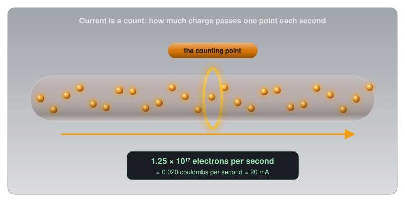
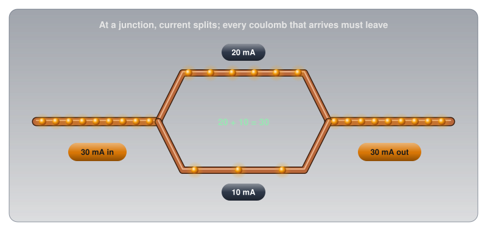
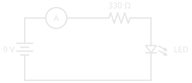

# Current

!!! abstract "Beginner"
    This article is in the **Circuit Foundations** topic and follows [Voltage](voltage.md), which introduced charge and the coulomb. No other prior knowledge required.

Put a meter in the wire just before an LED (light-emitting diode) and another just after it, and the two readings match to the last digit: 21.2 mA going in, 21.2 mA coming out. Yet the LED is glowing, and the battery feeding it is slowly going flat. Something is being used up, and it isn't current.

Two ideas explain what's going on:

1. **Current is a rate.** It counts how much charge passes one point each second, the way a turnstile counts people.
2. **Current is never used up.** Every bit of charge that leaves the battery comes back to it. What the LED takes is energy, which is the job [Voltage](voltage.md) described.

This article builds both ideas, then uses them on junctions, direction, real-world currents, measuring current, and why current is what does the damage in a shock.

---

## Idea One: Current Is a Rate

[Voltage](voltage.md) measured charge in coulombs and called voltage the push on it. Current asks a different question: how much of that charge is moving past a given point?

Picture standing beside a wire and counting the charge that passes one spot, like a turnstile counting people into a stadium. Count for one second and the total is the current.

???+ info "Definition: Ampere"

    One **ampere** (A), or amp, is a current of one coulomb of charge passing a point every second. A **milliamp** (mA) is a thousandth of that, 0.001 A, the unit most hobby circuits work in.

In formulas, current is written **I**, a letter that comes from the French *intensité du courant*, "current intensity": André-Marie Ampère, the physicist the unit is named after, used it in 1820, and it stuck. So in V = I × R, the I is the current.

A single LED drawing 20 mA has 0.020 coulombs passing through it every second. Since one coulomb is about 6.24 × 10¹⁸ electrons, that's about 125 thousand million million electrons per second through a component smaller than a fingernail.

\[ \frac{0.020\ \text{C/s}}{1.602 \times 10^{-19}\ \text{C per electron}} \approx 1.25 \times 10^{17}\ \text{electrons per second} \]

<figure markdown>
  { width="720" }
  <figcaption>Current is a count taken at one point: how much charge goes by each second.</figcaption>
</figure>

A rate this high doesn't mean the electrons are fast. Each one drifts along at a fraction of a millimetre per second; the enormous count comes from how many of them there are, side by side across the wire. [Conductors, Insulators, and Semiconductors](conductors_and_insulators.md#why-the-light-comes-on-instantly) works through that drift speed and why a light still comes on instantly.

### Capacity Is Current × Time

Because current is charge per second, a current running for a while adds up to a total amount of charge. That total is what a battery's capacity rating measures. "Milliamp-hours" means milliamps multiplied by hours.

The Energizer AA cell from [Voltage](voltage.md#voltage-is-not-energy-stored) is rated at about 2,500 mAh when drained at 100 mA, so it should last about 25 hours at that current:

\[ \frac{2{,}500\ \text{mAh}}{100\ \text{mA}} = 25\ \text{hours} \]

The datasheet's own test agrees: its 100 mA "digital audio" discharge curve runs for about 27 hours before the cell is exhausted. Drain the same cell five times harder, at 500 mA, and it doesn't simply last a fifth as long: the datasheet's capacity chart shows only about 1,500 mAh available at that current, about 3 hours. Batteries deliver less of their charge when drained fast, which is why a toy that works its batteries hard gets less out of them than a clock does.

---

## Idea Two: Current Is Never Used Up

With current pinned down as a count, the opening puzzle can be answered. Count the charge at any point in a single loop and the answer is always the same, because charge has nowhere else to go. It can't pile up inside a resistor or vanish into an LED. Every coulomb that enters a component leaves it, so the count going in equals the count coming out.

What the charge loses along the way is energy. In [Voltage](voltage.md)'s picture, each coulomb leaves the battery carrying 9 joules and gives some up in the resistor (as heat) and the rest in the LED (as light), arriving back at the battery with none left. The *number* of coulombs passing per second never changes; the *energy each one carries* drops at every component.

<figure markdown>
  { width="720" }
  <figcaption>Same number of balls passing every point (current), less energy in each one after every component (voltage).</figcaption>
</figure>

A hot-water heating system works the same way. A pump pushes water around a closed loop of pipe through radiators. The same amount of water flows past every point in the loop each second; none of it is used up. What the radiators take is heat, and the water returns to the boiler cooler than it left. The water is the charge, its flow rate is the current, and its heat is the energy that voltage measures.

That's the opening puzzle solved: the two meters agree because no charge is consumed. The LED glows because each coulomb hands it some energy on the way through, and the battery drains because its chemistry is what tops that energy back up.

### Junctions: Current Splits and Rejoins

Charge that can't be used up also can't be lost at a fork in the wire. When a wire splits into two branches, the current divides between them, and when the branches meet again, the currents add back up to the original. Whatever flows into a junction must flow out of it. This rule is called **Kirchhoff's current law**, after the physicist who stated it in 1845.

<figure markdown>
  { width="720" }
  <figcaption>30 mA in, 20 + 10 mA through the branches, 30 mA out. Nothing is gained or lost at a junction.</figcaption>
</figure>

How a current decides to split between branches depends on the resistance of each, which [Series and Parallel Circuits](series_and_parallel.md) works through with real components.

---

## Which Way Does Current Flow?

Current has a direction as well as a size, and the direction comes with a historical quirk.

When scientists in the 1700s named the two kinds of charge "positive" and "negative", nobody knew what actually moved in a wire. They assumed positive charge flowed out of the positive terminal and around to the negative one. Every rule and formula since has been written in that direction. In 1897, the electron was discovered, and it turned out to carry *negative* charge, which means the electrons in a wire actually drift the other way, from negative to positive.

<figure markdown>
  { width="720" }
  <figcaption>Both describe the same current. Electronics uses the top arrow.</figcaption>
</figure>

Both descriptions give the same answers, because negative charge moving one way has exactly the same effect as positive charge moving the other. Electronics keeps the original convention, called **conventional current**: from + to −. Every schematic, formula, and datasheet on this site uses it, and so do the symbols themselves. The arrow in an LED's symbol points the way conventional current flows through it.

### One Way, or Back and Forth

Current from a battery flows steadily in one direction. That's **direct current**, or DC. The current from a wall outlet reverses direction many times a second: in Canada it completes 60 back-and-forth cycles every second. That's **alternating current**, or AC. Everything in this article applies to both, moment by moment; [AC vs DC](ac_dc.md) covers how and why AC alternates.

---

## Currents You'll Meet

With the unit and the direction settled, real currents span an even wider range than voltages do, and the human body sits uncomfortably in the middle of it. The body figures come from the US National Institute for Occupational Safety and Health (NIOSH).

<figure markdown>
  { width="740" }
  <figcaption>Each tick is ten times the one before. The red labels show what each current does to a human body.</figcaption>
</figure>

| Current | What it is | Source |
|---|---|---|
| 1 mA | barely felt by the body | NIOSH 98-131 |
| 20 mA | a typical indicator LED | the LEDs on this site |
| 40 mA | absolute maximum from one Arduino Uno pin | ATmega328P datasheet |
| 200 mA | absolute maximum through the whole Uno chip | ATmega328P datasheet |
| 500 mA | what a USB (Universal Serial Bus) 2.0 port supplies | USB 2.0 specification |
| 15 A | a typical household circuit breaker | NIOSH 98-131 |
| 30,000 A | a typical lightning bolt | US National Oceanic and Atmospheric Administration (NOAA) |

The gap between "an LED" and "barely felt" is only twenty times. That's why the body's thresholds matter even at hobby scale, covered in [Safety](#safety-current-is-what-hurts) below.

---

## Measuring Current

Measuring current uses the same multimeter as measuring voltage, but connected in a completely different way, and getting that difference wrong is the most common way people break their meters.

Voltage is a difference between two points, so a voltmeter sits *across* a component. Current is a count of charge passing through one point, so the meter has to *be* that point: all the current must flow through it. That means breaking the circuit and letting the meter close the gap, **in series**. The meter's red lead also moves to its separate current jack (marked mA or A).

<figure markdown>
  { width="720" }
  <figcaption>Voltage: probes across a part, circuit intact. Current: circuit broken, meter in the path.</figcaption>
</figure>

<figure markdown>
  { width="420" }
  <figcaption>The ammeter (the circle marked A) sits in the loop itself. Compare the voltmeter schematic in <a href="../voltage/#measuring-voltage">Voltage</a>, which bridges the resistor instead.</figcaption>
</figure>

An ammeter is built the opposite way to a voltmeter. A voltmeter has a very high resistance so it barely disturbs the circuit; an ammeter has a very *low* resistance, close to a plain wire, so inserting it into the loop barely changes the current it's measuring. That low resistance is exactly what makes the classic mistake so destructive:

- ✅ **Safe (non-destructive):** measuring current with the meter in series in a battery-powered circuit, after checking that the expected current is within the meter's range.
- ⚠️ **Caution (can damage the meter):** leaving the leads in the current jack and then touching the probes across a battery or a power supply, the way a voltmeter is used. The meter becomes a near-short across the source, a large current rushes through it, and it blows its internal fuse (or worse, if it has none: [Using a Multimeter](tools/multimeter.md#the-fuse-behind-the-current-jacks) explains what that fuse has to survive). After measuring current, move the red lead back to the voltage jack straight away.
- 🚨 **DANGER:** measuring current in mains circuits. Leave it alone.

---

## Safety: Current Is What Hurts

[Voltage](voltage.md#safety-voltage-pushes-current-hurts) made the point that voltage pushes and current hurts. The body's thresholds put numbers on how little current that takes. NIOSH gives these estimates for 60 Hz alternating current through the body:

| Current | Effect |
|---|---|
| 1 mA | barely perceptible |
| 16 mA | the most an average man can grip and still let go |
| 20 mA | paralysis of the breathing muscles |
| 100 mA | ventricular fibrillation threshold: the heart's rhythm breaks down |
| 2 A | cardiac standstill and internal organ damage |

Above about 16 mA, the current itself clamps the hand shut on whatever it's holding, so the victim can't let go while the current keeps flowing. How much current a given voltage can push through skin depends on the body's resistance, which [What Is Electricity?](what_is_electricity.md#safety-where-the-numbers-matter) works through for dry and wet skin.

!!! danger "Twenty Milliamps Can Kill"
    NIOSH notes that contact with 20 mA can be fatal, which is the same current as a single indicator LED. A 120 V outlet can easily push far more than that through the body. Never work on anything connected to mains power.

The same limits apply to the parts in a circuit, just with less drama. Components are rated for the current they can carry, and exceeding it destroys them.

!!! warning "Respect a Pin's Current Limit"
    An Arduino Uno pin is rated at 40 mA absolute maximum, and the whole chip at 200 mA. Drawing more, by connecting a motor or a long LED strip directly to a pin, destroys the pin or the chip. [Digital Pins](digital_io.md) covers how to drive bigger loads safely.

---

## Practice

??? question "1. Counting Charge"

    A motor draws 2 A for one minute. How many coulombs of charge pass through it?

    ??? tip "Solution"
        2 A means 2 coulombs per second, and a minute is 60 seconds:

        \[ Q = I \times t = 2\ \text{A} \times 60\ \text{s} = 120\ \text{C} \]

??? question "2. How Long Will It Last?"

    A small project draws a steady 50 mA from a battery rated at 1,200 mAh. Roughly how long will the battery last? Why might the real answer be a little different?

    ??? tip "Solution"
        \[ \frac{1{,}200\ \text{mAh}}{50\ \text{mA}} = 24\ \text{hours} \]

        Real batteries deliver less of their rated capacity at higher currents and in the cold, and the capacity rating is measured under specific test conditions in the datasheet. A light, steady load like this one will come close; a heavy one won't.

??? question "3. Before and After"

    In a single loop, a meter before a resistor reads 15 mA. What does a meter right after the resistor read, and what has the resistor taken from the charge passing through it?

    ??? tip "Solution"
        It reads **15 mA**. Charge isn't used up, so the same current flows everywhere in a single loop. What the resistor takes is energy: each coulomb leaves the resistor with less energy than it entered with, and the difference has become heat. That loss shows up as a voltage drop across the resistor, not a drop in current.

??? question "4. The Three-Way Junction"

    A wire carrying 60 mA splits into three branches. Two of them carry 25 mA and 10 mA. What does the third carry?

    ??? tip "Solution"
        Everything flowing into a junction must flow out: 60 − 25 − 10 = **25 mA** in the third branch.

??? question "5. The Blown Meter"

    Someone measures a circuit's current, then, without touching the leads, puts the probes across a 9 V battery to check its voltage. The meter goes dead. What happened?

    ??? tip "Solution"
        The red lead was still in the current jack, where the meter has almost no resistance. Across the battery, the meter acted like a short circuit, a large current flowed through it, and its internal fuse blew. Current is measured with the meter *in* the path, voltage with the meter *across* it, and the lead has to move between the two jacks.

---

## Quick Recap

-   **Current is a rate**

    ---

    1 A = 1 coulomb per second past a point. Hobby circuits work in milliamps.

-   **Never used up**

    ---

    The same current flows everywhere in a single loop. What components take is energy, not charge.

-   **Junctions add up**

    ---

    Current in = current out. Branches split it; rejoining adds it back.

-   **Conventional direction**

    ---

    From + to −, a 1700s convention. Electrons actually drift from − to +. Every schematic uses the convention.

-   **Measure it in series**

    ---

    Break the circuit and let the meter close the gap. Move the red lead to the current jack, then back.

-   **Current is what hurts**

    ---

    1 mA is barely felt; 20 mA can be fatal. Respect component limits too.

---

## What's Next

Voltage pushes and current flows; the question is what decides how much flows for a given push. **[Resistance and Conductance](resistance.md)** answers it: what sets a wire's resistance, why conductance is the same idea flipped, and what a resistor's tolerance promises.

---

## Further Reading

**Datasheets and Standards**

- [Energizer E91 AA Datasheet](https://data.energizer.com/pdfs/e91.pdf) — the 100 mA discharge curve and the capacity-versus-current chart used in this article
- [ATmega328P Datasheet — Microchip](https://ww1.microchip.com/downloads/aemDocuments/documents/MCU08/ProductDocuments/DataSheets/ATmega48A-PA-88A-PA-168A-PA-328-P-DS-DS40002061B.pdf) — the absolute maximum ratings: 40 mA per pin, 200 mA for the chip

**Safety**

- [Worker Deaths by Electrocution (NIOSH Publication 98-131)](https://stacks.cdc.gov/view/cdc/6385/cdc_6385_DS1.pdf) — Table 1, the effects of current through the body

**Deep Dives**

- [Electric Current — Wikipedia](https://en.wikipedia.org/wiki/Electric_current) — the formal definition, conventional current, and drift
- [Kirchhoff's Circuit Laws — Wikipedia](https://en.wikipedia.org/wiki/Kirchhoff%27s_circuit_laws) — the current law from this article, and its partner for voltage

**Related Articles**

- [Voltage](voltage.md) — charge, the coulomb, and the energy current carries
- [Conductors, Insulators, and Semiconductors](conductors_and_insulators.md) — the free electrons that make up a current
- [Series and Parallel Circuits](series_and_parallel.md) — current in real branching circuits
