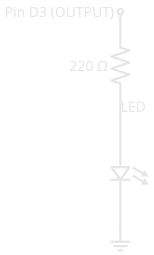
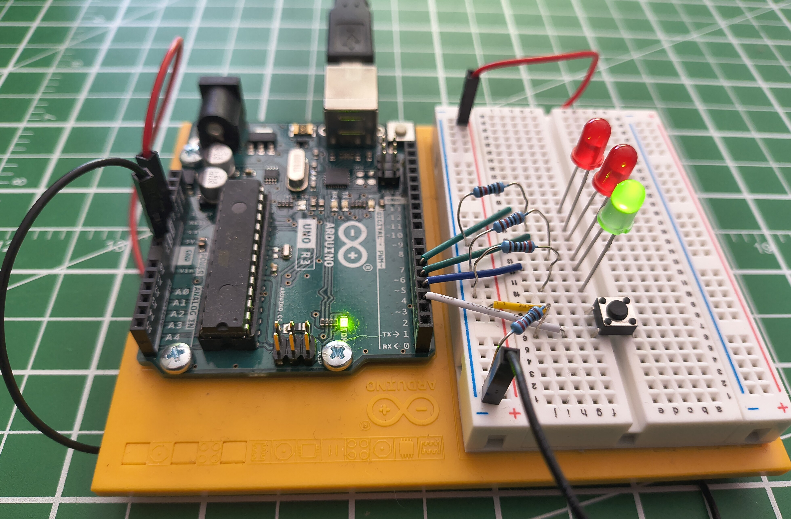

# Digital Pins

!!! abstract "Beginner"
    This article is in the **Microcontrollers** topic. It builds on [What Is Electricity?](what_is_electricity.md) and [Series and Parallel Circuits](series_and_parallel.md) — read those first if voltage, current, and the job of a resistor are new to you. If you've never seen an Arduino before, [What Is an Arduino?](what_is_an_arduino.md) covers the board and how to read its code first.

Look at the light switch on your wall. It's up or it's down. The light is on or it's off. There's no "half-on" — the switch commits to one of two states and stays there until you move it.

A **digital pin** is a microcontroller's version of that switch. It's a single metal connection along the edge of the board that is only ever in one of two states: fully on or fully off. A microcontroller like an [Arduino](what_is_an_arduino.md) Uno has a row of them, and your program decides — many times a second — which ones are on and which are off, or listens to whether the outside world is pushing them on or off.

That's the whole idea behind making hardware *do* something. By the end of this article you'll understand what those two states actually are, the two jobs a pin can take, and why a pin almost never connects to anything without a resistor in the way.

---

## On, Off, and Nothing in Between

"Digital" means two states, and only two. Engineers give them names:

- **HIGH** — the pin is at the supply voltage. On an Arduino Uno that's **5V**.
- **LOW** — the pin is at **0V**, the same as ground.

There is no in-between value. A digital pin is HIGH or it is LOW, the same way the wall switch is up or down. That restriction is exactly what makes it reliable: a little electrical noise can't accidentally turn "5V" into "4.6V and therefore something else," because the only two answers the pin understands are *all the way on* and *all the way off*.

!!! info "Your board may use 3.3V"
    The Uno's HIGH is 5V, but many modern boards — the `ESP32`, the Raspberry Pi Pico, the BBC micro:bit — use **3.3V** instead. The idea is identical; only the voltage of "HIGH" changes. This matters the moment you connect two boards together, because 5V coming out of one pin can damage a 3.3V pin on another. Always check what voltage your board runs at.

---

## A Pin Has Two Possible Jobs

Before a pin can do anything, you have to tell the microcontroller which of two jobs it should do:

- **OUTPUT** — the pin *provides* voltage. The microcontroller drives it HIGH or LOW to switch something on or off, like an LED.
- **INPUT** — the pin *senses* voltage. The microcontroller reads whether something outside is holding the pin HIGH or LOW, like a button being pressed.

You set this once, when the program starts, with `pinMode()`. A pin set to OUTPUT pushes electricity out; a pin set to INPUT listens for it. Get this backwards and nothing works — an output pin can't hear a button, and an input pin can't light an LED.

The code in this article is **Arduino C/C++**, the language an Arduino runs. If `void`, the curly braces, or `setup()`/`loop()` are unfamiliar, [What Is an Arduino?](what_is_an_arduino.md) walks through what each piece means before you hit it below. Once you're ready to actually run this code, [arduino-cli](tools/arduino_cli.md) covers compiling and uploading it.

---

## Job One: Switching an LED On (OUTPUT)

The simplest useful thing a pin can do is turn a light on. Here's the circuit built on a breadboard — an Arduino Uno on the left, three LEDs and a button on the right:

<figure markdown>
  { width="600" }
  <figcaption>A digital-I/O circuit: each LED connects to a pin through its own resistor, and a pushbutton feeds another pin. Nothing is powered yet.</figcaption>
</figure>

Follow just one LED. The pin connects to a resistor, the resistor to the LED, and the LED back to ground. Drawn as a **schematic** — the symbolic shorthand used in every tutorial and datasheet — that single path looks like this. (New to these symbols? [How to Read a Schematic](reading_schematics.md) decodes each one.)

<figure markdown>
  { width="280" }
  <figcaption>One output pin driving one LED. The zig-zag is the 220 Ω resistor; the triangle-and-bar with arrows is the LED; the lines at the bottom are ground (0V).</figcaption>
</figure>

When the pin is HIGH, it sits at 5V while the far end of the LED sits at 0V (ground). That 5V difference pushes current through the LED, and it lights. When the pin goes LOW, both ends are at 0V, no current flows, and the LED goes dark.

In code, that's two steps — declare the pin an output once, then drive it:

``` cpp title="Light an LED on pin 3" linenums="1"
void setup() {
  pinMode(3, OUTPUT);      // pin 3 will drive the LED
}

void loop() {
  digitalWrite(3, HIGH);   // 5V on pin 3 — LED on
}
```

`digitalWrite(3, HIGH)` puts 5V on pin 3; `digitalWrite(3, LOW)` drops it to 0V. To make the LED blink instead of staying on, you alternate between them with a pause in between — that's the entire "blinking LED" that every microcontroller starts with.

### Why the Resistor Is Not Optional

Notice the circuit never connects the LED straight to the pin. There's always a resistor first, and leaving it out is the most common way beginners destroy their first component.

An LED has very little resistance of its own. Connect it directly across 5V and it tries to draw far more current than it — or the pin — can survive. It may flare brightly for a second and burn out, and it can damage the pin driving it. The resistor deliberately limits the current to a safe level. This is the same current-limiting role you saw in [Series and Parallel Circuits](series_and_parallel.md); a 220 Ω resistor is a typical choice for a single LED on 5V.

!!! warning "Always put a resistor in series with an LED"
    Connecting an LED directly to a pin with no resistor lets too much current flow. The LED can burn out instantly, and you can damage the microcontroller pin driving it. One resistor per LED, every time.

---

## Job Two: Reading a Button (INPUT)

Reading the world is trickier than driving it, and the reason surprises people: a digital input pin connected to *nothing* doesn't reliably read LOW. It **floats**.

An unconnected pin is like a loose wire — it acts as a tiny antenna, picking up stray electrical noise from the air and from nearby wires. Read it and you'll get HIGH, then LOW, then HIGH again, with no pattern. The pin isn't broken; there's simply nothing holding it at a definite voltage, so it drifts. A button alone doesn't fix it, because a button only connects the pin to anything *while it's pressed*.

The fix is a second resistor that holds the pin at a definite voltage whenever the button isn't. This circuit uses a **pull-down resistor** tying the pin to ground: the pin rests at a steady **LOW** and reads **HIGH** the instant the button connects it to 5V. With the pin pulled down, reading it is two lines:

``` cpp title="Read a button on pin 2" linenums="1"
int buttonState = 0;

void setup() {
  pinMode(2, INPUT);            // pin 2 listens for the button
}

void loop() {
  buttonState = digitalRead(2); // HIGH when pressed, LOW when not
}
```

`digitalRead(2)` returns HIGH or LOW — the pin's current state. With the pull-down in place, that's HIGH while you hold the button and LOW the moment you let go.

Giving an input a reliable resting state is its own essential skill — pull-down versus pull-up, choosing the resistor's value, and the built-in pull-up your chip already has — so it has its own article: **[Pull-up and Pull-down Resistors](pull_resistors.md)**.

---

## Putting Both Jobs Together

The photo at the top had three LEDs *and* a button, and now both halves make sense: the button is an **input**, the LEDs are **outputs**, and a program ties them together. Read the input, decide what to do, drive the outputs — over and over, thousands of times a second.

Power the same circuit up and the program's idle state shows: the green LED is lit, the reds are dark, waiting for the button.

<figure markdown>
  { width="600" }
  <figcaption>Powered over USB. The program reads the button on its input pin and drives the LEDs on its output pins — here, the idle state holds the green LED on until the button is pressed.</figcaption>
</figure>

That loop — read inputs, drive outputs — is the heartbeat of nearly every microcontroller program, from this button-and-LED circuit to a thermostat reading a sensor and switching a furnace.

---

## The Same Idea on Every Board

Once you understand digital pins on an Arduino, you understand them everywhere. Every microcontroller works this way: each digital pin can be set to INPUT or OUTPUT, reads or writes HIGH or LOW, and floats if you leave an input unconnected. An `ESP32`, a Raspberry Pi Pico, a micro:bit — same concept, same two jobs.

What changes from board to board is the detail, not the idea:

- **The voltage of HIGH** — 5V on an Uno, 3.3V on most newer boards.
- **The pin numbers and how many there are.**
- **The exact code**, though the shape is always the same: set the mode, then read or write.

Learn it once here, and every new board is just a new set of numbers on a pattern you already know.

---

## Safety

!!! warning "A pin can only supply a little current"
    A microcontroller pin is meant to drive small loads — an LED, the input of another chip. An Arduino Uno pin is rated for about **20 mA**, and roughly 40 mA is the absolute limit before damage. A motor, a relay, a buzzer drawing real power, or a long strip of LEDs will all try to pull far more than that and can destroy the pin. When a load needs more current than a pin can give, the pin switches a transistor, and the transistor switches the load — never the load directly.

!!! warning "Match voltages between boards"
    Feeding 5V from an Uno pin into a 3.3V board's pin can damage that board. Before wiring two boards together, confirm they run at the same voltage, or use a level shifter between them.

---

## Practice

??? question "1. The drifting input"

    You set a pin to INPUT and wire a button to it — just the button, nothing else. With the button untouched, `digitalRead()` returns HIGH and LOW seemingly at random. The button isn't even pressed. What's happening, and what's the fix?

    ??? tip "Solution"

        The pin is **floating**. While the button is open, nothing connects the pin to a definite voltage, so it drifts on stray electrical noise. Add a **pull-down resistor** (around 10 kΩ) from the pin to ground so the pin rests at a steady LOW when the button is open — or set the pin to `INPUT_PULLUP` to use the chip's built-in pull-up instead. Either way, the pin now has a defined state at all times.

??? question "2. The missing resistor"

    A beginner wires an LED directly between pin 3 and ground — no resistor — and sets pin 3 HIGH. The LED flares brightly and then goes dark forever. What happened?

    ??? tip "Solution"

        With no resistor to limit it, the current through the LED shot far past what the LED could handle. It drew too much current, overheated, and burned out — that brief bright flare was it failing. The same over-current can damage the pin that was driving it. Every LED needs a current-limiting resistor in series; 220 Ω is a safe starting point on a 5V pin.

??? question "3. Which mode?"

    For each of these, would you set the pin to INPUT or OUTPUT?

    1. A buzzer you want the program to sound.
    2. A switch on a door that tells the program whether the door is open.
    3. A second LED.

    ??? tip "Solution"

        1. **OUTPUT** — the program drives the buzzer, providing voltage to switch it on. (A buzzer also draws more current than a pin should supply directly — drive it through a transistor.)
        2. **INPUT** — the program senses the switch's state, reading whether the pin is HIGH or LOW.
        3. **OUTPUT** — same as the first LED: the pin drives it.

---

## Quick Recap

<div class="grid cards two-col" markdown>

-   **Two States Only**

    ---

    A digital pin is **HIGH** (supply voltage — 5V on an Uno) or **LOW** (0V). Never anything between. That all-or-nothing behaviour is what makes it reliable.

-   **Two Jobs**

    ---

    Set with `pinMode()`: an **OUTPUT** pin drives a load HIGH or LOW; an **INPUT** pin reads whether the outside world is holding it HIGH or LOW.

-   **Outputs Need a Resistor**

    ---

    `digitalWrite(pin, HIGH)` puts 5V on a pin. Always pass it through a current-limiting resistor before an LED, or the LED — and maybe the pin — burns out.

-   **Inputs Need a Reference**

    ---

    A bare input pin floats on noise. A **pull-down** (or **pull-up**) resistor gives it a definite resting state, so `digitalRead(pin)` returns a reliable HIGH or LOW.

</div>

---

## What's Next

You've seen what the pins do — the fastest way to make it stick is to build it. **[Blink an LED](blink_an_led.md)** walks through wiring a single LED and flashing your first sketch, end to end, on real hardware.

From there, **[Pull-up and Pull-down Resistors](pull_resistors.md)** adds an input you can read reliably — the other half of this article's circuit — and **[arduino-cli](tools/arduino_cli.md)** covers the upload toolchain in depth.

---

## Further Reading

**Official Documentation**

- [Arduino Language Reference — Digital I/O](https://docs.arduino.cc/language-reference/) — the precise behaviour of `pinMode()`, `digitalWrite()`, and `digitalRead()`

**Related Articles**

- [What Is an Arduino?](what_is_an_arduino.md) — the board itself, and how to read a sketch's `setup()`/`loop()` structure
- [Resistor Color Codes](resistor_color_codes.md) — decode the 220 Ω current-limiting resistor in this article's circuit by its bands
- [Pull-up and Pull-down Resistors](pull_resistors.md) — giving an input a reliable resting state, the technique behind this article's button
- [What Is Electricity?](what_is_electricity.md) — voltage and current, the quantities a digital pin switches and senses
- [Series and Parallel Circuits](series_and_parallel.md) — the current-limiting resistor, seen here in front of every LED
- [How to Read a Schematic](reading_schematics.md) — decode the resistor, LED, and ground symbols used in this article's diagrams
