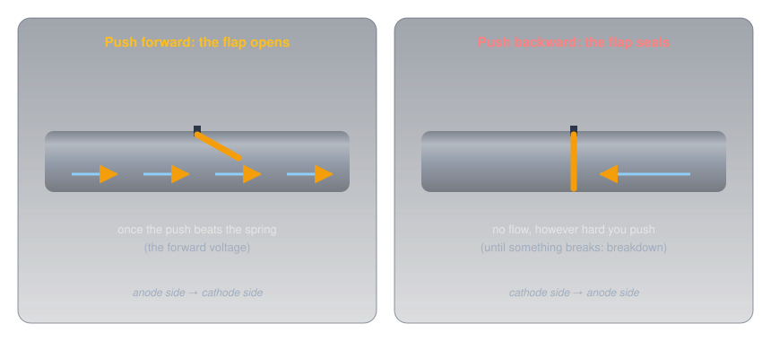
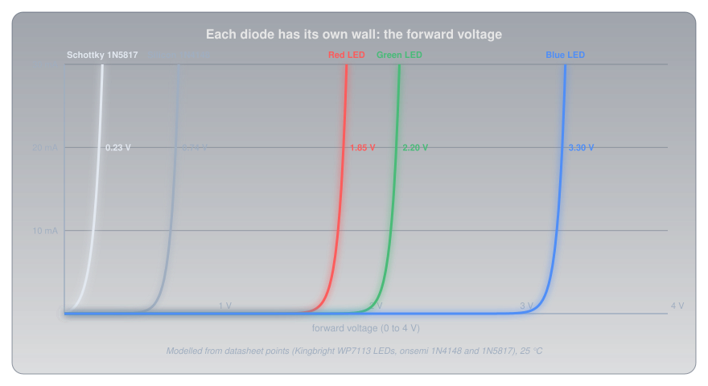
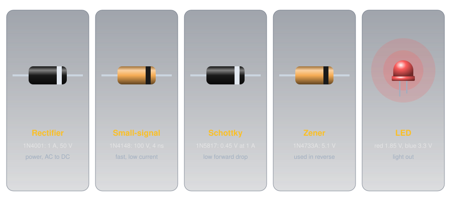
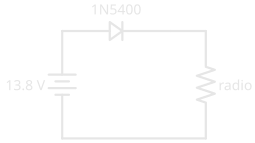
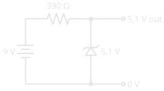

# Diodes and LEDs

!!! abstract "Beginner"
    This article is in the **Components** topic. It builds on [Ohm's Law and Power](ohms_law.md), where the LED's "wall" first appears, and on the doped silicon from [Conductors, Insulators, and Semiconductors](conductors_and_insulators.md#semiconductors-the-in-between). No other prior knowledge required.

Wire a red LED and a blue LED to two pins of an Arduino Uno, each through its own 220 Ω resistor. Both light, but the red one is clearly brighter, drawing about 14 mA against the blue's 8 mA. Same pin voltage, same resistor. Move both to a 3.3 V board like an `ESP32` and the red still glows, while the blue barely lights at all.

Two ideas explain it:

1. **A diode is a one-way valve.** Current passes in one direction only, and only once the voltage across it reaches the diode's **forward voltage**. Above that, the diode's voltage hardly changes however much current flows.
2. **The forward voltage is set by what the diode is made of,** and for an LED that means by the colour of its light. Bluer light needs a higher voltage, which leaves less for the resistor, and the resistor is what sets the current.

---

## Inside a Diode: The PN Junction

A diode is a single slab of silicon (or another semiconductor) doped two ways. [Conductors, Insulators, and Semiconductors](conductors_and_insulators.md#semiconductors-the-in-between) showed the two kinds: **N-type**, with spare free electrons, and **P-type**, with **holes** where electrons are missing. A diode is one of each, joined at a **PN junction**.

Right at the junction, free electrons from the N side drift across and fill holes on the P side. That leaves a thin layer on either side of the boundary with no free carriers at all, the **depletion zone**, which behaves like an insulator. What happens next depends on which way a voltage is applied:

<figure markdown>
  { width="780" }
  <figcaption>Forward bias pushes the carriers together and squeezes the zone away. Reverse bias pulls them apart and widens it.</figcaption>
</figure>

- **Forward biased** (positive on the P side, negative on the N side): the supply pushes electrons and holes toward the junction, the depletion zone shrinks, and once the push is strong enough, current flows.
- **Reverse biased** (the other way round): the supply pulls the carriers away from the junction, the zone widens, and only a tiny leakage current flows, a few microamps for a typical LED.

The P side is the **anode** and the N side the **cathode**. Conventional current flows anode to cathode; the electrons themselves drift the other way, cathode to anode, for the reason covered in [Current](current.md#which-way-does-current-flow).

---

## Idea One: A One-Way Valve

A plumber's check valve is the physical picture: a hinged flap held shut by a light spring. Push water forward hard enough to beat the spring and the flap swings open. Push backward and the water presses the flap against its seat, sealing it tighter.

<figure markdown>
  { width="740" }
  <figcaption>The spring is the forward voltage. Breakdown is the flap finally giving way.</figcaption>
</figure>

### Reading the Part and the Symbol

Because direction matters, every diode is marked. On the schematic symbol, the triangle points the way conventional current flows and the bar is the cathode. On the part itself, a painted band marks the cathode, so the band and the bar match. An LED's longer leg is its anode, and the rim around its base has a flat edge on the cathode side.

<figure markdown>
  { width="740" }
  <figcaption>Band on the part, bar on the symbol: both are the cathode.</figcaption>
</figure>

### The Forward Voltage

[Ohm's Law and Power](ohms_law.md#where-ohms-law-stops) showed an LED's current as a wall: almost nothing, then a near-vertical climb. Every diode has that wall; they differ in where it stands.

<figure markdown>
  { width="760" }
  <figcaption>Five diodes, five walls. Once a diode is conducting, its voltage barely moves.</figcaption>
</figure>

- **Silicon diodes** conduct from about 0.6 V and sit around 0.7 V at small currents. The `1N4148` small-signal diode is rated at 0.62 V to 0.72 V at 5 mA; the `1N4001` rectifier at 0.93 V typical (1.1 V maximum) when carrying a full amp.
- **Schottky diodes** join a metal to silicon instead of P to N silicon, and drop much less: the `1N5817` is rated at 0.32 V at 100 mA and 0.45 V at 1 A.
- **LEDs** are made from compound semiconductors such as gallium arsenide and gallium nitride, and their forward voltages run from under 2 V to over 3 V, depending on colour.

The steepness is the important part. Once a diode conducts, its voltage changes by only a fraction of a volt while the current changes many times over. A diode behaves less like a resistor and more like a small, fixed voltage drop, and that one fact explains most of what diodes are used for.

### Reverse: Blocking, Then Breakdown

In reverse, a diode blocks until the voltage reaches its **reverse breakdown**, where the junction gives way and current rushes through. Rectifier diodes are built to block a lot: the `1N4001` to `1N4007` family runs from 50 V up to 1,000 V. LEDs are not: Kingbright's datasheets for its common 5 mm LEDs rate them for just **5 V** in reverse. Breakdown usually destroys an ordinary diode, but one family, the Zener diode below, is built to work there.

---

## Idea Two: Colour Sets the Voltage

An LED makes light at the junction itself. Each electron that crosses and drops into a hole gives up a fixed amount of energy, and in an LED that energy leaves as a single particle of light, a **photon**. The energy per photon depends on the semiconductor, and the photon's energy *is* its colour: shorter wavelengths (toward blue) carry more energy than longer ones (toward red).

The energy of one photon is \( E = hc / \lambda \), where h is Planck's constant, c the speed of light, and λ the wavelength. Measured in **electron-volts** (the energy one electron gains crossing one volt), that energy turns out to be close to the LED's forward voltage: each electron has to be pushed through at least that many volts to have that much energy to give.

<figure markdown>
  { width="760" }
  <figcaption>Datasheet forward voltages beside the photon energy of each colour. Blue LEDs need the extra margin to overcome losses in their materials.</figcaption>
</figure>

| LED (Kingbright WP7113 series) | Wavelength | Photon energy | Forward voltage at 20 mA |
|---|---|---|---|
| Red | 640 nm | 1.94 eV | 1.85 V typical, 2.5 V maximum |
| Green | 568 nm | 2.18 eV | 2.2 V typical, 2.5 V maximum |
| Blue | 465 nm | 2.67 eV | 3.3 V typical, 4.0 V maximum |

Red and green sit close to their photon energy. Blue needs well over, because the gallium nitride it's made from loses more along the way. White LEDs are blue LEDs coated with a phosphor that turns some of the blue into yellow, so they share the blue's forward voltage.

### The Puzzle, Solved

The resistor gets whatever voltage the LED doesn't take, and Ohm's Law turns that into the current:

\[ I = \frac{V_{\text{supply}} - V_F}{R} \]

| | Red (1.85 V) | Blue (3.3 V) |
|---|---|---|
| 5 V pin, 220 Ω | (5 − 1.85) ÷ 220 ≈ **14 mA** | (5 − 3.3) ÷ 220 ≈ **8 mA** |
| 3.3 V pin, 220 Ω | (3.3 − 1.85) ÷ 220 ≈ **7 mA** | (3.3 − 3.3) ÷ 220 ≈ **0 mA** |

On a 3.3 V board the blue LED has almost nothing left over for the resistor. In practice it glows faintly, because at well under a milliamp its forward voltage is a little lower than the 20 mA figure, but it's dim and its brightness varies from one LED to the next. The fix is a smaller resistor, or a supply with more headroom.

### Sizing an LED Resistor

The same formula, turned round, sizes the resistor for any LED from any supply:

\[ R = \frac{V_{\text{supply}} - V_F}{I} \]

1. **Take the forward voltage from the datasheet,** at the current you plan to use. Without one, use about 2 V for red, yellow, or green and about 3.2 V for blue or white.
2. **Choose a current** comfortably inside the LED's rating. Kingbright's red is rated for 30 mA continuous; 10 to 15 mA is plenty bright for an indicator, and much kinder to a microcontroller pin.
3. **Round up to the next standard value** from the [E-series](resistance.md#why-only-certain-values-exist), which keeps the current at or below your target.
4. **Check the worst case** with the datasheet's *maximum* forward voltage, and check the resistor's power with \( P = I^2 R \).

Three worked examples:

- **Red LED on a 5 V Arduino pin, 15 mA:** (5 − 1.85) ÷ 0.015 = 210 Ω, so **220 Ω**, giving 14 mA. At the 2.5 V maximum forward voltage it would still get 11 mA: no visible difference.
- **Blue LED on the same pin, 15 mA:** (5 − 3.3) ÷ 0.015 ≈ 113 Ω, so **120 Ω**, giving 14 mA. At the 4.0 V maximum it drops to 8 mA, still clearly lit.
- **Two red LEDs in series from 9 V, 15 mA:** the string needs 2 × 1.85 = 3.7 V, so (9 − 3.7) ÷ 0.015 ≈ 353 Ω, so **390 Ω**, giving 13.6 mA. The resistor dissipates 5.3² ÷ 390 ≈ 72 mW, well inside a ¼ W part.

### Why a Resistor, and Not Just the Right Voltage

If a red LED wants 1.85 V, why not feed it exactly 1.85 V and skip the resistor? Because the wall is too steep to stand on. A tiny change in voltage makes a large change in current, and the forward voltage itself moves with temperature: Kingbright's red falls by 1.9 mV for every degree it warms.

Warm an LED held at exactly 1.85 V by 30 °C, which an LED running near its limit easily manages, and its forward voltage drops by about 57 mV. Fed from a fixed voltage, the modelled current roughly **triples**, from 20 mA to about 60 mA, double its rating. More current means more heat, which lowers the forward voltage further: a runaway that ends with a dead LED. With a 220 Ω resistor in series, the same 57 mV shift changes the current by 0.26 mA. The resistor turns the wall into a gentle slope that holds the current steady.

The same steepness rules out a common shortcut for several LEDs:

<figure markdown>
  { width="760" }
  <figcaption>No two LEDs have exactly the same forward voltage, so LEDs in parallel never share a current fairly.</figcaption>
</figure>

---

## The Diode Family

All diodes are one-way valves; they differ in what they're optimized for.

<figure markdown>
  { width="780" }
  <figcaption>Every one of them carries its band on the cathode end.</figcaption>
</figure>

-   :material-sine-wave: **Rectifier**

    ---

    **Built for:** current and reverse voltage. The `1N4001` to `1N4007` carry 1 A, survive a 30 A surge for one cycle, and block 50 V to 1,000 V.

    **Use:** turning AC into DC in power supplies; reverse-polarity protection.

-   :material-flash-outline: **Small-signal**

    ---

    **Built for:** speed at small currents. The `1N4148` switches off in 4 ns and blocks 100 V.

    **Use:** logic, protection of inputs, and signal circuits.

-   :material-arrow-down-bold-outline: **Schottky**

    ---

    **Built for:** a low forward drop. A metal-to-silicon junction gives the `1N5817` 0.45 V at 1 A, half a silicon rectifier's, but only 20 V of reverse blocking.

    **Use:** low-voltage power circuits, where every tenth of a volt wasted is heat.

-   :material-ray-vertex: **Zener**

    ---

    **Built for:** a precise, survivable reverse breakdown. The `1N4733A` breaks down at 5.1 V (±5%) and is meant to sit there.

    **Use:** a simple voltage reference or regulator, connected in *reverse*.

-   :material-led-on: **LED**

    ---

    **Built for:** light. Forward voltage set by colour; only 5 V of reverse blocking.

    **Use:** indicators, displays, and lighting.

-   :material-brightness-6: **Photodiode and varactor**

    ---

    **Photodiode:** a junction built to catch light rather than make it; held in reverse, it passes a current proportional to the light falling on it. **Varactor:** a reverse-biased junction used as a capacitor whose value changes with the voltage, because the depletion zone is a gap between two conductors ([Capacitors](capacitors.md#what-sets-the-capacitance)). Varactors tune radios electronically.

---

## What Diodes Do in Circuits

Almost every diode in a circuit is doing one of a handful of jobs, and each is a direct use of the one-way valve or the fixed drop.

### Reverse-Polarity Protection

Connect a radio's power leads the wrong way round and its electronics can be destroyed in an instant. A diode in series with the positive lead stops that: connected correctly it conducts, reversed it blocks. This is the reason a diode appears in the power lead of so much mobile gear, and a classic amateur radio exam question.

<figure markdown>
  { width="420" }
  <figcaption>Reversed, the diode blocks and nothing flows. The price is the diode's forward drop, all the time.</figcaption>
</figure>

The price is the forward drop. A silicon rectifier drops close to a volt, so a radio drawing 10 A loses about 10 W in the diode as heat, and gets a volt less supply. A Schottky diode halves the loss. High-current equipment often uses a fuse with a diode connected *across* the supply instead, cathode to positive: in normal use it does nothing, and connected backwards it shorts the supply and blows the fuse.

### Rectification: AC to DC

[AC](ac_dc.md) reverses direction many times a second, and a diode only lets one direction through. That's **rectification**, the first step of every power supply that turns mains into DC.

<figure markdown>
  { width="780" }
  <figcaption>One diode keeps half the wave. Four in a bridge keep all of it, flipped the same way.</figcaption>
</figure>

A single diode passes only the positive half-cycles: **half-wave** rectification, which leaves **pulsating DC**, always one direction but bumping between zero and the peak. Four diodes arranged in a **bridge** steer both halves of the cycle the same way through the load: **full-wave** rectification. A capacitor then fills on each peak and smooths the bumps, as [Capacitors](capacitors.md#where-youll-find-them) shows.

<figure markdown>
  { width="620" }
  <figcaption>On each half-cycle, two of the four diodes conduct. Current always leaves the bridge at the + corner.</figcaption>
</figure>

On each half-cycle, current passes through two diodes in series, so the output is two forward drops below the AC peak. 12 V AC peaks at about 17 V, and the bridge's two drops leave roughly 15.5 V.

### Voltage Reference: the Zener

A Zener diode connected in reverse, with a resistor to limit its current, holds the voltage across it close to its rated breakdown voltage even as the supply varies:

<figure markdown>
  { width="460" }
  <figcaption>The resistor takes the difference; the Zener takes whatever current keeps its voltage at 5.1 V.</figcaption>
</figure>

The resistor drops 9 − 5.1 = 3.9 V and passes 3.9 ÷ 390 = 10 mA, shared between the Zener and whatever is connected to the output. It's simple and robust but wasteful, and it only works for light loads; the voltage regulators that power real projects are a later article.

### Taming a Coil: the Flyback Diode

[Magnetism and Electromagnetism](magnetism.md#a-changing-field-makes-a-voltage) showed that a changing magnetic field makes a voltage. Switch off the current to a relay or motor coil and its collapsing field produces a reverse spike many times the supply voltage, enough to destroy the transistor that switched it. A diode connected across the coil, cathode to the positive side, does nothing in normal use and gives that spike a harmless path to die away. Every relay a microcontroller drives needs one.

### Detection

A diode also pulls the audio out of an AM radio signal, by passing only one half of the rapidly alternating radio wave so that its average follows the sound. The oldest radio receivers, the crystal sets, used little more than an antenna, a tuned circuit, and a diode. This job is called **detection**.

---

## Measuring a Diode

Most multimeters have a **diode test** setting, marked with the diode symbol. It pushes a small current, about a milliamp, through the part and displays the voltage across it.

- **Red probe on the anode, black on the cathode:** a good silicon diode reads about 0.5 V to 0.7 V, a Schottky about 0.2 V to 0.3 V, and a red LED around 1.6 V to 1.8 V, often glowing faintly as it does.
- **Probes reversed:** OL, the meter's "over limit", meaning open.
- **Low readings both ways** means the diode has failed short; **OL both ways** means it has failed open. (Some meters can't push enough voltage to light a blue or white LED, so read OL both ways on a perfectly good one.)

Readings are lower than the datasheet's 20 mA figures because the meter's test current is so small: further down the wall.

---

## Safety

Diodes and LEDs at hobby voltages are harmless to touch; the risks are to the parts, and to eyes.

!!! warning "Respect Reverse Voltage, Current, and Heat"
    An LED is rated for only 5 V in reverse, so never connect one backwards across a supply higher than that, and never run one without a series resistor. Rectifier diodes carrying real current get hot: a `1N4001` at its full 1 A dissipates close to a watt. Very bright LEDs, especially high-power white and blue ones, can harm eyes at close range; don't stare into one, and never into a laser diode. Rectifiers inside mains-powered supplies sit at mains voltage, and the [Capacitors](capacitors.md#safety-charge-outlasts-the-power) safety rules apply to the smoothing capacitors beside them.

---

## Practice

??? question "1. Which Way Round?"

    A diode's symbol has the triangle pointing right, with the bar on the right. Which side is the cathode, and which way does conventional current flow through it?

    ??? tip "Solution"
        The bar, on the right, is the **cathode**. Conventional current flows the way the triangle points: **left to right, anode to cathode**. (Electrons drift the other way, cathode to anode.)

??? question "2. Size the Resistor"

    A green LED (2.2 V at 20 mA) should run at 10 mA from a 5 V supply. What resistor, and what current does the standard value give?

    ??? tip "Solution"
        \[ R = \frac{5 - 2.2}{0.010} = 280\ \Omega \]

        Round up to the next E12 value, **330 Ω**: (5 − 2.2) ÷ 330 ≈ 8.5 mA. (In the E24 series, 300 Ω would give 9.3 mA.)

??? question "3. White on 3.3 V"

    Why does a white LED struggle on a 3.3 V supply, while a red one is fine?

    ??? tip "Solution"
        A white LED is a blue LED with a phosphor coating, so its forward voltage is about 3.2 V to 3.3 V. On a 3.3 V supply that leaves almost nothing for the resistor, so the current, and the brightness, is tiny and unpredictable. A red LED needs only about 1.85 V, leaving 1.45 V for the resistor to work with.

??? question "4. The Cost of Protection"

    A mobile radio draws 8 A through a series silicon diode with a 0.9 V drop. How much power does the diode waste? What would a Schottky with a 0.45 V drop waste?

    ??? tip "Solution"
        \( P = V \times I = 0.9 \times 8 = 7.2\ \text{W} \) for the silicon diode, which needs a heatsink. The Schottky: \( 0.45 \times 8 = 3.6\ \text{W} \), half as much.

??? question "5. Half or Full?"

    A single diode feeds a resistor from an AC supply. What does the voltage across the resistor look like, and what is it called?

    ??? tip "Solution"
        Only the positive half-cycles pass, with gaps where the negative halves were blocked: **half-wave rectified, pulsating DC**. It always flows the same way, but it isn't steady until a capacitor smooths it.

??? question "6. The Shared Resistor"

    Someone wires four LEDs in parallel and feeds them through a single resistor sized for four times one LED's current. One LED is much brighter than the rest, and after a while it fails, then another. Why?

    ??? tip "Solution"
        The LEDs' forward voltages differ slightly, and because the wall is so steep, the one with the lowest forward voltage takes most of the current. It runs over its rating, heats up (which lowers its forward voltage further), and fails. Its share then goes to the others, and the next weakest fails too. Each LED needs its own resistor, or the LEDs go in series.

---

## Quick Recap

-   **One-way valve**

    ---

    A PN junction: forward biased it conducts, reverse biased it blocks until breakdown.

-   **Band = bar = cathode**

    ---

    Current flows anode to cathode, the way the triangle points. LED: long leg is the anode, flat edge the cathode.

-   **Forward voltage**

    ---

    Silicon about 0.7 V, Schottky about 0.3 to 0.45 V, LEDs 1.8 V (red) to 3.3 V (blue and white).

-   **Colour sets the voltage**

    ---

    Bluer light, more energy per photon, higher forward voltage.

-   **R = (V − VF) ÷ I**

    ---

    Round up to a standard value; check the worst case. One resistor per LED, or LEDs in series.

-   **The family**

    ---

    Rectifier, small-signal, Schottky, Zener (used in reverse), LED, photodiode, varactor.

-   **The jobs**

    ---

    Reverse-polarity protection, rectification, voltage reference, flyback protection, detection.

-   **Testing**

    ---

    Diode-test mode: about 0.6 V one way, OL the other. Low both ways is shorted; OL both ways is open.

---

## What's Next

Put two PN junctions back to back with a very thin layer between them and something new happens: a small current through one junction controls a large one through both. **[Transistors](transistors.md)** builds that idea into the switch and the amplifier.

---

## Further Reading

**Datasheets**

- [Kingbright WP7113SRD Red LED (PDF)](https://www.kingbrightusa.com/images/catalog/spec/wp7113srd-d.pdf) — forward voltage, wavelength, reverse voltage, and the −1.9 mV/°C temperature coefficient
- [Kingbright WP7113QBC/D Blue LED (PDF)](https://www.kingbrightusa.com/images/catalog/spec/wp7113qbc-d.pdf) — the blue LED's 3.3 V forward voltage
- [onsemi 1N4001–1N4007 Rectifiers (PDF)](https://www.onsemi.com/pdf/datasheet/1n4001-d.pdf) — reverse voltage ratings, 1 A, and forward drop
- [onsemi 1N5817–1N5819 Schottky Rectifiers (PDF)](https://www.onsemi.com/pdf/datasheet/1n5817-d.pdf) — the low forward voltage, and the low reverse rating that comes with it
- [onsemi 1N914/1N4148 Small-Signal Diodes (PDF)](https://www.onsemi.com/pdf/datasheet/1n914-d.pdf) — forward voltage and 4 ns recovery

**Deep Dives**

- [Diode — Wikipedia](https://en.wikipedia.org/wiki/Diode) — the history, the physics, and every type
- [Light-Emitting Diode — Wikipedia](https://en.wikipedia.org/wiki/Light-emitting_diode) — materials, colours, and how white LEDs work

**Related Articles**

- [Ohm's Law and Power](ohms_law.md) — the LED's wall, and the arithmetic behind every resistor here
- [Conductors, Insulators, and Semiconductors](conductors_and_insulators.md) — doping, and the N-type and P-type silicon a junction is built from
- [Capacitors](capacitors.md) — the smoothing that follows every rectifier
- [Blink an LED](blink_an_led.md) — an LED and its resistor, built and running
