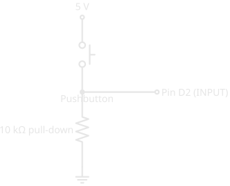
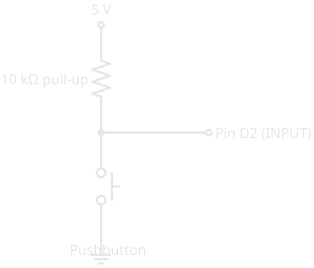

# Pull-up and Pull-down Resistors

!!! abstract "Essential"
    This article is part of the **Essential** learning path. It follows [Digital Pins](digital_io.md), where the floating-input problem first appears, and it leans on [What Is Electricity?](what_is_electricity.md) for Ohm's Law.

A switch on your wall has a spring in it. Let go and it snaps back to a known position — off. Without that spring, the switch would sit wherever you last nudged it, and a draft could flip it either way.

A microcontroller's input pin has no spring. Left to itself, it sits at no particular voltage and drifts on the slightest electrical disturbance. A **pull-up** or **pull-down resistor** is the spring you add yourself: it gives the pin a definite state to rest at, so the only thing that ever changes its reading is the button or sensor you actually wired up.

This article explains why a bare input misbehaves, the two ways to fix it, how to choose between them, and how to pick the resistor's value.

---

## Why a Bare Input Floats

A pin set to INPUT does one thing: it measures the voltage on it and reports HIGH or LOW. It draws almost no current of its own — it just *listens*. That sensitivity is the problem.

A wire connected to nothing still behaves like a tiny antenna. It picks up stray electrical fields from the mains wiring in your walls, from nearby jumper wires, even from your hand moving near it. With nothing holding the pin at a real voltage, those faint signals are all it has to report. Read it and you'll get HIGH, then LOW, then HIGH again — a pin that "reads a button" but changes its mind when no one is touching anything. This drifting, undefined state is called **floating**.

A button by itself doesn't fix this. A button only connects two points *while it's pressed*. The rest of the time, the pin on the other side of it is connected to nothing — and floats. To read a button reliably, you need something that holds the pin at a known voltage whenever the button isn't doing it. That something is a resistor.

---

## Two Ways to Pin It Down

There are two arrangements, and they are mirror images of each other.

=== "Pull-down (rests LOW)"

    A **pull-down resistor** connects the pin to ground. Whenever nothing else is driving the pin, the resistor gently "pulls it down" to 0V, so it reads a steady LOW. Press the button — which connects the pin to 5V — and the pin reads HIGH.

    <figure markdown>
      { width="360" }
      <figcaption>Pull-down: the resistor ties the pin to ground. Button open → pin reads LOW. Button pressed → pin connects to 5V and reads HIGH.</figcaption>
    </figure>

    - **Button open:** only the pull-down connects the pin to anything — it rests at **LOW**.
    - **Button pressed:** the button connects the pin to 5V — it reads **HIGH**.

    The logic reads naturally: pressed means HIGH.

=== "Pull-up (rests HIGH)"

    A **pull-up resistor** connects the pin to the supply voltage instead. Whenever nothing else is driving the pin, the resistor "pulls it up" to 5V, so it reads a steady HIGH. Press the button — wired to connect the pin to ground — and the pin reads LOW.

    <figure markdown>
      { width="360" }
      <figcaption>Pull-up: the resistor ties the pin to 5V. Button open → pin reads HIGH. Button pressed → pin connects to ground and reads LOW.</figcaption>
    </figure>

    - **Button open:** only the pull-up connects the pin to anything — it rests at **HIGH**.
    - **Button pressed:** the button connects the pin to ground — it reads **LOW**.

    The logic is inverted: pressed means LOW. That feels backwards at first, but it's the more common arrangement — and the next section explains why.

Either way, the pin now has a definite answer at all times. The resistor decides the *resting* state; the button decides the *other* state.

---

## Built-In Pull-ups: Often No Resistor Needed

Here's why pull-ups are more common in practice: most microcontrollers have pull-up resistors **built into the chip**, one per pin, that you switch on in software. No external resistor, no extra wiring.

On an Arduino you enable it by setting the pin mode to `INPUT_PULLUP` instead of `INPUT`:

``` cpp title="Read a button using the built-in pull-up" linenums="1"
void setup() {
  pinMode(2, INPUT_PULLUP);   // enable the internal pull-up on pin 2
}

void loop() {
  int buttonState = digitalRead(2);   // HIGH when open, LOW when pressed
}
```

That single word wires the pull-up arrangement above entirely inside the chip. The button just connects the pin to ground. It's the simplest reliable way to read a button, which is why you'll see it everywhere.

!!! info "Pull-ups are built in; pull-downs usually aren't"
    Most microcontrollers offer internal pull-**ups** but not internal pull-**downs**. That's a big reason the pull-up arrangement dominates: it's free and already there. Reach for an external pull-down only when you specifically want "pressed means HIGH" logic, or when a part you're connecting requires it.

---

## Sizing the Resistor

A pull resistor's value is a balance, and the Ohm's Law you met in [What Is Electricity?](what_is_electricity.md) sets both ends of it.

When the button is pressed, the resistor has the full supply voltage across it, so it passes a small current straight from 5V to ground for as long as you hold the button. From \( I = V / R \):

- **Too small** (say 100 Ω): \( 5\text{V} / 100\ \Omega = 50\text{ mA} \) wasted continuously while pressed — that's more than an LED draws, turned into heat for nothing.
- **Too large** (say 10 MΩ): the pull is so weak that ambient noise can overpower it, and the pin starts to float again — the very problem you were solving.
- **Just right** (10 kΩ): \( 5\text{V} / 10\,000\ \Omega = 0.5\text{ mA} \), negligible waste, yet a firm enough grip to hold the pin steady.

That's why **10 kΩ is the everyday default** for a pull-up or pull-down on a button. It's strong enough to win against noise and weak enough that the current it wastes doesn't matter.

---

## Where You'll Meet Them Again

Pull resistors are not just a button trick. The same idea — give a line a defined resting voltage — shows up all over electronics:

- **Buttons and switches** — the case in this article.
- **Communication lines** — protocols like I²C *require* pull-up resistors on their shared wires so every device sees a clean HIGH when no one is talking.
- **Reset and enable pins** — many chips need a pull-up or pull-down to sit in a known state at power-on instead of doing something random.

Learn the pattern on a button and you'll recognise it the next time a datasheet tells you to "add a 4.7 kΩ pull-up" — you'll know exactly what it's asking for and why.

---

## Practice

??? question "1. Pressed means HIGH"

    You want a circuit where the input pin reads **LOW** at rest and **HIGH** when the button is pressed. Which resistor arrangement is that, and how is the button wired?

    ??? tip "Solution"

        That's a **pull-down**. The resistor ties the pin to **ground**, so it rests LOW. The button is wired to connect the pin to **5V**, so pressing it drives the pin HIGH. (If you'd instead used a pull-up, the logic would be inverted: rest HIGH, pressed LOW.)

??? question "2. The warm resistor"

    A beginner uses a 220 Ω resistor as a pull-down because it's what they had on hand. The circuit works, but they notice the resistor gets warm whenever the button is held. What's happening, and what should they use?

    ??? tip "Solution"

        While the button is held, the 220 Ω resistor carries the full supply across it: \( 5\text{V} / 220\ \Omega \approx 23\text{ mA} \), dissipated as heat for as long as the button is down. It works, but it wastes current and warms the part. A **10 kΩ** resistor does the same job while passing only about 0.5 mA — strong enough to hold the pin, gentle enough to stay cool.

??? question "3. No resistor at all"

    On a different board you read a button with `pinMode(2, INPUT_PULLUP)` and no external resistor anywhere — yet the pin reads reliably. How?

    ??? tip "Solution"

        `INPUT_PULLUP` switches on a pull-up resistor **built into the microcontroller**, connected internally between the pin and the supply. It does the same job as an external pull-up, so the pin rests HIGH and reads LOW when the button connects it to ground — no external part required.

---

## Quick Recap

<div class="grid cards two-col" markdown>

-   **The Problem**

    ---

    A bare input pin **floats** — it drifts on electrical noise and reads unpredictably. A button alone doesn't help, because it only connects the pin while pressed.

-   **The Fix**

    ---

    A **pull-down** ties the pin to ground (rests LOW); a **pull-up** ties it to the supply (rests HIGH). The resistor sets the resting state; the button sets the other.

-   **The Easy Way**

    ---

    Most chips have **built-in pull-ups** — `pinMode(pin, INPUT_PULLUP)` — so a button to ground often needs no external resistor at all.

-   **The Value**

    ---

    **10 kΩ** is the everyday default: small enough current to ignore (≈ 0.5 mA), firm enough to beat the noise. Too small wastes power; too large floats again.

</div>

---

## What's Next

You can now read an input as reliably as you can drive an output. Back in [Digital Pins](digital_io.md), the button circuit used a pull-down for exactly this reason — reread that build and it should now read like second nature.

To actually run any of this, [arduino-cli](../tools/arduino_cli.md) compiles and uploads the sketches to your board.

---

## Further Reading

**Fundamentals**

- [Pull-up Resistors — SparkFun](https://learn.sparkfun.com/tutorials/pull-up-resistors) — the same idea with the Ohm's Law sizing worked through in more detail

**Related Articles**

- [Digital Pins](digital_io.md) — INPUT and OUTPUT, and where the floating problem first appears
- [What Is Electricity?](what_is_electricity.md) — the Ohm's Law behind choosing a resistor value
- [Resistor Color Codes](resistor_color_codes.md) — decode the 10 kΩ pull resistor from this article by its bands
- [Series and Parallel Circuits](series_and_parallel.md) — current-limiting resistors, the other everyday job a resistor does
