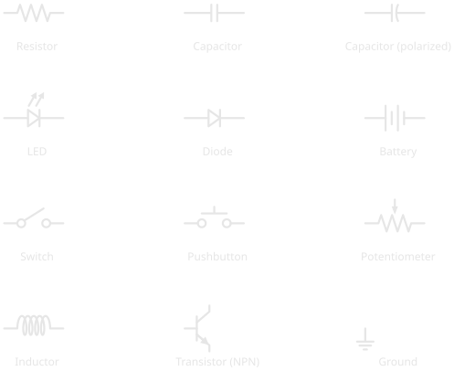
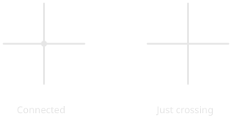
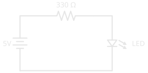

# How to Read a Schematic

!!! abstract "Essential"
    This article is part of the **Essential** learning path. It builds on [What Is Electricity?](what_is_electricity.md) and [Series and Parallel Circuits](series_and_parallel.md) — read those first if voltage, current, and resistance are new to you.

The first time you open a datasheet or a project tutorial and see a schematic, it looks like hieroglyphics: a tangle of zig-zags, lines, triangles, and arrows. It's tempting to skip past it and just copy the photo of someone's breadboard instead.

Don't. A schematic is not a picture of a circuit — it's a **map** of one. Like a subway map, it throws away the physical layout (which wire is where, how long each leg is) and keeps only what matters: what connects to what. Once you can read it, a schematic tells you more about a circuit, faster, than any photograph ever could. And unlike a photo, it's the same language in every textbook, datasheet, and tutorial on Earth.

This article teaches you that language: the handful of symbols you'll meet first, the one rule about wires that trips up every beginner, and how to trace current through a complete circuit.

---

## Why Schematics Exist

Picture a photograph of a finished breadboard: a dozen jumper wires crossing each other, components at odd angles, half of them hidden behind the others. Now imagine trying to answer a simple question from that photo — *is this resistor connected to the positive rail or the negative one?* You'd be squinting and tracing wires with your finger, and you still might get it wrong.

A schematic removes all of that. It uses a fixed symbol for each component and clean straight lines for the connections between them. The layout on the page has nothing to do with the physical layout on your bench — a resistor drawn on the left might sit on the right of your breadboard. What the schematic promises is only this: **if two things are joined by a line, they are electrically connected.** That single guarantee is what makes a circuit readable.

---

## The Symbols You'll Meet First

Electronics has hundreds of symbols, but you only need a dozen to read almost any beginner circuit. Here are the ones worth memorising:

<figure markdown>
  { width="640" }
  <figcaption>The dozen symbols that cover most beginner circuits. Learn to recognise these and you can read the majority of schematics you'll meet.</figcaption>
</figure>

It helps to group them by what they do.

-   :material-resistor: **Passive components**

    ---

    Shape current and voltage without needing power of their own.

    - **Resistor** — the zig-zag — limits current ([the physics](what_is_electricity.md))
    - **Capacitor** — two parallel lines — stores charge; a curved line means it's *polarized*
    - **Potentiometer** — a resistor with an arrow — an adjustable resistor, the symbol behind every volume knob
    - **Inductor** — a coil — stores energy in a magnetic field

-   :material-power-plug: **Power & connections**

    ---

    Define where energy enters and how the circuit is switched.

    - **Battery** — alternating long and short lines — the voltage source; the **longer line is positive**
    - **Ground** — the descending stack of shrinking lines — the 0V reference every voltage is measured against
    - **Switch** — a line that lifts away to break the circuit
    - **Pushbutton** — a switch that only closes while you hold it down

-   :material-chip: **Semiconductors**

    ---

    Steer current in ways the passives can't.

    - **Diode** — a triangle pointing into a bar — current flows one way only, in the triangle-to-bar direction
    - **LED** — a diode that emits light, shown by the two arrows
    - **Transistor** — the symbol with three legs — an electronic switch or amplifier; just recognise it for now

!!! warning "Polarity Symbols Point Somewhere for a Reason"
    Some symbols have a built-in direction — the LED's arrows, the diode's bar, the battery's long line, the polarized capacitor's curved plate. These aren't decoration. Installing a polarized component backwards means, at best, the circuit doesn't work, and at worst the part is destroyed or — with some capacitors — vents or bursts. When a symbol shows an orientation, the real component has one too. Always match them.

---

## Wires: Connected, or Just Crossing?

This is that rule. Learn it now and you'll be ahead of most.

On a busy schematic, lines have to cross each other. Two crossing lines might be joined into one connection, or they might be two separate wires passing over each other like a highway overpass. How do you tell them apart? **A dot.**

<figure markdown>
  { width="520" }
  <figcaption>A dot at a crossing means the wires are joined into one electrical connection. No dot means they simply cross — no connection.</figcaption>
</figure>

A **filled dot** at a junction means the wires are electrically joined — current can move between them. **No dot** means the wires merely cross on the page and are not connected at all. Miss this distinction and you'll read a circuit completely wrong: imagining connections that aren't there, or missing ones that are.

!!! tip "When in doubt, look for the dot"
    If a schematic ever seems to make no sense, check every crossing. A junction you read as connected — but which has no dot — is one of the most common beginner mistakes in tracing a circuit.

---

## Reading a Complete Circuit

Put the symbols and the wire rule together and you can read a whole circuit. Here's one of the simplest there is — a single LED lit from a battery:

<figure markdown>
  { width="500" }
  <figcaption>A complete loop: 5V battery, a 330 Ω current-limiting resistor, and an LED. Trace it from the battery's positive terminal all the way back to its negative one.</figcaption>
</figure>

Read it the way current flows — start at the battery's **positive terminal** (the longer line) and follow the wire:

1. Current leaves the positive terminal and travels along the top wire.
2. It reaches the **330 Ω resistor**, which limits how much current can flow — protecting the LED from the full force of the supply.
3. It continues down through the **LED**, which lights up as current passes through it in its forward direction.
4. It returns along the bottom wire to the battery's **negative terminal**, completing the loop.

That's the whole skill. Every circuit, no matter how dense, is read the same way: find the source, follow the connections, and name each symbol as you pass through it. A complicated schematic is just many small loops like this one sharing the same source and ground.

Notice this is a **series** circuit — one single path, exactly as described in [Series and Parallel Circuits](series_and_parallel.md). The schematic makes that obvious at a glance: there's only one loop to follow.

---

## A Schematic Is Not a Map of Your Breadboard

One more thing to keep straight. A schematic tells you the **electrical connections** — what joins to what. It does *not* tell you where to physically place components on a breadboard. The resistor drawn along the top of the diagram above doesn't belong at the "top" of anything; it just has to sit electrically between the battery and the LED.

Turning a schematic into a real, built circuit is a separate skill: deciding which holes and rails each leg goes into. That's what a breadboard is for, and it's covered in [Breadboards](../tools/breadboards.md). Read the schematic to understand the circuit; use the breadboard to build it.

---

## Practice

Test your reading before you move on.

??? question "1. Connected or not?"

    Two wires cross in the middle of a schematic. There is no dot where they meet. Are they electrically connected?

    ??? tip "Solution"
        **No.** With no dot at the crossing, the wires simply pass over each other — two separate wires. A dot would be required to join them.

??? question "2. Name the symbol"

    You see a triangle pointing into a flat bar, with two small arrows pointing away from the triangle. What is it, and does its orientation matter?

    ??? tip "Solution"
        It's an **LED** (a light-emitting diode — the arrows show it gives off light). Yes, orientation matters: like any diode, it conducts in one direction only, triangle-to-bar. Installed backwards, it won't light.

??? question "3. Trace the path"

    In the LED circuit above, you press nothing and add nothing — yet you want to describe the route current takes. Starting from the battery's positive terminal, list the components it passes through, in order, before returning.

    ??? tip "Solution"
        Positive terminal → **330 Ω resistor** → **LED** → back to the negative terminal. One single loop, so it's a series circuit: the same current flows through every component.

---

## Quick Recap

| Element | What to look for | What it tells you |
|---|---|---|
| **Component symbol** | A fixed shape (zig-zag, coil, triangle…) | Which component sits at that point |
| **Line** | A straight wire between symbols | Those points are electrically connected |
| **Dot at a crossing** | A filled circle | The crossing wires are joined |
| **No dot at a crossing** | Lines crossing, nothing else | The wires are *not* connected |
| **Polarity marks** | LED arrows, diode bar, battery long line | The component has a required orientation |
| **The whole diagram** | Loops from source back to source | The electrical structure, not the physical layout |

---

## What's Next

You can now read the language every circuit is documented in. The natural next step is to make one real: take the simple LED circuit above, and build it on a breadboard. [Breadboards](../tools/breadboards.md) walks through turning a schematic into a working circuit without soldering — translating the loop on the page into rows, rails, and jumper wires on the board.

From here on, every new component you learn comes with a symbol. Keep the reference chart above handy, and each new schematic will read a little faster than the last.

---

## Further Reading

**Schematic literacy:**

- [How to Read a Schematic — SparkFun](https://learn.sparkfun.com/tutorials/how-to-read-a-schematic) — a thorough walkthrough of symbols, name designators, and reading techniques
- [Electronic Symbol — Wikipedia](https://en.wikipedia.org/wiki/Electronic_symbol) — the standardised symbol set, including the IEC 60617 and IEEE 315 standards behind it

**Related articles:**

- [What Is Electricity?](what_is_electricity.md) — what the components in these symbols actually do to voltage and current
- [Series and Parallel Circuits](series_and_parallel.md) — the two wiring patterns you'll trace in every schematic
- [Breadboards](../tools/breadboards.md) — turning a schematic into a real, built circuit
