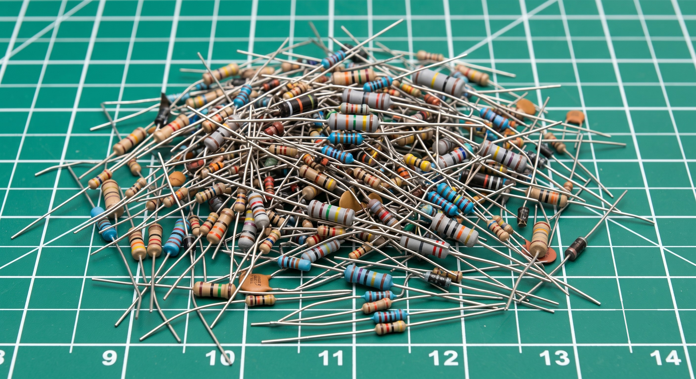

# Resistor Color Codes

!!! abstract "Essential"
    This article is part of the **Essential** learning path, in the **Components** topic. It uses the Ohm's Law from [What Is Electricity?](what_is_electricity.md) and the exact resistors already wired in [Series and Parallel Circuits](series_and_parallel.md), [Digital Pins](digital_io.md), and [Pull-up and Pull-down Resistors](pull_resistors.md).

Every resistor you've wired so far had a value — 220 Ω, 10 kΩ — and you took that value on faith. Look at the actual component and there's no "220" printed on it anywhere. No digits at all. Just four colored stripes painted around a small tan cylinder.

That's not decoration. It's the resistor's value, written in a code that's been standard since the 1920s. By the end of this article you'll be able to pick up any resistor, read its bands, and know its value and tolerance without looking anything up.

<figure markdown>
  { width="600" }
  <figcaption>A typical parts bin: hundreds of resistors, no two values labelled the same way twice — just bands.</figcaption>
</figure>

---

## Why Colors Instead of Print

A resistor is often only a few millimetres long. Printing "220" legibly at that size, in ink that survives handling and doesn't fade, is harder than it sounds — and it doesn't work at all once you're picking through a parts bin under dim light. A painted band, by contrast, is visible from any angle and never wears off the way ink on a tiny surface would.

So instead of text, resistors carry their value as a sequence of colored bands, wrapped around the body like rings on a finger. The scheme is standardized internationally (IEC 60062), which is why a resistor bought today reads exactly the same way as one manufactured decades ago.

---

## The Four Bands

The common resistor has four bands, and each one answers a specific question, always in the same order: two digits, then a multiplier, then a tolerance.

<figure markdown>
  { width="560" }
  <figcaption>Red-Red-Brown-Gold — the exact 220 Ω resistor from Digital Pins and Blink an LED. Two digits, a multiplier, and a tolerance.</figcaption>
</figure>

- **Band 1 — first significant digit**
- **Band 2 — second significant digit**
- **Band 3 — multiplier** (how many zeros to add — or, formally, ×10 to that power)
- **Band 4 — tolerance** (how far the actual value can legally stray from the printed one)

Put the first two digits together, apply the multiplier, and you have the resistance. `22` with a `×10` multiplier is `220` — the resistor reads **220 Ω**. The tolerance band separately tells you how much to trust that number: **gold** means the true value is guaranteed to be within **±5%** of 220 Ω, so anywhere from 209 Ω to 231 Ω.

---

## The Color-to-Number Key

Ten colors stand for the ten digits, 0 through 9. The same colors, in the third position, mean "multiply by 10 to this power" instead:

| Color | Digit | Multiplier |
|---|---|---|
| Black | 0 | ×1 |
| Brown | 1 | ×10 |
| Red | 2 | ×100 |
| Orange | 3 | ×1,000 |
| Yellow | 4 | ×10,000 |
| Green | 5 | ×100,000 |
| Blue | 6 | ×1,000,000 |
| Violet | 7 | — |
| Gray | 8 | — |
| White | 9 | — |

The **tolerance band** uses a separate, shorter set of colors:

| Color | Tolerance |
|---|---|
| Brown | ±1% |
| Red | ±2% |
| Gold | ±5% |
| Silver | ±10% |
| *(no band)* | ±20% |

**Gold and silver never appear in the first three bands.** That's not a coincidence — it's the clue that tells you which end of the resistor to start reading from, covered in [Which End Do You Start From?](#which-end-do-you-start-from) below.

!!! tip "A memory aid for the order"
    Generations of technicians have used some variation of "**B**lack **B**eetles **R**unning **O**ver **Y**our **G**arden **B**ring **V**ery **G**reat **W**oe" — one word per color, in order: Black, Brown, Red, Orange, Yellow, Green, Blue, Violet, Gray, White. Use whichever version sticks; the colors and their order are what matter.

---

## Reading It Yourself

Take the resistor from the diagram above: **Red, Red, Brown, Gold.**

1. **Band 1 (Red) = 2** — first digit.
2. **Band 2 (Red) = 2** — second digit. Together so far: `22`.
3. **Band 3 (Brown) = ×10** — multiply: \( 22 \times 10 = 220 \).
4. **Band 4 (Gold) = ±5%** — the true value is guaranteed within 5% of 220 Ω.

Result: **220 Ω ±5%** — precisely the current-limiting resistor you've already wired in front of every LED on this site.

Try a second one: **Brown, Black, Orange, Gold** — the pull resistor from [Pull-up and Pull-down Resistors](pull_resistors.md).

1. **Brown = 1**, **Black = 0** → digits `10`.
2. **Orange = ×1,000** → \( 10 \times 1{,}000 = 10{,}000 \).
3. **Gold = ±5%**.

Result: **10,000 Ω, or 10 kΩ, ±5%** — the exact pull-down value used to hold that input pin at a steady LOW.

---

## Which End Do You Start From?

A resistor's bands aren't perfectly centered — they're clustered toward one end, with the tolerance band set apart near the other. That gap is the reading direction: **start from the end where the bands are bunched together**, and the lone band, usually gold or silver, is the last one, the tolerance.

If a resistor is rotated and you're not sure which end is "first," look for gold or silver — since those colors never appear as a digit, the end nearest one of them is always the tolerance band, which means you read *away* from it, not toward it.

---

## Why Only Certain Values Exist

You'll notice real resistors come in values like 220 Ω, 330 Ω, and 470 Ω — never 250 Ω or 300 Ω. That's deliberate. Manufacturers produce resistors in standardized steps per decade, called the **E-series**, spaced so that each value's tolerance band overlaps the next value's — no gaps in coverage, no wasted production of values nobody needs.

The common **E12 series** has 12 steps per decade: 10, 12, 15, 18, 22, 27, 33, 39, 47, 56, 68, 82 — then repeats ×10 for the next decade (100, 120, 150…). That's why the LED resistor throughout this site is 220 Ω rather than a rounder-sounding 200 or 250 — 220 is one of the values that actually gets manufactured.

---

## Safety

!!! warning "Color bands tell you the resistance, not the power rating"
    Two resistors can have identical bands — same value, same tolerance — and still be rated for very different power. A resistor's power rating (¼ W, ½ W, 1 W…) is almost never color-coded; it's usually implied by physical size, or printed in the datasheet. Before reusing a salvaged or unlabeled resistor in a new circuit, confirm its power rating rather than assuming it matches the one you meant to use — an undersized resistor can overheat even at the "correct" resistance.

---

## Practice

??? question "1. Decode this resistor"

    A resistor has the bands **Yellow, Violet, Red, Gold**. What's its value and tolerance?

    ??? tip "Solution"

        Yellow = 4, Violet = 7 → digits `47`. Red = ×100 → \( 47 \times 100 = 4{,}700 \). Gold = ±5%.

        **4,700 Ω, or 4.7 kΩ, ±5%.**

??? question "2. Decode this one too"

    **Brown, Black, Red, Gold.**

    ??? tip "Solution"

        Brown = 1, Black = 0 → digits `10`. Red = ×100 → \( 10 \times 100 = 1{,}000 \). Gold = ±5%.

        **1,000 Ω, or 1 kΩ, ±5%.**

??? question "3. Working backwards"

    You need a 330 Ω resistor with ±5% tolerance. What four bands do you look for?

    ??? tip "Solution"

        330 splits into digits `33` with a ×10 multiplier: \( 33 \times 10 = 330 \). Orange = 3, so the first two bands are **Orange, Orange**. The multiplier ×10 is **Brown**. ±5% tolerance is **Gold**.

        **Orange, Orange, Brown, Gold.**

??? question "4. Which end?"

    You pick up a resistor and see bands in this order from left to right: **Gold, Brown, Black, Red**. Did you read it correctly?

    ??? tip "Solution"

        No — you read it backwards. Gold never appears as a digit, only as tolerance, so gold marks the *end* of the sequence, not the start. Flip your reading direction: **Red, Black, Brown, Gold** → digits `20`, ×10 multiplier → \( 20 \times 10 = 200 \). **200 Ω ±5%.**

---

## Quick Recap

-   **Four Bands, One Order**

    ---

    1st digit → 2nd digit → multiplier → tolerance. Always read in that order, never the reverse.

-   **The Color Key**

    ---

    Black through white map to digits 0–9 (and the same colors, in band 3, mean "×10 to that power"). Gold and silver are tolerance-only — they never appear as a digit.

-   **Find the Start**

    ---

    The tolerance band sits apart from the other three. Read starting from the clustered end, away from the isolated gold or silver band.

-   **Not Every Value Exists**

    ---

    Resistors are manufactured in standardized **E-series** steps (10, 12, 15, 18, 22…). That's why circuits use 220 Ω or 4.7 kΩ rather than round numbers like 200 or 250.

---

## What's Next

Every resistor already wired on this site — the 220 Ω in [Digital Pins](digital_io.md) and [Blink an LED](blink_an_led.md), the 10 kΩ in [Pull-up and Pull-down Resistors](pull_resistors.md) — now has bands you can read yourself, without taking the value on faith. Next time you're sorting a mixed parts bin, this is the only tool you need.

---

## Further Reading

**Fundamentals**

- [Resistor Color Code — SparkFun](https://learn.sparkfun.com/tutorials/resistor-color-codes) — an interactive band decoder covering 4-band, 5-band, and 6-band resistors

**Related Articles**

- [What Is Electricity?](what_is_electricity.md) — Ohm's Law and the resistance values these bands decode into
- [Series and Parallel Circuits](series_and_parallel.md) — the current-limiting resistor this article's worked example comes from
- [Pull-up and Pull-down Resistors](pull_resistors.md) — sizing a resistor for a job, the companion skill to reading one you already have
