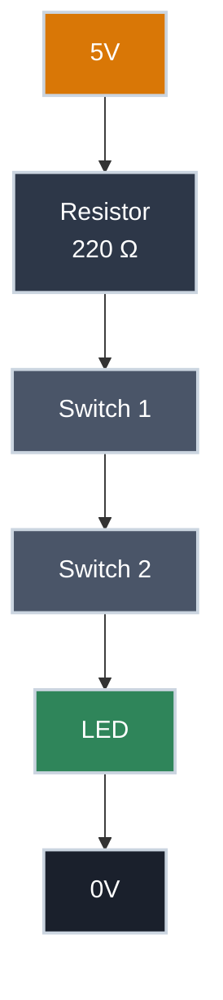
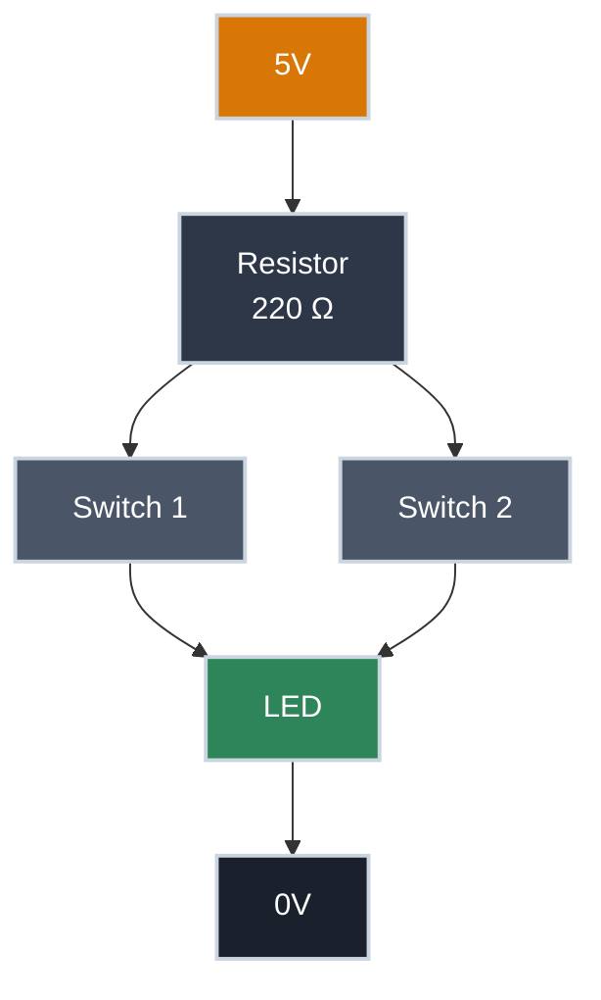
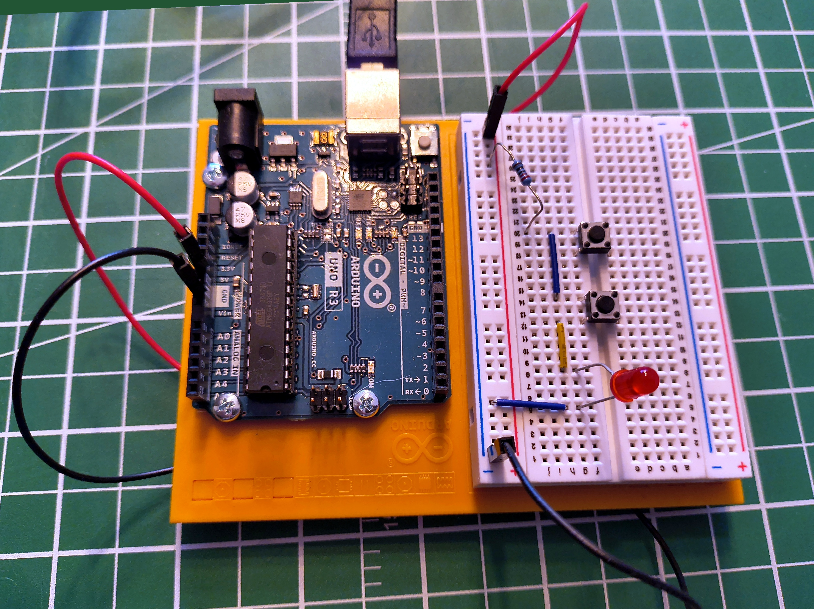
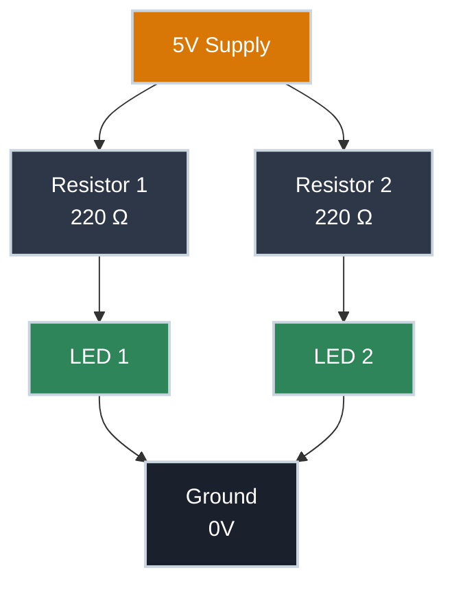

# Series and Parallel Circuits

!!! abstract "Essential"
    This article is part of the **Essential** learning path. It builds on [What Is Electricity?](what_is_electricity.md) — read that first if you're new to voltage, current, and resistance.

Pick up any string of Christmas lights. Old ones — the kind where one dead bulb kills the whole string. That's a series circuit. Modern ones, where a single bad bulb barely matters? Parallel.

Two patterns. Every circuit ever built uses one, the other, or a combination of both.

By the end of this article you'll understand what's actually different between them — not just the names, but the physics — and you'll be able to predict how voltage, current, and resistance behave in each arrangement.

---

## The Fundamental Difference

In a **series circuit**, current has exactly one path to follow. In a **parallel circuit**, current has multiple paths available. That single difference changes how voltage, current, and resistance behave across the entire circuit.

**Series — one path**

Both switches must be pressed to light the LED.

**Parallel — multiple paths**

Either switch pressed lights the LED.

---

=== "Series"

    In a series circuit, every component is connected end-to-end in a single chain. Current must pass through each component in sequence — there is no alternative route.

    For current to flow and the LED to light, **both switches must be pressed at the same time**. Either switch open means the path is broken — no current anywhere. A single current-limiting resistor sits at the start of the chain — before both switches — and limits current through the entire circuit to protect the LED.

    <figure markdown>
      { width="500" }
      <figcaption>Series circuit: both switches must be pressed to complete the path and light the LED. The resistor sits before both switches, limiting current through the entire chain.</figcaption>
    </figure>

    This is the essential nature of a series circuit: every component is a gatekeeper. All of them must allow current through, or none of it flows.

    ### Voltage Divides

    The supply voltage doesn't stay the same throughout the circuit. Each component has a voltage drop across it, and those drops always add up to the total supply:

    \[ V_{\text{supply}} = V_1 + V_2 + V_3 + \cdots \]

    This is called **voltage division**. The voltage is shared across the components in proportion to their resistance.

    The reason follows directly from Ohm's Law. Because there is only one path, the same current flows through every component. Since \( V = I \times R \), a component with higher resistance produces a larger voltage drop for that same current — the bigger the resistance, the larger the share of the supply voltage it takes.

    ??? example "Worked example"

        A 9V supply driving R1 = 300 Ω and R2 = 600 Ω in series.

        Total resistance:

        \[ R_{\text{total}} = 300 + 600 = 900\ \Omega \]

        Current (same through every component — there's only one path):

        \[ I = \frac{V}{R} = \frac{9\text{ V}}{900\ \Omega} = 10\text{ mA} \]

        Voltage across each resistor:

        \[ V_{R_1} = I \times R = 0.010\text{ A} \times 300\ \Omega = 3\text{ V} \]

        \[ V_{R_2} = I \times R = 0.010\text{ A} \times 600\ \Omega = 6\text{ V} \]

        Check: \( 3 + 6 = 9\text{ V} \) ✓

        The larger resistor takes the larger share of the voltage — the basis of the voltage divider, one of the most useful sub-circuits in electronics.

    **The general rules for series:**

    \[ R_{\text{total}} = R_1 + R_2 + R_3 + \cdots \]

    \[ I = \frac{V_{\text{supply}}}{R_{\text{total}}} \quad \text{(same current through every component)} \]

    ### What Happens When One Component Fails

    If any component in a series circuit breaks open — a burned-out bulb, a broken wire, a switch left open — the path is severed. No current flows anywhere. Everything stops.

    That's the old Christmas lights. One bad bulb: whole string out. The break anywhere in the chain kills the circuit completely.

    !!! tip "Try it yourself"
        Build this circuit on a breadboard — it takes less than five minutes. You'll need two pushbutton switches, one LED, and a 220 Ω resistor. The LED has polarity — the longer leg (anode) connects toward positive; if it doesn't light, flip it around. See [Breadboards](../tools/breadboards.md) if you haven't used one before.

=== "Parallel"

    In a parallel circuit, two or more branches share the same connection points — both the supply and the return to ground. Current can flow through any branch independently of the others.

    In this circuit, the two switches are the parallel branches. A single current-limiting resistor sits before both switches — shared by both paths — and limits current through the LED. Press **either** switch and current flows through that branch. Press both and current flows through both branches simultaneously.

    <figure markdown>
      { width="500" }
      <figcaption>Parallel circuit: either switch independently completes its own path to the LED. A single resistor before both switches limits the current.</figcaption>
    </figure>

    This is the essential nature of a parallel circuit: multiple paths mean multiple opportunities for current to flow. Any one path completing is enough.

    ### Voltage Stays the Same

    Every branch in a parallel circuit sees the full supply voltage. Whether one switch is pressed or both, the LED receives the same voltage — the full supply, not a fraction of it.

    This is a fundamental rule: **voltage is the same across every parallel branch**.

    You might wonder: if both switches are pressed and current flows through two paths, does the resistor drop more voltage and leave less for the LED? In practice, no. Each switch has near-zero resistance when closed, so the parallel combination is near-zero whether one or two paths are active. The resistor and LED divide the supply voltage the same way regardless.

    ### Current Divides

    When multiple parallel branches are active at once, the total current drawn from the supply is the sum of the current in each branch:

    \[ I_{\text{total}} = I_1 + I_2 + \cdots \]

    Each branch independently responds to the voltage across it. A branch with resistance R draws \( I = V/R \) regardless of what other branches are doing — it doesn't "know" whether they are open or closed. The supply simply delivers the sum of whatever each branch demands.

    **Total resistance in a parallel circuit decreases as you add branches:**

    \[ \frac{1}{R_{\text{total}}} = \frac{1}{R_1} + \frac{1}{R_2} + \frac{1}{R_3} + \cdots \]

    ??? example "Worked example"

        Two 220 Ω resistors in parallel across a 5V supply.

        Each resistor sees the full 5V:

        \[ I = \frac{V}{R} = \frac{5\text{ V}}{220\ \Omega} = 22.7\text{ mA} \]

        Total current from the supply:

        \[ I_{\text{total}} = 22.7 + 22.7 = 45.5\text{ mA} \]

        Applying the parallel resistance formula:

        \[ \frac{1}{R_{\text{total}}} = \frac{1}{220} + \frac{1}{220} = \frac{2}{220} \implies R_{\text{total}} = 110\ \Omega \]

        Two 220 Ω resistors in parallel behave as a single 110 Ω resistor. Adding more paths makes it easier for current to flow, so total resistance falls.

    ### What Happens When One Component Fails

    If one branch fails, current stops flowing in that branch only. Every other branch continues completely unaffected.

    That's modern Christmas lights — one dead bulb goes dark while the rest stay lit. It's also how your house is wired: one lamp failing doesn't affect the others on the same circuit.

    !!! tip "Try it yourself"
        Build the parallel version alongside the series circuit and compare them directly — the difference in behaviour is immediately obvious. Same components: two pushbutton switches, one LED, and a 220 Ω resistor. Remember LED polarity — longer leg toward positive. See [Breadboards](../tools/breadboards.md) if you haven't used one before.

---

## Series vs. Parallel at a Glance

| | Series | Parallel |
|---|---|---|
| **Paths for current** | One | Multiple |
| **To complete the circuit** | All components must allow current | Any one path completing is enough |
| **Current** | Same through every component | Splits — each branch carries its own |
| **Voltage** | Divides across components | Same across every branch |
| **Total resistance** | Increases with each component added | Decreases with each component added |
| **One component fails** | Entire circuit stops | Only that branch is affected |
| **Common use** | Voltage dividers, switch logic, current limiting | House wiring, LED arrays, battery banks |

---

## Real Circuits Use Both

Most practical circuits combine the two topologies. Consider a row of indicator LEDs: each one needs its own current-limiting resistor (series), but they should all run independently at full brightness from the same supply (parallel). Any time you have multiple independent loads from the same supply, this pattern applies.

Each resistor and its LED are in **series** with each other — the resistor limits current for that LED. The two pairs are in **parallel** with each other — each pair gets the full supply voltage, independently of the other.

Recognising these nested patterns is what lets you look at a circuit and immediately understand what each part is doing.

---

## Safety

!!! warning "More Parallel Branches = More Total Current"
    Every additional parallel branch draws its own current from the supply. A single LED at 20 mA is well within the limits of a USB supply. But motors, heating elements, or high-power LEDs multiplied across many parallel branches add up quickly. Always calculate total current before adding parallel loads, and verify your power source can deliver it.

!!! danger "Short Circuits in Parallel"
    A short circuit — a path with near-zero resistance — placed in parallel with your circuit gives current an almost-free route that bypasses everything else. All available current rushes through it. Wires heat rapidly, components are destroyed, and lithium batteries can ignite. Fuses and circuit breakers are deliberate weak points designed to fail safely before the wiring does.

---

## Practice

??? question "1. Two Switches, One LED"

    You wire two switches and an LED so that pressing either switch lights the LED, and pressing both also lights the LED. Is this series or parallel? What changes if you rewire it so that both switches must be pressed simultaneously?

    ??? tip "Solution"
        **Either switch lights the LED** — this is **parallel**. Each switch provides its own independent path to the LED. Any complete path is enough.

        **Both switches required** — this is **series**. There is one path, and both switches must be closed for current to flow through it. One switch open breaks the only path.

        This is the clearest demonstration of the difference between the two topologies.

??? question "2. Series Voltage Division"

    A 9V battery powers three resistors in series: R1 = 100 Ω, R2 = 200 Ω, R3 = 400 Ω. What current flows through the circuit? What voltage appears across each resistor?

    ??? tip "Solution"

        \[ R_{\text{total}} = 100 + 200 + 400 = 700\ \Omega \]

        \[ I = \frac{V}{R} = \frac{9\text{ V}}{700\ \Omega} = 12.9\text{ mA} \]

        \[ V_{R_1} = I \times R = 0.0129\text{ A} \times 100\ \Omega = 1.29\text{ V} \]

        \[ V_{R_2} = I \times R = 0.0129\text{ A} \times 200\ \Omega = 2.57\text{ V} \]

        \[ V_{R_3} = I \times R = 0.0129\text{ A} \times 400\ \Omega = 5.14\text{ V} \]

        Check: \( 1.29 + 2.57 + 5.14 = 9\text{ V} \) ✓

        The largest resistor takes the largest share of the voltage.

??? question "3. Parallel Current Draw"

    Three identical 470 Ω resistors are connected in parallel across a 5V supply. What current flows through each? What is the total current drawn from the supply?

    ??? tip "Solution"

        Each resistor sees the full 5V — voltage is the same across every parallel branch.

        \[ I = \frac{V}{R} = \frac{5\text{ V}}{470\ \Omega} = 10.6\text{ mA} \]

        \[ I_{\text{total}} = 10.6 + 10.6 + 10.6 = 31.9\text{ mA} \]

        Cross-check: \( R_{\text{total}} = 470 \div 3 = 156.7\ \Omega \), then \( I = 5\text{ V} \div 156.7\ \Omega = 31.9\text{ mA} \) ✓

??? question "4. Household Wiring"

    Your house has multiple power outlets on the same circuit. Plugging in a lamp doesn't affect the other outlets. Plugging in too many high-draw appliances trips the circuit breaker. Which topology is this, and why does the breaker trip?

    ??? tip "Solution"
        This is a **parallel** circuit. Each outlet connects independently to the same supply voltage — which is why one appliance failing or switching off doesn't affect any other.

        The breaker trips because of the parallel current rule: each additional load draws its own current, and all those branch currents add up at the supply. Enough appliances running simultaneously and the total current exceeds the breaker's rating (typically 15A or 20A in residential wiring). The breaker opens the circuit safely before the wiring overheats.

---

## Quick Recap

-   **Series**

    ---

    One path. All components must allow current. Same current everywhere. Voltage divides. Total resistance adds up. One failure stops everything.

    \( R_{\text{total}} = R_1 + R_2 + R_3 \)

-   **Parallel**

    ---

    Multiple paths. Any one path completing is enough. Same voltage everywhere. Current divides. Total resistance decreases. One failure is isolated.

    \( \dfrac{1}{R_{\text{total}}} = \dfrac{1}{R_1} + \dfrac{1}{R_2} + \dfrac{1}{R_3} \)

---

## What's Next

With series and parallel understood, the next article puts them to practical use: **the voltage divider** — a specific series arrangement that produces a precise reference voltage from a higher supply. It appears in nearly every circuit that reads a sensor or interfaces two components running at different voltages.

In the meantime, if you haven't already: build both circuits on a [breadboard](../tools/breadboards.md). The behavioural difference between series and parallel is immediately obvious the moment you press the switches.

---

## Further Reading

**Fundamentals**

- [Series and Parallel Circuits — SparkFun](https://learn.sparkfun.com/tutorials/series-and-parallel-circuits) — clear worked examples covering resistors, capacitors, and inductors
- [Series Circuits — The Physics Classroom](https://www.physicsclassroom.com/class/circuits/Lesson-4/Series-Circuits) — current, voltage, and resistance rules with practice problems
- [Parallel Circuits — The Physics Classroom](https://www.physicsclassroom.com/class/circuits/Lesson-4/Parallel-Circuits) — parallel rules in detail with mathematical analysis

**Tools**

- [Parallel and Series Resistor Calculator — Digi-Key](https://www.digikey.ca/en/resources/conversion-calculators/conversion-calculator-parallel-and-series-resistor) — enter up to 10 resistor values and get combined resistance instantly
