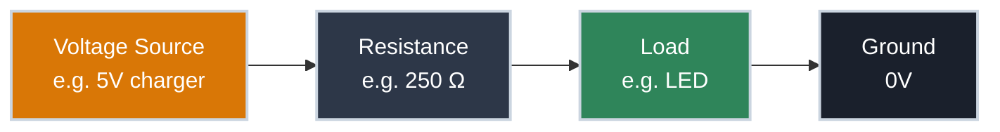

# What Is Electricity?

Pick up any USB charger near you. On the label you'll find two numbers: something like `5V ⎓ 2A`.

Most people recognise the 5V without being able to explain it. Almost nobody can explain what the 2A means, or why both numbers exist, or why they're different things entirely.

By the end of this article you'll be able to read that label and understand exactly what's happening inside the cable — and why both numbers matter every time you design a circuit.

---

## Voltage: The Force

That 5V on your charger is there whether anything is plugged in or not. It's potential energy — the force available to push current through a circuit once one is connected. The moment you complete a circuit, that potential drives current through it.

???+ info "Definition: Voltage"

    **Voltage** is the electrical potential difference between two points. It is potential energy: it exists whether or not a circuit is connected, and whether or not any current is flowing.

    Voltage is always measured between two points, never at a single point in isolation. Every circuit has a **ground** reference (0V); all other voltages are measured relative to it. When a GPIO pin is described as "3.3V," that means 3.3 volts relative to the ground pin.

    **Unit:** volts **(V)**

Some reference voltages from hardware you'll work with:

- **1.5V** — a AA battery
- **3.3V** — logic level on most modern microcontrollers (`ESP32`, `Raspberry Pi`)
- **5V** — USB power, Arduino Uno and other 5V microcontroller boards
- **12V** — hard drives, case fans, automotive systems
- **120V / 240V AC** — your wall outlet

---

## Current: What Actually Flows

Now plug something into that charger. Current flows.

The 2A on your charger label is the maximum current it can supply. Your phone doesn't necessarily draw 2A — it draws what it needs. A nearly-full phone might draw 300 mA. A flat battery might pull 1.5A. The charger makes 2A available; the device takes what it needs based on its own internal resistance.

???+ info "Definition: Current"

    **Current** is the movement of electrons through a conductor — the actual flow of charge through a circuit. Voltage is the force; current is what that force produces when it has a path to follow.

    **Unit:** amperes **(A)**

    Because an ampere is a large unit, most electronics work with **milliamperes (mA)** — one thousandth of an ampere (0.001 A). An LED drawing 20 mA is drawing 0.020 A.

Some reference currents from hardware you'll work with:

- **10–20 mA** — a single LED
- **40 mA** — maximum current from a single GPIO pin
- **500 mA** — a USB 2.0 port's limit
- **2–3 A** — a phone fast charger
- **10+ A** — motors, heating elements, high-power loads

!!! warning "GPIO Pins Are Not Power Rails"
    The GPIO pins on microcontrollers like the `ESP32` can supply around 40 mA maximum. Exceed that and you'll permanently damage the pin. Motors, relays, and high-power LEDs need a separate driver between them and the GPIO pin.

---

## Resistance: What Limits the Flow

So what determines how much current actually flows? The resistance of whatever is connected.

???+ info "Definition: Resistance"

    **Resistance** is the opposition to current flow. Every material resists the movement of electrons to some degree. For a given voltage, higher resistance means less current flows; lower resistance means more current flows.

    **Unit:** ohms, written using the Greek letter omega — **Ω** (pronounced "om")

This relationship has a dangerous edge case: the short circuit. Connect the positive and negative terminals of a battery directly with a wire and you've created a path with almost zero resistance. The resulting current is enormous — the battery or wire can't handle it, heat builds fast, and things melt or catch fire.

Some reference resistances:

- **~0 Ω** — a copper wire
- **100 Ω – 10 kΩ** — typical resistors in hobby circuits
- **1 kΩ – 100 kΩ** — human skin (dry skin at the high end, wet skin at the low end)
- **∞** — an open circuit (no connection)

---

## Ohm's Law: How They Connect

Voltage, current, and resistance aren't independent — they're locked together by one equation:

```
V = I × R
```

Change any one of the three values and at least one other must change too. The equation rearranges to solve for whichever quantity you need:

=== "Find Resistance (R = V ÷ I)"

    **Scenario:** You want to light an LED from a 5V supply. The LED needs 20 mA. What resistor limits current to that value?

    ```
    R = V / I
    R = 5V / 0.020A
    R = 250 Ω
    ```

    Pick the nearest standard value — 220 Ω or 270 Ω — and the LED lights up safely. That's a real circuit decision made with one equation.

=== "Find Current (I = V ÷ R)"

    **Scenario:** You have a 9V battery connected through a 470 Ω resistor. How much current flows?

    ```
    I = V / R
    I = 9V / 470Ω
    I = 19.1 mA
    ```

    This is how you verify a circuit is within safe operating limits before you build it.

=== "Find Voltage (V = I × R)"

    **Scenario:** You need to know how much voltage a resistor is consuming in a circuit. 50 mA flows through a 100 Ω resistor — what voltage appears across it?

    ```
    V = I × R
    V = 0.050A × 100Ω
    V = 5V
    ```

    Every component in a series circuit consumes some of the supply voltage. The resistor here consumes 5V — meaning if it's connected to a 9V supply with other components, the remaining 4V is available for everything else. In any circuit, the voltages consumed by all components always add up to the supply voltage.

Ohm's Law also explains the charger label. The 2A rating doesn't mean 2A always flows — it means the charger can supply up to 2A. The actual current drawn depends on the resistance of the connected device at that moment.

---

## Power: The Rate of Energy Delivery

Voltage, current, and resistance describe the state of a circuit — what's there and how it's flowing. Power describes what the circuit is actually *doing* with that energy.

???+ info "Definition: Power"

    **Power** is the rate at which electrical energy is converted into something else — heat, light, motion, or radio waves.

    **Unit:** watts **(W)**

    ```
    P = V × I
    ```

Your charger: 5V × 2A = **10 W**. That's what "10W charger" means on the packaging.

Power matters because electrical energy that isn't doing useful work becomes heat. That's why chargers get warm — the conversion process isn't perfectly efficient. It's also why every component has a power rating.

A resistor rated at 0.25 W dissipating 1 W will overheat. First it fails, then it burns. Staying within power ratings isn't optional.



Every circuit follows this pattern: a voltage source drives current through resistance and loads, returning to ground. The quantities always obey V = I × R and P = V × I.

---

## Safety: Where the Numbers Matter

!!! danger "Mains Voltage Is Lethal"
    Your wall outlet — 120V AC in North America, 240V AC in Europe — can kill you. Lethal current through the body starts around 50 mA. Circuit breakers protect wiring, not people — they won't trip until far more current flows than needed to stop a heart.

    Never connect mains voltage to a breadboard or open circuit. Use a USB power source or bench power supply for all prototyping work.

Many people have been shocked by house wiring and walked away, which creates a false sense of safety. The outcome depends on factors that vary every time: how dry your skin is, whether you're well grounded, and the path current takes through your body.

Body resistance is the key variable. Dry skin can be 100 kΩ or more; wet skin drops to around 1 kΩ. Run both through Ohm's Law:

```
Dry skin:  I = 120V / 100,000Ω = 1.2 mA   — painful, not dangerous
Wet skin:  I = 120V / 1,000Ω   = 120 mA   — potentially lethal
```

Same wire, same voltage, 100 times more current. The path through the body matters too — current crossing the chest is what stops a heart. Electricians work one-handed on live circuits specifically to avoid creating a hand-to-hand path across the chest.

Short circuits follow the same logic. Connecting a power source directly to ground with no resistance causes a massive current surge that can destroy the source, melt wires, and in the case of lithium batteries, cause fires. Check your wiring before applying power — every time.

The working voltages in most prototyping electronics — 3.3V, 5V, occasionally 12V — won't produce dangerous current through a human body. The habits that matter are checking wiring before powering up, and leaving anything connected to mains strictly alone.

---

## Practice

??? question "1. Reading a Charger Label"

    A laptop charger is labeled `Output: 20V ⎓ 3.25A`. What is the maximum power it can deliver, and what does each number represent?

    ??? tip "Solution"
        ```
        P = V × I
        P = 20V × 3.25A
        P = 65 W
        ```

        The 20V is the voltage — the electrical potential the charger supplies. The 3.25A is the maximum current it can provide. The laptop draws whatever it needs up to that limit. Together they give 65W, which is why this charger is marketed as a "65W charger."

??? question "2. LED Resistor for a 3.3V Circuit"

    You want to connect an LED to a 3.3V microcontroller pin. The LED needs 20 mA. What resistor do you need?

    ??? tip "Solution"
        ```
        R = V / I
        R = 3.3V / 0.020A
        R = 165 Ω
        ```

        Pick the nearest standard value: **150 Ω** (gives ~22 mA) or **180 Ω** (gives ~18 mA). Both are within normal operating range for an LED.

??? question "3. Too Much Current — What Are Your Options?"

    A circuit is drawing too much current and a component is overheating. You cannot change the voltage source. What can you do, and why does each option work?

    ??? tip "Solution"
        The fundamental relationship is `I = V / R`. If voltage is fixed, current is determined entirely by resistance. To reduce current, you must increase resistance — there are two ways to do that:

        **Add resistance in series.** Insert a resistor between the power source and the load. This increases total resistance and reduces current through the entire circuit. The Ohm's Law calculation tells you exactly how much resistor you need.

        **Reduce the load.** A smaller motor, fewer LEDs in parallel, or a lower-power component draws less current because it presents higher resistance to the circuit. Halve the load and you roughly halve the current.

        Both options work for the same reason: with voltage fixed, resistance is the only lever you have. Understanding this is the difference between guessing at a fix and knowing why it works.

??? question "4. Why Do Lithium Batteries Catch Fire When Shorted?"

    A single lithium cell (the kind inside a phone or power bank) is 3.7V. A short circuit through a wire with 0.05 Ω resistance — how much current flows? Why is this so much more dangerous than shorting a AA battery?

    ??? tip "Solution"
        ```
        I = V / R
        I = 3.7V / 0.05Ω
        I = 74 A
        ```

        74 amperes. Unlike a AA battery — which has significant internal resistance and can't actually deliver high currents — lithium cells can source very large currents for a brief period. That energy has to go somewhere: it becomes heat, rapidly. The electrolyte inside the cell ignites, which is why shorted or punctured lithium batteries catch fire rather than just dying. It's also why airlines restrict lithium batteries in checked luggage.

---

## Quick Recap

<div class="grid cards" markdown>

-   **V — Voltage**

    ---

    Measured in **volts (V)**

    The electrical force. Exists as potential energy before any current flows.

    `V = I × R`

-   **I — Current**

    ---

    Measured in **amperes (A)** or **milliamperes (mA)**

    The actual flow of electrons through a circuit.

    `I = V / R`

-   **R — Resistance**

    ---

    Measured in **ohms (Ω)**

    Opposition to current flow. Determines how much current a given voltage produces.

    `R = V / I`

-   **P — Power**

    ---

    Measured in **watts (W)**

    Rate of energy delivery. Energy not doing useful work becomes heat.

    `P = V × I`

</div>

---

## What's Next

The next article puts everything here to work: **Resistors** — the components designed specifically to control current. With voltage, current, resistance, and Ohm's Law in your toolkit, resistors are where the theory becomes actual circuit design.

---

## Further Reading

**Fundamentals**

- [Voltage, Current, Resistance, and Ohm's Law — SparkFun](https://learn.sparkfun.com/tutorials/voltage-current-resistance-and-ohms-law) — worked examples and diagrams covering the same ground from a different angle
- [Electric Potential Difference — The Physics Classroom](https://www.physicsclassroom.com/class/circuits/Lesson-1/Electric-Potential-Difference) — deeper treatment of voltage as potential energy, with practice problems
- [Ohm's Law — The Physics Classroom](https://www.physicsclassroom.com/class/circuits/Lesson-3/Ohm-s-Law) — conceptual depth and worked examples on the V = IR relationship

**Going Further**

- [All About LEDs — Adafruit](https://learn.adafruit.com/all-about-leds) — the LED resistor calculation from this article applied to real components

**Safety**

- [Electrical Safety in the Workplace — CDC/NIOSH](https://www.cdc.gov/niosh/electrical-safety/) — the current thresholds and injury mechanisms behind the numbers in this article
