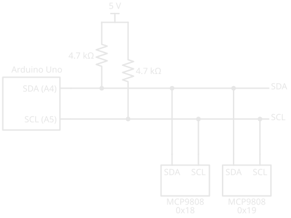

# I²C

!!! abstract "Beginner"
    This article is in the **Communication** topic, after [Serial Communication](serial_communication.md). It uses [Pull-up and Pull-down Resistors](pull_resistors.md) and [Digital Pins](digital_io.md). No other prior knowledge required.

An Arduino Uno can read eight temperature sensors using just two of its pins, the same two wires running past every sensor. Each sensor answers only when it's spoken to by name, and none of them ever talks over another. But leave out two small resistors and the same circuit does nothing at all: no sensor answers, and the code waits forever for a reply.

That's **I²C** (inter-integrated circuit, said "I-squared-C" or "I-two-C"), a bus Philips Semiconductors created around 1980 for chips on the same board to talk to each other. Two ideas explain it:

1. **Every device can pull a wire LOW, and none can push it HIGH.** A resistor lifts each wire HIGH whenever everyone lets go. Because no device ever drives HIGH, any number of them can share a wire without fighting.
2. **One wire carries a clock, so nobody has to agree on a speed, and every message starts with an address.** The device in charge sets the pace, and only the device whose address was called answers.

The missing resistors break idea one, and the second half shows exactly how.

---

## Two Wires: SDA and SCL

An I²C bus is two signal wires plus a shared ground:

- **SDA** (serial data) carries the bits, in both directions.
- **SCL** (serial clock) carries the timing.

On an Uno they're pins **A4 (SDA)** and **A5 (SCL)**, which the R3 board also brings out to two pins labelled SDA and SCL on its digital header ([Arduino Wire reference](https://docs.arduino.cc/language-reference/en/functions/communication/wire/)). Every device on the bus connects to the same two wires.

One device, usually the microcontroller, runs the bus: it generates the clock and decides who talks when. Current documents call it the **controller** and the others **targets**; older datasheets, including the one for the sensor in this article, say *master* and *slave*.

<figure markdown>
  { width="760" }
  <figcaption>Serial needed two wires per pair of devices. I²C needs two wires in total.</figcaption>
</figure>

---

## Idea One: Pull Down, Never Push Up

A normal [digital output](digital_io.md) drives its pin both ways, to 5 V for HIGH and to 0 V for LOW. Wire two of them together and let one try HIGH while the other tries LOW, and they fight: current pours from one straight into the other. That's why [Serial Communication](serial_communication.md) needed one TX wire per transmitter.

I²C pins are different. Each is **open drain**: inside, a transistor can connect the line to ground, or let go of it, and that's all. It can pull LOW, but it can't push HIGH. A **pull-up resistor** on each line does that job: when every device lets go, the resistor lifts the line to the supply ([Pull-up and Pull-down Resistors](pull_resistors.md) showed the same trick holding a button input HIGH).

<figure markdown>
  { width="760" }
  <figcaption>The line is HIGH only if every device lets go, and LOW if any one pulls.</figcaption>
</figure>

TI's application note [Understanding the I²C Bus](https://www.ti.com/lit/an/slva704/slva704.pdf) puts it simply: an open-drain output "can either pull the bus down to a voltage (ground, in most cases), or 'release' the bus and let it be pulled up by a pull-up resistor." Two devices pulling LOW at once is harmless: the line is just LOW. Nothing ever fights.

???+ info "Definition: Open Drain"
    An output that can only connect its pin to ground or let it float. It can make a LOW but never a HIGH; an external pull-up resistor supplies the HIGH. Named after the drain terminal of the [MOSFET](transistors.md#field-effect-transistors-controlled-by-voltage) that does the pulling (with a bipolar transistor it's called **open collector**).

### The Puzzle, Solved

Without the pull-ups, nothing ever lifts the lines HIGH. They sit LOW or drift, the controller can't produce a clean clock, and no target ever sees its address. The Arduino's [Wire reference](https://docs.arduino.cc/language-reference/en/functions/communication/wire/) says it directly: "a pull-up resistor is needed when connecting SDA/SCL pins." Many sensor breakout boards include them; a bare chip on a breadboard never does, so check the board's schematic.

### Choosing the Pull-Ups

The resistor's value is a balance, and the [ATmega328P datasheet](https://ww1.microchip.com/downloads/aemDocuments/documents/MCU08/ProductDocuments/DataSheets/ATmega48A-PA-88A-PA-168A-PA-328-P-DS-DS40002061B.pdf)'s two-wire bus requirements set both ends:

- **Too small**, and a device can't pull the line low enough. A device must hold the line below 0.4 V while sinking 3 mA, so on 5 V the resistor must be at least (5 − 0.4) ÷ 0.003 ≈ **1.53 kΩ**.
- **Too large**, and the line rises too slowly. Every wire and pin adds capacitance, and the pull-up has to charge it, an [RC time constant](capacitors.md) like any other. At 100 kHz the datasheet's limit is 1000 ns divided by the bus capacitance.

<figure markdown>
  { width="760" }
  <figcaption>More devices and longer wires mean more capacitance, and a smaller pull-up.</figcaption>
</figure>

Each pin adds up to 10 pF by the same table, and the wires add more, so a short breadboard bus with a few devices sits near the top row, where a 4.7 kΩ resistor is comfortable. That's why I²C is a bus for chips on one board or a short cable, not for running across a room.

---

## Idea Two: A Clock and an Address

[Serial Communication](serial_communication.md) had no clock: both ends agreed on a baud rate and the receiver timed each bit itself. I²C sends the timing on its own wire. The controller pulses SCL, and the receiver reads SDA on each pulse, whatever the speed. The common speeds are 100 kbit/s ("standard mode") and 400 kbit/s ("fast mode"), and the Arduino's `Wire.setClock()` accepts either ([Wire.setClock() reference](https://docs.arduino.cc/language-reference/en/functions/communication/wire/setclock/)).

### START, Bits, ACK, STOP

Because SCL marks every bit, SDA has a rule: it may only change while SCL is LOW. A change while SCL is HIGH means something else, and the bus uses exactly that for its two markers (TI's [Understanding the I²C Bus](https://www.ti.com/lit/an/slva704/slva704.pdf) has the details):

- **START:** SDA falls while SCL is HIGH. Every target starts listening.
- **STOP:** SDA rises while SCL is HIGH. The bus is free again.

Between them, bytes travel **most significant bit first** (the opposite of serial's least significant first), and every byte is followed by a ninth clock pulse for the receiver to reply. To **acknowledge (ACK)**, it pulls SDA LOW during that pulse; if SDA stays HIGH, that's a **NACK** (not acknowledged). Open drain makes this work: the sender lets go of SDA, and the receiver pulls it down.

<figure markdown>
  { width="760" }
  <figcaption>Nine clocks per byte: eight for the data, one for the reply.</figcaption>
</figure>

### Addresses

The first byte after every START is an address. Seven bits pick the target, which allows 128 addresses, of which 16 are reserved for special purposes, leaving 112 ([I²C](https://en.wikipedia.org/wiki/I%C2%B2C) on Wikipedia). The eighth bit says which way the data will go: 0 to write to the target, 1 to read from it. Only the target whose address matches pulls SDA low to ACK; every other device ignores the rest of the transaction.

Chips set part of their address with pins. The [MCP9808 datasheet](https://ww1.microchip.com/downloads/en/DeviceDoc/25095A.pdf) gives its address as binary `0011` followed by its A2, A1, and A0 pins, each tied to ground (0) or the supply (1). That's 0x18 with all three grounded, up to 0x1F with all three high: eight sensors, eight addresses, one bus.

!!! tip "7-Bit and 8-Bit Addresses"
    Some datasheets and example code quote an "8-bit address" that includes the read/write bit, such as 0x30 for a device the Arduino calls 0x18. Arduino's [Wire reference](https://docs.arduino.cc/language-reference/en/functions/communication/wire/) uses 7-bit addresses throughout: if a datasheet's number doesn't work, shift it right by one bit (divide by 2).

---

## Hands-On: Reading an MCP9808

The `MCP9808` is a digital temperature sensor, the kind [Temperature Sensors](temperature_sensors.md) describes: it measures, converts, and hands back a ready-made number. Its datasheet rates it to ±0.5 °C from −20 °C to 100 °C, with a resolution of 0.0625 °C, and it runs from 2.7 V to 5.5 V, so it works straight from an Uno's 5 V.

<figure markdown>
  { width="560" }
  <figcaption>One pair of pull-ups for the whole bus, not one per device. Each sensor also needs 5 V and ground (not drawn), and its address pins tied high or low.</figcaption>
</figure>

### Is Anyone There? A Bus Scanner

The ACK makes a quick test possible: call every address and see who answers. `Wire.endTransmission()` returns 0 when the address was acknowledged and 2 when it got a NACK ([Wire.endTransmission() reference](https://docs.arduino.cc/language-reference/en/functions/communication/wire/endtransmission/)).

``` cpp title="Scan the I2C bus for devices" linenums="1"
#include <Wire.h>

void setup() {
  Wire.begin(); // (1)!
  Serial.begin(9600);
  for (byte address = 8; address < 120; address++) { // (2)!
    Wire.beginTransmission(address);
    if (Wire.endTransmission() == 0) { // (3)!
      Serial.print("Found a device at 0x");
      Serial.println(address, HEX);
    }
  }
  Serial.println("Scan done");
}

void loop() {
}
```

1. Joins the bus as the controller, on A4 and A5.
2. Addresses 0 to 7, and the top few, are reserved, so the scan skips them.
3. Sends START, the address, and STOP. A 0 back means some device pulled SDA low to ACK.

With one sensor and its address pins grounded, the serial monitor shows `Found a device at 0x18`. If it finds nothing, check the pull-ups first.

### Reading the Temperature

The MCP9808 keeps its readings in **registers**, numbered slots inside the chip; the temperature is in register 0x05, two bytes long. Reading it takes one transaction in two halves: write the register number, then read two bytes back.

<figure markdown>
  { width="760" }
  <figcaption>A repeated START turns the bus around without letting another controller in between.</figcaption>
</figure>

``` cpp title="Read an MCP9808 over I2C" linenums="1"
#include <Wire.h>

const byte sensorAddress = 0x18;
const byte tempRegister = 0x05;

void setup() {
  Wire.begin();
  Serial.begin(9600);
}

void loop() {
  Wire.beginTransmission(sensorAddress); // (1)!
  Wire.write(tempRegister);
  Wire.endTransmission(false); // (2)!

  Wire.requestFrom(sensorAddress, (byte)2); // (3)!
  byte upper = Wire.read();
  byte lower = Wire.read();

  upper = upper & 0x1F; // (4)!
  float celsius;
  if (upper & 0x10) {
    celsius = 256 - ((upper & 0x0F) * 16 + lower / 16.0); // (5)!
    celsius = -celsius;
  } else {
    celsius = (upper * 16) + (lower / 16.0);
  }

  Serial.print("Temperature: ");
  Serial.println(celsius, 4);
  delay(500);
}
```

1. START, then the address with the write bit.
2. Sends the register number but `false` means no STOP: the next request starts with a repeated START.
3. Address with the read bit; the sensor sends two bytes. `Wire.read()` takes them in order.
4. The top three bits of the upper byte are alarm flags, not temperature; this clears them.
5. Bit 4 of the upper byte is the sign. The datasheet's formula gives the magnitude below 0 °C; the next line makes it negative.

The arithmetic is the datasheet's own: the temperature in °C is the upper byte × 16 plus the lower byte ÷ 16, because each step of the 12 temperature bits is 0.0625 °C (1/16 of a degree). A reading of upper byte 0x01 and lower byte 0x94 (148) is 1 × 16 + 148 ÷ 16 = **25.25 °C**.

---

## Serial and I²C Compared

Both send one bit at a time; they solve sharing and timing differently.

| | Serial (UART) | I²C |
|---|---|---|
| Wires | TX and RX, plus ground | SDA and SCL, plus ground |
| Timing | Agreed baud rate, no clock | Clock wire, set by the controller |
| Devices | Two, one at each end | Many, each with an address |
| Output type | Push-pull: drives HIGH and LOW | Open drain, with pull-ups |
| Bit order | Least significant first | Most significant first |
| Replies | None built in | ACK or NACK after every byte |
| Typical use | Board to computer, GPS and Bluetooth modules | Sensors, clocks, displays on one board |

---

## Safety and Good Practice

I²C runs at logic voltages, so the risks are to parts and to a bus that silently stops working.

!!! warning "Pull Up to the Right Voltage"
    The pull-ups set the bus's HIGH voltage. On a 5 V Uno with a 3.3 V-only sensor, 5 V pull-ups put 5 V on the sensor's pins, which can damage it. Check every device's supply range in its datasheet; mixed-voltage buses need pull-ups to the lower voltage or a level-shifter made for I²C. And give each device on a bus its own address: two devices answering the same address corrupt each other's replies.

---

## Practice

??? question "1. Why No Fight?"

    Two I²C devices try to use SDA at the same moment, one sending a 1 and the other a 0. What happens on the wire, and why isn't anything damaged?

    ??? tip "Solution"
        The line goes **LOW**. Sending a 1 means letting go; sending a 0 means pulling down. One device pulling down wins, and since nothing drives the line HIGH, there's no short between two outputs. (The device sending the 1 can even notice the line isn't HIGH and back off; that's how two controllers can share a bus.)

??? question "2. Find the Address"

    An MCP9808 has A2 grounded, A1 to 5 V, and A0 to 5 V. What's its 7-bit address?

    ??? tip "Solution"
        `0011` then A2 A1 A0 = 0, 1, 1: binary `0011011`, which is **0x1B** (27).

??? question "3. Pick a Pull-Up"

    A 5 V bus at 100 kHz has an estimated 150 pF of capacitance. Using the ATmega328P limits, what range of pull-up resistance is allowed? Is 4.7 kΩ in it?

    ??? tip "Solution"
        Minimum: (5 − 0.4) ÷ 0.003 ≈ 1.53 kΩ. Maximum: 1000 ns ÷ 150 pF ≈ 6.7 kΩ. **4.7 kΩ is inside** the range.

??? question "4. Decode a Reading"

    The MCP9808 returns upper byte 0x01 and lower byte 0x58. What's the temperature?

    ??? tip "Solution"
        The flags and sign bit are clear, so: 1 × 16 + 0x58 ÷ 16 = 16 + 88 ÷ 16 = 16 + 5.5 = **21.5 °C**.

??? question "5. The Scanner Finds Nothing"

    A bus scanner reports no devices on a sensor wired straight to A4 and A5 on a breadboard. Name the two most likely causes.

    ??? tip "Solution"
        **No pull-up resistors** (a bare chip has none, so the lines never go HIGH), and **SDA and SCL swapped**. After those: a missing ground or supply, or a sensor whose address pins are floating.

??? question "6. Serial or I²C?"

    You need to connect six sensors to an Uno, all within 10 cm of it. Which bus, and why?

    ??? tip "Solution"
        **I²C.** Six sensors on two shared wires, each with its own address, and a short bus where capacitance stays low. Serial would need a separate TX/RX pair for each sensor, and the Uno has only one hardware serial port, already used by USB.

---

## Quick Recap

<div class="grid cards two-col" markdown>

-   **Two wires, many devices**

    ---

    SDA carries data, SCL the clock. On an Uno: A4 and A5.

-   **Open drain plus pull-ups**

    ---

    Devices can only pull LOW; resistors make the HIGH. Nothing ever fights.

-   **Choosing pull-ups**

    ---

    At least 1.53 kΩ on 5 V; at most 1000 ns ÷ the bus capacitance at 100 kHz. 4.7 kΩ suits a short bus.

-   **A clock, not a baud rate**

    ---

    The controller drives SCL. 100 kbit/s standard, 400 kbit/s fast.

-   **START, STOP, and the rule**

    ---

    SDA changes only while SCL is LOW. A change while SCL is HIGH is START or STOP.

-   **Addresses and ACK**

    ---

    Seven address bits plus read/write. The matching target pulls SDA LOW on the ninth clock: ACK.

-   **Registers**

    ---

    Write the register number, repeated START, read the bytes back.

-   **Check voltages and addresses**

    ---

    Pull-ups set the HIGH voltage. Every device needs its own address.

</div>

---

## What's Next

I²C trades speed for pins. **[SPI](spi.md)** makes the opposite trade: a select wire for every device and no acknowledgements, in exchange for clocks twenty times faster, and a full-duplex design where reading a byte means sending one.

---

## Further Reading

**Datasheets and Application Notes**

- [Microchip MCP9808 Datasheet (PDF)](https://ww1.microchip.com/downloads/en/DeviceDoc/25095A.pdf) — address pins, the temperature register, its format, and the conversion
- [Texas Instruments: Understanding the I²C Bus (PDF)](https://www.ti.com/lit/an/slva704/slva704.pdf) — open drain, START and STOP, ACK and NACK, and registers
- [ATmega328P Datasheet (PDF)](https://ww1.microchip.com/downloads/aemDocuments/documents/MCU08/ProductDocuments/DataSheets/ATmega48A-PA-88A-PA-168A-PA-328-P-DS-DS40002061B.pdf) — the two-wire interface chapter and the pull-up resistor limits

**Official Documentation**

- [Arduino Wire Library](https://docs.arduino.cc/language-reference/en/functions/communication/wire/) — the pins on each board, 7-bit addresses, and the pull-up requirement

**Deep Dives**

- [I²C — Wikipedia](https://en.wikipedia.org/wiki/I%C2%B2C) — history, speed modes, and reserved addresses

**Related Articles**

- [Serial Communication](serial_communication.md) — the clockless, two-device alternative
- [Pull-up and Pull-down Resistors](pull_resistors.md) — the resistor that makes an input's resting state
- [Temperature Sensors](temperature_sensors.md) — where digital sensors like the MCP9808 fit
