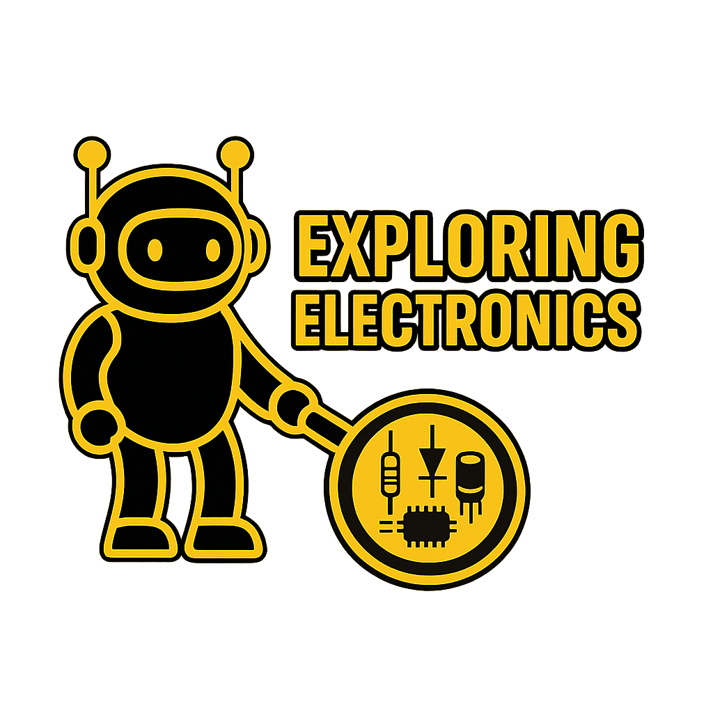

# Exploring Electronics

Electronics is everywhere. The question is whether you understand it or just work around it.

This site teaches electronics from first principles — not just how to follow a wiring diagram, but why circuits are designed the way they are. Every concept is explained directly, grounded in real components and real numbers, so you can read a datasheet, design a circuit, and understand what's actually happening when you power something up.

## Learning Path

-   **Essential**

    ---

    The foundations: voltage, current, resistance, and the components that put them to work. Start here if you're new to electronics.

    - [What Is Electricity?](essential/what_is_electricity.md) — Voltage, current, and resistance from first principles

-   **Efficient**

    ---

    Circuit design thinking: transistors, op-amps, communication protocols, and how to read datasheets. For makers who can follow a tutorial but want to go off-script.

-   **Mastery**

    ---

    Production-grade electronics: PCB design, power supply engineering, signal integrity, and the considerations that matter when hardware ships to customers.

-   **Practical Tools**

    ---

    The physical tools used throughout the site — read these as you need them.

    - [Breadboards](tools/breadboards.md) — How breadboards work internally, and the wiring mistakes that stop every beginner's first circuit

## Part of the BradPenney.io Network

This site is part of a family of progressive technical learning resources:

- [Exploring Linux](https://linux.bradpenney.io) — Linux for developers and platform engineers
- [Exploring Kubernetes](https://k8s.bradpenney.io) — Kubernetes from first deployment to production clusters
- [Exploring Python](https://python.bradpenney.io) — Python automation for platform engineers
- [Exploring Computer Science](https://cs.bradpenney.io) — CS theory for working engineers
