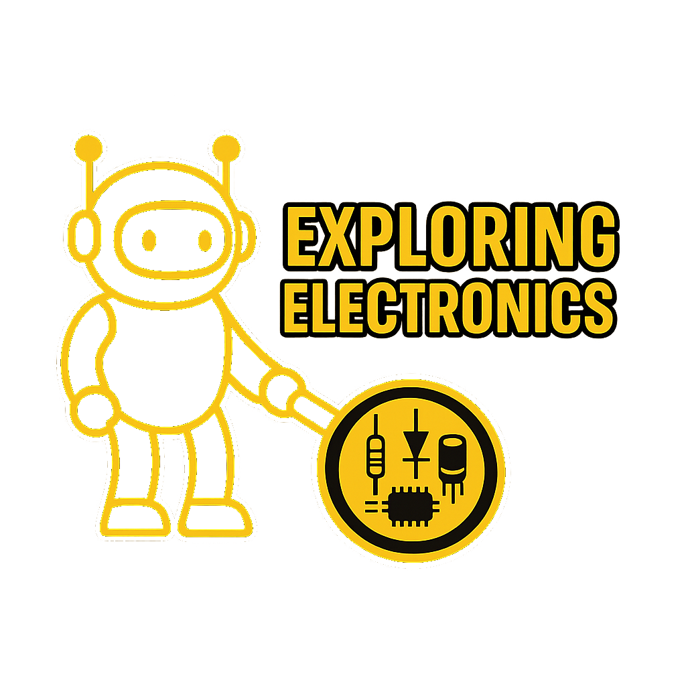

# Exploring Electronics

Electronics is everywhere. The question is whether you understand it or just work around it.

This site teaches electronics from first principles — not just how to follow a wiring diagram, but why circuits are designed the way they are. Every concept is explained directly, grounded in real components and real numbers, so you can read a datasheet, design a circuit, and understand what's actually happening when you power something up.

## Where Do You Start?

Articles are grouped into **topics** — the subjects of electronics, like circuit foundations and microcontrollers — and each topic deepens across three levels: **Essential** (start here, no prior knowledge needed), **Efficient** (for makers going off-script), and **Mastery** (production-grade depth).

-   :material-flag-checkered: **New to electronics?**

    ---

    Start at the very beginning — no prior knowledge assumed.

    [:octicons-arrow-right-24: Start with What Is Electricity?](essential/what_is_electricity.md)

-   :material-tools: **Ready to build?**

    ---

    Pick up the physical tools alongside the Essential articles whenever you're ready to wire something.

    [:octicons-arrow-right-24: Start with Breadboards](tools/breadboards.md)

---

## 📦 Essential

The foundations — no prior knowledge needed. Work through these in order, by topic.

**Circuit Foundations**

- [What Is Electricity?](essential/what_is_electricity.md) — Voltage, current, and resistance from first principles
- [Series and Parallel Circuits](essential/series_and_parallel.md) — How components connect changes everything about how a circuit behaves

**Reading Circuits**

- [How to Read a Schematic](essential/reading_schematics.md) — The symbols and rules for reading any circuit diagram

**Components**

- [Resistor Color Codes](essential/resistor_color_codes.md) — Decode any resistor's value and tolerance from its painted bands

**Microcontrollers**

- [What Is an Arduino?](essential/what_is_an_arduino.md) — The board itself, and how to read a sketch's `setup()`/`loop()` structure
- [Digital Pins](essential/digital_io.md) — How a microcontroller drives an LED and reads a button, and why every pin needs a resistor
- [Blink an LED](essential/blink_an_led.md) — Build a single-LED circuit and flash your first sketch, end to end
- [Pull-up and Pull-down Resistors](essential/pull_resistors.md) — Why an unconnected input floats, and how a resistor gives it a reliable HIGH or LOW

---

## 🔧 Practical Tools

The physical tools used throughout the site — read these as you need them.

- [Breadboards](tools/breadboards.md) — How breadboards work internally, and the wiring mistakes that stop every beginner's first circuit
- [arduino-cli](tools/arduino_cli.md) — Compile and upload Arduino sketches from the terminal, no IDE required

---

## ⚡ Efficient *(Coming soon)*

Circuit design thinking: transistors, op-amps, communication protocols, and how to read datasheets. For makers who can follow a tutorial but want to go off-script.

## 🎯 Mastery *(Coming soon)*

Production-grade electronics: PCB design, power supply engineering, signal integrity, and the considerations that matter when hardware ships to customers.

## Part of the BradPenney.io Network

This site is part of a family of progressive technical learning resources:

- [Exploring Linux](https://linux.bradpenney.io) — Linux for developers and platform engineers
- [Exploring Kubernetes](https://k8s.bradpenney.io) — Kubernetes from first deployment to production clusters
- [Exploring Python](https://python.bradpenney.io) — Python automation for platform engineers
- [Exploring Computer Science](https://cs.bradpenney.io) — CS theory for working engineers
