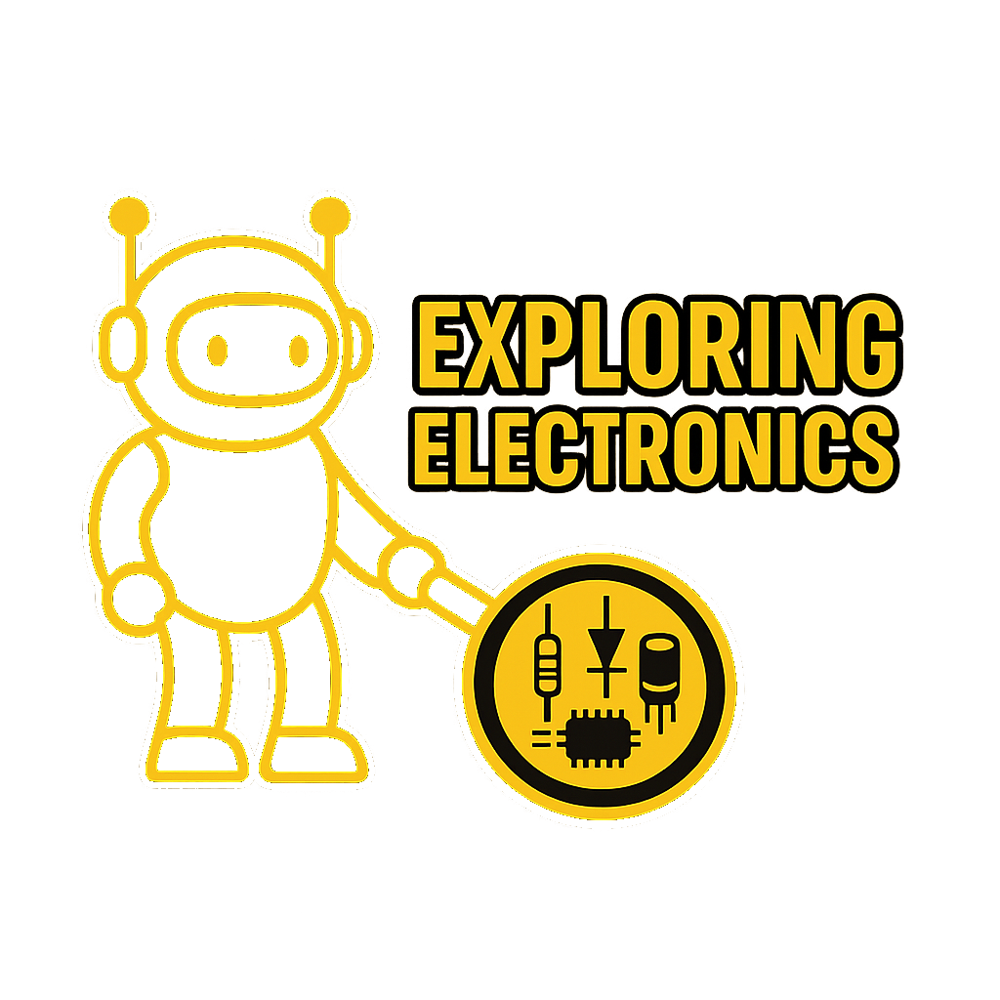

# Exploring Electronics

**Every circuit is a push, a flow, and something in the way.**

Learn those three properly and the rest of electronics stops being magic: why a bird can sit on a power line, why a cold light bulb reads 10 Ω on a meter, why every LED needs a resistor.

This site teaches electronics from the atom up, with numbers from real datasheets and measurements, circuits drawn as real schematics, and nothing that assumes you've done this before.

---

## Pick Your Starting Point

-   :material-atom: **Brand new to electronics**

    ---

    Start at the atom and climb one step at a time. No background needed.

    [:octicons-arrow-right-24: Conductors, Insulators, and Semiconductors](conductors_and_insulators.md)

-   :material-led-on: **Want to build something today**

    ---

    Wire a real circuit and make an LED blink, then come back for the why.

    [:octicons-arrow-right-24: Blink an LED](blink_an_led.md)

-   :material-vector-polyline: **Staring at a schematic**

    ---

    Learn the symbols and follow the current through any circuit diagram.

    [:octicons-arrow-right-24: How to Read a Schematic](reading_schematics.md)

-   :material-radio-tower: **Studying for amateur radio**

    ---

    The exam's electronics sections, taught for understanding, not memorization.

    [:octicons-arrow-right-24: Start with Voltage](voltage.md)

---

## The Foundations Path

Eleven articles take you from why copper conducts to real circuits. Each one builds on the last, and each one stands on its own.

<figure markdown>
  [{ width="760" }](conductors_and_insulators.md)
</figure>

[1. Conductors](conductors_and_insulators.md) · [2. What Is Electricity?](what_is_electricity.md) · [3. Metric Prefixes](metric_prefixes.md) · [4. Voltage](voltage.md) · [5. Current](current.md) · [6. Resistance](resistance.md) · [7. Ohm's Law](ohms_law.md) · [8. Shorts and Fuses](open_short_fuses.md) · [9. AC vs DC](ac_dc.md) · [10. Magnetism](magnetism.md) · [11. Series & Parallel](series_and_parallel.md)

---

## Explore by Topic

-   :material-lightning-bolt: **Circuit Foundations**

    ---

    What electricity actually is, with real numbers.

    [Conductors](conductors_and_insulators.md) · [What Is Electricity?](what_is_electricity.md) · [Metric Prefixes](metric_prefixes.md) · [Voltage](voltage.md) · [Current](current.md) · [Resistance](resistance.md) · [Ohm's Law](ohms_law.md) · [Shorts and Fuses](open_short_fuses.md) · [AC vs DC](ac_dc.md) · [Magnetism](magnetism.md) · [Series & Parallel](series_and_parallel.md)

-   :material-chip: **Microcontrollers**

    ---

    Make an Arduino sense the world and react to it.

    [What Is an Arduino?](what_is_an_arduino.md) · [Digital Pins](digital_io.md) · [Blink an LED](blink_an_led.md) · [Pull Resistors](pull_resistors.md) · [Analog Sensors](analog_input.md) · [Threshold Ladder](threshold_output.md)

-   :material-resistor: **Components**

    ---

    The parts on the bench: what they are and how to read them.

    [Resistor Color Codes](resistor_color_codes.md) · [Resistor Types and Potentiometers](resistor_types.md) · [Temperature Sensors](temperature_sensors.md) · [Package Types](package_types.md)

-   :material-vector-polyline: **Reading Circuits**

    ---

    The visual language every circuit is written in.

    [How to Read a Schematic](reading_schematics.md)

-   :material-battery-charging: **Power**

    ---

    Where a circuit's energy comes from, and how to handle it safely.

    [Cells and Batteries](batteries.md)

-   :material-tools: **Practical Tools**

    ---

    The bench equipment, read as you need it.

    [Breadboards](tools/breadboards.md) · [arduino-cli](tools/arduino_cli.md)

-   :material-wrench-clock: **Still to come**

    ---

    Capacitors and inductors, diodes and transistors, communication between chips, and power supplies and regulators.

---

## How This Site Teaches

-   :material-numeric: **Real numbers**

    ---

    Values come from manufacturer datasheets, standards, and published measurements, and every calculation is worked through.

-   :material-cube-outline: **Pictures that explain**

    ---

    3D figures show the mechanism; real schematics teach the notation you'll meet everywhere.

-   :material-shield-alert: **Safety first**

    ---

    Articles spell out what's safe, what can damage a part, and what can hurt you.

-   :material-pencil-box-multiple: **Practice built in**

    ---

    Articles end with practice problems and full solutions you can check.

---

## Part of the BradPenney.io Network

- [Exploring CNC](https://cnc.bradpenney.io) — hobby CNC machining with an open-source workflow
- [Exploring Linux](https://linux.bradpenney.io) — Linux for developers and platform engineers
- [Exploring Python](https://python.bradpenney.io) — Python automation for platform engineers
- [Exploring Computer Science](https://cs.bradpenney.io) — CS theory for working engineers
- [Exploring Kubernetes](https://k8s.bradpenney.io) — Kubernetes from first deployment to production clusters

## Subscribe by RSS

New articles go straight to the [RSS feed](https://electronics.bradpenney.io/feed_rss_created.xml): no algorithm, no email required.

