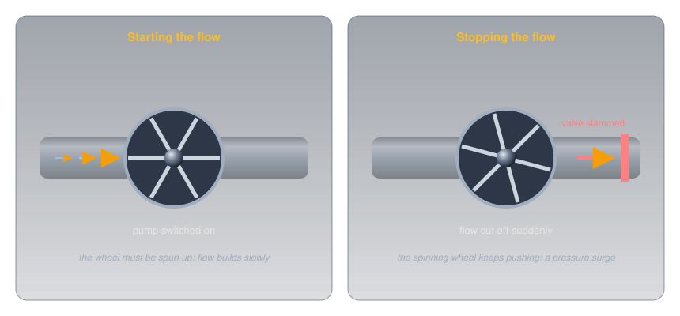
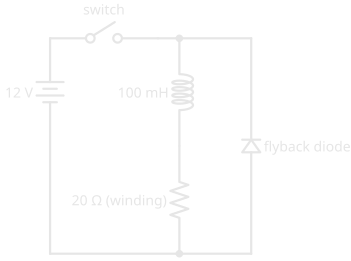
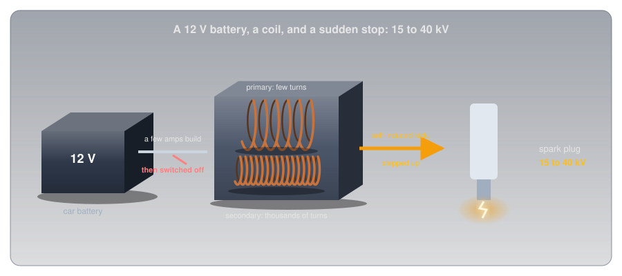
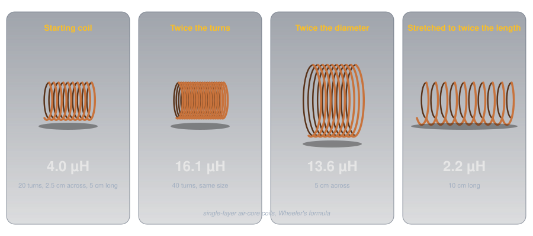
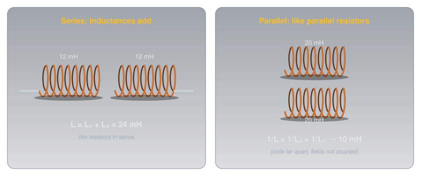

# Inductors

!!! abstract "Beginner"
    This article is in the **Circuit Foundations** topic. It builds on [Magnetism and Electromagnetism](magnetism.md), where a current makes a field and a changing field makes a voltage, and it's the partner of [Capacitors](capacitors.md). No other prior knowledge required.

A spark plug needs somewhere between 15,000 and 40,000 volts to fire, depending on the engine. The car has a 12 V battery. Between the two sits an ignition coil, and the trick it plays depends on one moment: the instant the current through it is switched *off*.

Two ideas explain it:

1. **An inductor resists any change in its current.** A coil's magnetic field takes energy to build and gives it back when it collapses, so the current through a coil can't jump; it can only ramp. How strongly a coil resists change is its **inductance**.
2. **The faster the change, the harder it pushes back.** The voltage a coil produces is its inductance times how fast the current is changing. Stop a current in a microsecond and that voltage can be enormous.

The ignition coil uses the second idea deliberately; most other circuits spend a diode making sure it never happens.

---

## Inside an Inductor

An inductor is a coil of wire, sometimes wound on a core of iron or ferrite. [Magnetism and Electromagnetism](magnetism.md#a-current-makes-a-field) showed what a coil does with a current: it makes a magnetic field, every turn adding to it. It also showed that a *changing* field through a coil induces a voltage in that coil ([A Changing Field Makes a Voltage](magnetism.md#a-changing-field-makes-a-voltage)).

Put those two facts in the same coil and something new appears. Change the current, and the field changes; the changing field induces a voltage in the very coil that made it; and that voltage always pushes against the change. Speed the current up and the coil pushes back; slow it down and the coil pushes forward to keep it going. This is **self-induction**, and the voltage it produces is often called **back-EMF** ([Voltage](voltage.md#other-names-for-voltage) explains the EMF).

A heavy flywheel turned by water in a pipe is the physical picture. It takes effort to spin up, so flow builds slowly when the pump starts. Once spinning, it keeps pushing, so if a valve slams shut the flow can't stop quietly: the pressure surges.

<figure markdown>
  { width="740" }
  <figcaption>A capacitor resists changes in voltage; an inductor resists changes in current. The flywheel is current's inertia.</figcaption>
</figure>

---

## Idea One: Inductance Resists Change

How hard a coil pushes back depends on the coil, and that property gets a unit.

???+ info "Definition: Henry"

    **Inductance** is how much voltage a coil produces for a given rate of change of current through it. One **henry** (H) produces one volt when the current changes by one ampere per second. Practical inductors range from nanohenries (nH) to a few henries.

\[ V = L \times \frac{\Delta I}{\Delta t} \]

Steady current, however large, produces no voltage at all: ΔI is zero. That's why an inductor on DC is just a piece of wire with the wire's own resistance. Only change matters.

### Filling Takes Time: τ = L ÷ R

Connect a coil to a battery, and at the first instant the current is zero: the coil pushes back with the full battery voltage. As the current builds, the push-back eases, and the current approaches the value the wire's resistance allows. The curve is the same shape as a [capacitor's](capacitors.md#idea-two-filling-takes-time), with current in place of voltage:

<figure markdown>
  { width="460" }
  <figcaption>Every real coil has resistance in its winding. The diode across it matters when the switch opens.</figcaption>
</figure>

???+ info "Definition: L/R Time Constant"

    For a coil with inductance L in henries and total resistance R in ohms, the **time constant** is \( \tau = L \div R \), in seconds. After one time constant the current has reached 63% of its final value; after five, over 99%.

A 100 mH coil with 20 Ω of winding on 12 V settles at 12 ÷ 20 = 0.6 A, with a time constant of 0.1 ÷ 20 = 5 ms: 0.38 A after 5 ms, essentially 0.6 A after 25 ms.

### Energy in the Field

Building that field took energy, and the coil holds it as long as the current flows:

\[ E = \tfrac{1}{2} L I^2 \]

The 100 mH coil at 0.6 A stores ½ × 0.1 × 0.6² = 18 mJ. It's the same shape as a capacitor's ½CV², with current where the capacitor has voltage, and it's where the trouble starts.

---

## Idea Two: Stopping a Current Bites

Open the switch, and the current through the coil has to stop. The coil's field holds 18 mJ, and that energy has to go somewhere. The coil does exactly what self-induction says: it pushes forward to keep the current flowing, raising whatever voltage it takes.

<figure markdown>
  { width="780" }
  <figcaption>On, the current builds gently. Off, the coil produces whatever voltage it takes to keep it flowing.</figcaption>
</figure>

If the switch opened in a microsecond, the formula would demand 0.1 H × 0.6 A ÷ 0.000 001 s = 60,000 V. It never gets there, because something gives first: the air across the opening switch contacts breaks down into an arc (pitting them a little every time), or, if a transistor did the switching, the transistor breaks down and dies. That's why every relay, solenoid, and motor in [Transistors](transistors.md) has a flyback diode across it: when the switch opens, the diode gives the coil's current a loop to circulate in, and it dies away over a few time constants at barely a volt instead of thousands ([Diodes and LEDs](diodes_and_leds.md#taming-a-coil-the-flyback-diode)).

### The Spark Plug, Solved

The ignition coil does on purpose what the flyback diode prevents. A few amps from the 12 V battery build a field in the coil's **primary** winding, of relatively few turns. At the moment the spark is needed, the current is switched off abruptly, and the primary's self-induced voltage jumps far above 12 V. The coil is also a [transformer](magnetism.md#transformers): its **secondary** winding has thousands of turns on the same core, so the collapsing field induces a voltage many times higher again, and the plug fires at 15 to 40 kV.

<figure markdown>
  { width="780" }
  <figcaption>Store energy slowly in a field, then collapse it fast: the inductor's version of the camera flash.</figcaption>
</figure>

It's the mirror image of the [camera flash](capacitors.md#the-flash-solved): there, a capacitor filled slowly and emptied fast to make a burst of current; here, a coil fills slowly and is cut off fast to make a burst of voltage.

### Inductors and AC

The same push-back shapes how a coil treats AC. [AC](ac_dc.md) is a current that never stops changing, so the coil pushes back all the time, and the faster the AC alternates, the faster the current would have to change, and the harder the coil pushes back. An inductor's opposition to AC therefore **rises with frequency**, the opposite of a capacitor's, and it has its own name: **inductive reactance**. A coil passes DC freely and resists high frequencies, which is exactly what a **choke** is for. Paired with a capacitor, whose reactance *falls* with frequency, it forms a tuned circuit that responds strongly at just one frequency, the heart of every radio.

| | Capacitor | Inductor |
|---|---|---|
| Stores energy in | an electric field, between plates | a magnetic field, around a coil |
| Resists changes in | voltage | current |
| Energy | ½ C V² | ½ L I² |
| Time constant | R × C | L ÷ R |
| On steady DC | blocks (once charged) | passes (just wire) |
| Opposition to AC | falls as frequency rises | rises as frequency rises |
| Series / parallel | combine like resistors in parallel / series | combine like resistors in series / parallel |

---

## What Sets a Coil's Inductance

For a coil of wire in air, three dimensions decide its inductance: the **number of turns**, the coil's **diameter**, and its **length**. Harold Wheeler's formula, published in 1928 for exactly the kind of single-layer coils radio builders wind, gives the inductance in microhenries from the diameter *d* and length *l* in inches and the number of turns *n*:

\[ L = \frac{d^2 n^2}{18d + 40l} \]

<figure markdown>
  { width="780" }
  <figcaption>Turns count twice over: double them and the inductance quadruples. Stretching the same turns over more length lowers it.</figcaption>
</figure>

- **Turns:** inductance goes with the square of the turns, because each turn both adds to the field and sees all of it. Twice the turns in the same space gives four times the inductance.
- **Diameter:** a wider coil encloses more field, so more inductance.
- **Length:** spreading the same turns over a longer coil weakens the field each turn sees, so less inductance.

A 20-turn coil 2.5 cm across and 5 cm long comes to about 4 µH, a typical value for tuning circuits at shortwave radio frequencies.

### Cores: Concentrating the Field

Winding the coil on a magnetic core multiplies its inductance by concentrating the field, the same effect that made the nail in [Magnetism and Electromagnetism](magnetism.md) a strong electromagnet. How much a material concentrates a field, compared with empty space, is its **relative permeability**: about 5,000 for nearly pure iron, roughly 10 to 2,300 for nickel-zinc ferrites, and 350 to 20,000 for manganese-zinc ferrites. A core's shape and any gap in it reduce the effect in practice, but a cored coil can easily reach hundreds of times the inductance of the same coil in air.

Cores have limits. Iron wastes energy at high frequencies, so it's used at mains and audio frequencies, and ferrites take over at radio frequencies. And every core **saturates**: push enough current through and the core can't concentrate any more field, the inductance collapses, and the current shoots up. An inductor's datasheet gives its saturation current as carefully as its inductance.

### Inductors in Series and Parallel

Inductors combine exactly like resistors, the reverse of capacitors:

<figure markdown>
  { width="740" }
  <figcaption>Series adds; parallel follows the resistor rule. Both assume the coils' fields don't overlap.</figcaption>
</figure>

- **Series:** \( L = L_1 + L_2 \). Two 12 mH chokes in series make 24 mH.
- **Parallel:** \( 1/L = 1/L_1 + 1/L_2 \). Two 20 mH inductors in parallel make 10 mH; the shortcuts from [Series and Parallel Circuits](series_and_parallel.md#current-divides) apply unchanged.

Both rules hold only when each coil's field stays out of the other's. Mount two coils close together and side by side and their fields **couple**: each induces a voltage in the other, and the totals change. Coupling is strongest when coils, or even two plain wires, are close and parallel. A transformer is coupling done deliberately; two wires running side by side in a cable picking up each other's signals is coupling done by accident.

---

## Kinds of Inductors

Inductors range from a few turns of bare wire to heavy iron-cored blocks, and the core decides most of the differences.

<figure markdown>
  { width="780" }
  <figcaption>From air to iron, as the inductance and the frequency fall.</figcaption>
</figure>

-   :material-sine-wave: **Air core**

    ---

    No core losses and no saturation, but low inductance: nanohenries to tens of microhenries.

    **Use:** tuning circuits at radio frequencies, often wound by hand.

-   :material-radio: **Ferrite rod and toroid**

    ---

    Ferrite concentrates the field with little loss at radio frequencies. A **toroid** (ring core) keeps its field inside the ring, so it neither radiates nor picks up much from its neighbours.

    **Use:** AM broadcast receiving antennas (ferrite rods), radio-frequency filters and transformers (toroids).

-   :material-filter-outline: **Iron-core choke**

    ---

    Laminated iron for big inductance at low frequencies: millihenries to henries.

    **Use:** smoothing power supplies and filtering mains interference.

-   :material-chip: **Moulded and chip inductors**

    ---

    Small fixed values on circuit boards. Moulded ones often carry colour bands read like a [resistor's](resistor_color_codes.md), in microhenries.

    **Use:** filters, radio-frequency chokes, and switching power supplies.

-   :material-circle-double: **Ferrite beads**

    ---

    A ferrite sleeve on a cable or a lead: a single "turn" through a lossy core.

    **Use:** soaking up radio-frequency noise on cables while passing DC and low frequencies untouched.

-   :material-tune-vertical: **Variable inductors**

    ---

    Wikipedia's [Inductor](https://en.wikipedia.org/wiki/Inductor) article calls a ferrite core that screws in or out of the coil "probably the most common type of variable inductor today." A **roller coil** is an air-core coil with a small wheel riding along its wire, so turning a shaft changes how many turns are in the circuit.

    **Use:** trimming tuned circuits (slug cores), and tuning transmitter circuits and antenna matching at high power (roller coils).

---

## Where You'll Find Them

Every use comes back to one of the two ideas: resisting change, or storing energy in a field and releasing it.

- **Chokes and filters.** Because a coil resists changing current, it smooths current in a power supply and blocks radio-frequency noise from travelling along a cable, while passing DC.
- **Switching power supplies.** Modern chargers and regulators switch a coil on and off tens of thousands of times a second, storing a little energy in its field each cycle and releasing it at a different voltage. The camera flash's charger in [Capacitors](capacitors.md#the-flash-solved) works this way.
- **Tuned circuits.** A coil and a capacitor together pick one frequency out of many, from a radio's dial to its transmitter.
- **Relays, solenoids, and motors.** These are inductors that do mechanical work, and every one needs a flyback diode.
- **Transformers and ignition coils.** Two coupled coils, sharing a changing field.

---

## Measuring Inductance

Most multimeters can't measure inductance. On the ohms range they read only the resistance of the winding, which says nothing about the inductance: the 100 mH coil above reads 20 Ω, the same as a 20 Ω resistor. Measuring inductance takes an **LCR meter** (inductance, capacitance, resistance), or one of the inexpensive component testers that identify a part and measure it automatically. A continuity test is still useful: a coil that reads open has a broken winding.

---

## Safety: Respect the Kick

Most inductors on a hobby bench are harmless, but the voltage a coil produces when its current is interrupted doesn't depend on the supply voltage, only on how much current was flowing and how fast it stopped.

!!! warning "Fit a Flyback Diode, and Don't Hold the Leads"
    Interrupting the current through a relay, motor, or solenoid coil produces a spike that destroys transistors and microcontroller pins, so fit a flyback diode across every coil you switch. A large coil disconnected by hand can deliver a sharp shock, even from a low-voltage supply, if you're holding its leads when the circuit breaks. Large iron-cored chokes and transformers also run hot under load. Ignition systems are in another class entirely: never touch the leads of a running engine, where the coil produces 15 to 40 kV.

---

## Practice

??? question "1. The Henry"

    The current through a 50 mH coil rises steadily from 0 to 2 A in 0.1 s. What voltage does the coil produce while it does?

    ??? tip "Solution"
        \[ V = L \times \frac{\Delta I}{\Delta t} = 0.05 \times \frac{2}{0.1} = 1\ \text{V} \]

        A steady 1 V, pushing against the rising current for as long as it rises.

??? question "2. Time Constant"

    A 200 mH coil has 40 Ω of winding resistance and is connected to 12 V. What's the final current, and roughly how long until it gets there?

    ??? tip "Solution"
        Final current: 12 ÷ 40 = **0.3 A**. Time constant: 0.2 ÷ 40 = 5 ms, so it's effectively there after five time constants, about **25 ms**.

??? question "3. Series and Parallel"

    What's the total of two 12 mH chokes in series? Of two 20 mH inductors in parallel, assuming their fields don't couple?

    ??? tip "Solution"
        Series: 12 + 12 = **24 mH**. Parallel: two equal inductors give half of one, **10 mH**. Inductors combine like resistors.

??? question "4. Rewinding a Coil"

    An air-core coil is rewound with twice as many turns, keeping the same diameter and the same length. What happens to its inductance?

    ??? tip "Solution"
        It roughly **quadruples**: inductance goes with the square of the number of turns. (Wheeler's formula: 4.0 µH becomes 16.1 µH for the example coil.)

??? question "5. Why Did the Transistor Die?"

    A transistor switches a 12 V relay coil, and works for a few minutes before failing. The circuit has no diode across the coil. What happened?

    ??? tip "Solution"
        Each time the transistor switched off, the coil's collapsing field produced a voltage spike far above 12 V across the transistor, which exceeded its rating until it failed. A flyback diode across the coil, cathode to the positive supply, gives the current a safe path and keeps the spike to about a volt.

??? question "6. Choke or Capacitor?"

    You want to stop radio-frequency noise travelling along a DC power lead to a radio, without blocking the DC. Should the part in series with the lead be an inductor or a capacitor?

    ??? tip "Solution"
        An **inductor** (a choke or a ferrite bead). It passes DC with only its winding resistance, and its opposition rises with frequency, so it resists the noise. A capacitor in series would block the DC; capacitors belong *across* the supply, from the lead to ground, where they short the noise away.

---

## Quick Recap

-   **A coil resists change**

    ---

    Self-induction: a changing current makes a changing field, which pushes back on the current.

-   **V = L × ΔI ÷ Δt**

    ---

    One henry gives one volt at one amp per second. Steady current: no voltage.

-   **τ = L ÷ R**

    ---

    Current builds to 63% in one time constant, effectively full in five.

-   **Energy = ½ L I²**

    ---

    Stored in the field, and released when the current stops.

-   **Stopping bites**

    ---

    A sudden stop makes a huge voltage. Fit a flyback diode; the ignition coil uses it on purpose.

-   **What sets L**

    ---

    Turns (squared), diameter, and length; a magnetic core multiplies it, until it saturates.

-   **Series adds, parallel halves**

    ---

    Inductors combine like resistors, as long as their fields don't couple.

-   **Rises with frequency**

    ---

    Passes DC, resists AC more as the frequency rises: a choke. With a capacitor, a tuned circuit.

---

## What's Next

Capacitors, inductors, transformers, meters, and fuses each have their own symbols, and real circuits combine them all. **[How to Read a Schematic](reading_schematics.md)** brings them together, and shows how to trace a complete circuit from the drawing.

---

## Further Reading

**Deep Dives**

- [Inductor — Wikipedia](https://en.wikipedia.org/wiki/Inductor) — self-induction, energy storage, and the full family of cores
- [Permeability (Electromagnetism) — Wikipedia](https://en.wikipedia.org/wiki/Permeability_(electromagnetism)) — the table of core materials used in this article
- [Ignition Coil — Wikipedia](https://en.wikipedia.org/wiki/Ignition_coil) — how the coil turns 12 V into 15 to 40 kV

**Related Articles**

- [Magnetism and Electromagnetism](magnetism.md) — fields, induction, and transformers
- [Capacitors](capacitors.md) — the inductor's partner, with every property mirrored
- [Diodes and LEDs](diodes_and_leds.md) — the flyback diode every switched coil needs
- [Transistors](transistors.md) — switching coils safely from a microcontroller pin
