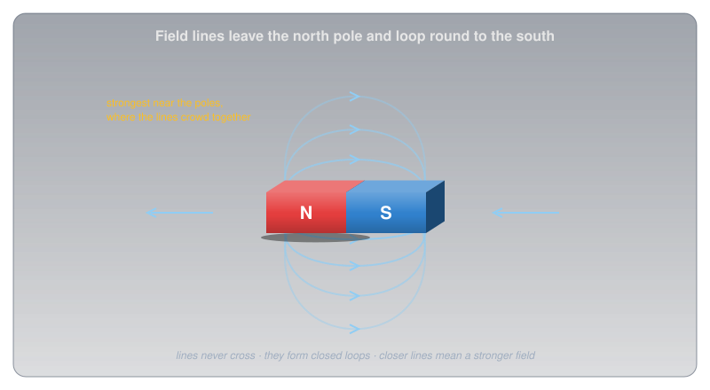
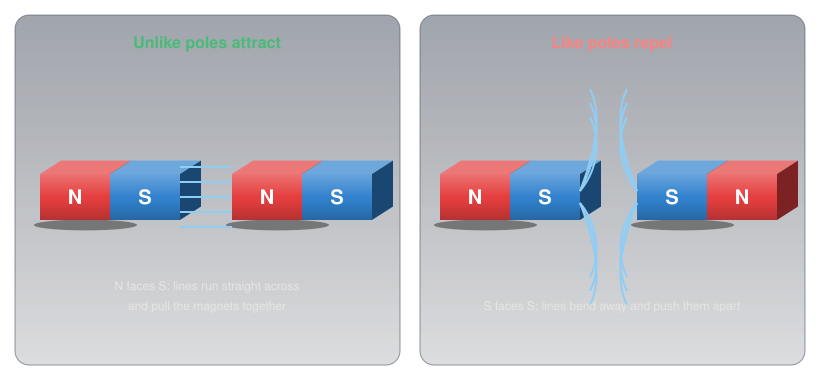
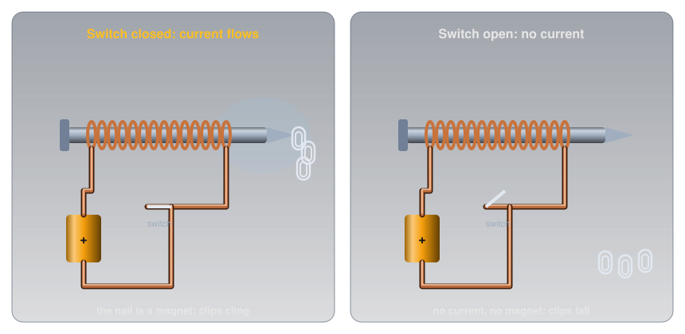
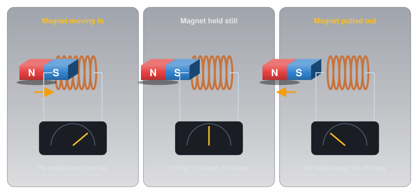
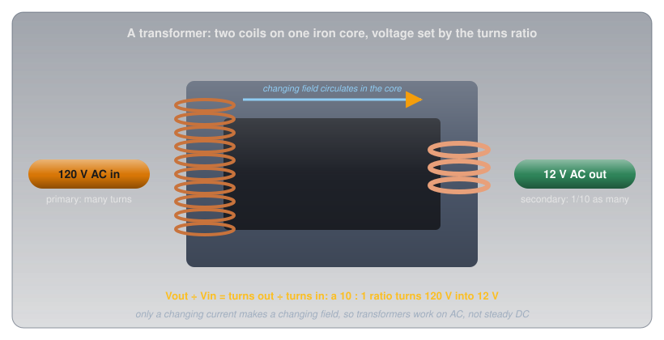
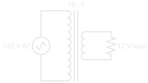

# Magnetism and Electromagnetism

!!! abstract "Beginner"
    This article is in the **Circuit Foundations** topic. It builds on [Current](current.md) and [AC vs DC](ac_dc.md). No other prior knowledge required.

Wrap insulated wire around an ordinary steel nail, connect the two ends to a battery, and the nail picks up paper clips. Disconnect the battery and the clips drop. There's no magnet anywhere in the setup: just a nail, some wire, and a battery.

Two ideas explain where the magnet came from:

1. **Magnets surround themselves with a field.** It has a north pole and a south pole, it can be mapped with lines, and like poles repel while unlike poles attract.
2. **Electricity and magnetism are the same force.** A current makes a magnetic field, and a *changing* magnetic field makes a voltage. Those two facts run electromagnets, motors, generators, transformers, and, in the end, radio.

---

## One of Four Forces

Physics recognizes four fundamental forces: gravity, the strong and weak nuclear forces (which only act inside atoms), and **electromagnetism**. The attraction between electrons and the nucleus in [Conductors, Insulators, and Semiconductors](conductors_and_insulators.md#inside-the-atom) is electromagnetism, and so is the pull of a fridge magnet. They look like different forces, but they're two faces of one, and the second half of this article shows how they connect.

---

## Idea One: Magnets and Their Fields

The space around a magnet, where its force can be felt, is its **magnetic field**. The field can't be seen, but it can be mapped: iron filings sprinkled around a magnet line up into curves, and a small compass placed anywhere in the field points along them. Those curves are drawn as **field lines**.

<figure markdown>
  { width="720" }
  <figcaption>Field lines leave the north pole and curve round to the south.</figcaption>
</figure>

Field lines follow a few rules:

- **They leave the north pole and enter the south pole** (outside the magnet), and run on through the magnet to form closed loops.
- **They never cross.**
- **They crowd together where the field is strong,** which is why a magnet is strongest at its poles.

Poles always come in pairs. Cut a bar magnet in half and you don't get a separate north and south: you get two smaller magnets, each with both poles.

### Like Poles Repel, Unlike Poles Attract

Bring two magnets together and their fields interact. A north pole facing a south pole pulls the magnets together; two of the same pole push them apart.

<figure markdown>
  { width="740" }
  <figcaption>Opposite poles attract; matching poles repel.</figcaption>
</figure>

That rule hides a twist. A compass needle is a small magnet, and the end marked N points north. Since unlike poles attract, the pole of the Earth near the geographic North Pole must be a magnetic *south* pole. The names are older than the physics.

### Kinds of Magnets

Magnets come in three broad kinds, defined by whether their magnetism lasts:

-   :material-magnet: **Permanent magnets**

    ---

    Keep their magnetism indefinitely. **Ferrite** (ceramic) magnets are cheap and common in fridge magnets and loudspeakers; **alnico** (aluminium, nickel, cobalt) was common in older equipment; **neodymium** magnets are the strongest ordinary magnets made. Wikipedia's [Magnet](https://en.wikipedia.org/wiki/Magnet) article sorts magnetic materials into "soft" ones like annealed iron, "which can be magnetized but do not tend to stay magnetized," and "hard" ones, "which do": permanent magnets are made from the hard kind, which is why one is far more likely to be steel than brass, copper, or aluminium, none of which is magnetic at all.

-   :material-nail: **Temporary magnets**

    ---

    Materials like soft iron and steel become magnetic while they sit in a field, then mostly lose it when the field is taken away. A nail stuck to a magnet can pick up a paper clip of its own.

-   :material-flash: **Electromagnets**

    ---

    A coil of wire carrying current, usually around an iron core. Their strength can be turned up, down, or off with the current. The second half of this article explains them.

### How Strong Is a Field?

Field strength is measured in **tesla** (T), a large unit: everyday fields are usually given in millitesla (mT) or microtesla (µT), using the prefixes from [Metric Prefixes and Units](metric_prefixes.md).

<figure markdown>
  { width="740" }
  <figcaption>From the Earth's gentle field to a hospital scanner, a range of about a hundred thousand times.</figcaption>
</figure>

---

## Idea Two: Electricity and Magnetism Are One Force

The connection between electricity and magnetism was found by accident. In 1820, the Danish physicist Hans Christian Ørsted noticed that a compass needle swung when he switched on a current in a nearby wire. A current makes a magnetic field.

### A Current Makes a Field

The field around a straight wire forms rings centred on the wire. Its direction follows the **right-hand rule**: point your right thumb along the conventional current ([Current](current.md#which-way-does-current-flow)), and your fingers curl the way the field circles.

<figure markdown>
  { width="760" }
  <figcaption>One wire makes rings; a coil adds them into a bar magnet's field.</figcaption>
</figure>

One wire's field is weak, but winding the wire into a coil adds every turn's rings together, and the result is a field shaped exactly like a bar magnet's, with a north end and a south end. Put an iron core inside and the iron's own magnetism lines up with the coil's field and multiplies it many times over. That's an **electromagnet**, and it's the nail puzzle solved.

<figure markdown>
  { width="760" }
  <figcaption>The coil makes the field; the steel nail concentrates it; the switch turns it on and off.</figcaption>
</figure>

The magnet was the current all along. The coil of wire made a field the moment current flowed, the steel nail concentrated it, and opening the switch stopped the current and the field together. More turns, more current, or a better iron core all make an electromagnet stronger.

Electromagnets are everywhere a magnet needs to be switched:

- **Relays** use a small current in a coil to pull a switch closed, so a small signal can control a large load.
- **Motors** use electromagnets pushing against permanent magnets (or each other) to turn a shaft.
- **Loudspeakers** push a coil back and forth against a permanent magnet in time with the audio signal.

### A Changing Field Makes a Voltage

In 1831, Michael Faraday found the reverse: a magnetic field can push a current, but only when it's *changing*. Move a magnet into a coil and a meter connected to the coil swings. Hold the magnet still and the meter reads zero. Pull it out and the meter swings the other way. This is **electromagnetic induction**.

<figure markdown>
  { width="760" }
  <figcaption>Motion, not presence: only a changing field induces a voltage.</figcaption>
</figure>

Induction is what makes a generator work. [AC vs DC](ac_dc.md#where-ac-comes-from-the-generator) showed a loop turning between magnet poles: the field through the loop keeps changing as it turns, so a voltage keeps being induced, first one way and then the other. That's alternating current.

### Transformers

Induction also lets two coils share energy without touching. Wind two coils on one iron core and feed AC into the first (the **primary**). Its constantly changing field circulates through the core and induces a voltage in the second coil (the **secondary**).

<figure markdown>
  { width="720" }
  <figcaption>The voltage ratio follows the turns ratio.</figcaption>
</figure>

Every turn of each coil sees the same changing field, so the voltages are in the same ratio as the number of turns:

\[ \frac{V_{\text{secondary}}}{V_{\text{primary}}} = \frac{N_{\text{secondary}}}{N_{\text{primary}}} \]

A transformer with ten times as many turns on its primary steps 120 V down to 12 V. Turn it around and it steps voltage up instead, which is how the grid reaches the high voltages that [Ohm's Law and Power](ohms_law.md#why-power-lines-run-at-such-high-voltages) showed are needed for long lines. A steady DC current makes a steady field, which induces nothing, which is why transformers only work on AC.

<figure markdown>
  { width="420" }
  <figcaption>A transformer in a schematic: two coils, with two straight lines between them for the iron core.</figcaption>
</figure>

#### Current and Power

A transformer can't create energy, so stepping the voltage down must step the current up. In an ideal transformer the power in equals the power out, and the currents go the opposite way to the voltages ([Transformer](https://en.wikipedia.org/wiki/Transformer) on Wikipedia):

\[ \frac{V_{\text{primary}}}{V_{\text{secondary}}} = \frac{I_{\text{secondary}}}{I_{\text{primary}}} = \frac{N_{\text{primary}}}{N_{\text{secondary}}} \]

<figure markdown>
  { width="760" }
  <figcaption>Same 60 W on both sides; voltage and current trade places.</figcaption>
</figure>

The 10 : 1 transformer above delivers 12 V at 5 A to its load while drawing only 0.5 A at 120 V from the wall. That's why a transformer's size is set by the power it handles, and why its rating is given in volt-amperes (VA), the product of its voltage and current.

The same trade changes how a load looks from the other side. The 2.4 Ω load on the secondary draws 0.5 A at 120 V from the primary, so the wall sees 240 Ω: a hundred times more, the turns ratio squared. Wikipedia states the rule: the load "referred to the primary circuit is equal to the turns ratio squared times the secondary circuit load impedance." Transformers use this to make a load look like the resistance a source wants to drive, which is how audio amplifiers drive loudspeakers and how radio antennas are matched to their cables.

#### Where the Losses Go

Real transformers lose a little energy on the way through, as heat, in four ways:

<figure markdown>
  { width="760" }
  <figcaption>Every loss ends as heat, which is why a working transformer is warm.</figcaption>
</figure>

- **Copper loss:** the windings are wire, and wire has [resistance](resistance.md), so current through them makes heat that grows with the current squared.
- **Eddy currents:** the iron core is a conductor too, and the changing field induces loops of current inside it. Building the core from thin, insulated sheets, called **laminations**, breaks those loops up; Wikipedia notes that "thinner laminations reduce losses, but are more laborious and expensive to construct."
- **Hysteresis:** the core's magnetism reverses every half-cycle, and "each time the magnetic field is reversed, a small amount of energy is lost."
- **Leakage flux:** some of the field misses the second winding and does no useful work.

None of these is large in a well-made transformer: Wikipedia puts typical distribution transformers at 98 to 99% efficient.

#### Kinds of Transformer

The same two-winding idea comes in a few arrangements worth recognizing:

<figure markdown>
  { width="620" }
  <figcaption>Two separate windings isolate; one shared winding doesn't.</figcaption>
</figure>

- **Isolation transformer:** a 1 : 1 transformer used for safety. The output has the same voltage as the input, but "no conductive path is present between source and load" ([Isolation transformer](https://en.wikipedia.org/wiki/Isolation_transformer)), so touching one side of the output while standing on the ground doesn't complete a path back through the mains.
- **Centre-tapped secondary:** a connection halfway along the secondary gives two equal voltages either side of the tap, which some full-wave rectifiers use ([Diodes and LEDs](diodes_and_leds.md#rectification-ac-to-dc)).
- **Multiple windings:** one primary can feed several secondaries at different voltages, each isolated from the others.
- **Autotransformer:** "an electrical transformer with only one winding" ([Autotransformer](https://en.wikipedia.org/wiki/Autotransformer)), with the output taken from a tap. It's smaller and cheaper, but it gives no isolation at all.
- **Variac:** a variable autotransformer whose sliding contact runs along the winding, giving a smoothly adjustable AC voltage. It's a repair-shop tool for testing equipment at different voltages, and, being an autotransformer, it doesn't isolate either.
- **Toroidal:** wound on a ring-shaped core, which keeps nearly all its field inside the ring, so it leaks less field and less interference into the circuits around it ([Inductor](https://en.wikipedia.org/wiki/Inductor) on Wikipedia).

!!! danger "An Autotransformer or Variac Is Not Isolated"
    Because input and output share one winding, an autotransformer's output is connected to the mains. Wikipedia warns that a failure in one "can result in full input voltage applied to the output." Never treat a variac's output as safer than the wall outlet it plugs into.

### From Fields to Radio

A current makes a magnetic field; a changing magnetic field makes a voltage. In 1865, James Clerk Maxwell worked out that changing electric and magnetic fields can keep generating each other and travel through space on their own, at the speed of light. In 1887, Heinrich Hertz, the man the unit of frequency is named after, made and detected those waves in his laboratory. They're radio waves: electromagnetism set loose from the wire.

---

## Safety: Strong Magnets

Small, powerful magnets, like the neodymium magnets used in craft projects and magnet sets, are a real hazard around children.

!!! danger "Swallowed Magnets Are a Medical Emergency"
    Health Canada warns that swallowing small, powerful magnets can cause severe injury or death, with children under 10 most at risk. Two or more swallowed magnets can attract each other through the walls of the intestines and tear them. Keep loose small magnets away from children, and get medical help immediately if one may have been swallowed.

Larger neodymium magnets carry their own risks.

!!! warning "Pinches, Shards, and Electronics"
    Strong magnets snap together hard enough to pinch skin painfully and can shatter into sharp shards when they collide. Magnet suppliers also warn to keep them away from pacemakers and other implanted medical devices, and from the magnetic stripes on cards.

---

## Practice

??? question "1. Which Way?"

    A magnet's north pole is brought near another magnet's north pole. What happens?

    ??? tip "Solution"
        They **repel**. Like poles push apart; only unlike poles (north and south) attract.

??? question "2. Cutting a Magnet"

    A bar magnet is cut in half across its middle. How many poles does each half have?

    ??? tip "Solution"
        **Two.** Each half is a complete magnet with its own north and south pole; poles always come in pairs.

??? question "3. A Stronger Electromagnet"

    Name three ways to make the nail electromagnet stronger.

    ??? tip "Solution"
        Use **more turns** of wire, **more current** (within what the wire and battery can safely handle), and a **better iron core**. Each one increases the field.

??? question "4. Still Magnet"

    A strong magnet sits motionless inside a coil connected to a meter. What does the meter read, and why?

    ??? tip "Solution"
        **Zero.** Induction needs a *changing* field. A stationary magnet makes a steady field, which induces no voltage.

??? question "5. Turns Ratio"

    A transformer has 600 turns on its primary and 30 on its secondary. With 120 V AC on the primary, what's the secondary voltage?

    ??? tip "Solution"
        \( 120 \times 30 / 600 = 6\ \text{V} \) AC. The ratio is 20 : 1, so the voltage steps down twenty times.

??? question "6. Why Not DC?"

    Why won't a transformer step down the 12 V DC from a car battery?

    ??? tip "Solution"
        Steady DC makes a steady magnetic field in the core, and a steady field induces no voltage in the secondary. A transformer needs a changing current, which is why it works on AC.

??? question "7. Secondary Current"

    A transformer steps 120 V down to 12 V and draws 0.5 A from the wall. Ignoring losses, how much current can its secondary deliver?

    ??? tip "Solution"
        Power in equals power out: 120 V × 0.5 A = 60 W, so the secondary delivers 60 W ÷ 12 V = **5 A**. The voltage went down ten times, so the current went up ten times.

??? question "8. Step Up, Current Down"

    A transformer with a 1 : 5 turns ratio steps a voltage up and delivers 50 mA to its load. Ignoring losses, what current does its primary draw?

    ??? tip "Solution"
        The voltage goes up five times, so the current on the primary side is five times the secondary current: 5 × 50 mA = **250 mA**.

??? question "9. Is It Isolated?"

    A variac and a 1 : 1 isolation transformer both deliver 120 V AC. Which one isolates its output from the mains, and why?

    ??? tip "Solution"
        **The isolation transformer.** Its two windings share only the magnetic field, with no conductive path between them. A variac is an autotransformer: one winding, with input and output connected through it.

---

## Quick Recap

-   **Fields and poles**

    ---

    Field lines leave north and enter south, never cross, and crowd where the field is strong.

-   **Attract and repel**

    ---

    Unlike poles attract; like poles repel. Poles always come in pairs.

-   **Kinds of magnets**

    ---

    Permanent (ferrite, alnico, neodymium), temporary (soft iron), and electromagnets.

-   **Current makes a field**

    ---

    Ørsted, 1820. A coil with an iron core is an electromagnet.

-   **Changing field makes a voltage**

    ---

    Faraday, 1831. Induction runs generators and transformers.

-   **Transformers**

    ---

    Voltage ratio = turns ratio; current ratio is the inverse; power in = power out. AC only.

---

## What's Next

With electricity and magnetism joined, **[Series and Parallel Circuits](series_and_parallel.md)** returns to building real circuits from several components.

---

## Further Reading

**Reference**

- [Orders of Magnitude (Magnetic Field) — Wikipedia](https://en.wikipedia.org/wiki/Orders_of_magnitude_(magnetic_field)) — the field strengths used in this article
- [Magnet Safety — Health Canada](https://www.canada.ca/en/health-canada/services/toy-safety/magnets.html) — the risks of swallowed magnets

**Deep Dives**

- [Electromagnetic Induction — Wikipedia](https://en.wikipedia.org/wiki/Electromagnetic_induction) — Faraday's law and how generators and transformers use it
- [Transformer — Wikipedia](https://en.wikipedia.org/wiki/Transformer) — cores, windings, the turns ratio, current and impedance ratios, and losses
- [Autotransformer — Wikipedia](https://en.wikipedia.org/wiki/Autotransformer) — one winding, no isolation, and the variac
- [Isolation Transformer — Wikipedia](https://en.wikipedia.org/wiki/Isolation_transformer) — why a 1 : 1 transformer makes equipment safer to work on

**Related Articles**

- [AC vs DC](ac_dc.md) — the generator that induction makes possible
- [Ohm's Law and Power](ohms_law.md) — why transformers step the grid up to high voltage
- [Current](current.md) — the conventional current direction the right-hand rule uses
