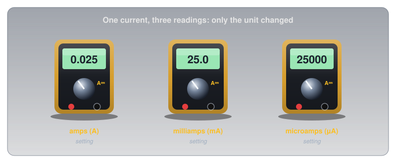
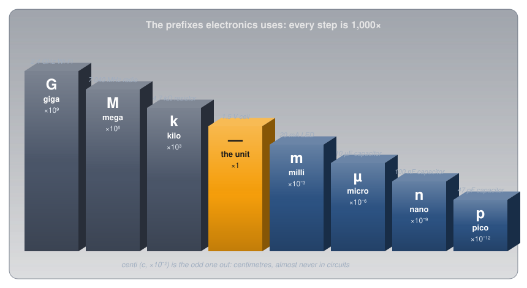
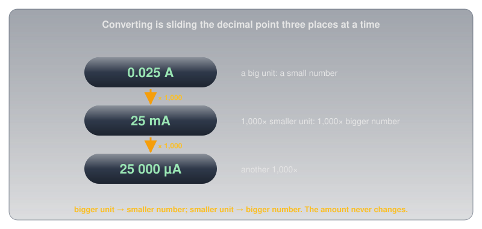

# Metric Prefixes and Units

!!! abstract "Beginner"
    This article is in the **Circuit Foundations** topic. No prior knowledge required. Every other article on the site uses these prefixes, so it's worth reading early.

A multimeter measuring the current through an LED reads **0.025** on its amps setting. Turn the dial to milliamps and it reads **25.0**. Turn it to microamps and it reads **25000**. Nothing in the circuit changed. The same current is flowing; only the way of writing it moved.

Electronics deals in quantities from a few millionths of a millionth (a small capacitor) to billions (a Wi-Fi signal's frequency), so it relies on the metric system's prefixes to keep the numbers readable. Two ideas cover all of it:

1. **A prefix is a multiplier stuck to a unit.** "Kilo" means a thousand, so 4.7 kΩ is 4.7 × 1,000 Ω. The prefixes electronics uses go up and down in steps of 1,000.
2. **Converting is sliding the decimal point,** three places per step. Switch to a unit 1,000 times smaller and the number gets 1,000 times bigger, because the amount itself never changes.

By the end, the three meter readings will be obviously the same thing, and so will the markings printed on real resistors and capacitors.

<figure markdown>
  { width="720" }
  <figcaption>Same current, three dial settings, three numbers.</figcaption>
</figure>

---

## Idea One: A Prefix Is a Multiplier

A metric prefix is a short word (or a single letter) in front of a unit that multiplies it by a fixed amount. **Kilo** (k) means 1,000, so a kilometre is 1,000 metres and a kilohm is 1,000 ohms. **Milli** (m) means a thousandth, so a millimetre is a thousandth of a metre and a milliamp is a thousandth of an amp. The same prefixes work on every unit: volts, amps, ohms, watts, hertz, farads.

The prefixes are defined internationally in the International System of Units (SI). The ones electronics uses step up and down by a factor of 1,000 each time:

<figure markdown>
  { width="760" }
  <figcaption>Each step down the stairs is a thousand times smaller than the one before.</figcaption>
</figure>

| Symbol | Prefix | Multiplier | Power of ten | Example |
|---|---|---|---|---|
| G | giga | 1,000,000,000 | 10⁹ | 2.4 GHz Wi-Fi |
| M | mega | 1,000,000 | 10⁶ | 7.040 MHz on a radio dial |
| k | kilo | 1,000 | 10³ | a 4.7 kΩ resistor |
| (none) | the unit itself | 1 | 10⁰ | a 1.5 V cell |
| m | milli | 0.001 | 10⁻³ | a 20 mA LED |
| µ | micro | 0.000 001 | 10⁻⁶ | a 10 µF capacitor |
| n | nano | 0.000 000 001 | 10⁻⁹ | a 100 nF capacitor |
| p | pico | 0.000 000 000 001 | 10⁻¹² | a 47 pF capacitor |

One prefix breaks the pattern: **centi** (c), a hundredth (10⁻²). It's everywhere in daily life, as centimetres, and almost nowhere in electronics.

### Case Matters

The symbols are case-sensitive, and some pairs differ only by case:

- **m and M are a billion times apart.** 1 mΩ (a milliohm) is a thousandth of an ohm; 1 MΩ (a megohm) is a million ohms.
- **k is lowercase for kilo.** A capital K is the symbol for the kelvin, a unit of temperature (though part markings often use K anyway, as later in this article).
- **µ is the Greek letter mu.** It isn't on most keyboards, so it's often typed as a plain **u**: "10uF" means 10 µF.

### Powers of Ten and Engineering Notation

The "power of ten" column is the same idea in a different form. 10³ means 10 × 10 × 10 = 1,000, and 10⁻³ means 1 ÷ 1,000. So 4.7 kΩ can also be written 4.7 × 10³ Ω, and a calculator shows it as `4.7E3`, where "E3" means "× 10³".

When the power of ten is always a multiple of three (10³, 10⁶, 10⁻⁶, and so on), the notation is called **engineering notation**, and every exponent lines up with a prefix: 10³ is kilo, 10⁻⁶ is micro. That's why engineers prefer it: 4.7 × 10³ Ω and 4.7 kΩ are the same thing written two ways.

---

## Idea Two: Converting Is Sliding the Decimal Point

Because each prefix is 1,000 times the next, converting between neighbouring prefixes means multiplying or dividing by 1,000, which in decimal notation means moving the decimal point three places.

The direction is easy to get backwards, so it helps to remember what doesn't change: the amount. A smaller unit needs a bigger number to describe the same amount, the same way a distance takes more millimetres than metres.

<figure markdown>
  { width="720" }
  <figcaption>Each step to a unit 1,000 times smaller moves the decimal point three places right.</figcaption>
</figure>

- **To a smaller unit, multiply by 1,000** (decimal point three places right): 0.25 A = 250 mA; 2 V = 2,000 mV.
- **To a bigger unit, divide by 1,000** (decimal point three places left): 3,000 mA = 3 A; 7,040 kHz = 7.040 MHz.
- **Two steps at once, multiply or divide by a million:** 25,000 µA is 25 mA, which is 0.025 A.

That's the opening puzzle solved. 0.025 A, 25 mA, and 25,000 µA are the same current; the meter's dial only chose which unit to count in. Choosing the setting that shows the most useful digits is most of the skill of reading a meter.

---

## Prefixes on Real Parts

Prefixes appear on real components in compact forms, because a resistor or a capacitor has very little room for print.

<figure markdown>
  { width="760" }
  <figcaption>The same prefixes, squeezed onto parts and displays.</figcaption>
</figure>

- **A letter in place of the decimal point.** A standard from the International Electrotechnical Commission (IEC 60062) prints values with the prefix letter where the decimal point would be: **4K7** is 4.7 kΩ, **1R0** is 1.0 Ω (R standing in for "ohms, no prefix"), and **4n7** is 4.7 nF. A decimal point is easy to lose under a smudge; a letter isn't.
- **The three-digit capacitor code.** Small ceramic capacitors often carry three digits: the first two are the value and the third is how many zeros follow, all in picofarads. **104** is 10 followed by four zeros, 100,000 pF, which is 100 nF (or 0.1 µF).
- **Colour bands on resistors** encode the value with a multiplier band instead of a prefix; [Resistor Color Codes](resistor_color_codes.md) decodes them.

---

## Safety: A Slipped Decimal Point Is a Real Fault

Prefix mistakes aren't just wrong answers on paper. A misread prefix puts the wrong part in the circuit.

!!! warning "Check the Prefix Before You Power Up"
    An LED (light-emitting diode) needing a 220 Ω resistor from a 5 V supply is fine. Fit a 0.22 Ω resistor by mistake (a 1,000-fold slip) and the resistor no longer limits anything: the LED ends up connected almost directly across the supply, far more current flows than it can survive, and it fails. The supply may be damaged too. Before powering a new circuit, read every part's value with its prefix, and when in doubt, measure the resistor with a multimeter first.

---

## Practice

??? question "1. Milliamps to Amps"

    A meter marked in amperes is used to measure a current of 3,000 mA. What does it read?

    ??? tip "Solution"
        Amps are a bigger unit than milliamps, so divide by 1,000: 3,000 mA = **3 A**.

??? question "2. Volts to Millivolts"

    How many millivolts are there in 2 V?

    ??? tip "Solution"
        Millivolts are a smaller unit, so multiply by 1,000: 2 V = **2,000 mV**.

??? question "3. A Quarter Amp"

    Write a quarter of an amp in milliamps.

    ??? tip "Solution"
        0.25 A × 1,000 = **250 mA**.

??? question "4. Kilohertz to Megahertz"

    A radio log lists a contact on 7,040 kHz. What is that in megahertz?

    ??? tip "Solution"
        Megahertz are 1,000 times bigger, so divide by 1,000: **7.040 MHz**.

??? question "5. Reading Part Markings"

    A resistor is printed **2K2** and a capacitor is marked **473**. What are their values?

    ??? tip "Solution"
        2K2 is **2.2 kΩ** (2,200 Ω). The capacitor code 473 is 47 followed by three zeros, in picofarads: 47,000 pF, which is **47 nF** (0.047 µF).

??? question "6. Two Steps"

    Convert 0.0047 µF to picofarads.

    ??? tip "Solution"
        Microfarads to picofarads is two steps down (µ to n to p), a factor of a million: 0.0047 × 1,000,000 = **4,700 pF** (which is also 4.7 nF).

---

## Quick Recap

-   **A prefix multiplies**

    ---

    k = 1,000, M = a million, m = a thousandth, µ = a millionth.

-   **Steps of 1,000**

    ---

    G, M, k, (unit), m, µ, n, p. Centi is the odd one out.

-   **Slide the decimal**

    ---

    Smaller unit: number gets bigger. Bigger unit: number gets smaller. Three places per step.

-   **Case matters**

    ---

    m (milli) and M (mega) are a billion times apart. µ is often typed as u.

-   **Engineering notation**

    ---

    Powers of ten in multiples of three line up with the prefixes: 4.7 × 10³ = 4.7 k.

-   **Part markings**

    ---

    4K7 = 4.7 kΩ; 104 on a capacitor = 100 nF.

---

## What's Next

With the prefixes in hand, **[Voltage](voltage.md)** starts the deep dive into the quantities they measure, beginning with the push that drives every circuit.

---

## Further Reading

**Standards**

- [SI Prefixes — Bureau International des Poids et Mesures (BIPM)](https://www.bipm.org/en/measurement-units/si-prefixes) — the official list of metric prefixes, from the body that maintains the SI
- [RKM Code — Wikipedia](https://en.wikipedia.org/wiki/RKM_code) — the IEC 60062 letter-for-decimal-point marking used on resistors and capacitors

**Deep Dives**

- [Metric Prefix — Wikipedia](https://en.wikipedia.org/wiki/Metric_prefix) — every prefix from quecto to quetta, with their history

**Related Articles**

- [Resistor Color Codes](resistor_color_codes.md) — reading a resistor's value from its bands
- [Voltage](voltage.md) and [Current](current.md) — the units these prefixes are most often attached to
