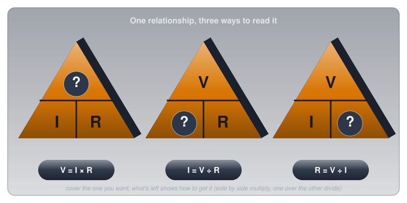
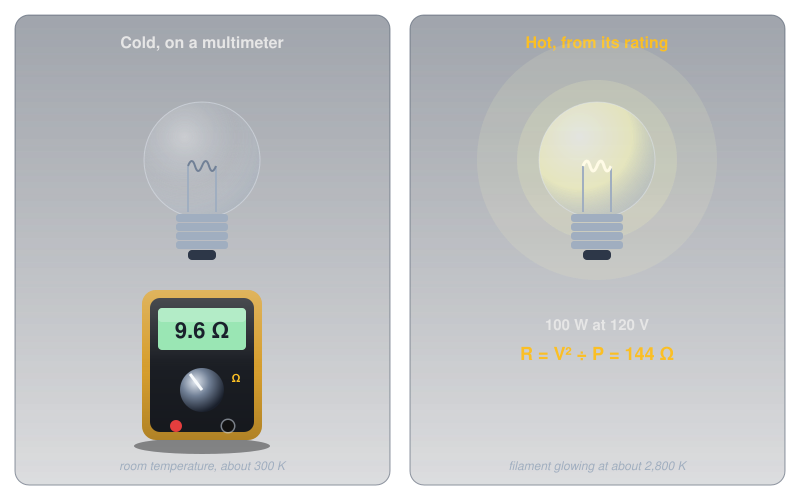
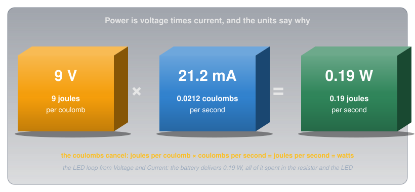
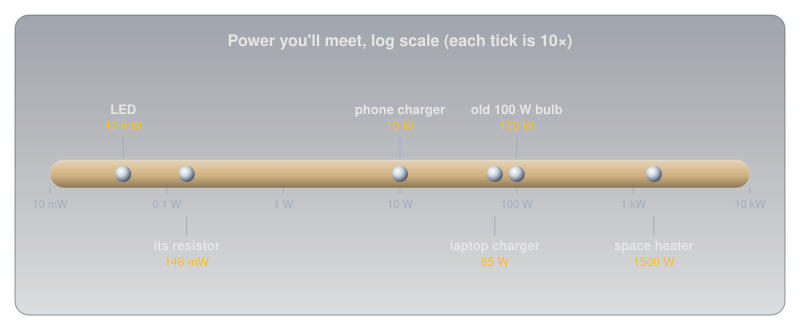
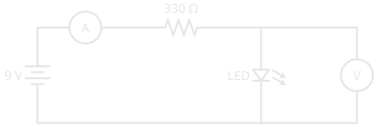

# Ohm's Law and Power

!!! abstract "Beginner"
    This article is in the **Circuit Foundations** topic and ties together [Voltage](voltage.md), [Current](current.md), and [Resistance and Conductance](resistance.md). It goes much deeper than the short introduction in [What Is Electricity?](what_is_electricity.md#ohms-law-how-they-connect).

A 100 W incandescent bulb is rated for 120 V. Working back from those two numbers gives the filament's resistance: 144 Ω. Yet put a multimeter across the same bulb, cold on the bench, and it reads about 10 Ω, nearly fifteen times less. The meter isn't broken and neither is the bulb.

Two ideas sort it out:

1. **Ohm's Law says current follows voltage in a straight line,** but only for parts whose resistance stays constant. A glowing filament isn't one of them, and neither is an LED (light-emitting diode).
2. **Power is voltage times current.** It's the rate at which energy is delivered, and combined with Ohm's Law it says how hot a resistor runs, why wires are sized the way they are, and why power lines run at hundreds of thousands of volts.

The bulb gets solved in the first half, and its numbers come back in the second.

---

## Idea One: Current in Proportion to Voltage

In 1827, the German physicist Georg Ohm published the result of careful experiments on wires: double the voltage across a wire and the current through it doubles; triple it and the current triples. The current is proportional to the voltage, and the constant linking them is the wire's resistance. (The English scientist Henry Cavendish had found the same relationship in 1781, but never published it; his notes only came out in 1879, edited by James Clerk Maxwell, by which time the law carried Ohm's name.)

???+ info "Definition: Ohm's Law"

    For a part with a constant resistance, the voltage across it equals the current through it times its resistance:

    \[ V = I \times R \]

    Any one of the three can be found from the other two.

Older textbooks and the Canadian amateur radio exam write voltage as **E**, for electromotive force ([Voltage](voltage.md#other-names-for-voltage)), so the same law appears there as E = I × R and R = E ÷ I.

[Resistance and Conductance](resistance.md) defined the ohm as the resistance that lets 1 V push 1 A. Ohm's Law is that definition put to work: once a part's resistance is known, it predicts the current for any voltage.

### Three Ways to Read It

The single equation answers three different questions, depending on which quantity is unknown. The triangle is a memory aid: cover the unknown, and what's left shows how to get it.

<figure markdown>
  { width="720" }
  <figcaption>Side by side means multiply; one over the other means divide.</figcaption>
</figure>

The LED loop from [Voltage](voltage.md) and [Current](current.md) shows all three at work. That loop has a 9 V battery, a 330 Ω resistor, and a red LED that takes about 2 V:

- **Find the current** (I = V ÷ R). The resistor has 9 − 2 = 7 V across it, so the current is 7 V ÷ 330 Ω = 21.2 mA. That's the current every meter in [Current](current.md) read, now predicted instead of measured.
- **Find the voltage** (V = I × R). To run the same resistor at 15 mA instead, it needs 0.015 A × 330 Ω ≈ 5 V across it.
- **Find the resistance** (R = V ÷ I). To run that LED at 20 mA from a 5 V supply, the resistor gets the 3 V the LED doesn't take, so it needs 3 V ÷ 0.020 A = 150 Ω. Forgetting the LED's own 2 V, and dividing the full 5 V instead, gives 250 Ω and a dimmer LED than planned.

### Where Ohm's Law Stops

Ohm's experiments were on metal wires at a steady temperature, and that's where the straight line holds. A part that obeys it is called **ohmic**. Plot the current through it against the voltage across it and the result is a straight line through zero; its slope is the conductance from [Resistance and Conductance](resistance.md).

Plenty of parts don't draw a straight line, and two of the most common ones bend it in opposite ways.

<figure markdown>
  { width="720" }
  <figcaption>Only the resistor is a straight line. The lamp and LED curves show their typical shapes.</figcaption>
</figure>

- **A lamp's curve bends over.** More voltage drives more current, which heats the filament, which raises its resistance (the temperature lever from [Resistance and Conductance](resistance.md)). Each extra volt buys less extra current than the one before.
- **An LED's curve is a wall.** Below about 1.8 V almost nothing flows. Just above it, a tiny increase in voltage lets the current shoot up, far past what the LED can survive. That's why an LED always needs a resistor in series: the resistor's straight line turns the LED's wall into a slope that can be controlled. [Diodes and LEDs](diodes_and_leds.md) explains where the wall comes from and how to size the resistor, and [Digital Pins](digital_io.md) puts it to work.

V = I × R still applies to a non-ohmic part at any single moment: divide the voltage by the current and you get its resistance *right then*. What fails is the assumption that the number stays put when the voltage changes.

### The Bulb, Solved

That's exactly what happens to the bulb. A tungsten filament glows at about 2,800 K. Measurements compiled by Desai and colleagues show tungsten's resistivity rising from 5.65 μΩ·cm at room temperature to 84.70 μΩ·cm at 2,800 K, fifteen times higher. The rating describes the hot filament; the multimeter measures the cold one.

<figure markdown>
  { width="720" }
  <figcaption>Same filament, two temperatures, fifteen times the resistance.</figcaption>
</figure>

\[ R_{\text{cold}} \approx \frac{144\ \Omega}{15} \approx 9.6\ \Omega \]

That's the opening puzzle solved, and it has a consequence anyone who's replaced bulbs has noticed: they tend to fail at the moment they're switched on. For a split second, the cold filament's 9.6 Ω lets 120 V push about 12.5 A, fifteen times the 0.83 A it draws once it's glowing. That surge is called **inrush current**, and it's the harshest moment of a bulb's life.

---

## Idea Two: Power

Ohm's Law says how much current flows. The next question is what that current does, and how fast.

[Voltage](voltage.md) defined a volt as a joule of energy per coulomb, and [Current](current.md) defined an amp as a coulomb per second. Multiply them and the coulombs cancel, leaving joules per second: the rate at which energy is delivered. That rate is **power**.

???+ info "Definition: Watt"

    **Power** is the rate at which energy is delivered or converted. One **watt** (W) is one joule per second. For any part:

    \[ P = V \times I \]

<figure markdown>
  { width="740" }
  <figcaption>Joules per coulomb times coulombs per second: the coulombs cancel and leave joules per second.</figcaption>
</figure>

In the LED loop, the battery delivers 9 V × 21.2 mA ≈ 0.19 W, and the two components split it exactly in line with the energy-per-coulomb picture from [Voltage](voltage.md):

- **The resistor:** 7 V × 21.2 mA ≈ 148 mW, all of it as heat.
- **The LED:** 2 V × 21.2 mA ≈ 42 mW, partly as light.

148 + 42 = 190 mW: every bit of power the battery delivers is accounted for.

### Two More Forms

Substituting Ohm's Law into P = V × I gives two more versions, each handy when one of the quantities isn't known:

\[ P = I^2 \times R \qquad\qquad P = \frac{V^2}{R} \]

- **Use P = I²R when you know the current.** The extension cord from [Resistance and Conductance](resistance.md#the-extension-cord-solved) carried 12.5 A through 0.77 Ω: 12.5² × 0.77 ≈ 120 W of heat in the cord.
- **Use P = V²/R when you know the voltage.** It's how the bulb's 144 Ω came from its rating: 120² ÷ 100.

The squares are where the surprises are. Double the voltage across a resistor and the current doubles too, so the power goes up *four* times.

### Why Power Lines Run at Such High Voltages

The I² in P = I²R explains one of the biggest design decisions in the electrical grid. A transmission line has resistance, so it wastes I²R as heat along its length. The power it delivers is V × I, so the same power can be sent as a large current at a low voltage, or a small current at a high voltage.

Take a line with 10 Ω of resistance delivering 1,000,000 W (1 MW):

| Line voltage | Current needed (I = P ÷ V) | Heat lost in the line (I²R) | Share lost |
|---|---|---|---|
| 10,000 V | 100 A | 100,000 W | 10% |
| 100,000 V | 10 A | 1,000 W | 0.1% |

Ten times the voltage means a tenth of the current, and a hundredth of the loss. That's why Hydro-Québec's lines from the northern dams to Montréal run at 735,000 V ([Voltage](voltage.md#from-fractions-of-a-volt-to-lightning) has that number on its scale): at that voltage the current is low enough that hundreds of kilometres of wire waste only a small share of the power.

### Power Ratings

Power is also the number that decides whether a part survives. Every resistor has a **power rating**, the most heat it can shed continuously without damage. The common through-hole resistors on this site are rated at ¼ W.

<figure markdown>
  { width="720" }
  <figcaption>Same part, three jobs. The rating gauge is what decides whether it's comfortable.</figcaption>
</figure>

A common rule of thumb is to keep a resistor at or below about half its rating. Near 100% it runs hot enough to burn a fingertip and drifts from its marked value; past 100% it scorches and eventually fails. The 330 Ω resistor in the 9 V LED loop sits at 59%, a little over that line, so a ½ W part would be the more comfortable choice there.

### Energy: Power Over Time

Power is a rate, so running something for a while adds up to an amount of energy. Electricity bills count it in **kilowatt-hours** (kWh): a kilowatt for an hour, which is 3.6 million joules.

- The 1,500 W space heater running for 2 hours uses 1.5 kW × 2 h = **3 kWh**.
- The whole Energizer AA cell from [Voltage](voltage.md#voltage-is-not-energy-stored), about 11,000 J, is roughly **0.003 kWh**: the heater burns through that much energy in about 7 seconds.

---

## Power You'll Meet

Real devices span a huge range of power, from the milliwatts of a single LED to the kilowatts of anything that makes heat.

<figure markdown>
  { width="740" }
  <figcaption>Each tick is ten times the one before. Anything whose job is heat sits at the top.</figcaption>
</figure>

---

## Measuring Power

A multimeter has no power setting, because power isn't a single reading: it's a voltage and a current multiplied together. To find the power in a part, measure both and multiply.

<figure markdown>
  { width="460" }
  <figcaption>The ammeter in series reads the current through everything; the voltmeter across the LED reads the voltage on the LED alone.</figcaption>
</figure>

In this circuit the ammeter reads about 21.2 mA and the voltmeter across the LED about 2.0 V, so the LED is taking about 42 mW. Move the voltmeter across the resistor and it reads about 7.0 V, for 148 mW. Both measurements together confirm Ohm's Law in the same breath: 7.0 V ÷ 21.2 mA ≈ 330 Ω.

---

## Safety: Power Becomes Heat

Every watt a resistor or a wire dissipates turns into heat, and the squared forms of the power law mean that heat climbs fast.

!!! warning "Resistors Get Hot"
    A resistor working near its rating can burn skin. Before touching parts in a running circuit, calculate (or carefully feel near, not on) how much they're dissipating, and choose resistors with comfortable headroom. A resistor that has discoloured or smells scorched has been run past its rating and should be replaced.

The same squares make mains voltage brutal on small resistances. By P = V²/R, a 10 Ω resistor connected across a 120 V outlet would try to turn 1,440 W into heat, as much as a space heater, inside a part the size of a grain of rice.

!!! danger "Never Connect Components to Mains"
    Parts sized for a 5 V or 9 V circuit can dissipate hundreds of times their rating on a 120 V outlet, and fail violently. Every project on this site runs from batteries or USB.

---

## Practice

??? question "1. Current and Power"

    A 12 V supply is connected across a 48 Ω resistor. What current flows, and how much power does the resistor dissipate?

    ??? tip "Solution"
        \[ I = \frac{V}{R} = \frac{12\ \text{V}}{48\ \Omega} = 0.25\ \text{A} \qquad P = V \times I = 12 \times 0.25 = 3\ \text{W} \]

        3 W is far beyond a ¼ W resistor. By the half-rating rule of thumb it needs a rating of at least 6 W, so in practice a 10 W power resistor.

??? question "2. Sizing an LED Resistor"

    A red LED (about 2 V) should run at 15 mA from a 5 V supply. What resistor does it need, which E12 value would you choose, and is a ¼ W resistor enough?

    ??? tip "Solution"
        The resistor takes 5 − 2 = 3 V, so \( R = 3 / 0.015 = 200\ \Omega \). The nearest E12 values are 180 Ω and 220 Ω; choosing 220 Ω keeps the current a little under target, at \( 3 / 220 \approx 13.6\ \text{mA} \). The resistor dissipates \( 3^2 / 220 \approx 41\ \text{mW} \), about 16% of ¼ W: plenty of headroom.

??? question "3. A Smaller Bulb"

    A 60 W bulb is rated for 120 V. What's its hot resistance? Using the same 15× ratio for tungsten, roughly what will a multimeter read cold, and what's the inrush current?

    ??? tip "Solution"
        Hot: \( R = V^2 / P = 120^2 / 60 = 240\ \Omega \). Cold: about 240 ÷ 15 ≈ 16 Ω. Inrush: 120 V ÷ 16 Ω ≈ 7.5 A, compared with 0.5 A once it's glowing.

??? question "4. Double the Voltage"

    A resistor dissipates 50 mW at 3 V. What does it dissipate at 6 V?

    ??? tip "Solution"
        Power goes with the square of the voltage (\( P = V^2 / R \)), so doubling the voltage multiplies the power by four: **200 mW**. A ¼ W resistor that was cruising at 20% of its rating is now at 80%.

??? question "5. Why Not Low Voltage?"

    Using P = I²R, explain why a utility would rather send power over a long line at 100,000 V than at 1,000 V.

    ??? tip "Solution"
        For the same delivered power (V × I), a hundred times the voltage needs a hundredth of the current. The line's heat loss is \( I^2 R \), so a hundredth of the current means a ten-thousandth of the loss. At low voltage, most of the power would heat the wires instead of reaching the customer.

---

## Quick Recap

-   **Ohm's Law**

    ---

    V = I × R. For an ohmic part, current is proportional to voltage: a straight line.

-   **Not everything is ohmic**

    ---

    A lamp's resistance climbs as it heats; an LED is a wall. V ÷ I gives the resistance only at that moment.

-   **Power**

    ---

    P = V × I: joules per coulomb times coulombs per second. Measured in watts.

-   **The squared forms**

    ---

    P = I²R and P = V²/R. Double the voltage across a resistor and its power quadruples.

-   **Ratings**

    ---

    Keep resistors at or below about half their power rating. Size wire for the current.

-   **Energy**

    ---

    Power × time. A kWh is 3.6 million joules; a whole AA cell is about 0.003 kWh.

---

## What's Next

With Ohm's Law and power in hand, **[Open Circuits, Short Circuits, and Fuses](open_short_fuses.md)** looks at what happens when a circuit goes wrong, and how a fuse stops a fault from becoming a fire.

---

## Further Reading

**Reference Data**

- [Resistivity of Tungsten — The Physics Factbook](https://hypertextbook.com/facts/2004/DeannaStewart.shtml) — the room-temperature and glowing-hot resistivity values behind the bulb puzzle
- [Incandescent Light Bulb — Wikipedia](https://en.wikipedia.org/wiki/Incandescent_light_bulb) — filament temperatures, and why tungsten

**Deep Dives**

- [Ohm's Law — Wikipedia](https://en.wikipedia.org/wiki/Ohm%27s_law) — Ohm's 1827 experiments, and the materials where the law breaks down
- [Electric Power — Wikipedia](https://en.wikipedia.org/wiki/Electric_power) — power, energy, and the kilowatt-hour
- [Electric Power Transmission — Wikipedia](https://en.wikipedia.org/wiki/Electric_power_transmission) — why grids step voltages up for long distances

**Related Articles**

- [Voltage](voltage.md) — joules per coulomb, and the 735 kV line
- [Current](current.md) — coulombs per second, and measuring it
- [Resistance and Conductance](resistance.md) — what sets a resistance in the first place
- [Series and Parallel Circuits](series_and_parallel.md) — Ohm's Law across real circuits
