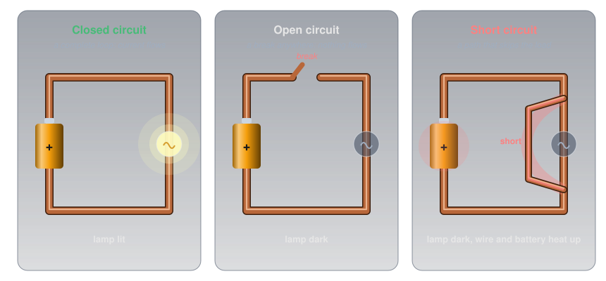
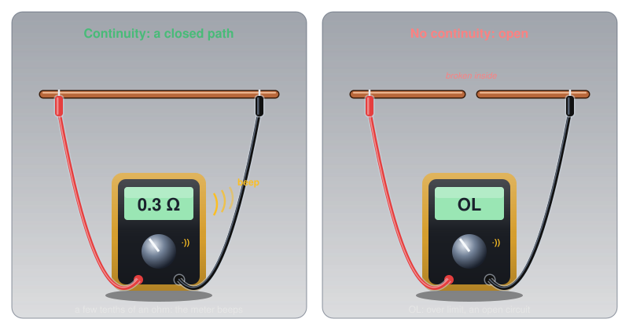
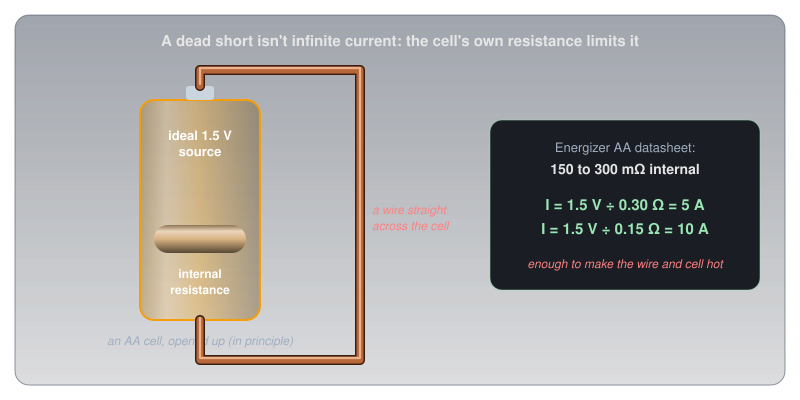
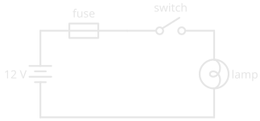
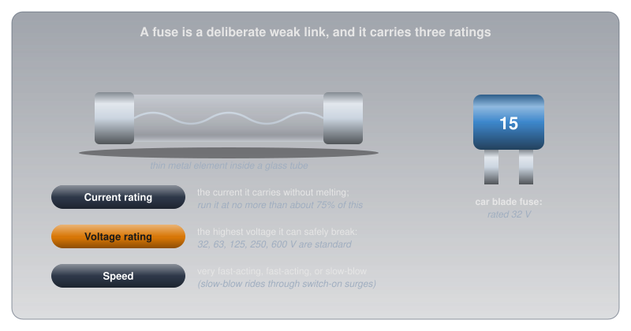
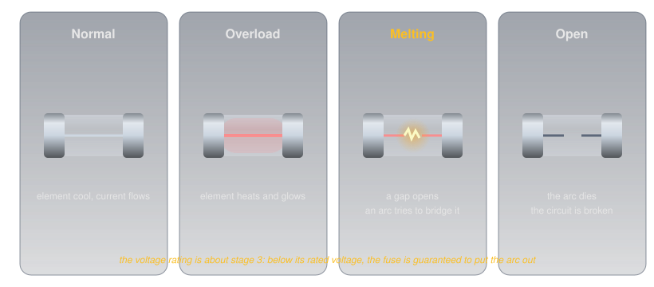

# Open Circuits, Short Circuits, and Fuses

!!! abstract "Beginner"
    This article is in the **Circuit Foundations** topic and puts [Ohm's Law and Power](ohms_law.md) to work on what happens when a circuit goes wrong. No other prior knowledge required.

Two small glass fuses sit side by side. They're the same size, both rated for 2 A, and to the eye they're identical: a thin wire inside a glass tube. But one is stamped 32 V and the other 250 V, and swapping one for the other is a real safety mistake. A strip of wire that melts when the current is too high shouldn't care about voltage at all.

Two ideas explain why it does:

1. **Current needs a complete loop.** Break the loop anywhere and nothing flows: an **open circuit**. A circuit with an unbroken path has **continuity**.
2. **A short circuit is a path that skips the load,** and only the circuit's own small resistances limit the current through it. A **fuse** is a deliberate weak link that opens the loop before that current can burn the wiring, and opening the loop safely is where voltage comes in.

The two fuses get explained in the second half, once it's clear what a fuse actually has to do.

---

## Idea One: A Circuit Must Be a Complete Loop

[Current](current.md) showed that charge isn't used up: every coulomb that leaves the battery has to come back. That only works if there's a complete path, out from one terminal, through the load, and back to the other. That path is a **closed circuit**.

Break it anywhere and the current stops everywhere at once, because a loop with a gap in it isn't a loop. That's an **open circuit**. Sometimes the break is deliberate (a switch is a device for opening a circuit on purpose); sometimes it's a fault, like a wire broken inside its insulation or a corroded battery contact.

<figure markdown>
  { width="760" }
  <figcaption>Closed, open, and short. Only the first one does what was intended.</figcaption>
</figure>

### Continuity: Testing for a Complete Path

A path with no breaks in it has **continuity**. Checking for it is one of the most useful things a multimeter does: is this wire intact, is this switch actually closing, is this fuse blown?

On its continuity setting (marked with a sound-wave symbol), a multimeter sends a small current through whatever its probes touch and beeps if the resistance is very low. A good wire reads a fraction of an ohm and beeps. A broken one reads **OL** ("over limit"): the resistance is too high to measure, which is the meter's way of saying open circuit.

<figure markdown>
  { width="720" }
  <figcaption>A beep means a closed path. OL means the path is broken somewhere.</figcaption>
</figure>

Like a resistance measurement ([Resistance and Conductance](resistance.md#measuring-resistance)), a continuity test only works on unpowered circuits.

- ✅ **Safe (non-destructive):** testing wires, switches, and fuses for continuity with the power off. A fuse that reads OL is blown.
- ⚠️ **Caution (can damage the meter):** testing continuity on a powered circuit. The meter's resistance input isn't built for an outside voltage. Disconnect power first.

---

## Idea Two: Short Circuits, and the Fuses That Stop Them

An open circuit is a failure of too little current. The opposite failure, far more dangerous, is too much.

### What a Short Circuit Really Is

A **short circuit** is an unintended path with very low resistance between two points that shouldn't be connected, typically straight from one side of the supply to the other, skipping the load. It's a parallel path, and as [Resistance and Conductance](resistance.md#idea-two-conductance-the-same-property-flipped) showed, side-by-side conductances add. A short's conductance is so large that it takes nearly all the current, and the lamp it bypasses goes dark.

Ohm's Law says the current through it is the voltage divided by the resistance, and a short's own resistance is close to zero. What limits the current isn't the short; it's everything else in the loop: the wires, and above all the source's own **internal resistance**. Every real battery behaves like a perfect voltage source with a small resistor hidden inside it.

<figure markdown>
  { width="720" }
  <figcaption>Short a fresh AA cell and its own 0.15 to 0.30 Ω is nearly all that limits the current.</figcaption>
</figure>

Energizer's datasheet gives a fresh AA cell 150 to 300 mΩ of internal resistance. Short it with a wire and the current is roughly 1.5 V ÷ 0.3 Ω = 5 A to 1.5 V ÷ 0.15 Ω = 10 A: hundreds of times what a typical circuit draws, enough to make the wire and the cell hot within seconds. Batteries with lower internal resistance deliver far more. A car battery can push hundreds of amps through a dropped wrench ([Voltage](voltage.md#safety-voltage-pushes-current-hurts)), and a shorted lithium cell can start a fire (a practice problem in [What Is Electricity?](what_is_electricity.md) works through why).

### The Fuse: A Planned Weak Link

The answer to a short is to make sure the circuit opens itself before the wiring overheats. A **fuse** is a short strip of metal designed to be the weakest part of the circuit: enough current heats it to melting, the strip breaks, and the circuit becomes an open circuit on purpose.

Fuses go as close to the source as possible, so that everything downstream is protected. In a schematic, a fuse is drawn as a small rectangle (or a wavy line) in series with the circuit.

<figure markdown>
  { width="420" }
  <figcaption>The fuse sits first in line, right at the battery, so every wire after it is protected.</figcaption>
</figure>

<figure markdown>
  { width="720" }
  <figcaption>Every fuse carries three ratings, and each one answers a different question.</figcaption>
</figure>

Every fuse has three ratings:

- **Current rating:** the current it's designed to carry continuously without melting. Littelfuse's design guide recommends running a fuse at no more than about 75% of its rating, so a 10 A fuse shouldn't normally carry more than 7.5 A. Ratings are set at 25 °C; in a hot enclosure, a fuse melts sooner.
- **Voltage rating:** the subject of the opening puzzle, below.
- **Speed:** how fast it reacts to an overload. Fuses come as **very fast-acting**, **fast-acting**, and **slow-blow** (time-lag). A slow-blow fuse has extra thermal mass so it can ride through a brief start-up surge, like the inrush current of a cold filament from [Ohm's Law and Power](ohms_law.md#the-bulb-solved), while still blowing on a sustained fault.

### The Voltage Rating, Solved

When a fuse element melts, the circuit doesn't open instantly. As the gap first appears, the voltage across it can be high enough to keep current jumping across as an **arc**: a spark that ionizes the air or metal vapour into a conductor, exactly the breakdown described in [Conductors, Insulators, and Semiconductors](conductors_and_insulators.md#insulators-every-electron-spoken-for).

<figure markdown>
  { width="760" }
  <figcaption>The arc in the third stage is what the voltage rating is about.</figcaption>
</figure>

The higher the circuit's voltage, the harder the arc is to put out. A fuse's **voltage rating** is the highest circuit voltage at which it's guaranteed to extinguish that arc and safely interrupt its rated short-circuit current. The standard ratings for small fuses are 32, 63, 125, 250, and 600 V.

That's the opening puzzle solved. The two fuses carry current identically; the difference only appears in the moment they blow. The 32 V fuse is built for a car's 12 V system and may not reliably break a 120 V mains fault: the arc could keep burning inside it. A 250 V fuse can stand in for a 32 V one of the same current, speed, and size, but never the other way round.

### Fuses and Circuit Breakers

A **circuit breaker** does the same job as a fuse but resets instead of melting: an overload trips a switch, which can be closed again once the fault is fixed. Household circuits use breakers, typically rated at 15 or 20 A. Both protect the *wiring* from overheating; neither trips fast enough, or at a low enough current, to protect a person touching a live wire. [What Is Electricity?](what_is_electricity.md#safety-where-the-numbers-matter) explains why.

---

## Safety: Respect the Fuse

A blown fuse is the circuit telling you something went wrong. Treat it as a symptom, not the problem.

!!! warning "Never Up-Rate or Bypass a Fuse"
    Replace a blown fuse only with the same current rating, the same or higher voltage rating, and the same speed. A fuse with a higher current rating lets a fault draw enough current to overheat the wiring and start a fire before it blows. A strip of foil or wire in place of a fuse removes the protection entirely. If a new fuse blows straight away, there's a short circuit to find before anything else.

Fuses inside mains-powered equipment add a second hazard: the equipment can still hold dangerous voltages, and capacitors inside can stay charged after it's unplugged.

!!! danger "Unplug Before Replacing a Mains Fuse"
    Disconnect mains-powered equipment from the outlet before opening it to replace a fuse, and leave the inside of anything that runs on mains to someone trained for it. Every project on this site runs from batteries or USB.

---

## Practice

??? question "1. The Fuse That Blows at Switch-On"

    A radio is connected to a power supply. The moment the supply is switched on, its fuse blows. What kind of fault does that point to?

    ??? tip "Solution"
        A **short circuit**. A fuse that blows immediately is seeing a very large current, which means a very low-resistance path somewhere across the supply: a pinched lead, reversed or crossed wires, or a failed part inside the radio. Find it before fitting another fuse.

??? question "2. Why Not a Bigger Fuse?"

    A circuit specifies a 5 A fuse. Why is fitting a 10 A fuse dangerous?

    ??? tip "Solution"
        The fuse is chosen to blow before the wiring overheats. With a 10 A fuse, a fault can draw up to 10 A, far more than the circuit was designed for, without the fuse opening. The wiring or a component can overheat and start a fire before the fuse protects anything.

??? question "3. Why a Voltage Rating?"

    Why does a fuse carry a voltage rating at all?

    ??? tip "Solution"
        When the element melts, an arc can form across the gap. The voltage rating is the highest circuit voltage at which the fuse is guaranteed to put that arc out and break the circuit safely. Above it, the arc may keep conducting.

??? question "4. Comfortable Current"

    A 3 A fuse protects a project in a room-temperature enclosure. Using Littelfuse's 75% guideline, what's the most current the project should normally draw?

    ??? tip "Solution"
        \( 3\ \text{A} \times 0.75 = 2.25\ \text{A} \). If the project normally draws more than that, it needs a larger fuse (and wiring rated to match), not a fuse that's being run close to its limit.

??? question "5. Continuity"

    A multimeter on its continuity setting reads OL across a fuse. What does that mean?

    ??? tip "Solution"
        OL means the resistance is too high to measure: there's no continuity, so the fuse is an **open circuit**. It's blown.

??? question "6. Internal Resistance"

    A small battery is 9 V with an internal resistance of 1.5 Ω. Roughly how much current flows if its terminals are shorted?

    ??? tip "Solution"
        Only the internal resistance limits it: \( I = 9 / 1.5 = 6\ \text{A} \). That's far more than the battery is designed to deliver, which is why shorted batteries get hot.

---

## Quick Recap

-   **Closed and open**

    ---

    Current needs a complete loop. A break anywhere stops it everywhere.

-   **Continuity**

    ---

    An unbroken path. The meter beeps on a good path and reads OL on an open one.

-   **Short circuit**

    ---

    A low-resistance path that skips the load. Only the wires and the source's internal resistance limit it.

-   **Fuse current rating**

    ---

    Carry no more than about 75% of it. Never fit a higher rating.

-   **Fuse voltage rating**

    ---

    The highest voltage at which the fuse can safely put out the arc. Equal or higher is fine; lower is not.

-   **Fuse speed**

    ---

    Fast-acting for sensitive parts; slow-blow to ride through switch-on surges.

---

## What's Next

Every circuit so far has run on steady current from a battery. **[AC vs DC](ac_dc.md)** covers the other kind: the current that reverses sixty times a second in every wall outlet.

---

## Further Reading

**Manufacturer Guides and Datasheets**

- [Fuseology Design Guide — Littelfuse](https://info.littelfuse.com/hubfs/Fuseology%20Design%20Guide.pdf) — current and voltage ratings, derating, speed classes, and how fuses open
- [Energizer E91 AA Datasheet](https://data.energizer.com/pdfs/e91.pdf) — the 150 to 300 mΩ internal resistance used in this article

**Deep Dives**

- [Fuse (Electrical) — Wikipedia](https://en.wikipedia.org/wiki/Fuse_(electrical)) — history, construction, and ratings
- [Short Circuit — Wikipedia](https://en.wikipedia.org/wiki/Short_circuit) — what happens in a short, from batteries to power grids

**Related Articles**

- [Ohm's Law and Power](ohms_law.md) — the law that sets a short's current, and the inrush that slow-blow fuses tolerate
- [Resistance and Conductance](resistance.md) — why a low-resistance path takes nearly all the current
- [Current](current.md) — why current needs a complete loop
