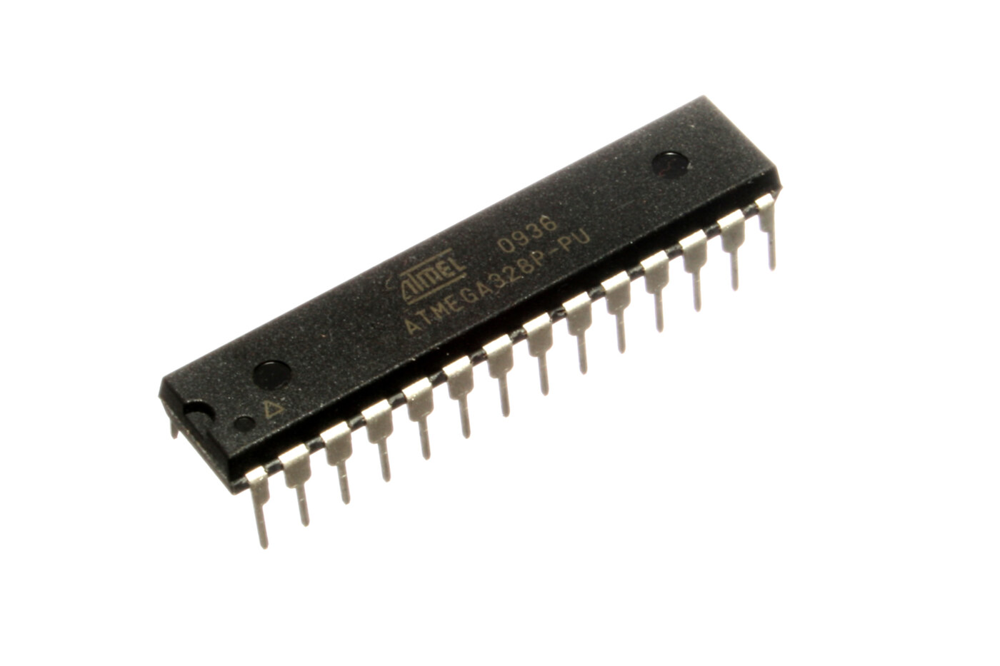
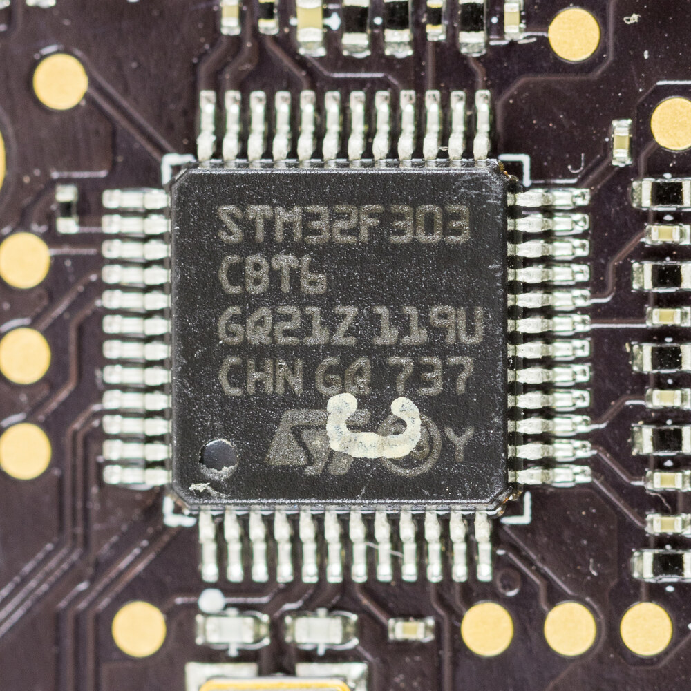
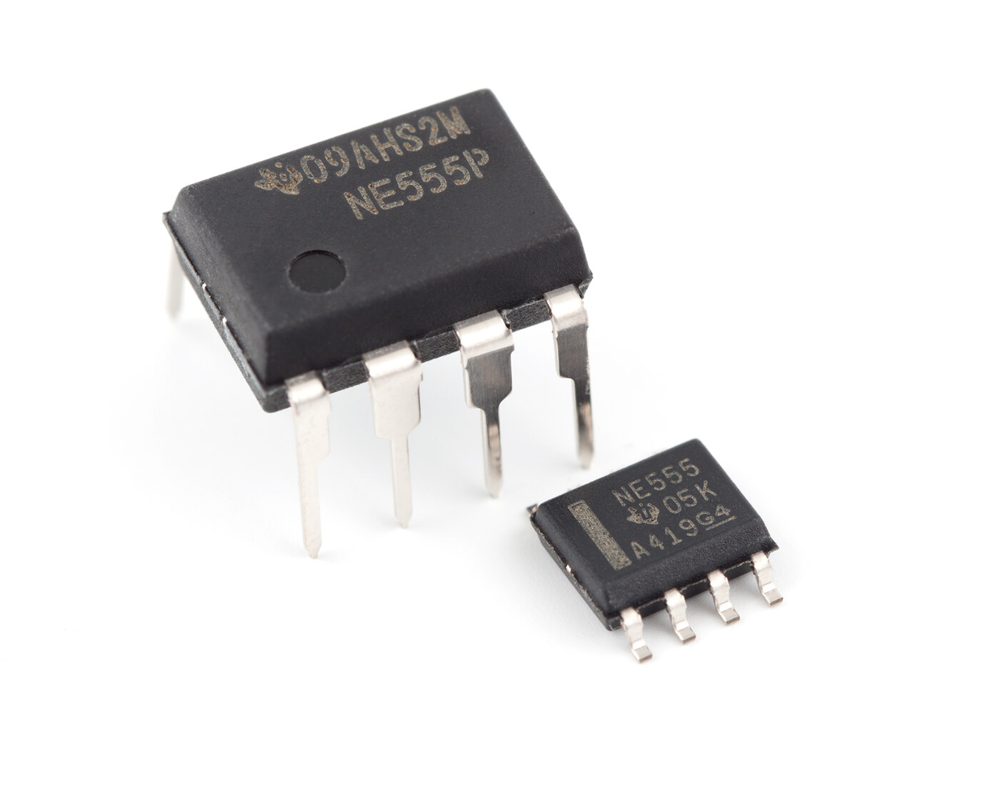
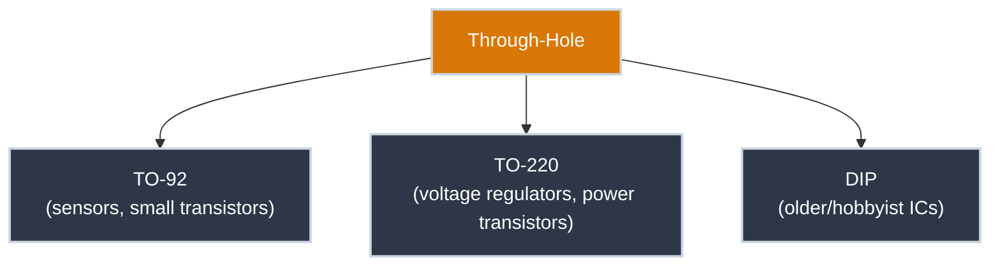
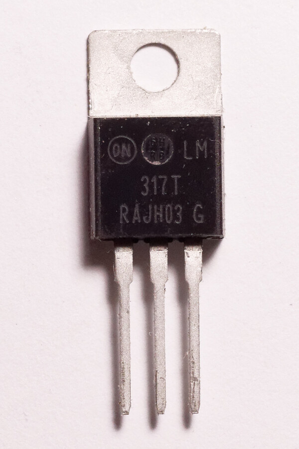
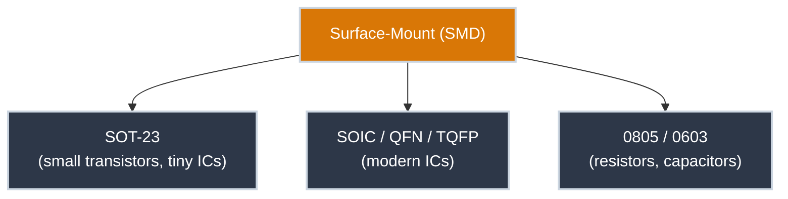
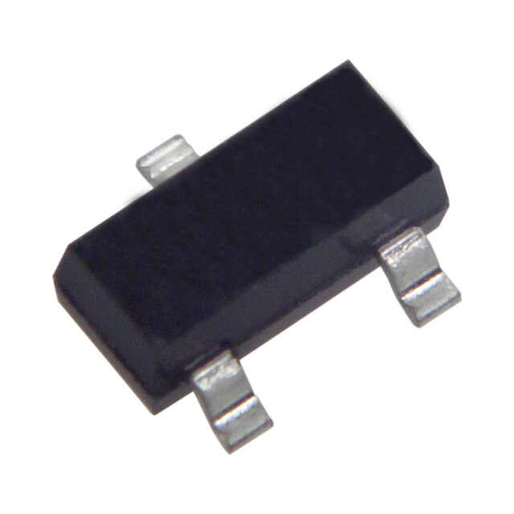
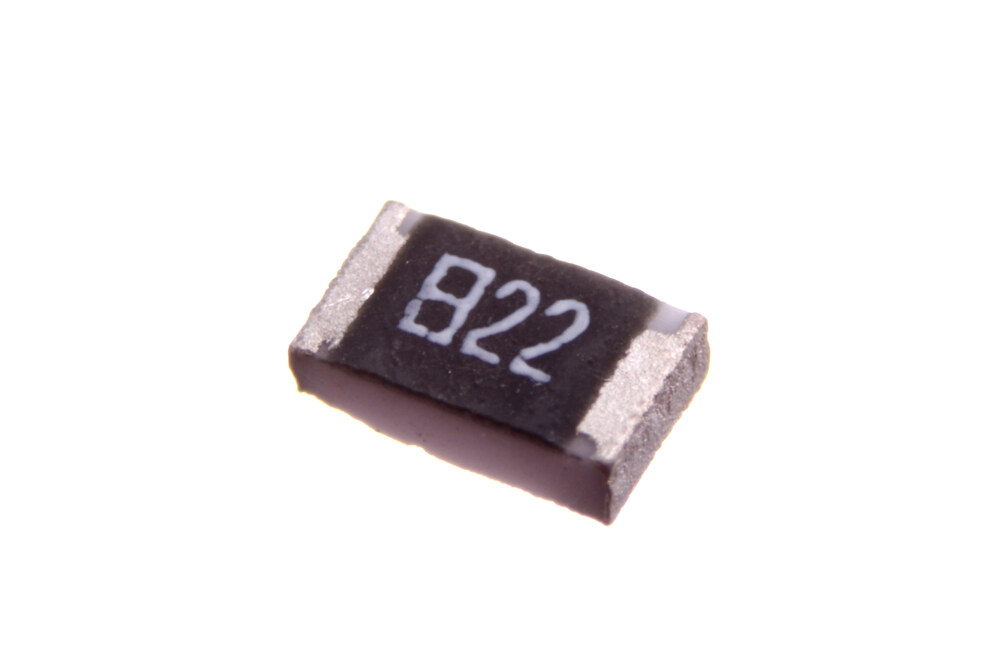

# Package Types

!!! abstract "Beginner"
    This article is in the **Components** topic. It generalizes something you've already seen twice: the `MCP9700A`'s TO-92 shape from [Temperature Sensors](temperature_sensors.md) and the resistor bodies from [Resistor Color Codes](resistor_color_codes.md).

A resistor and a temperature sensor do completely different jobs, but pull one of each out of a parts bin and you'll notice something odd: an LED, a transistor, and that temperature sensor all come in roughly the same black, three-legged shape. That's not a coincidence. What a component *does* and what it *looks like* are two separate design decisions, and the second one — its **package** — is standardized across thousands of unrelated parts.

By the end of this article you'll recognize the handful of package families that cover almost everything you'll encounter, and understand the one distinction that matters most for a beginner's bench: whether a part plugs into a breadboard at all.

<figure markdown>
  { width="480" }
  <figcaption>The <code>ATmega328P</code> — the microcontroller chip at the heart of every Arduino Uno used on this site — in a DIP package: a black rectangular body with two rows of legs. Photo: <a href="https://commons.wikimedia.org/wiki/File:ATMEGA328P-PU.jpg">oomlout</a>, <a href="https://creativecommons.org/licenses/by-sa/2.0/">CC BY-SA 2.0</a>.</figcaption>
</figure>

<figure markdown>
  { width="480" }
  <figcaption>An <code>STM32F303</code> — a different microcontroller, same job as the ATmega328P, in an LQFP package instead. You'll basically never see a chip like this loose in a parts bin the way you can with the ATmega328P above — SMD parts this small are handled by machine and photographed where they live: soldered down. Photo: <a href="https://commons.wikimedia.org/wiki/File:STMicroelectronics_STM32F303-4570.jpg">Raimond Spekking</a>, <a href="https://creativecommons.org/licenses/by-sa/4.0/">CC BY-SA 4.0</a>.</figcaption>
</figure>

Same job, two completely different packages. Neither photo shows you what the part *does* — they show you how it's built and how you're expected to connect to it, which is exactly what a package tells you.

---

## Two Families

Every package falls into one of two families, and the difference is entirely about how the part physically attaches to a board.

**Through-hole** parts have long metal legs meant to pass all the way through holes in a circuit board (or a breadboard's holes) and get soldered on the other side — or, on a breadboard, just held in place by the board's internal spring clips. Every part used hands-on anywhere on this site so far has been through-hole, for exactly one reason: it's the only family a breadboard can hold.

**Surface-mount** (SMD) parts have short metal legs, or no legs at all — just flat metal pads — meant to sit *on top of* a board and get soldered directly to pads printed on its surface. They're smaller, cheaper to produce in volume, and what almost all modern commercial electronics actually use. They are also, deliberately, absent from every project on this site: a breadboard has nothing for a flat pad to grip.

The `ATmega328P` pictured at the top of this article happens to be DIP — but "microcontroller" isn't a package any more than "temperature sensor" is. That same chip, running the exact same code, also ships in a surface-mount package: it's what's inside an Arduino Nano, in a much smaller TQFP footprint. Package and function are independent choices, and nothing proves that faster than one chip sold in both families at once:

<figure markdown>
  { width="600" }
  <figcaption>The same <code>NE555</code> timer chip, sold in both families — DIP (through-hole, left) and SOIC (surface-mount, right). Same silicon, same function, two completely different packages. Photo: <a href="https://commons.wikimedia.org/wiki/File:NE555_DIP_%26_SOIC.jpg">Swift.Hg</a>, <a href="https://creativecommons.org/licenses/by-sa/3.0/">CC BY-SA 3.0</a>.</figcaption>
</figure>

---

## Through-Hole: What You Start Exploring With

-   :material-shape-outline: **TO-92**

    ---

    A small black or clear half-cylinder with a flat face and three legs in a single row.

    **Common uses:** small transistors, and simple analog ICs like the `MCP9700A` temperature sensor.

    **Seen on this site:** [Temperature Sensors](temperature_sensors.md).

-   :material-shape-outline: **TO-220**

    ---

    A larger plastic body with a metal tab (for bolting to a heatsink) and three thick legs.

    **Common uses:** voltage regulators, power transistors — anything handling enough current to generate real heat.

    **Not yet used on this site**, but you'll recognize it the moment you meet a voltage regulator.

-   :material-shape-outline: **DIP** (Dual In-line Package)

    ---

    A black rectangular body with two parallel rows of legs bent at right angles, one row per side.

    **Common uses:** the classic hobbyist IC shape — logic chips, op-amps, and (on the Arduino Uno) the `ATmega328P` microcontroller itself.

    **Seen on this site:** every Arduino photo — the Uno's main chip is DIP.

<figure markdown>
  { width="360" }
  <figcaption>An <code>LM317</code> voltage regulator in TO-220 — the tab at the top is bare metal, meant to bolt directly to a heatsink. Photo: <a href="https://commons.wikimedia.org/wiki/File:LM317_(OnSemi)_01.jpg">Retired electrician</a>, public domain (CC0).</figcaption>
</figure>

---

## Surface-Mount: What's Inside Nearly Everything Else

-   :material-chip: **SOT-23**

    ---

    Tiny — a few millimetres — with 3 to 6 short legs splayed out from a small rectangular body.

    **Common uses:** the SMD equivalent of TO-92: small transistors, tiny regulators.

-   :material-chip: **SOIC / QFN / TQFP**

    ---

    A family of IC packages ranging from a small rectangle with legs down both long sides (SOIC) to a flat square with legs on all four edges (TQFP) or no visible legs at all (QFN).

    **Common uses:** almost every IC in a modern phone, laptop, or commercial product.

    **Seen on this site:** the SOIC half of the [NE555 photo above](#two-families).

-   :material-chip: **0805 / 0603 chip components**

    ---

    No legs — just a tiny rectangular block with two metal end-caps. The numbers are the size in hundredths of an inch (0805 = 0.08″ × 0.05″).

    **Common uses:** resistors and capacitors on virtually every modern circuit board — the SMD version of the resistor you've been reading color bands on.

<figure markdown>
  { width="320" }
  <figcaption>A SOT-23 transistor — the whole body is a few millimetres long. Photo: <a href="https://commons.wikimedia.org/wiki/File:SOT23.jpg">Leapfrog</a>, public domain.</figcaption>
</figure>

<figure markdown>
  { width="380" }
  <figcaption>An 0805 SMD resistor — no leads at all, just two solder end-caps. The printed <code>822</code> is its value code, the SMD equivalent of the color bands from [Resistor Color Codes](resistor_color_codes.md). Photo: <a href="https://commons.wikimedia.org/wiki/File:8.2_kiloohm_SMD_0805_resistor.jpg">oomlout</a>, <a href="https://creativecommons.org/licenses/by-sa/2.0/">CC BY-SA 2.0</a>.</figcaption>
</figure>

!!! info "ESD: a real concern once you're handling bare ICs"
    Static electricity from your own body can silently destroy the internals of an integrated circuit — through-hole or surface-mount — before you ever power it on. It's a low-probability event on a casual breadboard project, but if you start handling bare ICs regularly, an anti-static wrist strap or mat is cheap insurance, and always store spare chips in anti-static foam or their original packaging, not a loose parts bin.

---

## Why Package Choice Isn't Random

A manufacturer doesn't pick a package on a whim — it's a trade-off between size, heat handling, and how the part gets assembled:

- **Smaller is usually better for SMD** — less board space, lower cost at volume, and it's what automated pick-and-place assembly machines are built around.
- **Through-hole survives more mechanical stress** — a leg soldered through a board is harder to rip off than a pad soldered to its surface, which is part of why connectors and larger components often stay through-hole even in otherwise all-SMD designs.
- **Heat dictates the biggest packages** — TO-220's metal tab and QFN's exposed thermal pad both exist to move heat out of the part faster than tiny legs ever could.

The one trade-off that matters most for where you are right now: **through-hole is what a breadboard can hold, full stop.** That's the real reason every part on this site so far — the resistors, the LEDs, the `MCP9700A`, the Arduino's own `ATmega328P` — happens to be through-hole. It's not that SMD parts are more advanced or less "for beginners" — they're simply incompatible with the one piece of prototyping equipment this site has relied on throughout. Working with SMD means either soldering directly (a finer-tipped iron and steadier hands than through-hole demands) or using a breakout board that adapts its pads back out to breadboard-friendly pins.

---

## Reading a Package Off a Datasheet or a Parts Listing

Package is one of the first things listed for any component you'd buy — on a datasheet's cover page (visible in both the `MCP9700A`'s and the `ATmega328P`'s own datasheets), and as its own filterable column on any parts distributor's site, usually labelled "Package" or "Package/Case." If you've ever ordered a part and gotten something you couldn't plug into anything, mismatched package was almost certainly why — the electrical specs can be identical between a through-hole and an SMD version of the exact same chip.

---

## Practice

??? question "1. Identifying by description"

    A friend describes a part as "a tiny black square, no visible legs, with metal pads only on the underside." Through-hole or surface-mount, and roughly which package family?

    ??? tip "Solution"

        Surface-mount — no legs at all rules out every through-hole family. "Tiny black square with pads underneath" is a good description of a **QFN** package.

??? question "2. Breadboard compatibility"

    You want to prototype a circuit using a chip that's only sold in a SOIC package. What are your options?

    ??? tip "Solution"

        Either solder it directly onto a custom or perfboard circuit (no breadboard), or buy a **breakout board** — a small adapter PCB with the SOIC chip already soldered on and its pads broken back out to a row of breadboard-friendly through-hole pins.

??? question "3. Why not always SMD"

    If SMD is smaller and cheaper at volume, why does the `ATmega328P` on an Arduino Uno ship in the bulkier DIP package instead?

    ??? tip "Solution"

        The Uno is a hobbyist and prototyping board, and DIP is specifically what a breadboard and a socket can hold — some Uno-compatible boards even socket the chip so it can be pulled out and reused in a separate project. Arduino sells other boards using the same silicon in SMD packages for production use, where board space and cost matter more than breadboard compatibility.

---

## Quick Recap

-   **Package ≠ Function**

    ---

    What a part does and how it's physically built are separate decisions. Unrelated parts (a sensor, a transistor) can share the exact same package.

-   **Two Families**

    ---

    Through-hole (long legs, through the board) and surface-mount (flat pads, on top of the board) — the split that determines breadboard compatibility.

-   **This Site Has Been All Through-Hole**

    ---

    Every part used hands-on so far — resistors, LEDs, the `MCP9700A`, the `ATmega328P` — is through-hole, because that's the only family a breadboard can hold.

-   **Package Is a Datasheet Field**

    ---

    Listed on every datasheet cover page and every parts distributor's site — check it before ordering, since electrical specs can be identical across packages that aren't interchangeable.

---

## What's Next

Every component you meet from here on has a package worth glancing at before you buy or wire it — you now know what you're looking at and why it was chosen. [Reading an Analog Sensor](analog_input.md) puts the `MCP9700A`'s own TO-92 package to work.

---

## Further Reading

**Related Articles**

- [Temperature Sensors](temperature_sensors.md) — the `MCP9700A`'s TO-92 package, in context
- [Resistor Color Codes](resistor_color_codes.md) — the through-hole resistor body every band-reading example in this article assumes
- [What Is an Arduino?](what_is_an_arduino.md) — the `ATmega328P`'s DIP package on the board itself
