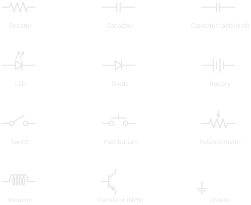
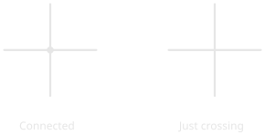
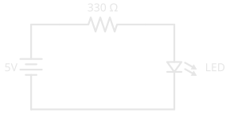

# How to Read a Schematic

!!! abstract "Beginner"
    This article builds on [What Is Electricity?](what_is_electricity.md) and [Series and Parallel Circuits](series_and_parallel.md); read those first if voltage, current, and resistance are new to you.

To a newcomer, a schematic in a datasheet or project tutorial looks like hieroglyphics: a tangle of zig-zags, lines, triangles, and arrows. It's tempting to skip it and copy the photo of someone's breadboard instead.

That photo shows where the parts happen to sit. A schematic is a **map** of the circuit. Like a subway map, it throws away the physical layout (which wire runs where, how long each leg is) and keeps only what matters: what connects to what. Once you can read it, a schematic tells you more about a circuit, faster, than any photograph, and it's the same language in every textbook, datasheet, and tutorial in the world.

This article teaches you that language: the handful of symbols you'll meet first, the one rule about wires that trips up every beginner, and how to trace current through a complete circuit.

---

## Why Schematics Exist

Picture a photograph of a finished breadboard: a dozen jumper wires crossing each other, components at odd angles, half of them hidden behind the others. Now try to answer a simple question from it: *is this resistor connected to the positive rail or the negative one?* It means squinting and tracing wires with a finger, and still possibly getting it wrong.

A schematic removes all of that. It uses a fixed symbol for each component and clean straight lines for the connections between them. The layout on the page has nothing to do with the layout on the bench: a resistor drawn on the left might sit on the right of the breadboard. What the schematic promises is only this: **if two things are joined by a line, they are electrically connected.** That single guarantee is what makes a circuit readable.

---

## The Symbols You'll Meet First

Electronics has hundreds of symbols, but you only need a dozen to read almost any beginner circuit. Here are the ones worth memorising:

<figure markdown>
  { width="640" }
  <figcaption>The dozen symbols that cover most beginner circuits. Learn to recognise these and you can read the majority of schematics you'll meet.</figcaption>
</figure>

It helps to group them by what they do.

-   :material-resistor: **Passive components**

    ---

    Shape current and voltage without needing power of their own.

    - **Resistor** (the zig-zag): limits current ([the physics](resistance.md), [reading its value](resistor_color_codes.md))
    - **Capacitor** (two parallel lines): stores charge; a curved line means it's *polarized*
    - **Potentiometer** (a resistor with an arrow pointing at it): an adjustable resistor, the part behind most volume knobs
    - **Inductor** (a coil): stores energy in a magnetic field

-   :material-power-plug: **Power & connections**

    ---

    Define where energy enters and how the circuit is switched.

    - **Battery** (alternating long and short lines): the voltage source; the **longer line is positive**
    - **Ground** (a stack of shrinking lines): the 0V reference every voltage is measured against
    - **Switch** — a line that lifts away to break the circuit
    - **Pushbutton** — a switch that only closes while you hold it down

-   :material-chip: **Semiconductors**

    ---

    Steer current in ways the passives can't.

    - **Diode** (a triangle pointing into a bar): current flows one way only, in the triangle-to-bar direction
    - **LED**: a diode that emits light, shown by the two arrows
    - **Transistor** (the symbol with three legs): an electronic switch or amplifier; just recognise it for now

!!! warning "Polarity Symbols Point Somewhere for a Reason"
    Some symbols have a built-in direction: the LED's arrows, the diode's bar, the battery's long line, the polarized capacitor's curved plate. Installing a polarized component backwards means, at best, the circuit doesn't work, and at worst the part is destroyed or, with electrolytic capacitors, vents or bursts. When a symbol shows an orientation, the real component has one too. Always match them.

### More Symbols You'll Meet

The Circuit Foundations articles add a second set: meters, an AC source, protection, and the transformer. One more is worth knowing early. Drawings made to the international IEC standard, common in Europe and in plenty of Canadian and textbook material, draw a resistor as a plain **rectangle** instead of a zig-zag. Both mean exactly the same thing.

<figure markdown>
  { width="640" }
  <figcaption>The next set. A circle with a letter is a meter; a circle with a wave is an AC source; the parallel lines between a transformer's coils mean an iron core.</figcaption>
</figure>

Each appears in a full circuit in its own article: the meters in [Voltage](voltage.md#measuring-voltage), [Current](current.md#measuring-current), and [Resistance](resistance.md#measuring-resistance); the fuse in [Open Circuits, Short Circuits, and Fuses](open_short_fuses.md); the AC source in [AC vs DC](ac_dc.md); and the transformer in [Magnetism and Electromagnetism](magnetism.md).

---

## Wires: Connected, or Just Crossing?

This is the rule that trips up every beginner.

On a busy schematic, lines have to cross each other. Two crossing lines might be joined into one connection, or they might be two separate wires passing over each other like a highway overpass. How do you tell them apart? **A dot.**

<figure markdown>
  { width="520" }
  <figcaption>A dot at a crossing means the wires are joined into one electrical connection. No dot means they simply cross — no connection.</figcaption>
</figure>

A **filled dot** at a junction means the wires are electrically joined, so current can move between them. **No dot** means the wires merely cross on the page. Miss the distinction and you'll read a circuit completely wrong, imagining connections that aren't there or missing ones that are.

!!! tip "When in doubt, look for the dot"
    If a schematic seems to make no sense, check every crossing. Reading a dotless crossing as connected is one of the most common beginner mistakes. (Careful drafters avoid the ambiguity entirely: they never join four wires at one point, and stagger junctions into T-shapes instead.)

---

## Reading a Complete Circuit

Put the symbols and the wire rule together and you can read a whole circuit. Here's one of the simplest there is, a single LED lit from a battery:

<figure markdown>
  { width="500" }
  <figcaption>A complete loop: 5V battery, a 330 Ω current-limiting resistor, and an LED. Trace it from the battery's positive terminal all the way back to its negative one.</figcaption>
</figure>

Read it the way current flows: start at the battery's **positive terminal** (the longer line) and follow the wire.

1. Current leaves the positive terminal and travels along the top wire.
2. It reaches the **330 Ω resistor**, which limits how much current can flow and protects the LED from the full force of the supply.
3. It continues down through the **LED**, which lights up as current passes through it in its forward direction.
4. It returns along the bottom wire to the battery's **negative terminal**, completing the loop.

That's the whole skill. Every circuit, no matter how dense, is read the same way: find the source, follow the connections, and name each symbol as you pass through it. A complicated schematic is just many small loops like this one sharing the same source and ground.

This is a **series** circuit, one single path, as described in [Series and Parallel Circuits](series_and_parallel.md). The schematic makes that obvious at a glance: there's only one loop to follow. You'll trace this very resistor-and-LED loop again when a microcontroller pin drives an LED in [Digital Pins](digital_io.md).

---

## A Schematic Is Not a Map of Your Breadboard

One more thing to keep straight. A schematic shows the **electrical connections**, what joins to what, and says nothing about where components physically go on a breadboard. The resistor drawn along the top of the diagram above doesn't belong at the "top" of anything; it just has to sit electrically between the battery and the LED.

Turning a schematic into a built circuit is a separate skill: deciding which holes and rails each leg goes into. That's what a breadboard is for, and it's covered in [Breadboards](tools/breadboards.md). Read the schematic to understand the circuit; use the breadboard to build it.

---

## Practice

Test your reading before you move on.

??? question "1. Connected or not?"

    Two wires cross in the middle of a schematic. There is no dot where they meet. Are they electrically connected?

    ??? tip "Solution"
        **No.** With no dot at the crossing, the wires simply pass over each other: two separate wires. A dot would be required to join them.

??? question "2. Name the symbol"

    You see a triangle pointing into a flat bar, with two small arrows pointing away from the triangle. What is it, and does its orientation matter?

    ??? tip "Solution"
        It's an **LED** (a light-emitting diode; the arrows show it gives off light). Yes, orientation matters: like any diode, it conducts in one direction only, triangle-to-bar. Installed backwards, it won't light.

??? question "3. Trace the path"

    Describe the route current takes in the LED circuit above. Starting from the battery's positive terminal, list the components it passes through, in order, before returning.

    ??? tip "Solution"
        Positive terminal → **330 Ω resistor** → **LED** → back to the negative terminal. One single loop, so it's a series circuit: the same current flows through every component.

---

## Quick Recap

| Element | What to look for | What it tells you |
|---|---|---|
| **Component symbol** | A fixed shape (zig-zag, coil, triangle…) | Which component sits at that point |
| **Line** | A straight wire between symbols | Those points are electrically connected |
| **Dot at a crossing** | A filled circle | The crossing wires are joined |
| **No dot at a crossing** | Lines crossing, nothing else | The wires are *not* connected |
| **Polarity marks** | LED arrows, diode bar, battery long line | The component has a required orientation |
| **The whole diagram** | Loops from source back to source | The electrical structure, not the physical layout |

---

## What's Next

You can now read the language every circuit is documented in. The natural next step is to make one real: take the simple LED circuit above, and build it on a breadboard. [Breadboards](tools/breadboards.md) turns a schematic into a working circuit without soldering, translating the loop on the page into rows, rails, and jumper wires.

From here on, every new component comes with a symbol. Keep the reference charts handy, and each new schematic will read a little faster than the last.

---

## Further Reading

**Schematic literacy:**

- [How to Read a Schematic — SparkFun](https://learn.sparkfun.com/tutorials/how-to-read-a-schematic) — a thorough walkthrough of symbols, name designators, and reading techniques
- [Electronic Symbol — Wikipedia](https://en.wikipedia.org/wiki/Electronic_symbol) — the standardised symbol set, including the IEC 60617 and IEEE 315 standards behind it

**Related articles:**

- [What Is Electricity?](what_is_electricity.md) — what the components in these symbols actually do to voltage and current
- [Series and Parallel Circuits](series_and_parallel.md) — the two wiring patterns you'll trace in every schematic
- [Resistor Color Codes](resistor_color_codes.md) — read a real resistor's value once the zig-zag symbol makes sense
- [Digital Pins](digital_io.md) — read the real schematics of a microcontroller driving an LED and reading a button
- [Pull-up and Pull-down Resistors](pull_resistors.md) — the pull-resistor schematics, traced symbol by symbol
- [Breadboards](tools/breadboards.md) — turning a schematic into a real, built circuit
