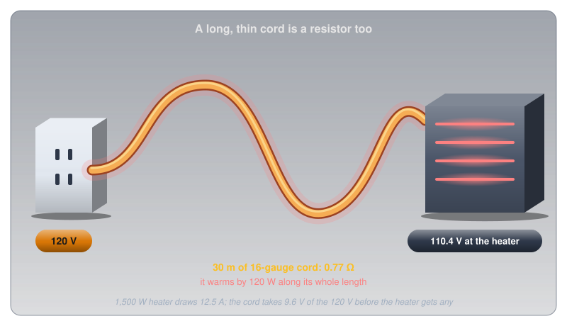
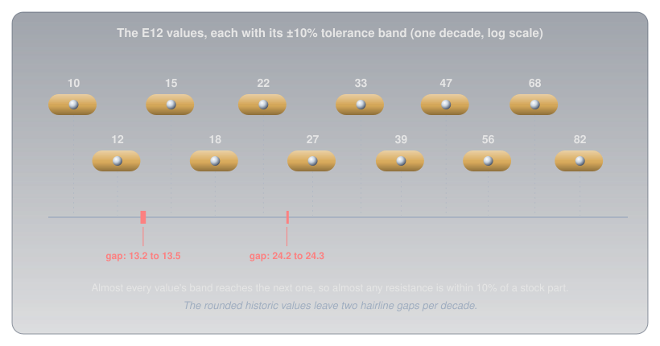
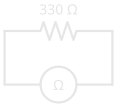

# Resistance and Conductance

!!! abstract "Beginner"
    This article is in the **Circuit Foundations** topic and follows [Voltage](voltage.md) and [Current](current.md). It builds on the collisions from [Conductors, Insulators, and Semiconductors](conductors_and_insulators.md). No other prior knowledge required.

Copper's resistance is so low that most circuit diagrams treat a wire as having none at all. Yet plug a 1,500 W space heater into a long, thin extension cord and the cord gets warm along its entire length, and the heater at the far end runs measurably weaker than it would plugged into the wall. A wire with "no" resistance is somehow turning power into heat.

Two ideas explain it:

1. **Resistance depends on more than the material.** Length, thickness, and temperature matter just as much, and a long, thin wire can add up to a real resistance even when it's copper.
2. **Conductance is the same property, seen from the other side.** Where resistance asks how hard current has to work to get through, conductance asks how easily it flows, and some problems (especially side-by-side paths) are far simpler from that side.

By the end, the extension cord will have a number on it, and so will the heat it makes. Along the way: wire gauges, the siemens, what a resistor's tolerance really promises, and how to measure resistance without fooling the meter.

---

## Resistance, Defined

[Current](current.md) counted charge flowing; [Voltage](voltage.md) measured the push on it. Resistance connects the two: for a given push, how much flow do you get?

???+ info "Definition: Ohm"

    **Resistance** is how strongly something opposes current. A component has a resistance of one **ohm** (Ω) when a push of 1 volt drives a current of 1 amp through it. Twice the resistance means half the current for the same voltage.

[Conductors, Insulators, and Semiconductors](conductors_and_insulators.md#question-two-how-far-do-they-get) showed where resistance comes from: free electrons colliding with vibrating atoms and impurities, losing the progress the voltage gave them. Every collision turns a little of the charge's energy into heat. Resistance is the total of all those collisions along the path, which is why it depends on the path as much as on the material.

---

## Idea One: Four Things Set a Wire's Resistance

A wire's resistance comes from four things: what it's made of, how long it is, how thick it is, and how hot it is. Each one changes the number of collisions a coulomb has to get through.

<figure markdown>
  { width="740" }
  <figcaption>Four separate levers. A wire's resistance is all four multiplied together.</figcaption>
</figure>

- **Material.** Every material has a **resistivity**, written ρ (the Greek letter rho): the resistance of a standard one-metre cube of it. Copper's is 1.68 × 10⁻⁸ Ω·m. Nichrome, the alloy in toaster elements, is about 65 times higher, which is exactly why toasters use it: its resistance turns current into heat.
- **Length.** A longer wire is more collisions in a row. Double the length and every coulomb has twice as far to fight through: double the resistance.
- **Thickness.** A thicker wire is more lanes side by side. Double the cross-sectional area and twice as many electrons can move at once, each one meeting the same number of collisions as before: half the resistance.
- **Temperature.** Hotter atoms vibrate harder and collide more often. Copper gains about 0.39% resistance for every degree Celsius, so at 70 °C it's about 19% above its 20 °C value.

The first three combine into one formula. Resistance is resistivity times length, divided by cross-sectional area:

\[ R = \frac{\rho \times L}{A} \]

Temperature then adjusts ρ itself. One metre of 1 mm² copper at 20 °C works out to 0.0168 Ω: 16.8 milliohms, about as close to zero as anything in a hobby circuit gets.

### Wire Gauge: Thickness in Practice

Thickness is the lever people actually choose when they buy wire. In North America, wire thickness is given as an **American Wire Gauge** (AWG) number. The scale runs backwards (a *smaller* number means a *thicker* wire) because it began as the number of times the wire had been drawn through a die: more draws, thinner wire.

<figure markdown>
  { width="720" }
  <figcaption>Every step of 3 gauges doubles the copper, which halves the resistance per metre.</figcaption>
</figure>

Every three gauge numbers roughly doubles the cross-sectional area, and so halves the resistance per metre. The 22 AWG hookup wire on a breadboard is fine for the milliamps of a hobby circuit. A household 15 A circuit uses 14 AWG, and a 30 A dryer circuit needs 10 AWG, because a wire has to be thick enough that its resistance doesn't turn the current into dangerous heat.

### The Extension Cord, Solved

Every piece needed for the opening puzzle is now on the table. A typical light-duty extension cord uses 16 AWG wire (1.31 mm²). A 30 m cord has 30 m of copper going out to the heater and 30 m coming back, 60 m in all:

\[ R = \frac{1.68 \times 10^{-8}\ \Omega\text{·m} \times 60\ \text{m}}{1.31 \times 10^{-6}\ \text{m}^2} \approx 0.77\ \Omega \]

A 1,500 W heater on a 120 V outlet draws 12.5 A. Pushing 12.5 A through the cord's 0.77 Ω takes about 9.6 V, so the heater gets roughly 110 V instead of 120. And the cord itself turns about 120 W into heat, spread along its whole length, as much as an old-style light bulb.

<figure markdown>
  { width="720" }
  <figcaption>"Zero" resistance, sixty metres of it. The cord is a 0.77 Ω resistor that happens to be long and flexible.</figcaption>
</figure>

That's the opening puzzle solved. Copper's resistance is tiny per metre but never zero, and a long, thin cord multiplies it until it matters. A 12 AWG cord of the same length would be only 0.31 Ω, and would warm by only about 48 W.

---

## Idea Two: Conductance, the Same Property Flipped

Resistance measures how hard it is for current to get through. Turn the question around, and ask how *easily* current gets through, and you have **conductance**.

???+ info "Definition: Conductance and the Siemens"

    **Conductance** (G) is the reciprocal of resistance: G = 1 / R. It's measured in **siemens** (S), named after the engineer Werner von Siemens. A 100 Ω resistor has a conductance of 1/100 S = 0.01 S, or 10 millisiemens (mS). The older name for the unit is the **mho** ("ohm" spelled backwards), written as an upside-down Ω symbol.

Conductance carries no new physics. It's the same property with the number flipped. Its value is that some problems become far simpler when you think about how well things conduct instead of how badly.

Side-by-side paths are the clearest example. When current has two paths to choose from, it gets through more easily than through either path alone, so the conductances simply **add**:

\[ G_{\text{total}} = G_1 + G_2 + \cdots \]

<figure markdown>
  { width="720" }
  <figcaption>Add another path and current flows more easily. In conductance, that's just addition.</figcaption>
</figure>

A 100 Ω and a 220 Ω resistor side by side conduct 10 mS + 4.5 mS = 14.5 mS together. Flip that back to resistance and the pair behaves like a single 68.8 Ω resistor, lower than either one. [Series and Parallel Circuits](series_and_parallel.md) writes the same rule with resistances, as a sum of 1/R terms. That sum *is* the conductances adding; the conductance view just says why.

The same idea applies to materials. Conductors, Insulators, and Semiconductors compared metals by their **conductivity**, measured in siemens per metre: resistivity flipped, exactly as conductance is resistance flipped.

---

## Tolerance: How Close Is Close Enough?

A resistor marked 220 Ω is almost never exactly 220 Ω. Manufacturing can only get so close, so every resistor carries a **tolerance**: a promise that its real value lies within a stated percentage of the marking. [Resistor Color Codes](resistor_color_codes.md) shows how to read it from the fourth band.

A 220 Ω resistor at ±5% can be anywhere from 209 Ω to 231 Ω and still be perfect. Whether that matters depends on the job:

- **Usually it doesn't.** In the LED (light-emitting diode) circuit from Voltage and Current, a 330 Ω resistor at ±5% could be anywhere from about 314 Ω to 347 Ω. The LED current would land somewhere between about 20 mA and 22 mA, a difference no eye can see.
- **Sometimes it does.** Circuits that compare or divide voltages precisely, like the sensor readings in [Reading an Analog Sensor](analog_input.md), get more accurate with tighter parts. Metal-film resistors at ±1% cost only slightly more and are the sensible default for anything that measures.

### Why Only Certain Values Exist

Tolerance also explains the odd-looking list of values resistors come in. The International Electrotechnical Commission (IEC) standard IEC 60063 defines **preferred number series**, called E-series, spaced so that each value's tolerance band reaches roughly to the next one. The E12 series, for ±10% parts, has twelve values per decade: 10, 12, 15, 18, 22, 27, 33, 39, 47, 56, 68, 82, then 100, 120, and so on.

<figure markdown>
  { width="740" }
  <figcaption>Twelve values, each with its ±10% band, cover almost the whole decade.</figcaption>
</figure>

The spacing is geometric: each value is about 1.21 times the one before (the twelfth root of 10), so with ±10% tolerance the bands almost meet. "Almost" is the honest word. The values were rounded to two digits generations ago, and checking the arithmetic shows two hairline gaps per decade: nothing at ±10% covers 13.2 Ω to 13.5 Ω, or 24.2 Ω to 24.3 Ω. The E24 series, for ±5% parts, doubles the number of values to 24 per decade, and the E96 series, for ±1% parts, has 96.

---

## Resistances You'll Meet

From fractions of an ohm in a wire to millions of ohms inside a meter, real resistances span as wide a range as voltages and currents do.

<figure markdown>
  { width="740" }
  <figcaption>Ten orders of magnitude, from house wiring to a meter's input.</figcaption>
</figure>

The body's resistance sits in the middle of that range, and it changes a hundredfold between wet and dry skin. [What Is Electricity?](what_is_electricity.md#safety-where-the-numbers-matter) works through what that does to the current a given voltage can push through someone.

---

## Measuring Resistance

A multimeter on its resistance setting (marked Ω) works differently from the voltage and current settings: it supplies its own small, known current, measures the voltage that produces across the part, and reports the ratio. That has two consequences.

First, the part must be **unpowered**. The meter's tiny test current can't be read reliably on top of a circuit's own current, and applying a powered circuit to the meter's resistance input can damage it.

Second, the part should be **out of the circuit**, or at least have one end disconnected. Any other path between the two probes conducts the meter's test current too. From Idea Two, side-by-side conductances add, so a second path always makes the reading *lower* than the part's real resistance.

<figure markdown>
  { width="320" }
  <figcaption>The ohmmeter (the circle marked Ω) across a resistor on its own. No battery: the meter supplies its own test current.</figcaption>
</figure>

- ✅ **Safe (non-destructive):** measuring a loose resistor, a length of wire, or a switch's continuity, with the circuit unpowered.
- ⚠️ **Caution (misleading or damaging):** measuring a resistor still soldered into a board, which reads low because of parallel paths; or measuring anything that's powered, which can damage the meter. Disconnect power, and lift one leg of the part if a reading looks low.
- 🚨 **DANGER:** probing mains wiring on any setting. Leave it alone.

---

## Safety: Wire Must Match the Current

The extension cord shows the safety side of resistance. A wire's resistance turns some of its current into heat, and as [Conductors, Insulators, and Semiconductors](conductors_and_insulators.md#heat-makes-every-metal-worse) showed, heat raises the resistance, which makes more heat.

!!! warning "Size Wire and Cords for the Current"
    A wire that's too thin for its current runs hot along its whole length. Use extension cords rated for the appliance's current, never chain them together (each one adds its resistance), and fully uncoil a cord carrying a heavy load: a coiled cord can't shed its heat. In a project, check that hookup wire and connectors are rated for the current a motor or heater will draw, not just for the voltage.

---

## Practice

??? question "1. Longer and Thinner"

    A wire has a resistance of 2 Ω. You replace it with a wire of the same material that's twice as long and half the cross-sectional area. What's the new resistance?

    ??? tip "Solution"
        Doubling the length doubles the resistance; halving the area doubles it again:

        \[ R = 2\ \Omega \times 2 \times 2 = 8\ \Omega \]

??? question "2. Hookup Wire"

    22 AWG copper has about 5.16 Ω per 100 m. What's the resistance of a 50 cm jumper wire? Does it matter in a 20 mA LED circuit?

    ??? tip "Solution"
        50 cm is 0.5 m, so \( R = 5.16\ \Omega \times 0.5 / 100 \approx 0.026\ \Omega \). At 20 mA that takes \( 0.020 \times 0.026 \approx 0.0005\ \text{V} \), half a millivolt. It doesn't matter at all, which is why circuit diagrams treat wires as zero resistance.

??? question "3. Three in Parallel"

    Three 1 kΩ resistors are connected side by side. Using conductance, find their combined resistance.

    ??? tip "Solution"
        Each conducts \( 1 / 1{,}000\ \Omega = 1\ \text{mS} \). Side by side, conductances add: 3 mS. Flip it back:

        \[ R = \frac{1}{0.003\ \text{S}} \approx 333\ \Omega \]

??? question "4. Within Tolerance?"

    A resistor marked 1 kΩ ±5% measures 1,042 Ω. Is it faulty?

    ??? tip "Solution"
        ±5% of 1,000 Ω is 50 Ω, so anything from 950 Ω to 1,050 Ω meets the marking. At 1,042 Ω it's within tolerance and working exactly as promised.

??? question "5. The Low Reading"

    A resistor marked 220 Ω is still soldered into a board, and the meter reads about 150 Ω. On the board, a 470 Ω resistor connects across the same two points. Explain the reading.

    ??? tip "Solution"
        The meter's test current flows through both paths. Their conductances add: \( 1/220 + 1/470 \approx 4.55 + 2.13 = 6.68\ \text{mS} \), which is \( 1 / 0.00668 \approx 150\ \Omega \). The 220 Ω resistor is probably fine; lift one of its legs and measure again.

---

## Quick Recap

-   **The ohm**

    ---

    1 Ω lets 1 V push 1 A. Resistance is the total of the collisions along a path.

-   **Four levers**

    ---

    Material (ρ), length, thickness, and temperature. \( R = \rho L / A \), with ρ rising as it heats.

-   **Gauge**

    ---

    Smaller AWG number, thicker wire. Every 3 gauges halves the resistance per metre.

-   **Conductance**

    ---

    G = 1/R, in siemens. Side-by-side paths add their conductances.

-   **Tolerance**

    ---

    The marked value plus or minus a percentage. E-series values are spaced to nearly cover every decade.

-   **Measuring**

    ---

    Unpowered, and out of the circuit. Parallel paths always read low.

---

## What's Next

Voltage, current, and resistance are now each defined on their own. **[Ohm's Law and Power](ohms_law.md)** ties all three together, finds where the rule breaks, and follows the current into power and heat.

---

## Further Reading

**Reference Data**

- [Electrical Resistivity and Conductivity — Wikipedia](https://en.wikipedia.org/wiki/Electrical_resistivity_and_conductivity) — the resistivity values used here, from copper to nichrome
- [American Wire Gauge — Wikipedia](https://en.wikipedia.org/wiki/American_wire_gauge) — the gauge formula and a full table of diameters and areas
- [E Series of Preferred Numbers — Wikipedia](https://en.wikipedia.org/wiki/E_series_of_preferred_numbers) — the E6 through E192 series defined in IEC 60063

**Deep Dives**

- [Siemens (Unit) — Wikipedia](https://en.wikipedia.org/wiki/Siemens_(unit)) — the unit of conductance and the history of the mho
- [Resistivity and Temperature Coefficients — HyperPhysics](https://hyperphysics.gsu.edu/hbase/Tables/rstiv.html) — how much each material's resistance rises with heat

**Related Articles**

- [Conductors, Insulators, and Semiconductors](conductors_and_insulators.md) — the collisions that resistance adds up
- [Current](current.md) — the flow that resistance limits
- [Resistor Color Codes](resistor_color_codes.md) — reading a resistor's value and tolerance from its bands
- [Series and Parallel Circuits](series_and_parallel.md) — resistances combined end to end and side by side
