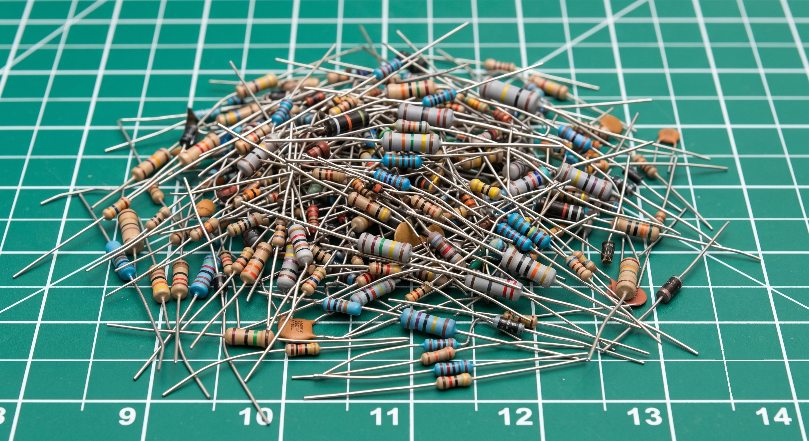

# Resistor Color Codes

!!! abstract "Beginner"
    This article is in the **Components** topic. It builds on [Resistance and Conductance](resistance.md) and decodes the exact resistors wired in [Series and Parallel Circuits](series_and_parallel.md), [Digital Pins](digital_io.md), and [Pull-up and Pull-down Resistors](pull_resistors.md).

Every circuit on this site names its resistors' values (220 Ω, 10 kΩ), but pick up the actual component and there's no "220" printed anywhere. No digits at all: just four coloured stripes around a small tan cylinder.

Those stripes are the value, written in a code that has been standard since the 1920s. This article teaches you to pick up any resistor, read its bands, and know its value and tolerance without looking anything up.

<figure markdown>
  { width="600" }
  <figcaption>A typical parts bin: hundreds of resistors, every value marked only in bands.</figcaption>
</figure>

---

## Why Colors Instead of Print

A resistor is often only a few millimetres long. Digits printed at that size are hard to read, and a number printed on one side of a cylinder disappears when the part rolls over. A band wrapped all the way round is readable from any angle.

So resistors carry their value as a sequence of coloured bands, wrapped around the body like rings on a finger. The scheme is standardized internationally (IEC 60062), which is why a resistor bought today reads exactly the same way as one manufactured decades ago.

---

## The Four Bands

The common resistor has four bands, and each one answers a specific question, always in the same order: two digits, then a multiplier, then a tolerance.

<figure markdown>
  { width="560" }
  <figcaption>Red-red-brown-gold: the 220 Ω resistor from Digital Pins and Blink an LED. Two digits, a multiplier, and a tolerance.</figcaption>
</figure>

- **Band 1:** first significant digit
- **Band 2:** second significant digit
- **Band 3:** multiplier (how many zeros to add, or formally, ×10 to that power)
- **Band 4:** tolerance (how far the actual value may stray from the marked one)

Put the first two digits together, apply the multiplier, and you have the resistance. `22` with a `×10` multiplier is `220`: the resistor reads **220 Ω**. The tolerance band separately tells you how much to trust that number: **gold** means the true value is guaranteed to be within **±5%** of 220 Ω, so anywhere from 209 Ω to 231 Ω.

---

## The Color-to-Number Key

Ten colors stand for the ten digits, 0 through 9. The same colors, in the third position, mean "multiply by 10 to this power" instead:

| Color | Digit | Multiplier |
|---|---|---|
| Black | 0 | ×1 |
| Brown | 1 | ×10 |
| Red | 2 | ×100 |
| Orange | 3 | ×1,000 |
| Yellow | 4 | ×10,000 |
| Green | 5 | ×100,000 |
| Blue | 6 | ×1,000,000 |
| Violet | 7 | ×10,000,000 (rare) |
| Gray | 8 | ×100,000,000 (rare) |
| White | 9 | ×1,000,000,000 (rare) |
| Gold | (none) | ×0.1 |
| Silver | (none) | ×0.01 |

The order of the ten digit colors is the part worth memorizing. A common mnemonic takes the first letter of each word: **B**etter **B**e **R**ight **O**r **Y**our **G**reat **B**ig **V**enture **G**oes **W**est, for **B**lack, **B**rown, **R**ed, **O**range, **Y**ellow, **G**reen, **B**lue, **V**iolet, **G**ray, **W**hite. The two B-words come in the same order as the colors: black (darkest) before brown.

The **tolerance band** uses a separate, shorter set of colors:

| Color | Tolerance |
|---|---|
| Brown | ±1% |
| Red | ±2% |
| Gold | ±5% |
| Silver | ±10% |
| *(no band)* | ±20% |

**Gold and silver are never digits.** In the multiplier band they mean ×0.1 and ×0.01, for resistors under 10 Ω: yellow-violet-gold-gold is 47 × 0.1 = 4.7 Ω ±5%. Everywhere else they mark the tolerance band, and that's the clue to which end to start reading from, covered in [Which End Do You Start From?](#which-end-do-you-start-from) below.

---

## Reading It Yourself

Take the resistor from the diagram above: **Red, Red, Brown, Gold.**

1. **Band 1 (Red) = 2**, the first digit.
2. **Band 2 (Red) = 2**, the second digit. Together so far: `22`.
3. **Band 3 (Brown) = ×10**, so \( 22 \times 10 = 220 \).
4. **Band 4 (Gold) = ±5%**: the true value is within 5% of 220 Ω.

Result: **220 Ω ±5%**, the current-limiting resistor in front of every LED on this site.

Try a second one: **Brown, Black, Orange, Gold**, the pull resistor from [Pull-up and Pull-down Resistors](pull_resistors.md).

1. **Brown = 1**, **Black = 0** → digits `10`.
2. **Orange = ×1,000** → \( 10 \times 1{,}000 = 10{,}000 \).
3. **Gold = ±5%**.

Result: **10,000 Ω, or 10 kΩ, ±5%**, the pull-down that holds that input pin at a steady LOW.

---

## Which End Do You Start From?

A resistor's bands aren't centred: they're clustered toward one end, with the tolerance band set apart near the other. That gap gives the reading direction. **Start from the end where the bands are bunched together**; the lone band, usually gold or silver, is the last one, the tolerance.

If the gap is hard to see, look for gold or silver at one end. Neither can be a first digit, so a gold or silver band at the end is the tolerance band, and you read *away* from it.

### Five Bands: Precision Resistors

Precision resistors (±1% and ±2%) need a third digit, so they carry five bands: three digits, a multiplier, and a tolerance. Brown-black-black-brown-brown is 100 × 10 = 1,000 Ω ±1%. Their bodies are often blue rather than tan, and the tolerance band is brown or red, so on these the gap between bands matters more than looking for gold.

---

## Why Only Certain Values Exist

Real resistors come in values like 220 Ω, 330 Ω, and 470 Ω, and never 250 Ω. Manufacturers make standard steps per decade, the **E-series**, spaced so each value's tolerance band reaches roughly to the next. The common **E12 series** has 12 steps: 10, 12, 15, 18, 22, 27, 33, 39, 47, 56, 68, 82, then the same again ×10. That's why the LED resistor on this site is 220 Ω rather than a rounder 250: 220 is a value you can buy. [Resistance and Conductance](resistance.md#why-only-certain-values-exist) explains the spacing and the finer E24 and E96 series.

---

## Safety

!!! warning "Color bands tell you the resistance, not the power rating"
    Two resistors can have identical bands and still be rated for very different power. A resistor's power rating (¼ W, ½ W, 1 W…) is almost never colour-coded; it's implied by physical size or given in the datasheet. Before reusing a salvaged resistor, confirm its power rating: an undersized resistor overheats even at the "correct" resistance ([Ohm's Law and Power](ohms_law.md#power-ratings) shows how to check).

---

## Practice

??? question "1. Decode this resistor"

    A resistor has the bands **Yellow, Violet, Red, Gold**. What's its value and tolerance?

    ??? tip "Solution"

        Yellow = 4, Violet = 7 → digits `47`. Red = ×100 → \( 47 \times 100 = 4{,}700 \). Gold = ±5%.

        **4,700 Ω, or 4.7 kΩ, ±5%.**

??? question "2. Decode this one too"

    **Brown, Black, Red, Gold.**

    ??? tip "Solution"

        Brown = 1, Black = 0 → digits `10`. Red = ×100 → \( 10 \times 100 = 1{,}000 \). Gold = ±5%.

        **1,000 Ω, or 1 kΩ, ±5%.**

??? question "3. Working backwards"

    You need a 330 Ω resistor with ±5% tolerance. What four bands do you look for?

    ??? tip "Solution"

        330 splits into digits `33` with a ×10 multiplier: \( 33 \times 10 = 330 \). Orange = 3, so the first two bands are **Orange, Orange**. The multiplier ×10 is **Brown**. ±5% tolerance is **Gold**.

        **Orange, Orange, Brown, Gold.**

??? question "4. Which end?"

    You pick up a resistor and see bands in this order from left to right: **Gold, Brown, Black, Red**. Did you read it correctly?

    ??? tip "Solution"

        No, it's backwards. Gold can't be a first digit, so a gold band at the end marks the tolerance. Flip your reading direction: **Red, Black, Brown, Gold** → digits `20`, ×10 multiplier → \( 20 \times 10 = 200 \). **200 Ω ±5%.**

---

## Quick Recap

-   **Four Bands, One Order**

    ---

    1st digit → 2nd digit → multiplier → tolerance. Precision parts add a third digit for five bands.

-   **The Color Key**

    ---

    Black through white map to digits 0–9, and the same colours in the multiplier band mean "×10 to that power." Gold and silver are never digits: they're tolerance, or ×0.1 and ×0.01 as multipliers.

-   **Find the Start**

    ---

    The tolerance band sits apart from the other three. Read starting from the clustered end, away from the isolated gold or silver band.

-   **Not Every Value Exists**

    ---

    Resistors are manufactured in standardized **E-series** steps (10, 12, 15, 18, 22…). That's why circuits use 220 Ω or 4.7 kΩ rather than round numbers like 250.

---

## What's Next

Every resistor on this site, from the 220 Ω in [Digital Pins](digital_io.md) and [Blink an LED](blink_an_led.md) to the 10 kΩ in [Pull-up and Pull-down Resistors](pull_resistors.md), now has bands you can read yourself.

The bands tell you the value. **[Resistor Types](resistor_types.md)** covers what they don't: what's inside each kind of resistor, what a temperature coefficient means, and how potentiometers and trimmers make a resistance adjustable.

---

## Further Reading

**Fundamentals**

- [Resistor Color Code — SparkFun](https://learn.sparkfun.com/tutorials/resistor-color-codes) — an interactive band decoder covering 4-band, 5-band, and 6-band resistors

**Related Articles**

- [Resistance and Conductance](resistance.md) — what the value means, and why tolerance and the E-series exist
- [Pull-up and Pull-down Resistors](pull_resistors.md) — sizing a resistor for a job, the companion skill to reading one you already have
