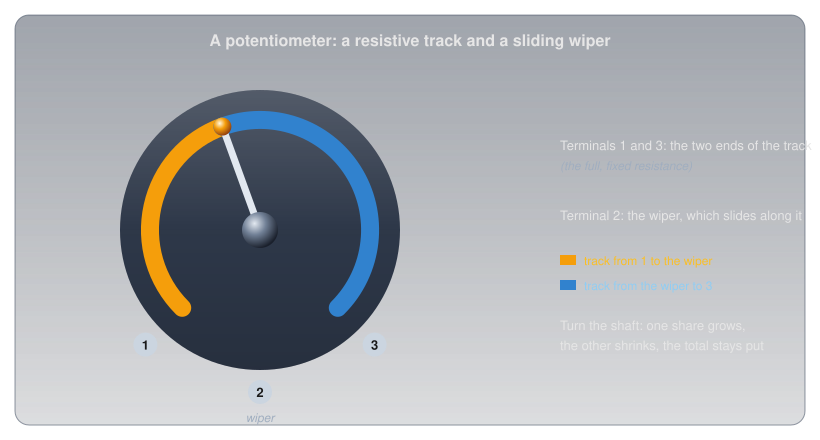
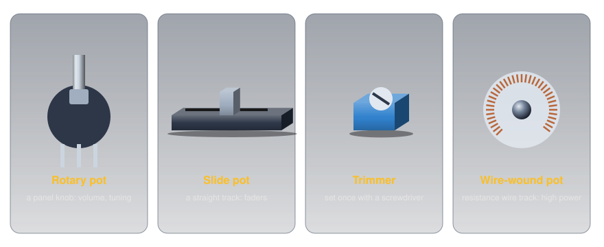
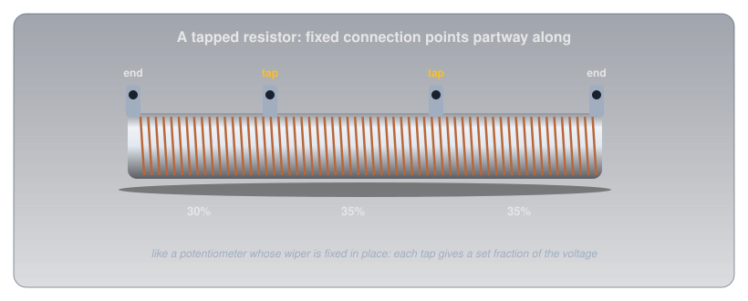

# Resistor Types

!!! abstract "Beginner"
    This article is in the **Components** topic. It builds on [Resistance and Conductance](resistance.md) and [Resistor Color Codes](resistor_color_codes.md). No other prior knowledge required.

Turn an old stereo's volume knob halfway and you'd expect the music at about half volume. With the right part inside, that's roughly what you get. With the wrong one, the knob is nearly at full volume by the quarter mark, and the rest of its travel barely changes anything. Both parts can be stamped with the same value and look identical from the outside.

Two ideas explain why resistors come in so many kinds:

1. **What a fixed resistor is made of matters as much as its value.** Carbon, metal film, and wire each trade off precision, stability with temperature, power, noise, and behaviour at high frequencies.
2. **A third terminal makes a resistor adjustable.** A potentiometer, a rheostat, a trimmer, and a tapped resistor are all the same resistive element with extra connection points, and how the resistance spreads along the element (its **taper**) decides how the knob feels.

---

## Idea One: What's Inside a Fixed Resistor

Every fixed resistor has a resistive element between two leads, and the material of that element sets its character. The common types, opened up:

<figure markdown>
  { width="760" }
  <figcaption>Same job, five constructions. The spiral cut in a film resistor sets its value: a longer spiral path means more resistance.</figcaption>
</figure>

-   :material-circle-slice-8: **Carbon composition**

    ---

    **Inside:** a solid slug of carbon powder in a binder.

    **Strengths:** shrugs off brief high-energy pulses.

    **Weaknesses:** drifts with age, temperature, and humidity, and is electrically noisy. Mostly found in older equipment now.

-   :material-texture-box: **Carbon film**

    ---

    **Inside:** a thin carbon film on a ceramic rod, cut into a spiral.

    **Strengths:** cheap; the everyday through-hole part.

    **Weaknesses:** a large temperature coefficient (below).

-   :material-target: **Metal film**

    ---

    **Inside:** a thin metal film, spiral-cut more finely.

    **Strengths:** tight tolerances (±1% is routine), low noise, and a small temperature coefficient. The sensible default for anything that measures.

-   :material-reload: **Wire-wound**

    ---

    **Inside:** resistance wire wound around a ceramic core.

    **Strengths:** handles high power and can be very precise and stable.

    **Weaknesses:** the winding is a coil, so it behaves a little like an inductor (below).

-   :material-chip: **Surface-mount chip**

    ---

    **Inside:** a thick or thin film printed onto a tiny ceramic chip.

    **Strengths:** small and cheap; what fills nearly every modern circuit board. Marked with a short number code instead of colour bands ([Metric Prefixes and Units](metric_prefixes.md#prefixes-on-real-parts)).

### Temperature Coefficient

[Resistance and Conductance](resistance.md#idea-one-four-things-set-a-wires-resistance) showed that heat changes resistance. A resistor's datasheet puts a number on how much, as its **temperature coefficient of resistance** (TCR), usually given in **parts per million per degree Celsius** (ppm/°C): how many millionths of its value it changes for each degree of temperature change.

- A **positive** coefficient (PTC) means the resistance rises with temperature, as in most pure metals.
- A **negative** coefficient (NTC) means it falls, as in many carbon resistors and in semiconductors ([Conductors, Insulators, and Semiconductors](conductors_and_insulators.md#semiconductors-the-in-between)).

So whether a resistor's value goes up or down as the room warms depends on its temperature coefficient. Real datasheets show how different the types are. Yageo's common ¼ W carbon-film resistor (CFR-25) is rated −500 to +350 ppm/°C below 100 kΩ, while its metal-film series (MFR) is rated ±50 or ±100 ppm/°C.

<figure markdown>
  { width="720" }
  <figcaption>Thirty degrees of warming: up to 1.5% drift for carbon film, 0.15% for metal film.</figcaption>
</figure>

Warm a 10 kΩ carbon-film resistor by 30 °C and it can move anywhere from 150 Ω down to 105 Ω up:

\[ 10{,}000\ \Omega \times 350 \times 10^{-6} \times 30 \approx 105\ \Omega \]

The same warming moves a ±50 ppm/°C metal-film part by only 15 Ω. In an LED circuit nobody would notice; in a circuit that measures temperature or divides a voltage precisely, it's the difference between a reading you can trust and one that wanders with the weather.

### Wire-Wound vs. Composition

The two oldest constructions sit at opposite ends of most trade-offs:

| | Wire-wound | Carbon composition |
|---|---|---|
| Power | high: tens of watts or more | modest |
| Precision and stability | excellent | poor: drifts with age, heat, and humidity |
| Noise | very low | relatively high |
| Brief pulses | can be damaged by sharp surges | handles them well |
| At high frequencies | the winding acts as a coil (inductance) | essentially non-inductive |

That last row matters for radio. A wire-wound resistor's winding is a coil of wire, and a coil resists rapid changes in current ([Magnetism and Electromagnetism](magnetism.md) explains why coils and current interact). At radio frequencies a wire-wound part stops behaving like a plain resistor, which is why radio test loads are built from non-inductive resistors, never wire-wound ones.

---

## Idea Two: Resistors You Can Adjust

A fixed resistor has two terminals, one at each end of its element. Add a third, on a contact that slides along the element, and the resistor becomes adjustable.

### The Potentiometer

A **potentiometer** (pot) has a resistive track between two end terminals and a **wiper**, the third terminal, that slides along it as a shaft turns.

<figure markdown>
  { width="720" }
  <figcaption>The wiper splits one track into two resistances that always add up to the full value.</figcaption>
</figure>

The resistance between the two ends never changes. What changes is how it's split: as the wiper moves toward one end, the resistance on that side shrinks and the other side grows by the same amount. Connected across a supply with the output taken from the wiper, a pot is an adjustable **[voltage divider](voltage_divider.md)**: anywhere from 0 V to the full supply, set by the shaft. That's how a volume control or a brightness knob works, and wired to an Arduino's analog pin it becomes the simplest analog input there is ([Reading an Analog Sensor](analog_input.md) explains how that pin measures it).

### Rheostats and Trimmers

Use only two of the three terminals, one end and the wiper, and the same part becomes a simple **variable resistor**, called a **rheostat** when it's controlling current.

<figure markdown>
  { width="560" }
  <figcaption>A pot uses all three terminals (left); a rheostat uses two (right). The arrow pointing <em>into</em> the resistor is a wiper; the arrow drawn <em>through</em> it means "variable".</figcaption>
</figure>

The rheostat circuit keeps a fixed 330 Ω resistor in series for a reason: turned all the way down, a rheostat is close to zero ohms, and without a fixed resistor the LED would be left with nothing limiting its current.

Variable resistors come in several physical forms:

<figure markdown>
  { width="760" }
  <figcaption>Rotary, slide, trimmer, and wire-wound: the same idea in four packages.</figcaption>
</figure>

- **Rotary and slide pots** are panel controls, meant to be adjusted often.
- **Trimmers** are small pots set once during calibration, usually with a screwdriver, and then left alone.
- **Composition (carbon-track) pots** use a carbon track; they're cheap and smooth, with a fine, continuous adjustment.
- **Wire-wound pots** use a track of wound resistance wire; they handle much more power, but the wiper steps from one turn of wire to the next.

#### Trimmers: Set Once, Then Left Alone

A **trimmer** (trimpot) is a potentiometer built to be adjusted a handful of times and then forgotten. It has no knob or shaft, just a slot for a small screwdriver, and it solders straight onto the circuit board. Its job is calibration: every part in a circuit has a [tolerance](resistance.md#tolerance-how-close-is-close-enough), and a trimmer absorbs the combined error, so a reference voltage can be set to exactly 2.500 V or a sensor's threshold placed precisely where it's wanted. It also suits settings the owner shouldn't be fiddling with, which is why it hides inside the case.

Two kinds are common:

- **Single-turn trimmers** cover their whole range in about three-quarters of a turn. They're quick to set, but coarse: on a 10 kΩ part, a few degrees of screwdriver is a change of a couple of hundred ohms.
- **Multi-turn trimmers** drive the wiper with a small lead screw, typically over 25 full turns, so each turn moves only a twenty-fifth of the range. They're the rectangular blue blocks with a brass screw on top, chosen when the setting has to be fine.

Trimmers often carry the same three-digit value code as surface-mount resistors: `103` is 10 followed by three zeros, 10 kΩ, and `502` is 5 kΩ. On hobby modules they're everywhere. The contrast control on a 16×2 character LCD module is a 10 kΩ trimmer, and the sensitivity adjustment on cheap infrared, sound, and soil-moisture sensor boards is usually a blue multi-turn trimmer setting a comparator's threshold.

The one thing a trimmer isn't built for is regular use. Manufacturers rate them for a limited number of adjustments, a few hundred full cycles for common parts, against tens of thousands for a panel pot. A setting that's changed every day belongs on a panel pot with a knob.

### Tapers: The Volume-Knob Puzzle

A pot's **taper** describes how its resistance is spread along the track. In a **linear** pot it's spread evenly: turn the shaft halfway and the wiper is at half the resistance. In a **logarithmic** (audio) pot the resistance changes slowly at first and quickly at the end, so halfway might be only a tenth of the total.

<figure markdown>
  { width="700" }
  <figcaption>Linear is a straight line; an audio taper starts slow and finishes fast.</figcaption>
</figure>

That's the opening puzzle solved. Our ears judge loudness on a roughly logarithmic scale: each step that sounds equally louder is a multiplication of the power, not an addition. A linear pot as a volume control puts most of the audible change in the first part of its travel. An audio-taper pot spreads the change out so each part of the knob's turn sounds like an even step. From the outside they're identical; only the taper differs.

### Tapped Resistors

A **tapped resistor** is a fixed resistor with extra terminals partway along its element: a potentiometer whose wiper has been fixed in place, often several times over. Large wire-wound power resistors are commonly made this way, giving a few set fractions of a voltage, or a few set resistances, from one part.

<figure markdown>
  { width="700" }
  <figcaption>Fixed taps: a voltage divider with the choices built in.</figcaption>
</figure>

---

## Safety: Adjustable Parts Can Be Turned Too Far

An adjustable resistor can always be turned to an extreme, and a circuit has to be safe at both ends of its range.

!!! warning "Protect the Low End, and Respect the Wiper"
    A rheostat at zero is a short across whatever it was limiting, so always pair it with a fixed resistor that keeps the current safe at the minimum setting. And when a pot is used as a rheostat, all the current flows through a short section of its track and the wiper contact. A small panel pot is often rated for only a fraction of a watt, so check its power rating before using one to control any real current.

---

## Practice

??? question "1. Half-Way on a Divider"

    A 10 kΩ linear pot is connected across a 5 V supply, with the output taken from the wiper. What's the output with the shaft turned exactly half-way?

    ??? tip "Solution"
        The wiper splits the track into two 5 kΩ halves, so the output is half the supply: **2.5 V**.

??? question "2. Temperature Drift"

    A 1 kΩ metal-film resistor is rated ±100 ppm/°C. How far can its value move if it warms by 50 °C?

    ??? tip "Solution"
        \( 1{,}000 \times 100 \times 10^{-6} \times 50 = 5\ \Omega \). It stays within 995 Ω to 1,005 Ω.

??? question "3. Which Way Does It Drift?"

    A resistor's resistance falls as it warms. Does it have a positive or negative temperature coefficient?

    ??? tip "Solution"
        **Negative** (NTC). The resistance moves opposite to the temperature, as in many carbon resistors and in semiconductors.

??? question "4. The Rheostat's Range"

    The rheostat circuit above uses a 9 V battery, a red LED (about 2 V), a fixed 330 Ω resistor, and a 1 kΩ rheostat. What's the LED current at each end of the rheostat's range?

    ??? tip "Solution"
        The resistors share 9 − 2 = 7 V. Rheostat at zero: \( 7 / 330 \approx 21\ \text{mA} \), the safe maximum. Rheostat at 1 kΩ: \( 7 / 1{,}330 \approx 5.3\ \text{mA} \), dim but lit.

??? question "5. A Radio Test Load"

    A radio test load must look like a pure resistance at radio frequencies. Why would a wire-wound resistor be a poor choice?

    ??? tip "Solution"
        Its winding is a coil of wire, which adds inductance. At radio frequencies that inductance makes the part behave unlike a plain resistor. A non-inductive (film or composition) resistor is used instead.

??? question "6. Two Terminals or Three?"

    A pot has its wiper and one end connected, and the other end left unconnected. What is it being used as?

    ??? tip "Solution"
        A **variable resistor** (a rheostat): its resistance between the two connected terminals changes as the shaft turns. Using all three terminals would make it a voltage divider.

??? question "7. Choosing a Trimmer"

    A circuit's output has to be set to within 10 mV of 5.000 V, using a 1 kΩ trimmer in a divider that spans about 2 V of adjustment. Would you choose a single-turn or a 25-turn trimmer, and why?

    ??? tip "Solution"
        A **25-turn** trimmer. A single-turn part spreads 2 V across about 270° of rotation, roughly 7 mV per degree, so hitting a 10 mV window means turning the screwdriver by about one degree. Spread over 25 turns (9,000°), the same 2 V works out to about 0.2 mV per degree, and the setting becomes easy to make and stays put.

---

## Quick Recap

-   **Fixed resistor types**

    ---

    Carbon composition, carbon film, metal film, wire-wound, and surface-mount chips.

-   **Temperature coefficient**

    ---

    ppm/°C. Carbon film: hundreds. Metal film: tens. Positive rises with heat; negative falls.

-   **Wire-wound vs. composition**

    ---

    Wire-wound: power and precision, but inductive. Composition: handles pulses, but drifts and is noisy.

-   **Potentiometer**

    ---

    Three terminals: an adjustable voltage divider.

-   **Rheostat and trimmer**

    ---

    Two terminals for a variable resistance. A trimmer is a board-mounted pot for calibration: set once, rated for only a few hundred adjustments.

-   **Taper**

    ---

    Linear or logarithmic (audio). Audio taper makes a volume knob feel even.

---

## What's Next

With the resistor family complete, the next component conducts in one direction only: **[Diodes and LEDs](diodes_and_leds.md)** covers the one-way valve, why every LED colour needs its own voltage, and how to size an LED's resistor properly.

---

## Further Reading

**Datasheets**

- [Yageo CFR Carbon Film Resistors](https://www.yageogroup.com/content/Resource%20Library/Datasheet/YAGEO-CFR_DATASHEET.pdf) — temperature coefficients by type and value
- [Yageo MFR Metal Film Resistors](https://www.yageogroup.com/content/Resource%20Library/Datasheet/YAGEO-MFR_DATASHEET.pdf) — ±50 and ±100 ppm/°C options

**Deep Dives**

- [Resistor — Wikipedia](https://en.wikipedia.org/wiki/Resistor) — every construction, with their noise, stability, and frequency behaviour
- [Potentiometer — Wikipedia](https://en.wikipedia.org/wiki/Potentiometer) — tapers, rheostats, and trimmers

**Related Articles**

- [Resistance and Conductance](resistance.md) — why heat changes resistance
- [Resistor Color Codes](resistor_color_codes.md) — reading a resistor's value and tolerance
- [Metric Prefixes and Units](metric_prefixes.md) — the short codes printed on surface-mount parts
