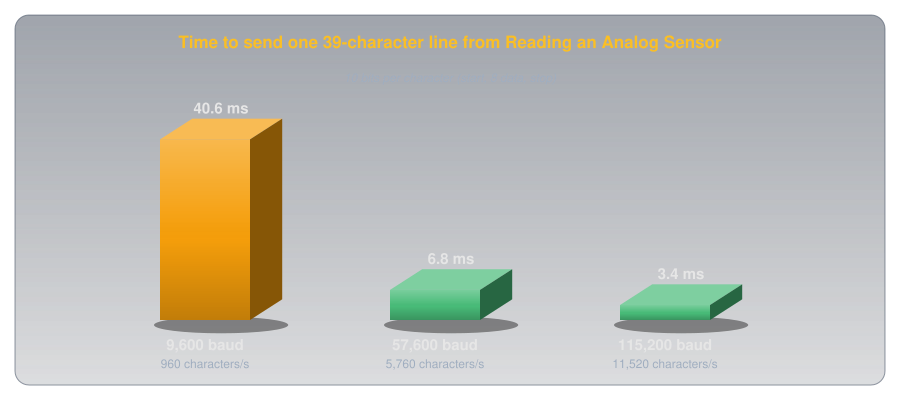
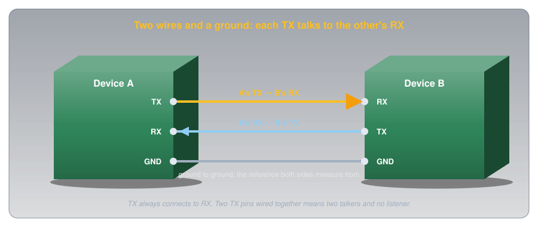
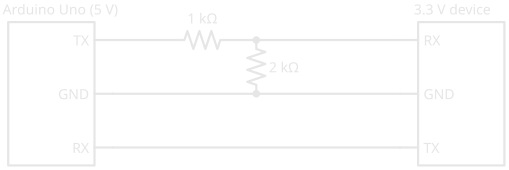

# Serial Communication

!!! abstract "Beginner"
    This article opens the **Communication** topic. It builds on [Digital Pins](digital_io.md) and uses the `Serial.print()` lines from [Reading an Analog Sensor](analog_input.md) and the serial monitor in [arduino-cli](tools/arduino_cli.md). No other prior knowledge required.

Every sketch on this site that prints a reading starts with `Serial.begin(9600)`. Open the serial monitor at 9600 and the readings appear as clean text. Set the monitor to any other speed and the same board, sending the same text down the same cable, produces a screen of nonsense: odd symbols, accented letters, and boxes. The data didn't change; the receiver's idea of it did.

Two ideas explain why:

1. **Serial sends one bit at a time down one wire.** Each character is a number, each number is eight bits, and the wire is held HIGH or LOW for a fixed time per bit, with a marker bit on each end of every character.
2. **There's no clock wire, only an agreement.** Nothing on the wire says how long a bit lasts. Both ends are set to the same speed, the **baud rate**, in advance, and the receiver times everything from the start of each character.

Set the two ends to different speeds and the receiver reads the right wire at the wrong moments. The second half shows exactly what that does to the letter A.

---

## Characters Are Numbers

A wire can only carry voltages, so text has to become numbers first. The standard table for that is **ASCII** (American Standard Code for Information Interchange), which gives every letter, digit, and punctuation mark a number from 0 to 127. Capital A is 65, B is 66, the digit 0 is 48, and a space is 32.

Each number travels as one **byte**: eight binary digits, or **bits**, each either 0 or 1. 65 in binary is `01000001`: one 64, plus one 1. So sending "A" means sending the eight bits 0, 1, 0, 0, 0, 0, 0, 1, and a [digital pin](digital_io.md) can show each bit as LOW (0 V) or HIGH (5 V).

---

## Idea One: One Bit at a Time

The Arduino's serial hardware is called a **UART** (universal asynchronous receiver-transmitter). It sends a byte on its **TX** (transmit) pin as a timed sequence of HIGH and LOW, and listens on its **RX** (receive) pin for the same thing coming back. Between characters, the line rests HIGH. Every character is then wrapped in a **frame**:

<figure markdown>
  { width="760" }
  <figcaption>Ten bits per character: a start bit, eight data bits, a stop bit.</figcaption>
</figure>

1. **A start bit**, LOW for one bit time. The drop from the resting HIGH is the receiver's signal that a character is starting.
2. **Eight data bits**, least significant bit first, so `01000001` goes out as 1, 0, 0, 0, 0, 0, 1, 0.
3. **A stop bit**, HIGH, which returns the line to rest and proves the frame ended where it should.

This layout is called **8N1**: eight data bits, no parity bit (an optional error check), one stop bit. It's the default for `Serial.begin()` ([Arduino Serial.begin() reference](https://docs.arduino.cc/language-reference/en/functions/communication/serial/begin/)), and the most common format in use.

???+ info "Definition: Baud Rate"
    The number of bits sent per second on a serial line. At 9600 baud each bit lasts 1 ÷ 9600 s, about 104 µs. With 8N1 framing every character costs ten bits, so 9600 baud carries 960 characters a second.

### What Speed Costs

Ten bits per character makes the arithmetic easy: divide the baud rate by ten for characters per second. That adds up faster than it sounds. Each line the [Reading an Analog Sensor](analog_input.md) sketch prints is about 39 characters including its line ending, and at 9600 baud it takes 40 ms to send:

<figure markdown>
  { width="760" }
  <figcaption>The sketch waits 100 ms between readings, and 40 of them can go to printing at 9600 baud.</figcaption>
</figure>

That's why sketches that print a lot use 115200 baud, twelve times faster. Both ends just have to agree, which is idea two.

---

## Idea Two: No Clock, Only an Agreement

Nothing in the frame says how long a bit is. The receiver can see when the start bit begins, because the line drops, but after that it's on its own: it has to know the bit time in advance and check the line at the right moments. A UART samples each bit near its middle, the moment furthest from both edges, and starts the timing afresh on every start bit, so small errors never accumulate past one character.

When both ends use the same baud rate, the samples land in the middle of every bit. When they don't, they land in the wrong places:

<figure markdown>
  { width="760" }
  <figcaption>The wire carries the same A every time. Only the receiver's timing changes.</figcaption>
</figure>

### The Puzzle, Solved

That's the screen of nonsense from the hook. A receiver at 19200 reads the A as the byte 6, an unprintable control code, and then finds the line LOW where the stop bit should be: a **framing error**. A receiver at 4800 reads 252, which a monitor shows as ü. Every character goes wrong in its own way, and the screen fills with symbols.

How close is close enough? The last sample, for the stop bit, comes 9.5 bit times after the start edge, and it has to land inside the stop bit, within half a bit of its middle. So the two clocks may disagree by at most about half a bit in 9.5, roughly **5%**. Simulating the letter A bears that out: a receiver 4% fast still reads it, and one 6% fast misses the stop bit. A chip can't always hit a baud rate exactly, though, because it divides its own clock down to make the bit time. The baud-rate tables in the [ATmega328P datasheet](https://ww1.microchip.com/downloads/aemDocuments/documents/MCU08/ProductDocuments/DataSheets/ATmega48A-PA-88A-PA-168A-PA-328-P-DS-DS40002061B.pdf) show that from the Uno's 16 MHz clock, 9600 baud comes out within 0.2% but 115200 is 2.1% off at best: inside the margin, but using up a good part of it. Still, the common way to break the agreement is simply setting the two ends differently.

---

## Wiring Serial Between Two Devices

Between two boards, or a board and a module like a GPS receiver, a serial link needs three wires:

<figure markdown>
  { width="760" }
  <figcaption>Each side talks on TX and listens on RX, so the wires cross.</figcaption>
</figure>

- **TX to RX, and RX to TX.** What one side transmits, the other must receive. Wiring TX to TX connects two transmitters together with nothing listening.
- **Ground to ground.** A HIGH is only "5 V" relative to something. Without a shared ground the two boards have no common reference to measure each other's voltages against ([Voltage](voltage.md) explains why a voltage always needs two points).

On an Uno, the USB cable is itself a serial link: a converter on the board turns USB into serial on **pins 0 (RX) and 1 (TX)**. That's what the serial monitor talks to, and it's why Arduino's [Serial reference](https://docs.arduino.cc/language-reference/en/functions/communication/serial/) warns that on the Uno, "connecting anything to these pins can interfere with that communication, including causing failed uploads to the board." Leave pins 0 and 1 free unless a project needs them, and disconnect anything on them while uploading.

### Voltage Levels

Serial between chips uses ordinary logic levels, but not every chip uses the same ones:

<figure markdown>
  { width="760" }
  <figcaption>The framing is the same in all three. The voltages are not.</figcaption>
</figure>

An Uno's TX swings to 5 V, and many modern modules run at 3.3 V, where 5 V on an input can damage them. A [voltage divider](voltage_divider.md) fixes the Uno-to-module direction: 1 kΩ over 2 kΩ turns 5 V into 3.33 V. The other direction usually needs nothing: the module's 3.3 V HIGH is above the 3 V the Uno's chip needs to read a HIGH ([Digital Pins](digital_io.md) gives the thresholds), though with little margin to spare.

<figure markdown>
  { width="560" }
  <figcaption>The divider only goes on the line the 5 V side drives. Dedicated level-shifter chips do the same job for faster or bidirectional signals.</figcaption>
</figure>

Older equipment uses **RS-232**, a serial standard with much larger voltages. Arduino's Serial reference is blunt: RS-232 ports "operate at +/- 12V and can damage your Arduino board." Connecting to one takes an RS-232 converter chip or a USB adapter made for it.

---

## Talking Back: Reading Serial on the Arduino

Serial goes both ways. Everything typed into the serial monitor arrives at the Uno's RX, where the hardware stores it until the sketch reads it. That storage, the **receive buffer**, holds 64 bytes ([Arduino Serial.available() reference](https://docs.arduino.cc/language-reference/en/functions/communication/serial/available/)).

``` cpp title="Control the onboard LED from the serial monitor" linenums="1"
void setup() {
  pinMode(LED_BUILTIN, OUTPUT);
  Serial.begin(9600); // (1)!
  Serial.println("Send 1 for on, 0 for off");
}

void loop() {
  if (Serial.available() > 0) { // (2)!
    char c = Serial.read(); // (3)!
    if (c == '1') {
      digitalWrite(LED_BUILTIN, HIGH);
      Serial.println("LED on");
    } else if (c == '0') {
      digitalWrite(LED_BUILTIN, LOW);
      Serial.println("LED off");
    } // (4)!
  }
}
```

1. Both ends must agree: open the monitor at 9600 too.
2. `Serial.available()` returns how many bytes are waiting in the receive buffer. Checking it first means the sketch never waits for input that hasn't arrived.
3. `Serial.read()` takes the oldest byte out of the buffer. The quotes in `'1'` mean the character 1, ASCII 49, not the number 1.
4. Anything else, including the line-ending characters the monitor may send after each line, is quietly ignored.

Upload it, open `arduino-cli monitor -p <port>` (on Linux usually `/dev/ttyACM0`; [arduino-cli](tools/arduino_cli.md#watching-serial-output) covers the rest), type `1`, and the `L` LED by pin 13 lights.

### Other Serial Buses

UART serial is **asynchronous**: no clock wire, only the agreement. Two other buses that turn up on sensor and display modules, **I²C** (inter-integrated circuit) and **SPI** (serial peripheral interface), add a clock wire so the receiver never has to time anything itself, and let several devices share the same wires. The bits still travel one at a time; idea one carries over unchanged.

---

## Safety

Serial runs at logic voltages, so the risks are to the parts, not to you.

!!! warning "Check Voltages Before Connecting"
    Wiring a 5 V TX straight to a 3.3 V device's RX can damage the device over time or at once, and RS-232's ±12 V can damage the Arduino. Check each device's logic voltage in its datasheet before connecting, and level-shift where they differ. Wiring TX to TX joins two outputs that may fight each other; if a link doesn't work, check for crossed wires before anything else.

---

## Practice

??? question "1. Spell It in Bits"

    The letter B is ASCII 66. What are its eight bits, and in what order do they leave the TX pin?

    ??? tip "Solution"
        66 = 64 + 2, so B is `01000010`. Least significant bit first, the data bits leave as **0, 1, 0, 0, 0, 0, 1, 0**, wrapped in a LOW start bit and a HIGH stop bit.

??? question "2. How Long Is a Bit?"

    How long does one bit last at 115200 baud, and how many characters a second can that carry with 8N1?

    ??? tip "Solution"
        1 ÷ 115200 ≈ **8.7 µs** per bit. Ten bits per character gives 115200 ÷ 10 = **11,520 characters** a second.

??? question "3. The Garbled Monitor"

    A sketch calls `Serial.begin(115200)`, and the serial monitor shows nothing but strange symbols. What's the most likely cause, and the fix?

    ??? tip "Solution"
        The monitor is set to a different baud rate, most likely the 9600 default. Its samples land at the wrong moments, so every character comes out wrong. Open the monitor at 115200 (`-c baudrate=115200` for `arduino-cli monitor`).

??? question "4. Wire It Up"

    You're connecting an Uno to a 3.3 V GPS module that sends position data on its TX pin. Which pins connect to which, and does anything need level shifting?

    ??? tip "Solution"
        GPS TX → Uno RX, Uno TX → GPS RX, and GND → GND. The GPS's 3.3 V TX can go straight to the Uno's RX, since 3.3 V is above the Uno's 3 V HIGH threshold. If the Uno's TX is connected to the GPS RX at all, it needs a divider (1 kΩ over 2 kΩ) to bring 5 V down to about 3.3 V.

??? question "5. How Far Off Can a Clock Be?"

    Why does a mismatch of about 5% between the two ends' baud rates break a serial link, but not 1%?

    ??? tip "Solution"
        The receiver times each frame from its start edge and samples near the middle of each bit. The last sample, for the stop bit, comes 9.5 bit times in, and must stay within half a bit of its target. Half a bit in 9.5 is about 5%. A 1% mismatch drifts only about a tenth of a bit by the end of the frame, and the next start bit resets the timing.

??? question "6. Upload Failing"

    An Uno uploads fine on its own, but every upload fails once a Bluetooth module is wired to pins 0 and 1. Why?

    ??? tip "Solution"
        Pins 0 and 1 carry the Uno's USB serial link, which is how uploads reach the chip. The module's TX is driving the same RX line as the USB converter, so the two collide. Disconnect the module while uploading, or connect it to other pins with a software serial library.

---

## Quick Recap

<div class="grid cards two-col" markdown>

-   **Characters are numbers**

    ---

    ASCII: A is 65, `01000001`. Each character travels as one byte.

-   **One bit at a time**

    ---

    The line idles HIGH. Start bit LOW, eight data bits least significant first, stop bit HIGH: 8N1.

-   **Baud rate**

    ---

    Bits per second. 9600 baud is 104 µs a bit and 960 characters a second.

-   **No clock, only agreement**

    ---

    The receiver times each frame from its start bit and samples mid-bit. Both ends must use the same baud rate.

-   **Wrong speed, wrong bits**

    ---

    A mismatch beyond about 5% puts samples in the wrong bits: garbage characters and framing errors.

-   **TX to RX, ground to ground**

    ---

    The signal wires cross. A shared ground gives both sides the same reference.

-   **Check the voltages**

    ---

    5 V and 3.3 V logic need a divider or level shifter one way. RS-232's ±12 V never goes straight to an Arduino.

-   **Two-way serial**

    ---

    `Serial.available()` and `Serial.read()` take bytes from a 64-byte receive buffer.

</div>

---

## What's Next

Serial connects exactly two devices. **[I²C](i2c.md)** connects many on just two shared wires, with a clock wire so nobody has to agree on a speed, and an address on every message so only the right device answers.

---

## Further Reading

**Official Documentation**

- [Arduino Serial Reference](https://docs.arduino.cc/language-reference/en/functions/communication/serial/) — serial pins on every board, the Uno's pins 0 and 1, and the RS-232 warning
- [Arduino Serial.begin()](https://docs.arduino.cc/language-reference/en/functions/communication/serial/begin/) — baud rates and the 8N1 default
- [Arduino Serial.available()](https://docs.arduino.cc/language-reference/en/functions/communication/serial/available/) — the 64-byte receive buffer

**Datasheets**

- [ATmega328P Datasheet (PDF)](https://ww1.microchip.com/downloads/aemDocuments/documents/MCU08/ProductDocuments/DataSheets/ATmega48A-PA-88A-PA-168A-PA-328-P-DS-DS40002061B.pdf) — the USART chapter, including the baud-rate error tables

**Deep Dives**

- [Universal Asynchronous Receiver-Transmitter — Wikipedia](https://en.wikipedia.org/wiki/Universal_asynchronous_receiver-transmitter) — framing, sampling, and the UART's history
- [ASCII — Wikipedia](https://en.wikipedia.org/wiki/ASCII) — the full character table

**Related Articles**

- [Digital Pins](digital_io.md) — HIGH, LOW, and the input thresholds that decide what a pin reads
- [Voltage Dividers](voltage_divider.md) — the 5 V to 3.3 V level shift
- [arduino-cli](tools/arduino_cli.md) — opening the serial monitor from the command line
