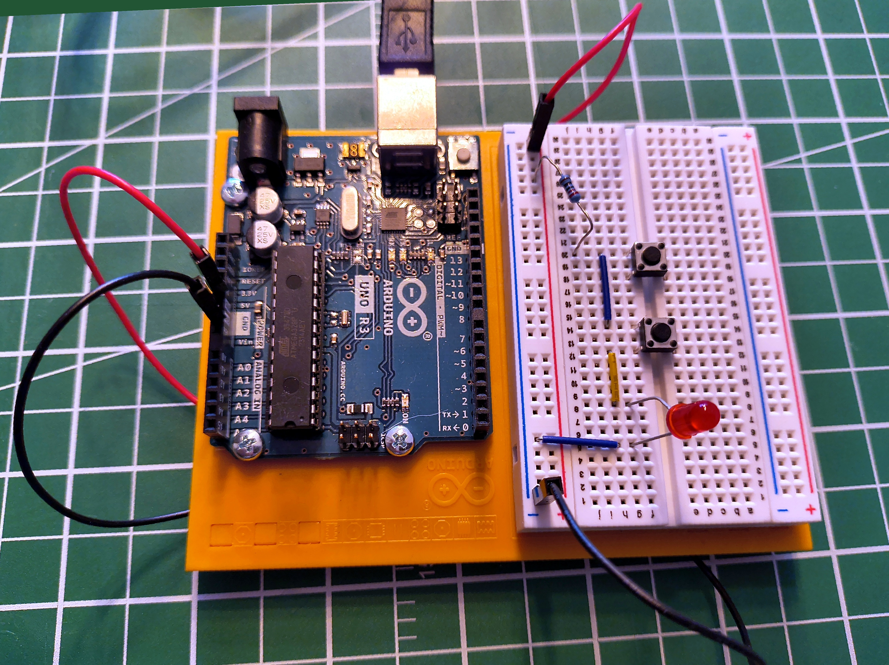
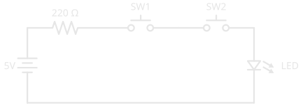
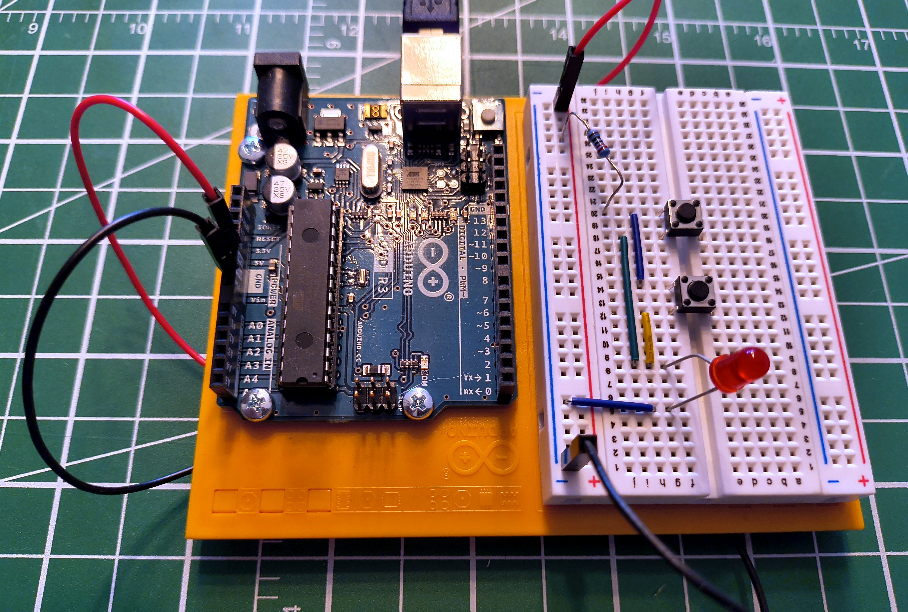
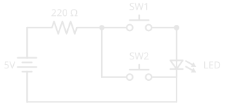
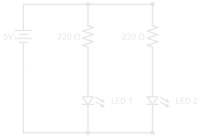
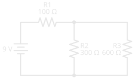
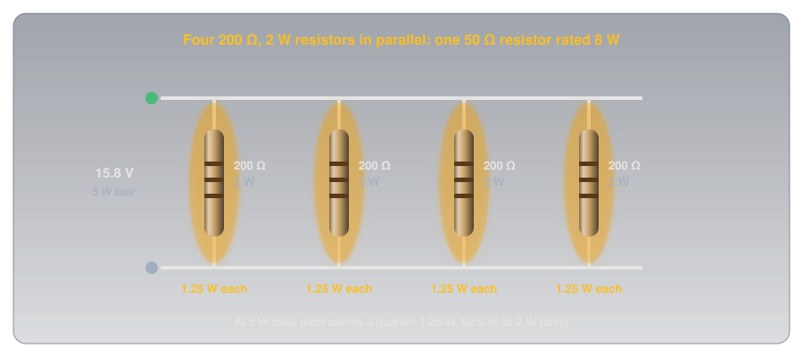

# Series and Parallel Circuits

!!! abstract "Beginner"
    This article builds on [Voltage](voltage.md), [Current](current.md), and [Ohm's Law and Power](ohms_law.md); read those first if voltage, current, and resistance are new to you.

An old string of Christmas lights goes completely dark when one bulb dies. The lamps in a house don't: one burns out and every other one stays lit. The first is a series circuit, the second a parallel one.

Two patterns, and every circuit ever built uses one, the other, or a combination of both. This article covers what's physically different between them, and how to predict what voltage, current, and resistance do in each.

---

## The Fundamental Difference

In a **series circuit**, current has exactly one path to follow. In a **parallel circuit**, current has multiple paths available. That single difference changes how voltage, current, and resistance behave across the entire circuit. The two tabs below show each arrangement as a real breadboard build and as a schematic; if schematic symbols are new to you, [How to Read a Schematic](reading_schematics.md) explains each one.

---

=== "Series"

    In a series circuit, every component is connected end-to-end in a single chain. Current must pass through each component in turn, with no alternative route.

    For the LED to light, **both switches must be pressed at the same time**. Either switch open breaks the path, and no current flows anywhere. A single current-limiting resistor at the start of the chain limits the current through the whole circuit to protect the LED.

    <figure markdown>
      { width="500" }
      <figcaption>Series circuit: both switches must be pressed to complete the path and light the LED. The resistor sits before both switches, limiting current through the entire chain.</figcaption>
    </figure>

    Here is the same circuit drawn as a **schematic**. Trace the single loop: the supply pushes current through the resistor, through `SW1`, through `SW2`, through the LED, and back. One path, no branches.

    <figure markdown>
      { width="500" }
      <figcaption>The same series circuit as a schematic. The zig-zag is the resistor, the gapped symbols are the pushbuttons, and the triangle-and-bar with arrows is the LED. Everything sits on one unbroken loop.</figcaption>
    </figure>

    This is the essential nature of a series circuit: every component is a gatekeeper. All of them must allow current through, or none of it flows.

    ### Voltage Divides

    The supply voltage doesn't stay the same throughout the circuit. Each component has a voltage drop across it, and those drops always add up to the total supply:

    \[ V_{\text{supply}} = V_1 + V_2 + V_3 + \cdots \]

    This is called **voltage division**. The voltage is shared across the components in proportion to their resistance.

    The reason follows directly from Ohm's Law. Because there is only one path, the same current flows through every component. Since \( V = I \times R \), a component with higher resistance drops more voltage for the same current: the bigger the resistance, the larger its share of the supply.

    ??? example "Worked example"

        A 9V supply driving R1 = 300 Ω and R2 = 600 Ω in series.

        Total resistance:

        \[ R_{\text{total}} = 300 + 600 = 900\ \Omega \]

        Current (the same through every component, since there's only one path):

        \[ I = \frac{V}{R} = \frac{9\text{ V}}{900\ \Omega} = 10\text{ mA} \]

        Voltage across each resistor:

        \[ V_{R_1} = I \times R = 0.010\text{ A} \times 300\ \Omega = 3\text{ V} \]

        \[ V_{R_2} = I \times R = 0.010\text{ A} \times 600\ \Omega = 6\text{ V} \]

        Check: \( 3 + 6 = 9\text{ V} \) ✓

        The larger resistor takes the larger share of the voltage. Tapping the point between the two resistors gives a fixed fraction of the supply, here 6V from 9V: the **[voltage divider](voltage_divider.md)**, one of the most useful sub-circuits in electronics.

    **The general rules for series:**

    \[ R_{\text{total}} = R_1 + R_2 + R_3 + \cdots \]

    \[ I = \frac{V_{\text{supply}}}{R_{\text{total}}} \quad \text{(same current through every component)} \]

    ### What Happens When One Component Fails

    If any component in a series circuit breaks open (a burned-out bulb, a broken wire, a switch left open), the path is severed and no current flows anywhere.

    That's the old Christmas lights: one bad bulb, whole string out. Modern mini-light strings are still wired in series, but each bulb has a tiny **shunt** wire that closes when its filament burns out, so current bypasses the dead bulb and the rest stay lit. [Open Circuits, Short Circuits, and Fuses](open_short_fuses.md) covers what a break does to every voltage in the loop.

    !!! tip "Try it yourself"
        Build this circuit on a breadboard; it takes less than five minutes. You'll need two pushbutton switches, one LED, and a 220 Ω resistor. The LED has polarity: the longer leg (anode) goes toward positive, and if it doesn't light, flip it around. See [Breadboards](tools/breadboards.md) if you haven't used one before.

=== "Parallel"

    In a parallel circuit, two or more branches share the same two connection points: the supply and the return to ground. Current can flow through any branch independently of the others.

    In this circuit, the two switches are the parallel branches. A single current-limiting resistor before both switches, shared by both paths, limits the current through the LED. Press **either** switch and current flows through that branch. Press both and current flows through both branches simultaneously.

    <figure markdown>
      { width="500" }
      <figcaption>Parallel circuit: either switch independently completes its own path to the LED. A single resistor before both switches limits the current.</figcaption>
    </figure>

    The schematic makes the two branches obvious. After the resistor, the wire splits: `SW1` rides the top branch and `SW2` rides the bottom, and both rejoin before the LED. Either branch on its own completes a path.

    <figure markdown>
      { width="500" }
      <figcaption>The same parallel circuit as a schematic. The wire splits into two branches after the resistor, one through SW1 and one through SW2, and they merge again at the LED.</figcaption>
    </figure>

    This is the essential nature of a parallel circuit: multiple paths mean multiple opportunities for current to flow. Any one path completing is enough.

    ### Voltage Stays the Same

    Every branch in a parallel circuit sees the full supply voltage. Whether one switch is pressed or both, the LED sees the same voltage.

    This is a fundamental rule: **voltage is the same across every parallel branch**.

    You might wonder: if both switches are pressed and current flows through two paths, does the resistor drop more voltage and leave less for the LED? In practice, no. Each switch has near-zero resistance when closed, so the parallel combination is near-zero whether one or two paths are active. The resistor and LED divide the supply voltage the same way regardless.

    ### Current Divides

    When multiple parallel branches are active at once, the total current drawn from the supply is the sum of the current in each branch:

    \[ I_{\text{total}} = I_1 + I_2 + \cdots \]

    Each branch responds only to the voltage across it. A branch with resistance R draws \( I = V/R \) whatever the other branches are doing, so the lowest-resistance branch carries the most current, and the supply delivers the sum.

    **Total resistance in a parallel circuit decreases as you add branches:**

    \[ \frac{1}{R_{\text{total}}} = \frac{1}{R_1} + \frac{1}{R_2} + \frac{1}{R_3} + \cdots \]

    ??? example "Worked example"

        Two 220 Ω resistors in parallel across a 5V supply.

        Each resistor sees the full 5V:

        \[ I = \frac{V}{R} = \frac{5\text{ V}}{220\ \Omega} = 22.7\text{ mA} \]

        Total current from the supply:

        \[ I_{\text{total}} = 22.7 + 22.7 = 45.5\text{ mA} \]

        Applying the parallel resistance formula:

        \[ \frac{1}{R_{\text{total}}} = \frac{1}{220} + \frac{1}{220} = \frac{2}{220} \implies R_{\text{total}} = 110\ \Omega \]

        Two 220 Ω resistors in parallel behave as a single 110 Ω resistor. Adding more paths makes it easier for current to flow, so total resistance falls, always below the smallest branch.

    Two shortcuts save the reciprocal arithmetic. **Identical resistors:** n equal resistors in parallel give R ÷ n, so four 100 Ω resistors make 25 Ω. **Exactly two resistors:** the total is their product over their sum,

    \[ R_{\text{total}} = \frac{R_1 \times R_2}{R_1 + R_2} \]

    so 300 Ω and 600 Ω in parallel give 180,000 ÷ 900 = 200 Ω. Thinking in [conductance](resistance.md#idea-two-conductance-the-same-property-flipped) makes the rule obvious: in parallel, conductances simply add.

    ### What Happens When One Component Fails

    If one branch fails, current stops flowing in that branch only. Every other branch continues completely unaffected.

    That's how a house is wired: one lamp failing doesn't affect the others on the same circuit.

    !!! tip "Try it yourself"
        Build the parallel version alongside the series circuit and compare them directly; the difference is immediately obvious. Same components: two pushbutton switches, one LED, and a 220 Ω resistor, with the LED's longer leg toward positive. See [Breadboards](tools/breadboards.md) if you haven't used one before.

---

## Series vs. Parallel at a Glance

| | Series | Parallel |
|---|---|---|
| **Paths for current** | One | Multiple |
| **To complete the circuit** | All components must allow current | Any one path completing is enough |
| **Current** | Same through every component | Splits; each branch carries its own |
| **Voltage** | Divides across components | Same across every branch |
| **Total resistance** | Increases with each component added | Decreases with each component added |
| **One component fails** | Entire circuit stops | Only that branch is affected |
| **Common use** | Voltage dividers, switch logic, current limiting | House wiring, LED arrays, battery banks |

---

## Real Circuits Use Both

Most practical circuits combine the two topologies. Consider a row of indicator LEDs: each needs its own current-limiting resistor in series (the same resistor every [LED driven by a microcontroller pin](digital_io.md) needs), but they should all run independently at full brightness from the same supply, in parallel. Any time you have multiple independent loads from the same supply, this pattern applies.

<figure markdown>
  { width="500" }
  <figcaption>Two LED branches in parallel, each with its own series resistor. Follow either branch top to bottom: resistor then LED, in series. The two branches hang in parallel off the same supply.</figcaption>
</figure>

Each resistor is in **series** with its LED and limits that LED's current. The two pairs are in **parallel** with each other, so each gets the full supply voltage independently.

Recognising these nested patterns is what lets you look at a circuit and immediately understand what each part is doing.

### Reducing a Network Step by Step

When every part is a resistor, nested series and parallel groups can be collapsed into a single equivalent resistance, one group at a time, working from the inside out. Here a 100 Ω resistor feeds a 300 Ω and a 600 Ω resistor in parallel:

<figure markdown>
  { width="420" }
  <figcaption>R1 carries all the current. R2 and R3 split it.</figcaption>
</figure>

<figure markdown>
  { width="760" }
  <figcaption>Collapse the innermost group first, then whatever it's in series or parallel with.</figcaption>
</figure>

1. **The parallel pair:** 300 × 600 ÷ (300 + 600) = 200 Ω.
2. **Add the series part:** 100 + 200 = 300 Ω in total, so the battery supplies 9 V ÷ 300 Ω = **30 mA**.
3. **Work back out:** all 30 mA flows through R1, which takes 0.030 A × 100 Ω = 3 V. That leaves 6 V across the parallel pair, so R2 carries 6 V ÷ 300 Ω = 20 mA and R3 carries 6 V ÷ 600 Ω = 10 mA.

The check closes the loop: 3 V + 6 V = 9 V around the circuit, and 20 mA + 10 mA = 30 mA into the junction. When a hand calculation passes both checks, it's right.

---

## Sharing the Heat: Power Ratings in Combination

Combining resistors changes more than the resistance. Each one in a group dissipates its own power, and each has its own [power rating](ohms_law.md#power-ratings), so a combination can handle more heat than any single part in it, or fail at a fraction of what you'd expect.

### Identical Resistors Share Equally

When the resistors are identical, each takes an equal share of the heat, in series or in parallel. Two 500 Ω, 1 W resistors in series make 1 kΩ that can dissipate **2 W**. The same two in parallel make 250 Ω that can also dissipate **2 W**. Either way, n identical resistors can handle n times the power of one.

That gives a useful trick: to get a resistance in a higher power rating than you have in stock, build it from several. Two 100 Ω resistors in parallel are 50 Ω, the same as one 50 Ω resistor, with twice the power rating. Radio transmitters are tested into a 50 Ω load that has to absorb the full output power, and four 200 Ω, 2 W resistors in parallel make one that can take 8 W:

<figure markdown>
  { width="760" }
  <figcaption>Four parts, one resistance, four times the heat capacity.</figcaption>
</figure>

### Unequal Resistors: Check Each One

When the values differ, the heat doesn't split evenly, and which resistor runs hottest depends on how they're connected:

- **In series**, every resistor carries the same current, so by P = I² × R the **largest** resistance dissipates the most.
- **In parallel**, every resistor sees the same voltage, so by P = V² ÷ R the **smallest** resistance dissipates the most.

<figure markdown>
  { width="760" }
  <figcaption>The same two ¼ W resistors on the same 12 V. In series both are safe; in parallel one burns.</figcaption>
</figure>

The rule is to calculate each resistor's power on its own and compare it with that resistor's rating. The first one to reach its limit sets the limit for the whole group, however much headroom the others have.

### Bigger Bodies, Bigger Ratings

A resistor's power rating is set by how much heat it can shed without damage, and that depends mostly on its surface area. That's why resistors of the same value come in different sizes: a ¼ W through-hole resistor is a few millimetres long, and a 10 W one is a ceramic block several centimetres long. When a circuit needs to dissipate more heat at the same resistance, the answer is a physically larger resistor (or several smaller ones sharing the load), and the half-rating rule of thumb from [Ohm's Law and Power](ohms_law.md#power-ratings) still applies to each part.

---

## Safety

Parallel wiring is where currents quietly add up, and where the most dangerous wiring mistake hides.

!!! warning "More Parallel Branches = More Total Current"
    Every additional parallel branch draws its own current from the supply. A single LED at 20 mA is well within the limits of a USB supply. But motors, heating elements, or high-power LEDs multiplied across many parallel branches add up quickly. Always calculate total current before adding parallel loads, and verify your power source can deliver it.

Any wire that lands across the supply by mistake is itself a parallel branch, and the worst kind:

!!! danger "Short Circuits in Parallel"
    A short circuit, a path with near-zero resistance placed in parallel with your circuit, gives current an almost-free route around everything else. All the current the source can deliver rushes through it: wires heat rapidly, components are destroyed, and lithium batteries can ignite. Fuses and circuit breakers are deliberate weak points that fail safely before the wiring does; [Open Circuits, Short Circuits, and Fuses](open_short_fuses.md) explains how.

---

## Practice

??? question "1. Two Switches, One LED"

    You wire two switches and an LED so that pressing either switch lights the LED, and pressing both also lights the LED. Is this series or parallel? What changes if you rewire it so that both switches must be pressed simultaneously?

    ??? tip "Solution"
        **Either switch lights the LED:** this is **parallel**. Each switch provides its own path to the LED, and any complete path is enough.

        **Both switches required:** this is **series**. There is one path, and both switches must be closed for current to flow through it. One switch open breaks the only path.

        This is the clearest demonstration of the difference between the two topologies.

??? question "2. Series Voltage Division"

    A 9V battery powers three resistors in series: R1 = 100 Ω, R2 = 200 Ω, R3 = 400 Ω. What current flows through the circuit? What voltage appears across each resistor?

    ??? tip "Solution"

        \[ R_{\text{total}} = 100 + 200 + 400 = 700\ \Omega \]

        \[ I = \frac{V}{R} = \frac{9\text{ V}}{700\ \Omega} = 12.9\text{ mA} \]

        \[ V_{R_1} = I \times R = 0.0129\text{ A} \times 100\ \Omega = 1.29\text{ V} \]

        \[ V_{R_2} = I \times R = 0.0129\text{ A} \times 200\ \Omega = 2.57\text{ V} \]

        \[ V_{R_3} = I \times R = 0.0129\text{ A} \times 400\ \Omega = 5.14\text{ V} \]

        Check: \( 1.29 + 2.57 + 5.14 = 9\text{ V} \) ✓

        The largest resistor takes the largest share of the voltage.

??? question "3. Parallel Current Draw"

    Three identical 470 Ω resistors are connected in parallel across a 5V supply. What current flows through each? What is the total current drawn from the supply?

    ??? tip "Solution"

        Each resistor sees the full 5V, since voltage is the same across every parallel branch.

        \[ I = \frac{V}{R} = \frac{5\text{ V}}{470\ \Omega} = 10.6\text{ mA} \]

        \[ I_{\text{total}} = 10.6 + 10.6 + 10.6 = 31.9\text{ mA} \]

        Cross-check: \( R_{\text{total}} = 470 \div 3 = 156.7\ \Omega \), then \( I = 5\text{ V} \div 156.7\ \Omega = 31.9\text{ mA} \) ✓

??? question "4. Household Wiring"

    A house has several power outlets on the same circuit. Plugging in a lamp doesn't affect the other outlets. Plugging in too many high-draw appliances trips the circuit breaker. Which topology is this, and why does the breaker trip?

    ??? tip "Solution"
        This is a **parallel** circuit. Each outlet connects independently to the same supply voltage, which is why one appliance failing or switching off doesn't affect any other.

        The breaker trips because of the parallel current rule: each additional load draws its own current, and all those branch currents add up at the supply. Enough appliances running simultaneously and the total current exceeds the breaker's rating (typically 15A or 20A in residential wiring). The breaker opens the circuit safely before the wiring overheats.

??? question "5. Reduce the Network"

    A 12 V battery feeds a 1 kΩ resistor in series with a 1 kΩ and a 1.5 kΩ resistor in parallel. What's the total resistance, and how much current flows?

    ??? tip "Solution"
        The parallel pair first: 1 × 1.5 ÷ (1 + 1.5) = 0.6 kΩ, or 600 Ω. Then add the series resistor: 1,000 + 600 = **1.6 kΩ**. The current is 12 V ÷ 1,600 Ω = **7.5 mA**.

??? question "6. Two 1 W Resistors"

    Two 500 Ω, 1 W resistors are connected first in series, then in parallel. What's the most power each combination can safely dissipate?

    ??? tip "Solution"
        **2 W in both cases.** The resistors are identical, so they always share the heat equally, and two 1 W parts can take 2 W between them. Only the resistance changes: 1 kΩ in series, 250 Ω in parallel.

??? question "7. Building a Load"

    You need a 50 Ω resistor that can dissipate 5 W, and you have 200 Ω, 2 W resistors. How many do you need, and how should they be connected?

    ??? tip "Solution"
        **Four in parallel.** Four equal resistors in parallel give 200 ÷ 4 = 50 Ω, and four 2 W parts can share 8 W. At 5 W each one carries 1.25 W, about 62% of its rating, so the combination is comfortably within limits.

---

## Quick Recap

-   **Series**

    ---

    One path. All components must allow current. Same current everywhere. Voltage divides. Total resistance adds up. One failure stops everything.

    \( R_{\text{total}} = R_1 + R_2 + R_3 \)

-   **Parallel**

    ---

    Multiple paths. Any one path completing is enough. Same voltage everywhere. Current divides. Total resistance decreases. One failure is isolated.

    \( \dfrac{1}{R_{\text{total}}} = \dfrac{1}{R_1} + \dfrac{1}{R_2} + \dfrac{1}{R_3} \)

-   **Reduce from the inside out**

    ---

    Collapse each nested series or parallel group into one resistance, then work back out to find each part's voltage and current.

-   **Every resistor has its own rating**

    ---

    Identical resistors share heat equally. Unequal ones don't: in series the largest runs hottest, in parallel the smallest. Check each against its rating.

---

## What's Next

Two resistors in series, with a wire from the point between them, make the most useful sub-circuit in electronics: **[Voltage Dividers](voltage_divider.md)** shows how they set any voltage you need, and why the output sags the moment something draws current from it.

Meanwhile, build both circuits on a [breadboard](tools/breadboards.md). The behavioural difference between series and parallel is immediately obvious the moment you press the switches.

---

## Further Reading

**Fundamentals**

- [Series and Parallel Circuits — SparkFun](https://learn.sparkfun.com/tutorials/series-and-parallel-circuits) — clear worked examples covering resistors, capacitors, and inductors
- [Series Circuits — The Physics Classroom](https://www.physicsclassroom.com/class/circuits/Lesson-4/Series-Circuits) — current, voltage, and resistance rules with practice problems
- [Parallel Circuits — The Physics Classroom](https://www.physicsclassroom.com/class/circuits/Lesson-4/Parallel-Circuits) — parallel rules in detail with mathematical analysis

**Tools**

- [Parallel and Series Resistor Calculator — Digi-Key](https://www.digikey.ca/en/resources/conversion-calculators/conversion-calculator-parallel-and-series-resistor) — enter up to 10 resistor values and get combined resistance instantly

**Related Articles**

- [Resistor Color Codes](resistor_color_codes.md) — decode the 220 Ω resistor used throughout this article's circuits by its painted bands
- [Cells and Batteries](batteries.md) — series and parallel applied to cells: more voltage, or more capacity
