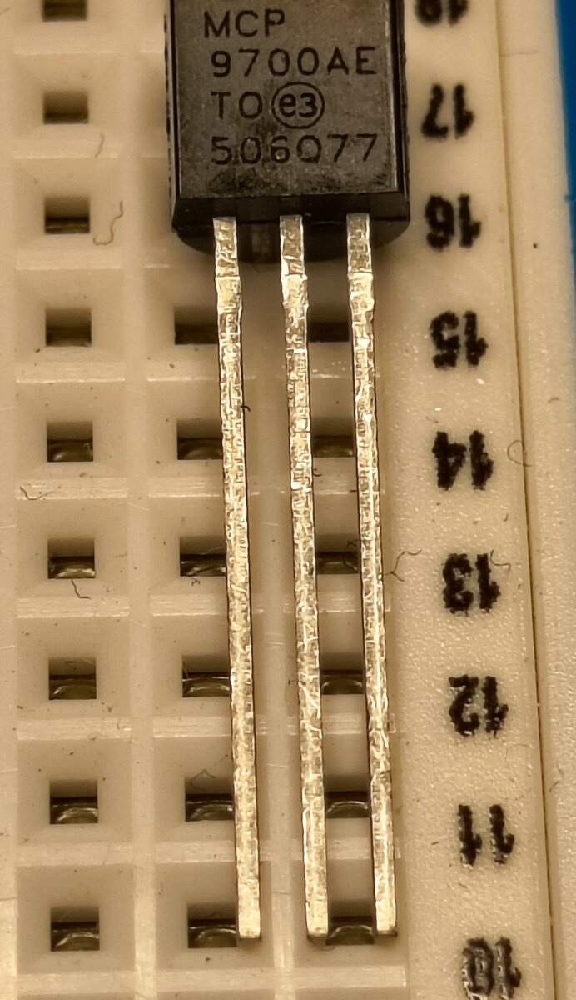
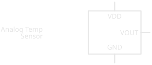
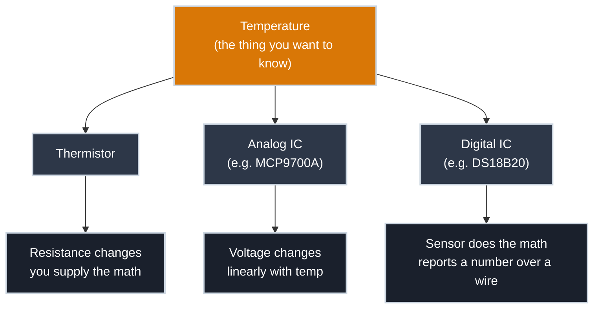

# Temperature Sensors

!!! abstract "Beginner"
    This article is in the **Components** topic. It uses the voltage and Ohm's Law from [What Is Electricity?](what_is_electricity.md). No microcontroller appears yet — that's [Reading an Analog Sensor](analog_input.md), the article this one sets up.

A microcontroller pin can only ever measure one thing: voltage. Not heat, not light, not pressure — voltage. So how does a $2 sensor let a circuit know a room has gotten warmer?

It doesn't measure heat directly. Instead, it exploits a material that *changes* in some voltage-measurable way as it warms up, and the sensor's whole job is turning that change into a number a circuit can use. By the end of this article you'll know the three common ways that trick gets pulled off, and exactly how one of them — the sensor you'll wire up next — turns temperature into a voltage you can read with a single wire.

<figure markdown>
  { width="480" }
  <figcaption>The MCP9700A: the same TO-92 shape as a common transistor, with three legs doing three separate jobs.</figcaption>
</figure>

Drawn as a schematic, that pinout looks like this:

<figure markdown>
  { width="420" }
  <figcaption>The pinout shared by most small analog temperature sensors: power in, ground, and one pin that reports a voltage proportional to temperature.</figcaption>
</figure>

---

## Three Ways to Sense Heat

Every temperature sensor is built around a material property that shifts predictably with heat. Which property, and how much translation work the sensor does for you, is what separates the three common types.

-   :material-resistor: **Thermistor**

    ---

    **What changes:** its resistance, sharply and nonlinearly, as temperature rises.

    **What you get:** nothing directly readable — you form a voltage divider with a known resistor, measure the divider's output voltage, then convert *that* back to a resistance and finally to a temperature using a formula specific to that thermistor.

    **Trade-off:** cheap and physically tiny, but all the conversion math is on you, and the relationship isn't a straight line.

-   :material-chip: **Analog IC**

    ---

    **What changes:** nothing you measure directly — the chip has a tiny reference circuit inside it that already did the thermistor's job, and outputs a clean, **linear** voltage instead.

    **What you get:** a voltage that rises by a fixed, predictable amount per degree. One `analogRead()`, one small formula, done.

    **Trade-off:** less flexible than a bare thermistor, but far less math, and the part this article (and the next one) focuses on.

-   :material-serial-port: **Digital IC**

    ---

    **What changes:** internally, something similar to the analog IC — but the chip goes a step further and does the voltage-to-temperature conversion itself, then reports a ready-made number over a digital protocol (often One-Wire or I²C).

    **Trade-off:** the most convenient and often the most accurate, at the cost of a slightly more involved wiring and code setup than a single analog pin.

None of these are "more correct" than the others — they're a trade-off between how much conversion work happens inside the sensor versus inside your code. This site starts with the analog IC because it's the shortest path from a physical sensor to a number you understand, with the least new machinery to learn at once.

---

## Inside an Analog Temperature IC

The sensor you'll wire up next, the `MCP9700A`, is an analog IC. Physically it's a small black **TO-92** package — the same shape used for common transistors — with three legs: power, ground, and one output pin, matching the generic pinout shown in the schematic above. Internally, it contains a small reference circuit built from transistors whose voltage output happens to change in a very predictable, very linear way as the chip's own temperature changes. The manufacturer has already done the hard part: characterizing that relationship at the factory so every unit behaves the same way.

What you get on the output pin is a straight line: **voltage rises by a fixed 10 mV for every 1°C**, with a **500 mV offset built in at 0°C**. That offset is a deliberate design choice — the sensor runs on a single positive supply and physically cannot output a negative voltage, but temperature regularly *is* negative. Shifting the whole scale up by 500 mV lets a chip running on 5V still represent temperatures well below freezing without ever asking for a voltage the circuit can't produce.

Put as a formula, output voltage in volts as a function of temperature in Celsius:

\[
V_{out} = 0.5 + (0.01 \times T)
\]

Rearranged to go the other direction — voltage measured, temperature wanted, which is what you'll actually do in code next:

\[
T = \frac{V_{out} - 0.5}{0.01}
\]

Try it: room temperature, 22°C, gives \( V_{out} = 0.5 + (0.01 \times 22) = 0.72\text{V} \). A `MCP9700A` sitting on your desk right now is outputting something very close to that.

!!! info "Accuracy has a limit"
    The [`MCP9700A` datasheet](https://ww1.microchip.com/downloads/en/DeviceDoc/20001942G.pdf) rates this sensor at ±2°C (max) from 0°C to 70°C, typically closer to ±1°C. Good enough to answer "is it getting warmer in here" or "did that closet just spike ten degrees" — not precise enough for lab or medical use.

---

## Wiring It Is Just Three Pins

A resistor doesn't care which way it's installed, and an LED only asks you to check one thing — which leg is which. This sensor asks more of you: three specific jobs assigned to three specific pins — power, ground, and signal — and none of them are interchangeable.

The power pin is labelled `VDD` on the [`MCP9700A`'s datasheet](https://ww1.microchip.com/downloads/en/DeviceDoc/20001942G.pdf). Other datasheets label the same job `VCC` instead — the name just depends on which family of transistor the chip is built from internally, `VDD` from a MOSFET's *Drain* terminal, `VCC` from a bipolar transistor's *Collector*. You don't need the transistor theory behind either name; both mean exactly the same thing: "connect this to your positive supply." Just match whichever label the part in front of you actually uses, rather than assuming.

!!! warning "Reversed Power Pins Can Destroy the Sensor"
    Swap VDD and GND on this part and, unlike a resistor, it isn't forgiving — you can damage the sensor permanently in seconds. Before powering the circuit, double-check the pinout against the datasheet or the packaging, not against memory.

---

## Practice

??? question "1. Reading the voltage"

    A `MCP9700A` outputs 0.62V. What temperature does that represent?

    ??? tip "Solution"

        \( T = (0.62 - 0.5) / 0.01 = 12°C \).

??? question "2. Predicting the voltage"

    Your freezer sits at -18°C. What voltage should the sensor output?

    ??? tip "Solution"

        \( V_{out} = 0.5 + (0.01 \times -18) = 0.32\text{V} \). This is exactly why the 500 mV offset exists — without it, a negative temperature would need a negative voltage the chip can't produce.

??? question "3. Choosing a sensor type"

    You need to log a greenhouse's temperature once a minute from across the yard, over a single cheap wire, with a device that does its own math and hands you a clean number. Which of the three sensor types fits best, and why?

    ??? tip "Solution"

        A **digital IC** sensor. The analog IC would work too, but it needs an analog-capable pin and you'd write the conversion math yourself. A digital sensor reports an already-converted number over a single data line, which is exactly what a long single-wire run to a remote location benefits from.

---

## Quick Recap

-   **The Core Problem**

    ---

    A microcontroller pin only measures voltage. Every temperature sensor's job is turning heat into a voltage (or a number) some other way.

-   **Three Types, One Trade-off**

    ---

    Thermistor (cheap, nonlinear, you do the math), analog IC (linear voltage, minimal math), digital IC (sensor does the math, reports a ready-made number).

-   **The MCP9700A's Formula**

    ---

    10 mV per °C, with a 500 mV offset at 0°C so negative temperatures don't require a negative voltage: \( V_{out} = 0.5 + (0.01 \times T) \).

-   **Three Pins, No Room for Error**

    ---

    VDD, GND, and VOUT are each a specific job. Reversing power pins can destroy the part — check the pinout before powering it.

---

## What's Next

You now know why the `MCP9700A`'s output voltage means what it means. [Reading an Analog Sensor](analog_input.md) wires this exact sensor to an Arduino and turns that voltage into a live temperature reading with `analogRead()`.

---

## Further Reading

**Datasheets**

- [MCP9700/9700A Datasheet — Microchip](https://ww1.microchip.com/downloads/en/DeviceDoc/20001942G.pdf) — full electrical specifications, accuracy, and package details

**Related Articles**

- [What Is Electricity?](what_is_electricity.md) — the voltage this sensor's whole output is built from
- [Reading an Analog Sensor](analog_input.md) — wiring this sensor to an Arduino and reading it in code
- [Package Types](package_types.md) — the TO-92 shape this sensor comes in, and the other package families you'll meet
- [How to Read a Schematic](reading_schematics.md) — decoding IC symbols like the one in this article
