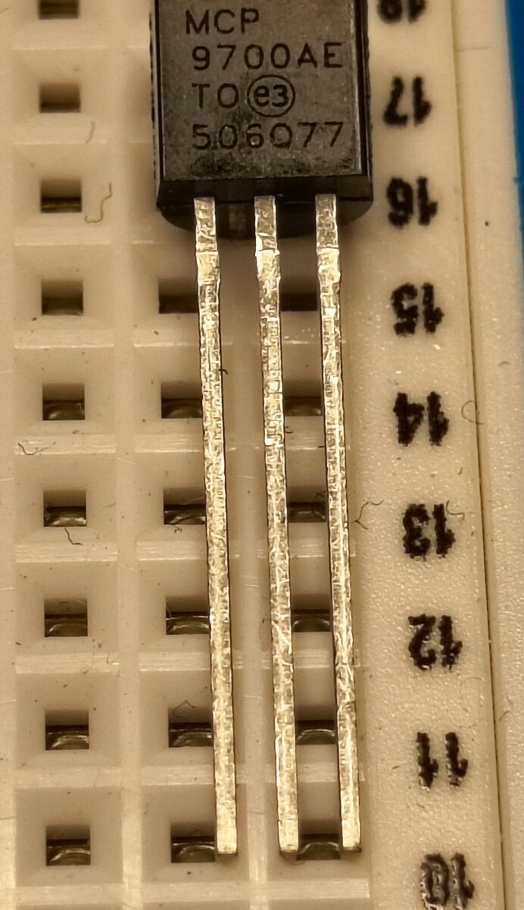
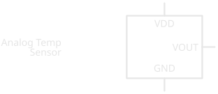
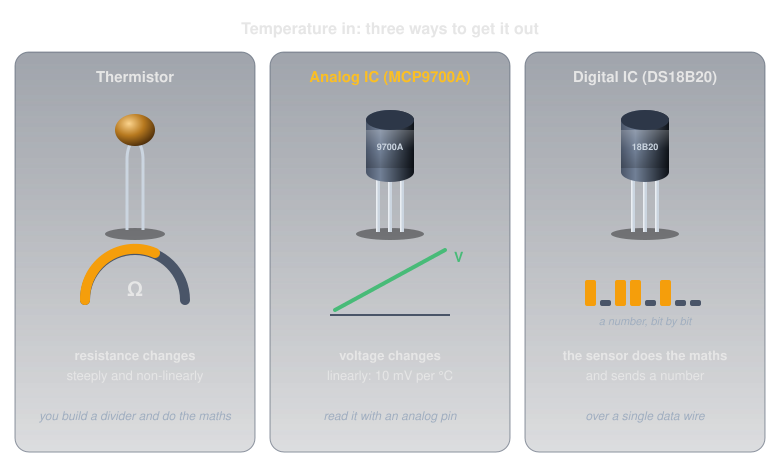

# Temperature Sensors

!!! abstract "Beginner"
    This article is in the **Components** topic. It uses [Voltage](voltage.md) and [Ohm's Law](ohms_law.md). No microcontroller appears yet: that's [Reading an Analog Sensor](analog_input.md), the article this one sets up.

A microcontroller's analog pin measures exactly one thing: voltage. Not heat, not light, not pressure. So how does a $2 sensor tell a circuit that a room has got warmer?

It never measures heat directly. It relies on a material property that changes predictably as it warms, and its whole job is turning that change into something a circuit can read. This article covers the three common ways that's done, and exactly how one of them, the sensor wired up in the next article, turns temperature into a voltage on a single pin.

<figure markdown>
  { width="480" }
  <figcaption>The MCP9700A: the same TO-92 shape as a common transistor, with three legs doing three separate jobs.</figcaption>
</figure>

Drawn as a schematic, the three legs become three labelled pins:

<figure markdown>
  { width="420" }
  <figcaption>The pinout shared by most small analog temperature sensors: power in, ground, and one pin that reports a voltage proportional to temperature.</figcaption>
</figure>

---

## Three Ways to Sense Heat

Every temperature sensor is built around a material property that shifts predictably with heat. Which property, and how much translation work the sensor does for you, is what separates the three common types.

<figure markdown>
  { width="720" }
  <figcaption>Same job, three outputs: a resistance, a voltage, or a finished number.</figcaption>
</figure>

-   :material-resistor: **Thermistor**

    ---

    **What changes:** its resistance, sharply and nonlinearly, as temperature rises. Every material's resistance moves with temperature ([Resistance and Conductance](resistance.md) explains why); a thermistor is made to move a lot.

    **What you get:** nothing directly readable. You pair it with a known resistor as a voltage divider, measure the divider's output voltage, convert that back to a resistance, and finally to a temperature with a formula specific to that thermistor.

    **Trade-off:** cheap and physically tiny, but all the conversion math is on you, and the relationship isn't a straight line.

-   :material-chip: **Analog IC**

    ---

    **What changes:** the voltage across transistor junctions inside the chip, which shifts steadily with temperature. The chip's own circuitry turns that into a clean, **linear** output voltage.

    **What you get:** a voltage that rises by a fixed, predictable amount per degree. One `analogRead()`, one small formula, done.

    **Trade-off:** less flexible than a bare thermistor, but far less math, and the part this article (and the next one) focuses on.

-   :material-serial-port: **Digital IC**

    ---

    **What changes:** internally, much the same as the analog IC, but the chip also does the voltage-to-temperature conversion itself and reports a ready-made number over a digital protocol (often 1-Wire or I²C).

    **Trade-off:** the most convenient and often the most accurate (the `DS18B20` is rated ±0.5°C), at the cost of a slightly more involved wiring and code setup than a single analog pin.

The difference between them is where the conversion work happens: inside the sensor or inside your code. This site starts with the analog IC because it's the shortest path from a physical sensor to a number you understand, with the least new machinery to learn at once.

---

## Inside an Analog Temperature IC

The sensor you'll wire up next, the `MCP9700A`, is an analog IC. Physically it's a small black **TO-92** package, the same shape as a common transistor, with three legs: power, ground, and one output. Inside, the voltage across its transistors' junctions changes in a very predictable, nearly linear way with the chip's own temperature. The manufacturer has done the hard part, designing and trimming the circuit so every unit follows the same line.

What you get on the output pin is a straight line: **voltage rises by a fixed 10 mV for every 1°C**, with a **500 mV offset built in at 0°C**. The offset is deliberate. The sensor runs on a single positive supply and can't output a negative voltage, but temperatures often *are* negative. Shifting the whole scale up by 500 mV lets it represent temperatures down to −40°C (0.1V) without needing a voltage the circuit can't produce.

Put as a formula, output voltage in volts as a function of temperature in Celsius:

\[
V_{out} = 0.5 + (0.01 \times T)
\]

Rearranged the other way round (voltage measured, temperature wanted), which is what the code in the next article does:

\[
T = \frac{V_{out} - 0.5}{0.01}
\]

Try it: room temperature, 22°C, gives \( V_{out} = 0.5 + (0.01 \times 22) = 0.72\text{V} \). An `MCP9700A` sitting on a desk outputs something very close to that.

!!! tip "Accuracy has a limit"
    The [`MCP9700A` datasheet](https://ww1.microchip.com/downloads/en/DeviceDoc/20001942G.pdf) rates this sensor at ±2°C (max) from 0°C to 70°C, typically closer to ±1°C. Good enough to answer "is it getting warmer in here?" or "did that closet just spike ten degrees?", but not for lab or medical use.

---

## Wiring It Is Just Three Pins

A resistor doesn't care which way round it goes, and an LED asks you to check one thing: which leg is which. This sensor asks more: three pins with three jobs (power, ground, and signal), none of them interchangeable.

The power pin is labelled `VDD` on the [`MCP9700A`'s datasheet](https://ww1.microchip.com/downloads/en/DeviceDoc/20001942G.pdf). Other datasheets call the same pin `VCC`. The name comes from the transistor family the chip is built from (`VDD` from a MOSFET's *drain*, `VCC` from a bipolar transistor's *collector*), but both mean "connect this to the positive supply." Match whichever label the part in front of you uses.

!!! warning "Reversed Power Pins Can Destroy the Sensor"
    Swap VDD and GND on this part and you can damage it permanently in seconds. Before powering the circuit, double-check the pinout against the datasheet or the packaging, not against memory.

---

## Practice

??? question "1. Reading the voltage"

    A `MCP9700A` outputs 0.62V. What temperature does that represent?

    ??? tip "Solution"

        \( T = (0.62 - 0.5) / 0.01 = 12°C \).

??? question "2. Predicting the voltage"

    Your freezer sits at -18°C. What voltage should the sensor output?

    ??? tip "Solution"

        \( V_{out} = 0.5 + (0.01 \times -18) = 0.32\text{V} \). This is why the 500 mV offset exists: without it, a negative temperature would need a negative voltage the chip can't produce.

??? question "3. Choosing a sensor type"

    You need to log a greenhouse's temperature once a minute from across the yard, over a single cheap wire, with a device that does its own math and hands you a clean number. Which of the three sensor types fits best, and why?

    ??? tip "Solution"

        A **digital IC** sensor. The analog IC would work too, but it needs an analog-capable pin and you'd write the conversion math yourself. A digital sensor reports an already-converted number over one data line (plus ground), and a number survives a long cable run, where a small analog voltage would pick up noise and lose a little in the wire.

---

## Quick Recap

-   **The Core Problem**

    ---

    A microcontroller pin only measures voltage. Every temperature sensor's job is turning heat into a voltage (or a number) some other way.

-   **Three Types, One Trade-off**

    ---

    Thermistor (cheap, nonlinear, you do the math), analog IC (linear voltage, minimal math), digital IC (sensor does the math, reports a ready-made number).

-   **The MCP9700A's Formula**

    ---

    10 mV per °C, with a 500 mV offset at 0°C so negative temperatures don't require a negative voltage: \( V_{out} = 0.5 + (0.01 \times T) \).

-   **Three Pins, No Room for Error**

    ---

    VDD, GND, and VOUT each have a specific job. Reversing the power pins can destroy the part, so check the pinout before powering it.

---

## What's Next

You now know why the `MCP9700A`'s output voltage means what it means. [Reading an Analog Sensor](analog_input.md) wires this exact sensor to an Arduino and turns that voltage into a live temperature reading with `analogRead()`.

---

## Further Reading

**Datasheets**

- [MCP9700/9700A Datasheet — Microchip](https://ww1.microchip.com/downloads/en/DeviceDoc/20001942G.pdf) — full electrical specifications, accuracy, and package details

**Related Articles**

- [Voltage](voltage.md) — the quantity this sensor's whole output is built from
- [Reading an Analog Sensor](analog_input.md) — wiring this sensor to an Arduino and reading it in code
- [Package Types](package_types.md) — the TO-92 shape this sensor comes in, and the other package families you'll meet
- [How to Read a Schematic](reading_schematics.md) — decoding IC symbols like the one in this article
