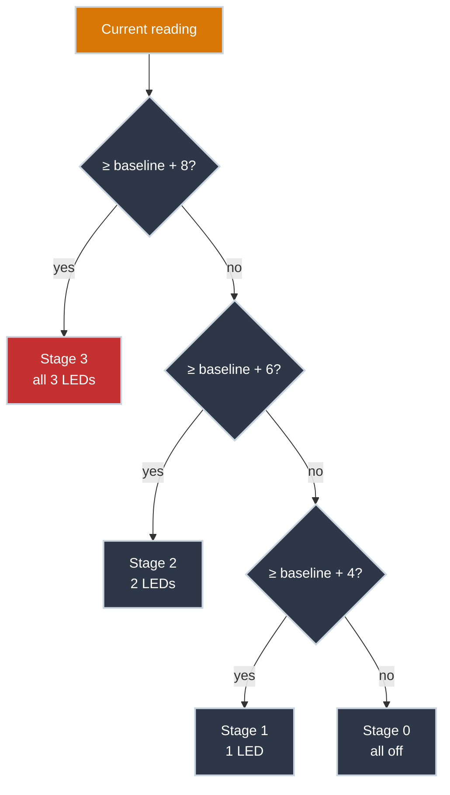
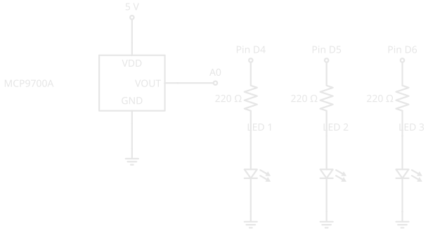

# Building a Threshold Ladder

!!! abstract "Intermediate"
    This article is in the **Microcontrollers** topic and follows [Reading an Analog Sensor](analog_input.md) directly — same circuit, same sensor, same formula. It assumes you're comfortable wiring a breadboard, reading a schematic, and the `analogRead()`/ADC material from the previous article.

[Reading an Analog Sensor](analog_input.md) got you a live temperature in the Serial Monitor. That's fine while you're sitting at a laptop watching it — useless the moment you close the lid and walk away. Nobody tails a serial console all day waiting for a closet to overheat. What you actually want is the circuit itself telling you, at a glance, whether things are fine, getting warm, or a problem.

This article extends the exact same circuit with three LEDs and turns one continuous number into staged, physical output: nothing lit means normal, one LED means it's drifting, three means go check on it now.

---

## Where You've Seen This

You already think in staged severity — you just haven't wired it to an LED before.

- **A phone's battery icon** — full, then yellow, then red as charge drops — is the same idea as this article's zero-to-three LEDs: more visual signal as things get more serious, not a single on/off flag.
- **A car's temperature or fuel gauge** — a needle moving through colored zones (blue/normal/red, or normal/reserve) — bands a continuous reading the same way this circuit bands a temperature range into "stage 0" through "stage 3."
- **A video game health bar** — segments that empty in visible chunks, not a smooth fade — the same staged-not-continuous instinct behind lighting one, two, or three LEDs instead of dimming a single one.

The electronics is new; the pattern of turning a continuous signal into discrete, actionable bands is not — you've been reading bands like this off a screen for years.

---

## Why Relative, Not Absolute

A tempting first design: pick a fixed temperature — say 26°C — and light an LED above it. Don't. A fixed threshold assumes you know the "normal" temperature of every room you'll ever put this in, and a closet in July isn't the same baseline as one in January.

The sketch below instead measures a **baseline** once — the normal reading from [Reading an Analog Sensor](analog_input.md) with nothing wrong — and stages its output relative to *that*, not to an assumed constant. It's the same reasoning behind how a fever gets judged: 98.6°F (37°C) is an average, not a hard cutoff — someone whose normal resting temperature runs a degree warm isn't sick at that same number. "Above your own baseline" is the meaningful threshold, not a fixed constant that ignores where you started.



Each `else if` only runs when every band above it has already failed — that's what keeps the ladder from ever lighting the wrong stage. Get the order backwards and every reading trips the lowest band it matches first, which is *not* the one you want.

---

## Wiring the LEDs

<figure markdown>
  { width="600" }
  <figcaption>The same board from [Reading an Analog Sensor](analog_input.md) — the three LEDs on pins D4, D5, and D6 that were sitting unused are what this article's code drives.</figcaption>
</figure>

<figure markdown>
  { width="720" }
  <figcaption>Three independent LED branches, each a familiar pin → resistor → LED → ground path from Digital Pins, sharing the breadboard with the unchanged MCP9700A wiring.</figcaption>
</figure>

Each LED branch is exactly the output circuit from [Digital Pins](digital_io.md) — nothing new there. What's new is that three of them exist side by side, addressed individually in code.

---

## The Code

``` cpp title="Stage LEDs by distance from baseline" linenums="1"
const int sensorPin = A0;
const float baselineTemp = 20.0; // (1)!

void setup() {
  Serial.begin(9600);

  for (int pinNumber = 4; pinNumber < 7; pinNumber++) { // (2)!
    pinMode(pinNumber, OUTPUT);
    digitalWrite(pinNumber, LOW);
  }
}

void loop() {
  int sensorVal = analogRead(sensorPin);
  float voltage = (sensorVal / 1024.0) * 5.0;
  float temperature = (voltage - 0.5) * 100;

  if (temperature < baselineTemp + 4) { // (3)!
    digitalWrite(4, LOW);
    digitalWrite(5, LOW);
    digitalWrite(6, LOW);
  }
  else if (temperature < baselineTemp + 6) { // (4)!
    digitalWrite(4, HIGH);
    digitalWrite(5, LOW);
    digitalWrite(6, LOW);
  }
  else if (temperature < baselineTemp + 8) {
    digitalWrite(4, HIGH);
    digitalWrite(5, HIGH);
    digitalWrite(6, LOW);
  }
  else {
    digitalWrite(4, HIGH);
    digitalWrite(5, HIGH);
    digitalWrite(6, HIGH);
  }

  delay(100);
}
```

1. Set this to whatever your sensor reported as "normal" in [Reading an Analog Sensor](analog_input.md) — measure your own room, don't reuse this number blind.
2. The three LED pins are consecutive (4, 5, 6), so a loop configures all of them in three lines instead of one `pinMode()`/`digitalWrite()` pair repeated three times. This is the same instinct as replacing three near-identical function calls with a loop over a list — same job, less to get wrong when you change it later.
3. Each `else if` only evaluates once every band above it has failed, so a reading of `baseline + 9` correctly falls into the final `else`, not the first band it happens to satisfy.
4. Notice this only tests an upper bound (`< baselineTemp + 6`) and not a lower one — the fact that it's an `else if` already guarantees the reading is at least `baselineTemp + 4`, from the branch above failing. Testing that again would be redundant.

---

## Verifying It Works

Power the circuit and let it settle for a few seconds — all three LEDs should be off if the room is near the baseline you measured. Warm the sensor gradually (cup a hand loosely around it, don't touch it directly) and watch the LEDs light in order: one, then two, then all three, as the reading climbs through each band. Let go and they should drop back down the same way, in reverse.

??? note "Troubleshooting"

    **All three LEDs light immediately, even at rest** — `baselineTemp` is probably set too low for your actual room. Rerun [Reading an Analog Sensor](analog_input.md)'s sketch, note the resting value, and update the constant.

    **LEDs light out of order (e.g. only the third one)** — check the `else if` chain is intact and hasn't been rewritten as three separate `if` statements. Separate `if`s each evaluate independently, so a hot reading would satisfy all four conditions and every `digitalWrite()` after the first would just override the last — the wiring is fine, the logic isn't.

    **One LED never lights** — isolate it: move it to a pin you know works (say, swap it with LED 1's wiring) and retest. A dead LED or a bad resistor connection is more common than a code bug at this stage.

---

## Practice

??? question "1. Reordering the ladder"

    Someone reorders the chain so the highest band is checked first, without changing anything else: `if (temperature < baselineTemp + 8) ...` runs before `if (temperature < baselineTemp + 4) ...`. At a reading of `baselineTemp + 2` — normally stage 0, nothing lit — what actually lights now?

    ??? tip "Solution"

        Stage 2's LEDs (pins 4 and 5) light, which is wrong. `baselineTemp + 2` satisfies `< baselineTemp + 8` — that condition was only ever meant to mean "below +8 *and* everything above +6 already failed," but moved to the front of the chain, it just means "below +8," full stop, and a merely-normal reading matches it immediately. Each `<` condition was written assuming the bands above it get checked first; reordering breaks that assumption without changing a single number.

??? question "2. The bug in separate ifs"

    Rewrite stages 1 through 3 as three separate `if` statements instead of an `else if` chain, each checking only a `>=` lower bound (`temperature >= baselineTemp + 4`, `>= baselineTemp + 6`, `>= baselineTemp + 8`) with no `else`. At `baselineTemp + 9`, what actually happens, and why?

    ??? tip "Solution"

        All three conditions are true simultaneously, so all three blocks run in sequence — the last one (`digitalWrite` for stage 3) executes last and wins, since each block unconditionally sets every pin. In this specific case the *end result* happens to be correct, but the circuit briefly commands overlapping states and does extra comparisons every loop for no benefit. It becomes a real correctness trap the moment a block doesn't set every pin — if a later block only changed one pin instead of all three, you'd see a stale state bleed through from an earlier block that already ran.

??? question "3. Extending the ladder"

    You want a fourth stage — an additional LED that lights only when the temperature is 12°C or more above baseline. What has to change, both in wiring and code?

    ??? tip "Solution"

        Wiring: a fourth LED-and-resistor branch on a new digital pin (e.g. D7), following the same pin → resistor → LED → ground pattern. Code: extend the `for` loop's range to include the new pin, add a fourth `digitalWrite()` to every existing branch (LOW everywhere except its own band), and insert one more `else if (temperature < baselineTemp + 12)` before the final `else`.

---

## Quick Recap

<div class="grid cards two-col" markdown>

-   **Loop the Setup**

    ---

    Consecutive pins doing the same job get configured in a `for` loop instead of repeated `pinMode()`/`digitalWrite()` pairs.

-   **Baseline, Not Absolute**

    ---

    Measure "normal" for your specific location and stage output relative to it — the same reasoning behind judging a fever against your own baseline temperature, not a fixed number.

-   **Order Matters in a Ladder**

    ---

    `else if` guarantees only one band ever wins. Separate `if` statements can leave several conditions true at once and silently depend on execution order for the right result.

-   **One Signal, Staged Output**

    ---

    A single continuous reading becomes discrete, at-a-glance severity — the same instinct behind a battery icon, a fuel gauge, or a game's health bar.

</div>

---

## What's Next

A continuous sensor reading, converted, and staged into physical output — this pattern (read something analog, band it, act on the band) shows up constantly in embedded work, well beyond LEDs and temperature. The two building blocks underneath it, `analogRead()`'s ADC and multi-pin `OUTPUT` control, are now both in your toolkit.

---

## Further Reading

**Related Articles**

- [Reading an Analog Sensor](analog_input.md) — the ADC and sensor math this article's `loop()` reuses unchanged
- [Digital Pins](digital_io.md) — the single-LED output circuit each of this article's three branches repeats
- [Temperature Sensors](temperature_sensors.md) — why the MCP9700A outputs the voltage this whole ladder is staged on
