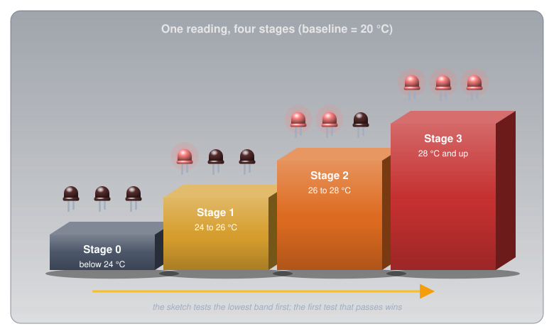
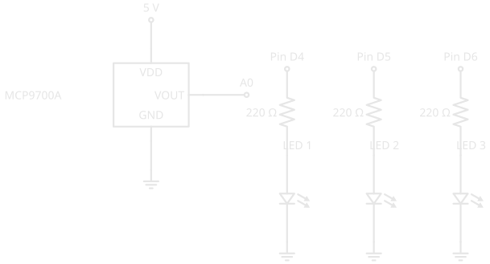

# Building a Threshold Ladder

!!! abstract "Intermediate"
    This article is in the **Microcontrollers** topic and follows [Reading an Analog Sensor](analog_input.md) directly: same circuit, same sensor, same formula. It assumes you're comfortable wiring a breadboard, reading a schematic, and the `analogRead()`/ADC material from the previous article.

[Reading an Analog Sensor](analog_input.md) produced a live temperature in the Serial Monitor. That works while someone sits at a laptop watching it, and stops working the moment the lid closes. What a closet monitor needs is the circuit itself saying, at a glance, whether things are fine, getting warm, or a problem.

This article adds three LEDs to the same circuit and turns one continuous number into staged, physical output: nothing lit means normal, one LED means it's drifting, three means go and check now.

---

## Where You Might Have Seen This

Staged severity is everywhere in everyday technology:

- **A phone's battery icon** steps from full to yellow to red as the charge drops: more signal as things get more serious, rather than a single on/off flag.
- **A car's temperature gauge** sweeps a needle through coloured zones, banding a continuous reading exactly as this circuit bands a temperature into stages 0 to 3.
- **A video game health bar** empties in visible chunks rather than a smooth fade, the same instinct behind lighting one, two, or three LEDs instead of dimming one.

The electronics is new; turning a continuous signal into discrete, actionable bands is a pattern most people already read without thinking.

---

## Why Relative, Not Absolute

A tempting first design is to pick a fixed temperature, say 26°C, and light an LED above it. The trouble is that "normal" differs from one space to the next: a closet with a charger running in it may sit at 26°C all day and be perfectly fine.

The sketch below starts from a **baseline** instead: the normal reading you measured in [Reading an Analog Sensor](analog_input.md), with nothing wrong. It stages its output by how far the temperature has climbed above *that*. A fever is judged the same way: 37°C is an average, and someone whose normal runs a little warm isn't ill at the same number. (A baseline typed into the code still won't follow the seasons; practice problem 4 has the sketch measure its own baseline at power-up.)

<figure markdown>
  { width="720" }
  <figcaption>The sketch checks from the bottom up, and the first band that matches decides how many LEDs light.</figcaption>
</figure>

Each `else if` runs only when every test before it has failed, which is what keeps the ladder from lighting the wrong stage. Because each test is "less than", the order matters: check the widest band first and every cool reading matches it immediately.

---

## Wiring the LEDs

<figure markdown>
  { width="600" }
  <figcaption>The same board from [Reading an Analog Sensor](analog_input.md): the three LEDs on pins D4, D5, and D6 that sat unused there are what this article's code drives.</figcaption>
</figure>

<figure markdown>
  { width="720" }
  <figcaption>Three independent LED branches, each a familiar pin → resistor → LED → ground path from Digital Pins, sharing the breadboard with the unchanged MCP9700A wiring.</figcaption>
</figure>

Each LED branch is the output circuit from [Digital Pins](digital_io.md). What's new is three of them side by side, each controlled separately in code.

---

## The Code

``` cpp title="Stage LEDs by distance from baseline" linenums="1"
const int sensorPin = A0;
const float baselineTemp = 20.0; // (1)!

void setup() {
  Serial.begin(9600);

  for (int pinNumber = 4; pinNumber < 7; pinNumber++) { // (2)!
    pinMode(pinNumber, OUTPUT);
    digitalWrite(pinNumber, LOW);
  }
}

void loop() {
  int sensorVal = analogRead(sensorPin);
  float voltage = (sensorVal / 1024.0) * 5.0;
  float temperature = (voltage - 0.5) * 100;

  if (temperature < baselineTemp + 4) { // (3)!
    digitalWrite(4, LOW);
    digitalWrite(5, LOW);
    digitalWrite(6, LOW);
  }
  else if (temperature < baselineTemp + 6) { // (4)!
    digitalWrite(4, HIGH);
    digitalWrite(5, LOW);
    digitalWrite(6, LOW);
  }
  else if (temperature < baselineTemp + 8) {
    digitalWrite(4, HIGH);
    digitalWrite(5, HIGH);
    digitalWrite(6, LOW);
  }
  else {
    digitalWrite(4, HIGH);
    digitalWrite(5, HIGH);
    digitalWrite(6, HIGH);
  }

  delay(100);
}
```

1. Set this to what your sensor reported as "normal" in [Reading an Analog Sensor](analog_input.md). Measure your own space rather than reusing this number.
2. The three LED pins are consecutive (4, 5, 6), so a `for` loop configures all of them instead of three repeated `pinMode()`/`digitalWrite()` pairs. Same job, and less to get wrong when you change it later.
3. Each `else if` only evaluates once every band above it has failed, so a reading of `baseline + 9` correctly falls into the final `else`, not the first band it happens to satisfy.
4. This tests only an upper bound (`< baselineTemp + 6`). Being an `else if` already guarantees the reading is at least `baselineTemp + 4`, because the branch above failed.

---

## Verifying It Works

Power the circuit and let it settle for a few seconds: all three LEDs should be off if the room is near the baseline you measured. Warm the sensor gradually by cupping a hand loosely around it, and watch the LEDs light in order (one, two, then three) as the reading climbs through each band. Take your hand away and they go out in reverse.

??? warning "Troubleshooting"

    **All three LEDs light immediately, even at rest:** `baselineTemp` is probably set too low for your room. Rerun [Reading an Analog Sensor](analog_input.md)'s sketch, note the resting value, and update the constant.

    **The wrong number of LEDs lights:** check that the `else if` chain is intact and hasn't been rewritten as separate `if` statements. Separate `if`s each run independently, so a cool reading satisfies every `<` test and the last block to run decides what lights. The wiring is fine; the logic isn't.

    **One LED never lights:** isolate it. Swap its wiring with LED 1's and retest. A dead LED or a bad resistor connection is more common than a code bug at this stage.

---

## Practice

??? question "1. Reordering the ladder"

    Someone reorders the chain so the highest band is checked first, without changing anything else: `if (temperature < baselineTemp + 8) ...` runs before `if (temperature < baselineTemp + 4) ...`. At a reading of `baselineTemp + 2` — normally stage 0, nothing lit — what actually lights now?

    ??? tip "Solution"

        Stage 2's LEDs (pins 4 and 5) light, which is wrong. `baselineTemp + 2` satisfies `< baselineTemp + 8`. That condition was written to mean "below +8 *and* the earlier tests failed"; moved to the front of the chain it just means "below +8," and a normal reading matches it immediately. Each `<` condition was written assuming the bands above it get checked first; reordering breaks that assumption without changing a single number.

??? question "2. The bug in separate ifs"

    Rewrite stages 1 through 3 as three separate `if` statements instead of an `else if` chain, each checking only a `>=` lower bound (`temperature >= baselineTemp + 4`, `>= baselineTemp + 6`, `>= baselineTemp + 8`) with no `else`. At `baselineTemp + 9`, what actually happens, and why?

    ??? tip "Solution"

        All three conditions are true at once, so all three blocks run in sequence, and the stage 3 block runs last and wins, because each block sets every pin. Here the *end result* happens to be correct, but only because of the order the blocks are written in. It becomes a real bug the moment a block doesn't set every pin: a stale state from an earlier block bleeds through.

??? question "3. Extending the ladder"

    You want a fourth stage: an extra LED that lights only when the temperature is 12°C or more above baseline. What has to change, both in wiring and code?

    ??? tip "Solution"

        Wiring: a fourth LED-and-resistor branch on a new digital pin (e.g. D7), following the same pin → resistor → LED → ground pattern. Code: extend the `for` loop's range to include the new pin, add a fourth `digitalWrite()` to every existing branch (LOW everywhere except its own band), and insert one more `else if (temperature < baselineTemp + 12)` before the final `else`.

??? question "4. A baseline that measures itself"

    The sketch's `baselineTemp` is a number you typed in, so it won't follow a closet that runs warmer in July than in January. How could the sketch set its own baseline each time it powers up?

    ??? tip "Solution"

        Read the sensor in `setup()`, which runs once at power-up, and use that as the baseline. Averaging several readings smooths out the ADC's half-degree steps:

        ``` cpp title="Measure the baseline at power-up" linenums="1"
        float baselineTemp;   // no longer a fixed constant

        void setup() {
          float total = 0;
          for (int i = 0; i < 20; i++) {
            float voltage = (analogRead(A0) / 1024.0) * 5.0;
            total += (voltage - 0.5) * 100;
            delay(50);
          }
          baselineTemp = total / 20;   // average of 20 readings over one second
          // ...then the pinMode() loop as before
        }
        ```

        The catch: the sketch now assumes everything is normal at the moment it powers up. Reset it while the closet is already overheating and it adopts that as normal.

---

## Quick Recap

<div class="grid cards two-col" markdown>

-   **Loop the Setup**

    ---

    Consecutive pins doing the same job get configured in a `for` loop instead of repeated `pinMode()`/`digitalWrite()` pairs.

-   **Baseline, Not Absolute**

    ---

    Measure "normal" for your location and stage output relative to it, the way a fever is judged against a person's own normal temperature.

-   **Order Matters in a Ladder**

    ---

    `else if` guarantees only one band ever wins. Separate `if` statements can leave several conditions true at once and silently depend on execution order for the right result.

-   **One Signal, Staged Output**

    ---

    A single continuous reading becomes discrete, at-a-glance severity, like a battery icon or a game's health bar.

</div>

---

## What's Next

Read something analog, band it, act on the band: the pattern turns up constantly in embedded work, well beyond LEDs and temperature, and both of its building blocks (`analogRead()` and multi-pin output) are now in your toolkit.

This is the last Microcontrollers article so far. A monitor in a closet eventually needs to run without a USB cable, and **[Cells and Batteries](batteries.md)** covers what it takes to power a project on its own.

---

## Further Reading

**Related Articles**

- [Reading an Analog Sensor](analog_input.md) — the ADC and sensor math this article's `loop()` reuses unchanged
- [Digital Pins](digital_io.md) — the single-LED output circuit each of this article's three branches repeats
- [Temperature Sensors](temperature_sensors.md) — why the MCP9700A outputs the voltage this whole ladder is staged on
