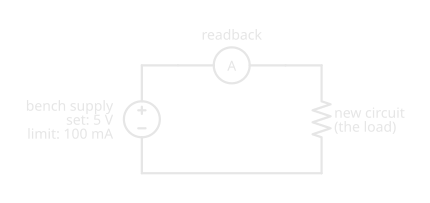

# Bench Power Supplies

!!! abstract "Practical Tools · Beginner"
    This article is part of the **Practical Tools** section. It builds on [Ohm's Law and Power](../ohms_law.md) and [Voltage Regulators](../voltage_regulators.md). Read it before connecting your first project to a bench supply.

A new circuit has a short circuit hidden in it: a stray wire across the supply rails. Power it from four AA cells and a few amps rush through the short, enough to heat a thin wire until its insulation smokes. Power the same circuit from a bench supply set to 5 V, and nothing gets warm. The display shows 0.01 V and 100 mA, and a small lamp marked **CC** lights up.

Two ideas explain the difference:

1. **A bench supply is an adjustable regulator with a meter built in.** Set a voltage and it holds that voltage whatever the circuit draws, while its display shows exactly how much current that is.
2. **It also holds a current limit, and whichever limit is reached first takes over.** Below the limit it holds the voltage. At the limit it holds the current instead, and lets the voltage fall to whatever pushes exactly that current through the circuit.

The short circuit hits the current limit, which is why it stays cool. The numbers are worked through in the second half.

---

## What's on the Front

Bench supplies vary in size and price, but the controls are nearly always the same few.

<figure markdown>
  { width="760" }
  <figcaption>Two settings, two readbacks, and a lamp that says which setting is in charge.</figcaption>
</figure>

- **Voltage and current knobs** set the output voltage and the current limit.
- **Two readbacks** show what the output is actually doing: the voltage at the terminals and the current flowing out.
- **CV and CC lamps** show which setting is in control right now.
- **An output button** switches the terminals on and off without changing the settings, so the circuit can be wired with the output off.
- **Terminals**: positive (red), negative (black), and often a third, green earth terminal connected to the mains earth. The earth is not the negative output: they're separate terminals, and the manual says whether and how to link them.

---

## Idea One: An Adjustable Regulator With a Meter

Inside, a bench supply is the [power supply chain](../voltage_regulators.md#putting-it-together-a-linear-power-supply) with knobs: a transformer, rectifier, and filter feed a regulator whose output voltage you set. In **constant voltage (CV)** mode it behaves like the regulators in that article. Rigol's [DP800 user guide](https://www.globaltestsupply.com/pdfs/cache/www.globaltestsupply.com/dp832/manual/dp832-manual.pdf) puts it plainly: "in CV mode, the output voltage equals the voltage setting value and the output current is determined by the load."

The readback is the part that makes it a bench instrument. With the output at 5 V, the current display shows exactly what the circuit draws: a free [ammeter](../current.md#measuring-current) on every project, with no meter to wire in.

That ammeter has limits, though. The Rigol DP832's [datasheet](https://www.rigol.com/dam/global/downloads/brochures/en/data-sheet/dc-powers/DP800_DataSheet_EN.pdf) specifies its current readback to ±(0.15% + 5 mA). At 1 A that's good to about 6.5 mA; at 2 mA, the reading could be off by more than the current itself. For small currents, such as an Arduino sleeping or a single LED, use a [multimeter](multimeter.md) in series instead.

---

## Idea Two: A Limit That Takes Over

The second knob sets a **current limit**. As long as the circuit draws less than it, the supply holds the voltage. When the circuit tries to draw more, the supply switches to **constant current (CC)** mode: it holds the current at the limit and lowers the voltage until [Ohm's law](../ohms_law.md) gives exactly that current. In Rigol's words, "in CC mode, the output current equals the current setting value and the output voltage is determined by the load." The switch is automatic, in both directions.

Drawn as voltage against current, the supply's output lives on an L-shaped boundary, and any load sits where its own V = I × R line meets it:

<figure markdown>
  { width="760" }
  <figcaption>Above 50 Ω the voltage limit wins; below it the current limit does.</figcaption>
</figure>

With 5 V and a 100 mA limit, the two limits meet at 5 V ÷ 0.1 A = **50 Ω**, the **crossover**. A load above 50 Ω draws less than 100 mA at 5 V, so the supply stays in CV. A load below 50 Ω would draw more, so the supply drops into CC:

- **100 Ω**: 5 V ÷ 100 Ω = 50 mA, under the limit. CV, 5 V, 50 mA.
- **20 Ω**: 5 V would push 250 mA, over the limit. CC: 100 mA, and the voltage falls to 0.1 A × 20 Ω = 2 V.

<figure markdown>
  { width="760" }
  <figcaption>The current can never pass the limit, however low the load's resistance goes.</figcaption>
</figure>

### The Puzzle, Solved

A short circuit is just a very low resistance. A 0.1 Ω short on the bench supply gets the limit, 100 mA, at 0.1 A × 0.1 Ω = 0.01 V: exactly the reading in the hook, and 1 mW of heat. Four alkaline AA cells have no limit but their own internal resistance, 150 to 300 mΩ each by [Cells and Batteries](../batteries.md#internal-resistance-where-voltage-goes-missing), so the same short gets 6 V ÷ (0.6 to 1.2 Ω + 0.1 Ω):

<figure markdown>
  { width="760" }
  <figcaption>Same fault, a few thousand times less heat.</figcaption>
</figure>

That's why a bench supply with a sensible current limit is the safest way to power a new circuit for the first time: a mistake shows up as a CC lamp instead of smoke.

???+ info "Definition: CV, CC, and Crossover"
    **Constant voltage (CV):** the supply holds the set voltage; the load decides the current. **Constant current (CC):** the supply holds the set current limit; the load decides the voltage. **Crossover:** the load resistance where the two meet, the set voltage divided by the current limit.

---

## A Safe First Power-Up

The CV/CC behaviour turns into a routine worth following every time a new or modified circuit is powered:

<figure markdown>
  { width="440" }
  <figcaption>The current limit, not the circuit, decides the worst case.</figcaption>
</figure>

1. **Set the voltage with the output off.** Turn the output on with nothing connected, check the display, and switch it off again.
2. **Set the current limit a little above what the circuit should draw.** If an Arduino and a few LEDs should take about 60 mA, a 100 mA limit leaves room for normal operation but catches a fault quickly.
3. **Connect the circuit, then switch the output on.**
4. **Look at the lamp before anything else.** CV and a current close to what you expected means the circuit is behaving. CC straight away means it's trying to draw more than it should: switch off and look for the fault.
5. **Raise the limit only once the circuit is proven.**

The limit also lets a supply drive an LED with no resistor in a pinch: set the voltage a little above the LED's forward voltage and the limit to the LED's current, and CC mode holds the current at exactly that. It's a useful test, but in a finished circuit the [LED resistor](../diodes_and_leds.md#sizing-an-led-resistor) stays, because a battery or adapter has no limit at all.

---

## Reading the Spec Sheet

A bench supply's datasheet answers a handful of questions. The [Rigol DP832](https://www.rigol.com/dam/global/downloads/brochures/en/data-sheet/dc-powers/DP800_DataSheet_EN.pdf) is a common example:

-   **Channels and range**

    ---

    **Why it matters:** sets what it can power. The DP832 has two 30 V, 3 A channels and one 5 V, 3 A channel, up to 195 W in total.

-   **Ripple and noise**

    ---

    **Why it matters:** sensitive analog and radio circuits hear it. The DP832, a linear supply, specifies under 350 µV rms, 2 mV peak to peak.

-   **Readback accuracy**

    ---

    **Why it matters:** decides whether to trust the display. ±(0.05% + 10 mV) for voltage, ±(0.15% + 5 mA) for current.

-   **Protection: OVP and OCP**

    ---

    **Why it matters:** over-voltage and over-current protection switch the output off if a setting is exceeded, guarding against a knob turned too far.

-   **Sense terminals**

    ---

    **Why it matters:** measure the voltage at the circuit, not at the supply, so the supply can make up the drop in the leads.

-   **Linear or switching**

    ---

    **Why it matters:** linear supplies are quieter but heavy (the DP832A weighs 10.5 kg); switching ones are lighter and cheaper but noisier ([Voltage Regulators](../voltage_regulators.md#what-switching-costs) explains why).

### Sense Terminals and Lead Drop

At small currents the leads don't matter. At a few amps they do: every lead has [resistance](../resistance.md#wire-gauge-thickness-in-practice), and the circuit gets the supply's voltage minus the drop in both leads.

<figure markdown>
  { width="760" }
  <figcaption>Thicker, shorter leads lose less. Sense leads remove the loss.</figcaption>
</figure>

Supplies with **sense terminals** run a second, thin pair of wires to the circuit. In Rigol's words, they "detect the actual voltage at the load terminal so as to compensate for the voltage drop caused by the load lead": the supply raises its own output until the circuit sees the set voltage. Without them, use short, thick leads, and measure the voltage at the circuit with a multimeter when it matters.

### Without a Bench Supply

Batteries, USB ports, and wall adapters all power circuits on this site perfectly well, but none has an adjustable current limit. When powering something new from one of them, a [fuse](../open_short_fuses.md) or a series resistor sized for the expected current does a cruder version of the same job.

---

## Safety

A bench supply is a mains-powered instrument whose output is usually safe to touch, but not always.

!!! danger "Higher-Voltage Supplies and Mains"
    Supplies that reach tens of volts, especially with channels connected in series, can produce voltages that push a dangerous current through the body ([Voltage](../voltage.md#safety-voltage-pushes-current-hurts) explains why voltage is what drives it). Keep outputs at the voltage the project needs. The supply itself plugs into the mains: never open its case, and keep its earth connection intact.

!!! warning "Batteries, Coils, and Capacitors"
    Don't charge lithium cells from a bench supply unless you know the exact charging voltage and current for that cell and stay with it: the wrong voltage or current can damage a lithium cell or start a fire ([Cells and Batteries](../batteries.md)). Coils such as relays and motors kick back a voltage spike when switched off ([Inductors](../inductors.md)), and large capacitors on a circuit can hold charge after the supply's output is off ([Capacitors](../capacitors.md)).

---

## Practice

??? question "1. CV or CC?"

    A supply is set to 12 V with a 200 mA limit. Which mode is it in, and what are the voltage and current, for a 100 Ω load? For a 30 Ω load?

    ??? tip "Solution"
        Crossover: 12 V ÷ 0.2 A = 60 Ω. **100 Ω** is above it: CV, 12 V, 12 ÷ 100 = **120 mA**. **30 Ω** is below it: CC, **200 mA**, at 0.2 × 30 = **6 V**.

??? question "2. The Lamp Says CC"

    A new circuit should draw about 40 mA at 5 V. The supply, with a 100 mA limit, shows CC, 1.2 V, 100 mA the moment the output turns on. What's going on, and what's the circuit's resistance?

    ??? tip "Solution"
        The circuit draws more than the limit even at a low voltage: a fault, most likely a short or a reversed part. Its resistance is 1.2 V ÷ 0.1 A = **12 Ω**, far below the 5 V ÷ 0.04 A = 125 Ω a healthy circuit would show. Switch off and find it.

??? question "3. Trust the Readback?"

    A DP832 reads 3 mA on its current display. With a current readback accuracy of ±(0.15% + 5 mA), what could the real current be?

    ??? tip "Solution"
        ±(0.0015 × 3 mA + 5 mA) ≈ ±5 mA, so anything from 0 to about 8 mA. At this level the display is little more than a hint; measure with a multimeter in series.

??? question "4. Lead Drop"

    A supply set to 12 V drives 3 A through leads with a total resistance of 0.1 Ω. What does the circuit get, and how much power is wasted in the leads?

    ??? tip "Solution"
        The drop is 3 A × 0.1 Ω = 0.3 V, so the circuit gets **11.7 V**. The leads dissipate 3² × 0.1 = **0.9 W**. Sense leads, or shorter and thicker leads, would fix both.

??? question "5. Setting the Limit"

    You're about to power an untested Arduino project expected to draw 150 mA at 9 V. What would you set, and what would you watch for?

    ??? tip "Solution"
        9 V, and a limit a little above 150 mA, perhaps 200 mA. Connect with the output off, switch on, and check the lamp: **CV at about 150 mA** means it's healthy; **CC immediately** means a fault.

??? question "6. Why Not Just Use a Battery?"

    Explain in a sentence why a bench supply is safer than a battery pack for the first power-up of a new circuit.

    ??? tip "Solution"
        A battery's current is limited only by its internal resistance, so a short can draw amps and heat wires; a bench supply's current limit caps a fault at whatever you set, often a few thousand times less power.

---

## Quick Recap

-   **An adjustable regulator**

    ---

    Set a voltage; the supply holds it (CV) whatever the load draws.

-   **A built-in ammeter**

    ---

    The current readback shows what the circuit draws, within its stated accuracy.

-   **A limit that takes over**

    ---

    Above the limit's current, the supply holds the current (CC) and lets the voltage fall.

-   **The crossover**

    ---

    Set voltage ÷ current limit. Loads above it get CV; loads below it get CC.

-   **Faults show up as CC**

    ---

    A short at a 100 mA limit gets 100 mA, not amps. The lamp, not smoke, tells you.

-   **A first power-up routine**

    ---

    Set voltage, set a tight limit, connect with output off, switch on, read the lamp.

-   **Read the spec sheet**

    ---

    Channels, ripple, readback accuracy, protection, sense terminals, linear or switching.

-   **Leads have resistance**

    ---

    At amps, use short thick leads or sense terminals.

---

## What's Next

A current limit makes powering a circuit safe; a meter makes it measurable. **[Using a Multimeter](multimeter.md)** covers the other half of the bench: what a meter's jacks, fuses, and categories mean before it touches a live circuit.

---

## Further Reading

**Manufacturer Documents**

- [Rigol DP800 Series Datasheet (PDF)](https://www.rigol.com/dam/global/downloads/brochures/en/data-sheet/dc-powers/DP800_DataSheet_EN.pdf) — the DP832's channels, ripple, readback accuracy, and protection
- [Rigol DP800 Series User Guide (PDF)](https://www.globaltestsupply.com/pdfs/cache/www.globaltestsupply.com/dp832/manual/dp832-manual.pdf) — CV and CC modes, the automatic switch between them, and sense terminals

**Related Articles**

- [Voltage Regulators](../voltage_regulators.md) — the linear and switching regulators inside every bench supply
- [Ohm's Law and Power](../ohms_law.md) — the arithmetic behind the crossover
- [Open Circuits, Short Circuits, and Fuses](../open_short_fuses.md) — what a short is, and a fuse as a cruder current limit
- [Cells and Batteries](../batteries.md) — internal resistance, and why lithium charging needs care
