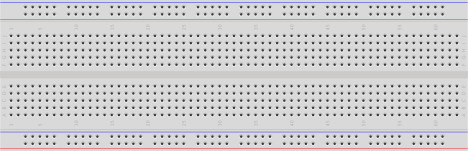
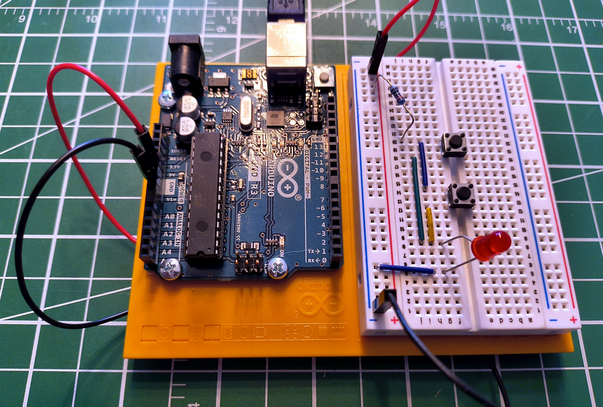

# Breadboards

!!! abstract "Practical Tools"
    This article is part of the **Practical Tools** section — foundational reading before building your first circuit. If you're new to voltage, current, and resistance, start with [What Is Electricity?](../essential/what_is_electricity.md) first.

Every circuit you build starts as an idea that probably doesn't work on the first try. Without a breadboard, testing that idea means soldering components together — and soldering is permanent. Get a connection wrong, apply too much heat, or choose the wrong resistor, and you're desoldering everything to try again. It's slow, it damages components, and it discourages experimentation.

A breadboard solves this. Push components into holes, connect them with jumper wires, and your circuit works — no heat, no commitment, no damage. Pull everything out and the board resets. Try a component value, change it, rearrange the circuit, start over — none of it costs you anything. Every circuit on this site starts on a breadboard.

A full-size 830-point breadboard costs $5–15 and will last years. It's the first thing to buy alongside any microcontroller kit.

{ .breadboard-crop }

<p style="text-align: center; font-size: 0.75rem; color: var(--md-default-fg-color--light);">A full-size breadboard. Partial image: Giacomo Alessandroni, <a href="https://creativecommons.org/licenses/by-sa/4.0/">CC BY-SA 4.0</a>.</p>

---

## How the Holes Connect

Look at the component area in the image — the dense grid of holes between the power rails. It's divided into a left half (columns `a` through `e`) and a right half (columns `f` through `j`), separated by the channel running down the middle. Rows are numbered starting from 1.

The internal connection pattern:

```
  + -       a    b    c    d    e       f    g    h    i    j    - +
  o o   1  [o]--[o]--[o]--[o]--[o]  |  [o]--[o]--[o]--[o]--[o]   o o
  o o   2  [o]--[o]--[o]--[o]--[o]  |  [o]--[o]--[o]--[o]--[o]   o o
  o o   3  [o]--[o]--[o]--[o]--[o]  |  [o]--[o]--[o]--[o]--[o]   o o
```

`--` marks connected holes. `|` is the center gap — not connected.

Inside the board, each row of five holds a metal clip. Anything inserted into `a5`, `b5`, `c5`, `d5`, or `e5` is touching the same clip — the same electrical node. `f5` through `j5` are a separate clip on the other side of the gap.

The center gap is designed for components that intentionally span it. Integrated circuits (ICs) — small chips with a row of pins on each side — are the most common example: one row lands in columns `a–e`, the other in columns `f–j`, keeping both sides electrically separate. Tactile switches are designed the same way. The rule isn't "never cross the gap" — it's "know whether your component is meant to span it."

---

## Power Rails

The red and blue strips along each long edge are the power rails — visible in the image as the strips running alongside the component area. Unlike the component rows, these run the full length of the board:

- **`+` rail** (red stripe): your supply voltage — 3.3V, 5V, or whatever the circuit needs
- **`−` rail** (blue stripe): ground, 0V reference

Connect power once to the rails, then use short jumper wires to bring it into the component area wherever you need it.

!!! warning "The Rail Break"
    Most breadboards — especially full-size 830-point boards — have a **physical gap in the middle of each power rail**. The two halves are **not connected**. If you have a multimeter, put it in continuity mode and probe from one end of the `+` rail to the other — if it doesn't beep, there's a break.

    If your circuit spans the full board, bridge the gap with a short jumper. Miss this and that half of the rail won't have power, and nothing connected to it will work.

---

## A Circuit on a Breadboard

Here's a real circuit on a breadboard — an Arduino powering components through the power rails, with jumper wires routing signals into the component area. This is the parallel switch circuit from [Series and Parallel Circuits](../essential/series_and_parallel.md).

<figure markdown>
  { style="width: 60%;" }
  <figcaption>A real breadboard circuit: jumper wires carry power and ground from the Arduino into the rails, and each component occupies its own rows.</figcaption>
</figure>

Notice the jumper wires carrying power and ground from the Arduino into the rails, and how each component occupies its own rows. Components sharing a row are electrically connected — no wires needed between them, just the metal clip inside the board.

---

## Common Mistakes

??? warning "Bridging the center gap with a component"

    The channel isn't just cosmetic — there's no connection across it. Some components are designed to span it intentionally (ICs, tactile switches), but a resistor or LED is not. If a component that shouldn't cross the gap does, you've connected the left and right halves of that row — usually creating a short you didn't intend.

??? warning "Off-by-one row"

    Row 10 and row 11 look identical. Miscounting by one row creates a broken circuit or an accidental short. Count carefully. On large circuits, different-coloured jumper wires help track what connects to what.

??? warning "Ignoring the rail break"

    The most common reason a circuit works on one half of the board but not the other. Test your rails once in continuity mode before trusting them.

??? warning "Partially seated components"

    A leg pushed in at an angle may not be making contact with the internal clip. Push straight down until it stops. Intermittent connections — works when you press on it, fails when you don't — are almost always a seating problem.

??? warning "Running out of row space"

    Each row has five holes. When a row fills up, bridge to an adjacent empty row with a short jumper. Don't force a sixth leg in — it deforms the clip and damages the board permanently.

---

## Practice

??? question "Which holes are connected?"

    On a standard breadboard, which of these pairs share an electrical connection?

    - `a5` and `e5`
    - `a5` and `a6`
    - `f5` and `j5`
    - `a5` and `f5`

    ??? tip "Solution"

        - ✅ `a5` and `e5` — same row, same side of the gap
        - ❌ `a5` and `a6` — same column letter, different rows; columns don't connect
        - ✅ `f5` and `j5` — same row, same side of the gap
        - ❌ `a5` and `f5` — same row number but opposite sides of the center gap

??? question "Find the mistake"

    A circuit isn't working. Tracing the wiring: the LED's anode is in `e10`, its cathode is in `f10`, and a resistor runs from `a10` to the `+` rail. What's wrong?

    ??? tip "Solution"

        The LED straddles the center gap. `e10` and `f10` are on opposite sides and are not connected — the gap between columns `e` and `f` breaks the row. Both LED legs need to land on the same side of the gap. Move the LED so both legs are in `a10`–`e10` or `f10`–`j10`, then connect to the other side with a jumper if the circuit requires it.

??? question "Rail break diagnosis"

    Components on one half of your board work; the other half is dead. Power and ground are confirmed good on the working side. What's the most likely cause, and how do you fix it?

    ??? tip "Solution"

        The power rail break. Most full-size breadboards have a physical gap midway along each rail — the two halves are not connected. Check continuity along both the `+` and `−` rails with a multimeter in continuity mode. If either doesn't beep end-to-end, bridge the gap with a short jumper wire connecting the two halves.

---

## Quick Recap

<div class="grid cards" markdown>

-   **Component Rows**

    ---

    Holes `a–e` in a row are connected. Holes `f–j` in the same row are a separate node. The center gap separates the two halves.

-   **Power Rails**

    ---

    Red `+` and blue `−` strips run the length of the board. Watch for the break in the middle — bridge it with a jumper if your circuit spans both halves.

-   **Center Gap**

    ---

    Not a mistake — it's there for components designed to span it: DIP-package ICs, tactile switches, and others. The question is whether your specific component is meant to bridge it.

-   **No Commitment**

    ---

    Pull everything out and start over. Breadboards are for prototyping. Once a circuit works, move to something permanent.

</div>

---

## Further Reading

**Visual Guides**

- [How to Use a Breadboard — SparkFun](https://learn.sparkfun.com/tutorials/how-to-use-a-breadboard) — photos and diagrams showing the internal clip structure
- [Breadboards for Beginners — Adafruit](https://learn.adafruit.com/breadboards-for-beginners) — wire management tips for keeping circuits readable as they grow

**Related Articles**

- [What Is Electricity?](../essential/what_is_electricity.md) — voltage, current, and resistance: the theory behind every circuit you'll build on a breadboard
- [Series and Parallel Circuits](../essential/series_and_parallel.md) — the two wiring configurations demonstrated on the breadboard in this article

---

## What's Next

The breadboard appears in every circuit on this site. The next step is putting it to work: **[Series and Parallel Circuits](../essential/series_and_parallel.md)** — two different wiring configurations built on this exact board, and why the difference between them matters for every circuit you'll ever design.
