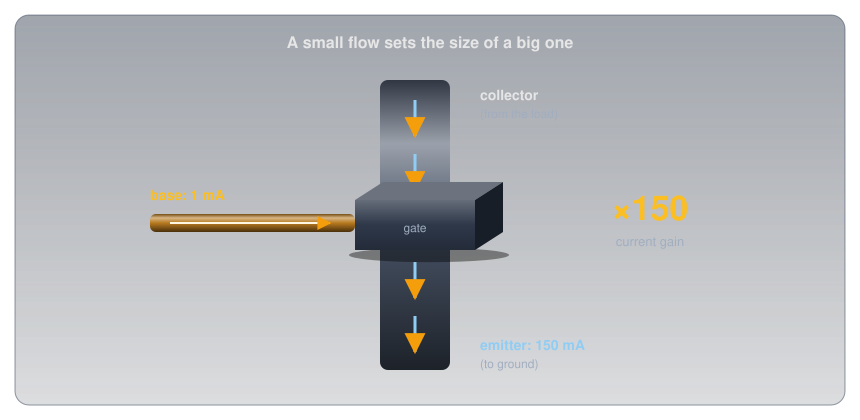
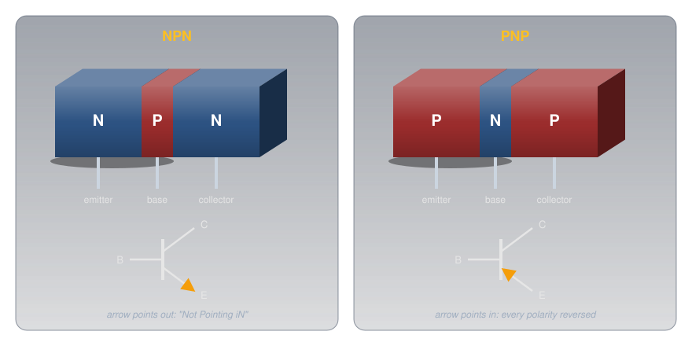
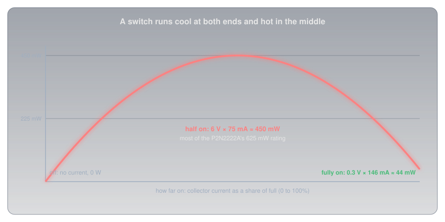
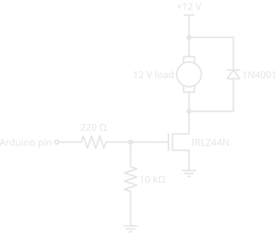
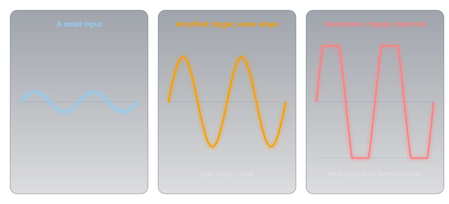

# Transistors

!!! abstract "Beginner"
    This article is in the **Components** topic and follows [Diodes and LEDs](diodes_and_leds.md), whose PN junction is the transistor's building block. It uses [Ohm's Law and Power](ohms_law.md) throughout, and its examples are driven from the pins described in [Digital Pins](digital_io.md).

An Arduino Uno pin is rated for 20 mA at 5 V. A small 12 V cooling fan draws about 150 mA. That's seven times the current at more than twice the voltage, and connecting the fan straight to the pin would destroy the pin and leave the fan still. Yet a transistor in a package smaller than a pea lets that pin switch the fan on and off, and the pin barely notices.

Two ideas explain how:

1. **A transistor is a valve worked by a smaller valve.** A small current into one terminal, or a voltage on it, controls a much larger current between the other two. In a bipolar transistor the large current is a fixed multiple of the small one; that multiple is its **gain**.
2. **How it's driven decides what it does.** Driven fully on or fully off, a transistor is a **switch**, and it runs cool. Driven partway, the output follows the input in proportion, and it's an **amplifier**, which is also where the heat is.

---

## Idea One: A Valve Worked by a Smaller Valve

The picture is a wide water pipe with a gate in it, and a thin side pipe that works the gate. A trickle through the side pipe opens the gate in proportion, and a much larger flow passes through the main pipe.

<figure markdown>
  { width="720" }
  <figcaption>The small flow never joins the big one's job; it only sets how wide the gate opens.</figcaption>
</figure>

A **transistor** is that arrangement in silicon, with three terminals. Two carry the main current; the third controls it. There are two great families, built differently, and both appear on the amateur radio exam.

### Bipolar Transistors: NPN and PNP

A **bipolar junction transistor (BJT)** is a three-layer sandwich of doped silicon: either N, P, N or P, N, P. The middle layer is very thin. Its three terminals are the **emitter**, the **base** (the thin middle), and the **collector**.

<figure markdown>
  { width="760" }
  <figcaption>Two PN junctions back to back, with a base thin enough that the two interact.</figcaption>
</figure>

In an NPN transistor, a small current flowing into the base (forward-biasing the base-emitter junction, exactly like the diode in [Diodes and LEDs](diodes_and_leds.md#inside-a-diode-the-pn-junction)) floods the thin base with electrons from the emitter. Most of them don't stop there: the base is so thin that they're swept straight on into the collector. The result is a collector current many times the base current:

\[ I_C = h_{FE} \times I_B \]

The **current gain**, written hFE or β, is typically somewhere between 100 and 300 for a small transistor. onsemi's `P2N2222A` datasheet promises an hFE between 100 and 300 at 150 mA, a wide spread because no two transistors are quite alike. Good circuits are designed so the exact gain doesn't matter.

A **PNP** transistor is the mirror image: every polarity is reversed. Its emitter sits at the positive side, current flows *out* of its base to turn it on, and the arrow in its symbol points in. That's why a PNP can't simply replace an NPN in a circuit. The symbol's arrow marks the emitter and points the way conventional current flows through it; "NPN: Not Pointing iN" remembers which is which.

### Field-Effect Transistors: Controlled by Voltage

A **field-effect transistor (FET)** does the same job by a different mechanism: a voltage, rather than a current, controls the main current. Its terminals are the **source**, the **gate**, and the **drain**, and they map onto the bipolar transistor's: the source corresponds to the emitter, the gate to the base, and the drain to the collector. The main current flows through a **channel** of doped silicon between source and drain, either N-type (an **N-channel** FET) or P-type (a **P-channel** FET). Charge carriers enter the channel at the source and leave at the drain, which is where the names come from.

The most common kind is the **MOSFET** (metal-oxide-semiconductor FET). Its gate is a metal plate sitting on a layer of insulating oxide, so it's literally one plate of a tiny [capacitor](capacitors.md):

<figure markdown>
  { width="760" }
  <figcaption>A positive gate pulls electrons up under the oxide and builds a channel that wasn't there.</figcaption>
</figure>

Put a positive voltage on an N-channel MOSFET's gate and its field draws electrons into the P-type silicon just under the oxide, forming an N-type channel that joins source to drain. Above the **gate threshold voltage**, current flows; below it, none does. Because the gate sits on an insulator, essentially **no current flows into the gate** once it's charged: Infineon rates the `IRLZ44N`'s gate leakage at no more than 100 nA. That's what makes a FET a **high-impedance** device: it controls amps while drawing almost nothing from whatever drives it.

The older **junction FET (JFET)** uses a reverse-biased PN junction as its gate instead of an oxide layer. Its channel is open with the gate at 0 V, and *more* reverse bias on the gate widens the junction's depletion zone into the channel and squeezes it shut:

<figure markdown>
  { width="760" }
  <figcaption>A JFET works backwards from a MOSFET: decreasing the gate's reverse bias opens the channel and increases the current.</figcaption>
</figure>

---

## Idea Two: Switch or Amplifier

Back to the NPN transistor driving the fan. As the base current rises from zero, the transistor passes through three regions:

<figure markdown>
  { width="760" }
  <figcaption>The gain only applies in the middle. At the top, the fan, not the transistor, sets the current.</figcaption>
</figure>

- **Cutoff:** no base current, no collector current. The transistor is an open switch.
- **Active:** the collector current is hFE times the base current. Small changes in base current make proportionally larger changes in collector current. This is the amplifier region.
- **Saturation:** the transistor is fully on, with only a few tenths of a volt across it. More base current can't raise the collector current any further, because the load now limits it: the fan's 80 Ω across 12 V allows about 146 mA, and that's all there is.

A transistor driven back and forth between cutoff and saturation behaves like a switch, which is how almost every transistor in a computer and a microcontroller is used.

### Why a Switch Must Be Fully On or Fully Off

The transistor's own heat is the power across it: the voltage between collector and emitter times the current through it. That's what makes the middle region dangerous for a switch:

<figure markdown>
  { width="760" }
  <figcaption>Off: no current. Fully on: almost no voltage. Halfway: plenty of both.</figcaption>
</figure>

- **Off:** 12 V across it but no current: 0 W.
- **Fully on:** 146 mA through it, but the `P2N2222A`'s saturation voltage is at most 0.3 V: about 44 mW.
- **Half on:** 6 V across it *and* 75 mA through it: 450 mW, ten times as much, and most of the part's 625 mW rating.

Excessive heat is the commonest way transistors die, and a switch left halfway on is the commonest way to cook one. Drive it hard into saturation, or not at all.

### Switching the Fan with an NPN Transistor

To be sure of saturation, designers don't rely on the typical gain. The `P2N2222A` datasheet guarantees its 0.3 V saturation voltage at 150 mA with a base current of 15 mA, a "forced gain" of just 10, and that's the usual rule of thumb for a hard switch.

<figure markdown>
  { width="520" }
  <figcaption>A low-side switch: the transistor sits between the load and ground. The diode across the fan is the flyback diode.</figcaption>
</figure>

The base-emitter junction is a diode, so the base sits about 0.8 V above ground when saturated. The base resistor gets the rest of the pin's 5 V:

\[ R_B = \frac{5 - 0.8}{0.015} = 280\ \Omega \;\rightarrow\; 270\ \Omega, \text{ giving } 15.6\ \text{mA} \]

That's within the pin's 20 mA rating, and the 146 mA through the fan comes from the 12 V supply, not the pin. The emitter connects to the same ground as the Arduino, so the two supplies share a reference. The diode across the fan is the [flyback diode](diodes_and_leds.md#taming-a-coil-the-flyback-diode) that catches the motor coil's spike when the transistor turns off.

### Switching Bigger Loads with a MOSFET

A bipolar transistor needs base current in proportion to its load: 15 mA to switch 150 mA, so a 2 A load would need 200 mA, ten times what the pin can give. A MOSFET's gate needs essentially none, so for anything heavier than a few hundred milliamps, a MOSFET is the better switch.

<figure markdown>
  { width="560" }
  <figcaption>The same low-side switch with a MOSFET. The 10 kΩ pull-down keeps it off while the Arduino is starting up.</figcaption>
</figure>

Three details matter:

- **Choose a logic-level MOSFET.** The gate threshold voltage is where the MOSFET *starts* to conduct, not where it's fully on. The `IRLZ44N`'s threshold is 1 V to 2 V, and Infineon specifies its on-resistance at 5 V on the gate (0.025 Ω) and at 4 V (0.035 Ω), so a 5 V pin turns it fully on. Many power MOSFETs are specified only at 10 V and run half-on, and hot, from a microcontroller pin. On a 3.3 V board, choose a part whose on-resistance is specified at 3.3 V or below; the `IRLZ44N`'s isn't.
- **The gate resistor.** The gate is a capacitor, so at the instant the pin switches it draws a brief rush of current to charge it. 220 Ω limits that to 5 ÷ 220 ≈ 23 mA for a moment.
- **The pull-down.** While an Arduino resets or boots, its pins are inputs, and a floating gate could leave the MOSFET half-on, the hottest place to be. The 10 kΩ holds the gate at 0 V until the sketch takes over, the same idea as [Pull-up and Pull-down Resistors](pull_resistors.md).

Fully on, a MOSFET behaves like a small resistor, so its heat is \( I^2 R \). At the fan's 146 mA, the `IRLZ44N` dissipates about half a milliwatt. At 5 A it would dissipate 0.625 W, and with no heatsink its junction-to-air thermal resistance of 62 °C per watt means a rise of about 39 °C: warm, but fine. The headline "47 A" on the datasheet assumes the case is held at 25 °C on a large heatsink, which a hobby build never achieves.

### Amplifying

In the active region, the output follows the input in proportion. A small varying current into the base produces a collector current hFE times larger with the same shape, and a resistor in the collector turns that current into a voltage. That's an **amplifier**, a circuit that increases the size (the **amplitude**) of a signal. How much bigger is its **gain**, the ratio of output to input, which can be a voltage gain, a current gain, or a power gain, and is often quoted in decibels.

<figure markdown>
  { width="760" }
  <figcaption>An amplifier copies the shape at a larger size, until the signal runs out of supply.</figcaption>
</figure>

A good amplifier is **linear**: twice the input gives twice the output, so the shape is preserved. Push it too hard and the output runs into saturation at one end and cutoff at the other, the peaks are flattened, and the signal is **distorted**. Two other properties come up constantly:

- **Efficiency** is the useful output power divided by the DC power the amplifier draws from its supply. The rest becomes heat in the transistors.
- **Feedback** is part of the output fed back to the input. Fed back in opposition (negative feedback), it makes an amplifier more stable and linear. Fed back in step (positive feedback), enough of it makes the amplifier feed itself, and it **oscillates**: it produces a signal of its own, which is exactly how radio transmitters and every clock in a microcontroller generate their frequencies.

Designing amplifiers is a subject of its own; what matters here is that it's the same transistor, driven in its middle region instead of at its ends.

---

## The Parts You'll Meet

A handful of transistors cover nearly every hobby job, and the pin order differs from part to part, so always check the datasheet's pinout before wiring one.

<figure markdown>
  { width="760" }
  <figcaption>The <code>P2N2222A</code>'s order is C, B, E; the older metal-can 2N2222A and many similar parts use E, B, C. Check every time.</figcaption>
</figure>

-   :material-chip: **Small-signal NPN and PNP**

    ---

    `P2N2222A` (NPN: 40 V, 600 mA, 625 mW) and its PNP partners in the same TO-92 shape ([Package Types](package_types.md) covers the packages).

    **Use:** switching LEDs, relays, and small fans; amplifying audio and radio signals. Its 300 MHz gain-bandwidth product makes it useful well into radio frequencies.

-   :material-flash: **Logic-level power MOSFET**

    ---

    `IRLZ44N` (N-channel: 55 V, 0.025 Ω at a 5 V gate).

    **Use:** switching motors, LED strips, heaters, and solenoids straight from a microcontroller pin.

-   :material-arrow-split-vertical: **P-channel MOSFET and PNP**

    ---

    The mirror images, with every polarity reversed.

    **Use:** switching on the *positive* side of a load (high-side), such as cutting power to a whole section of a circuit.

-   :material-tune-vertical: **JFET**

    ---

    Normally on, turned off by reverse bias on its gate; very high input impedance.

    **Use:** the input stages of test instruments, microphones, and sensitive radio receivers.

---

## Testing a Transistor

The diode-test mode from [Diodes and LEDs](diodes_and_leds.md#measuring-a-diode) checks a bipolar transistor, because it's two junctions sharing a base. On an NPN, with the red probe on the base, both the base-emitter and base-collector junctions read about 0.6 V to 0.7 V, and reversed they read OL. Between collector and emitter it should read OL both ways. A low reading between collector and emitter means the transistor has failed short, the usual result of overheating. Some multimeters also have an hFE socket that measures gain directly. MOSFETs are harder to test in this simple way, and their gates can be damaged by static, so handle loose ones by the package rather than the leads.

---

## Safety

Transistors at hobby voltages can't hurt you, but they can destroy themselves, and the circuits they switch.

!!! warning "Heat, Flyback, and Ratings"
    Keep a switching transistor fully on or fully off; partway is where it overheats. Check the power: \( V_{CE} \times I_C \) for a bipolar transistor, \( I^2 R_{DS(on)} \) for a MOSFET, and add a heatsink if it's more than about a watt in a TO-220. Always fit a flyback diode across a motor, relay, or solenoid. Stay inside the voltage and current ratings: the `P2N2222A` is rated for 40 V and 600 mA, and its 625 mW is at 25 °C ambient, falling by 5 mW for every degree warmer. Anything switching mains belongs in a properly rated, enclosed module, never on a breadboard.

---

## Practice

??? question "1. How Much Collector Current?"

    An NPN transistor with a gain of 200, operating in its active region, has 0.4 mA flowing into its base. What's the collector current?

    ??? tip "Solution"
        \( I_C = h_{FE} \times I_B = 200 \times 0.4\ \text{mA} = 80\ \text{mA} \), as long as the load allows that much; if it doesn't, the transistor saturates and the load sets the current.

??? question "2. Size the Base Resistor"

    A `P2N2222A` will switch a 12 V relay coil drawing 60 mA from a 5 V pin. Using a forced gain of 10 and 0.8 V for the base, what base resistor?

    ??? tip "Solution"
        The base needs 60 ÷ 10 = 6 mA. \( R_B = (5 - 0.8) / 0.006 = 700\ \Omega \); the next E12 value **down**, 680 Ω, gives 6.2 mA and guarantees saturation (rounding *up* would starve the base). Fit a flyback diode across the coil.

??? question "3. Which Terminal Is Which?"

    Match each bipolar terminal to its field-effect equivalent.

    ??? tip "Solution"
        **Emitter ↔ source**, **base ↔ gate**, **collector ↔ drain**. In both, the control terminal is the middle one in the list, and the main current flows between the other two.

??? question "4. Why Did It Get Hot?"

    A MOSFET specified only at a 10 V gate is driven from a 5 V Arduino pin to switch a 3 A load, and it gets too hot to touch. What's wrong, and what's the fix?

    ??? tip "Solution"
        At 5 V on the gate it isn't fully on: it's in the region between off and on, with both voltage and current across it, so it dissipates far more than its datasheet on-resistance suggests. Use a **logic-level** MOSFET whose on-resistance is specified at 5 V (or lower), such as the `IRLZ44N`.

??? question "5. JFET Direction"

    An N-channel JFET's gate is at −2 V. What happens to the drain current if the gate moves to −1 V?

    ??? tip "Solution"
        It **increases**. Less reverse bias shrinks the depletion zone, widening the channel.

??? question "6. Distortion"

    An amplifier's output looks like the input on small signals, but on loud passages the peaks come out flattened. What's happening?

    ??? tip "Solution"
        On large signals the transistor is being driven out of its linear active region into saturation and cutoff, so the output can't swing any further and the peaks are clipped: the amplifier has become **non-linear** and the output is **distorted**. Reduce the input, or lower the gain.

---

## Quick Recap

-   **A valve worked by a valve**

    ---

    A small current (BJT) or voltage (FET) controls a much larger current.

-   **Bipolar: C, B, E**

    ---

    NPN or PNP, with polarities reversed. \( I_C = h_{FE} \times I_B \) in the active region.

-   **Field-effect: D, G, S**

    ---

    N- or P-channel. MOSFET gates draw almost no current; a JFET is opened by *reducing* reverse bias.

-   **Three regions**

    ---

    Cutoff (off), active (amplifier), saturation (fully on, current set by the load).

-   **Switches run cool**

    ---

    Fully on or fully off. Halfway on is where transistors overheat and fail.

-   **Driving loads**

    ---

    BJT: base resistor for a forced gain of 10. Bigger loads: a logic-level MOSFET with a gate resistor and pull-down. Always a flyback diode on coils.

-   **Amplifiers**

    ---

    Gain = output ÷ input. Overdriven means distorted; positive feedback means oscillation; efficiency is output ÷ DC input.

-   **Check the pinout**

    ---

    Pin order varies between parts, even with the same number.

---

## What's Next

Before the transistor, the same jobs were done by glass tubes with the air pumped out. **[Vacuum Tubes](vacuum_tubes.md)** shows how a heated cathode and a wire grid make a voltage-controlled amplifier, why it behaves so like a FET, and why tubes are still made.

---

## Further Reading

**Datasheets**

- [onsemi P2N2222A NPN Transistor (PDF)](https://www.onsemi.com/pdf/datasheet/p2n2222a-d.pdf) — gain, saturation voltage, ratings, and the C-B-E pinout
- [Infineon IRLZ44N Logic-Level MOSFET (PDF)](https://www.infineon.com/dgdl/irlz44npbf.pdf?fileId=5546d462533600a40153567217c32725) — on-resistance at 5 V and 4 V, gate threshold, and thermal resistance

**Deep Dives**

- [Bipolar Junction Transistor — Wikipedia](https://en.wikipedia.org/wiki/Bipolar_junction_transistor) — how the thin base works, and the operating regions
- [MOSFET — Wikipedia](https://en.wikipedia.org/wiki/MOSFET) — enhancement and depletion types, and the gate as a capacitor
- [JFET — Wikipedia](https://en.wikipedia.org/wiki/JFET) — the junction gate and pinch-off

**Related Articles**

- [Diodes and LEDs](diodes_and_leds.md) — the PN junction, and the flyback diode every switched coil needs
- [Digital Pins](digital_io.md) — the pin's 20 mA limit that makes a transistor necessary
- [Capacitors](capacitors.md) — the gate of a MOSFET is one
- [Package Types](package_types.md) — TO-92, TO-220, and SOT-23
