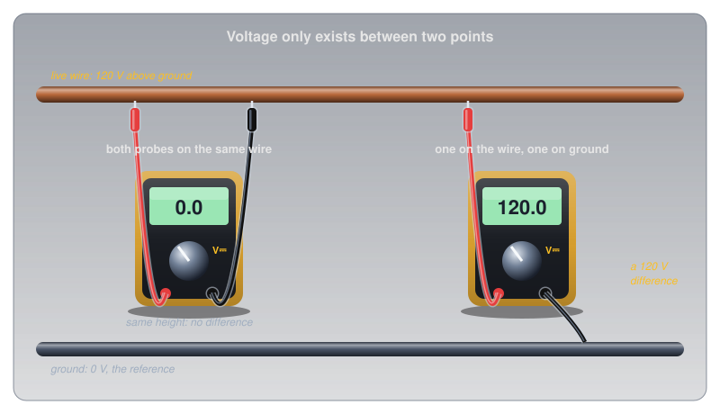
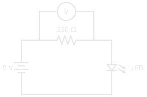

# Voltage

!!! abstract "Beginner"
    This article is in the **Circuit Foundations** topic and goes much deeper than the overview in [What Is Electricity?](what_is_electricity.md). It builds on the free electrons from [Conductors, Insulators, and Semiconductors](conductors_and_insulators.md). No prior knowledge required.

Birds perch on power lines carrying thousands of volts and fly away unharmed. A 9 V battery touched to the tongue gives a sharp tingle. Thousands of volts do nothing to the bird, and nine volts is enough to feel.

The puzzle dissolves once voltage is understood as two ideas working together:

1. **Voltage is energy per unit of charge.** It says how hard each bit of charge is pushed, not how much charge there is.
2. **Voltage only exists between two points.** There is no such thing as the voltage *of* a wire, only the voltage of one point compared with another.

The bird has both feet on the same wire, so between its feet there is no difference at all. The tongue bridges the two terminals of the battery, a 9 V difference, with nothing but wet skin in between. This article builds both ideas from the ground up, then puts them to work on batteries, sources, the scale of real-world voltages, and how to measure one.

---

## Charge: What Voltage Pushes On

Voltage is a push, so the first question is what it pushes on.

[Conductors, Insulators, and Semiconductors](conductors_and_insulators.md) showed that a metal is full of free electrons, each carrying a tiny negative **electric charge**. A single electron's charge is far too small to count with, so charge is measured in **coulombs** (C). One coulomb is the charge of about 6.24 billion billion electrons (6.24 × 10¹⁸).

???+ info "Definition: Coulomb"

    The **coulomb** (C) is the unit of electric charge. One coulomb is the charge carried by about 6.24 × 10¹⁸ electrons. Charge is the "stuff" that flows in a circuit; voltage is the push on it.

Charge is the stuff; voltage is how hard it gets pushed. Keeping those two apart is most of the work of understanding electricity.

---

## Idea One: Energy per Charge

With charge measured in coulombs, voltage gets a precise meaning: it's the energy each coulomb gains or loses between two points.

???+ info "Definition: Volt"

    One **volt** (V) means one **joule** of energy per coulomb of charge. A 9 V battery gives every coulomb that passes through it 9 joules of energy, which the coulomb then gives up as it travels around the circuit.

Height is the best physical picture of this. Lift a ball onto a shelf and it gains energy; let it roll down a ramp and it gives that energy back, spinning a paddle wheel or warming the ramp on the way. A battery works as a lift for charge. Each coulomb that goes through it rises to a "height" of 9 joules, then rolls down through the circuit, handing that energy to whatever it passes through: an LED (light-emitting diode) turns it into light, a resistor into heat, a motor into motion.

<figure markdown>
  { width="720" }
  <figcaption>The battery lifts; the circuit lets each coulomb back down. The height of the drop is the voltage.</figcaption>
</figure>

### Voltage Is Not Energy Stored

The height picture also shows what voltage is *not*. A shelf's height says how much energy each ball gains, not how many balls are waiting to be lifted. In the same way, a battery's voltage says how much energy each coulomb gets, not how much charge the battery can deliver before it's flat. That second number is the battery's **capacity**, usually printed in milliamp-hours (mAh).

An alkaline AA cell shows the difference with real numbers. Energizer's datasheet for its E91 AA lists a nominal 1.5 V and about 2,500 mAh at a moderate 100 mA drain:

- **Charge delivered:** 2,500 mAh is 2.5 amp-hours, and an amp-hour is 3,600 coulombs, so the cell delivers about **9,000 C**.
- **Energy per coulomb:** the voltage sags from about 1.5 V toward the 0.8 V cutoff as the cell drains, averaging roughly 1.25 V, so each coulomb carries about 1.25 J.
- **Total energy:** 9,000 C × 1.25 J/C ≈ **11,000 J**. That's enough to lift a 1 kg bag of sugar more than a kilometre straight up.

\[ E = Q \times V \approx 9{,}000\ \text{C} \times 1.25\ \text{V} \approx 11\ \text{kJ} \]

Voltage and capacity answer different questions: how hard each coulomb is pushed, and how many coulombs there are to push.

### Cells in Series Add Their Voltages

A single chemical cell produces a voltage fixed by its chemistry: about 1.5 V for an alkaline cell, about 2.1 V for a lead-acid cell. Higher voltages come from stacking cells end to end, **in series**, so each coulomb is lifted by one cell after another and the lifts add up.

A 9 V battery is exactly this. Its standard designation from the International Electrotechnical Commission (IEC), 6LR61, means six alkaline cells stacked inside one case: 6 × 1.5 V = 9 V. A car battery is the same idea with six lead-acid cells, about 12.6 V when fully charged.

<figure markdown>
  { width="720" }
  <figcaption>Each cell adds its own lift. Six of them make a 9 V battery or a 12 V car battery.</figcaption>
</figure>

---

## Idea Two: Always Between Two Points

Energy per coulomb only means something once two places are named: where the coulomb starts and where it ends. That's the second idea, and it's the one that explains the bird.

A voltmeter always has two probes for this reason. Touch both to the same wire and it reads zero, even if that wire is live, because there's no difference in energy per coulomb between two points on one wire. Touch one probe to the wire and the other to ground, and the full difference appears.

<figure markdown>
  { width="720" }
  <figcaption>Same live wire, two readings. The bird is the meter on the left: both feet at the same point, no difference, no current.</figcaption>
</figure>

That's the opening puzzle solved. The bird's two feet sit at the same voltage, so no current flows through it, however high the line's voltage is above the ground. A person on a ladder who touches the same wire is a different story: one hand on the wire, feet connected to the earth, and the full difference is across their body.

### Ground: A Chosen Zero

Every voltage needs a reference point, and in a circuit that point is called **ground**. Ground is defined as 0 V, and every other voltage in the circuit is measured from it. When a datasheet says a pin sits at 5 V, it means 5 V above that circuit's ground.

Altitude works the same way. A hilltop might be 300 m above sea level and a valley 100 m above sea level. Measure from the valley floor instead and the hilltop is at 200 m and the valley at 0 m. The numbers change with the reference; the 200 m difference between them never does.

<figure markdown>
  { width="720" }
  <figcaption>Choose a different zero and every number changes, but the differences don't. Ground is the zero a circuit chooses.</figcaption>
</figure>

### Every Component Takes Its Share

Back to the coulomb rolling down from the battery. If it starts 9 J up and ends at 0 J, then the energy it gives up along the way has to total exactly 9 J, split between everything it passes through. Each component's share is its **voltage drop**, and the drops around a loop always add up to the source voltage. [Series and Parallel Circuits](series_and_parallel.md) puts numbers on how that split works.

### Other Names for Voltage

Voltage goes by several names, and each emphasizes a different side of the same quantity:

- **Potential difference (PD)** is the formal name, and the most literal: a difference in electrical potential, energy per coulomb, between two points. Every voltage is a potential difference, including the drop across each component above.
- **Electromotive force (EMF)** is the voltage a *source* produces by separating charge: a battery, a generator, a solar cell. A battery's EMF is what it produces with nothing connected; [Cells and Batteries](batteries.md#cells-batteries-and-emf) shows how its voltage sags once current flows. Despite the name, EMF isn't a force in the physics sense; it's a voltage, measured in volts, and the name is a leftover from the 1800s. Older textbooks and the Canadian amateur radio exam write it with the letter **E**, which is why Ohm's Law also appears as E = I × R.
- **Electrical pressure** is an informal analogy rather than a technical term. Water pressure pushes water through a pipe, and voltage pushes charge through a circuit. Like voltage, what moves the water is a *difference* in pressure between two points: water flows from high pressure to low. The analogy has limits, but it's a good first picture.

---

## Where Voltage Comes From

So far a battery has done all the lifting. Any process that pushes charges apart, piling up extra electrons in one place and leaving a shortage in another, creates a voltage between the two places. The common sources differ only in what does the pushing.

<figure markdown>
  ![Six panels, one per source. Chemistry: a battery, 1.5 volts per alkaline cell. Light: a solar cell under the sun, about 0.6 volts per silicon cell. Magnetism: a magnet beside a copper coil, a generator whose voltage rises with speed and the number of turns. Heat: two different metal wires joined at a hot junction, a thermocouple producing millivolts. Pressure: a crystal squeezed between two arrows, with plus and minus charge on opposite faces, a piezo crystal whose squeeze makes a spark. Friction: a charged sphere throwing sparks, static at thousands of volts but tiny charge.](images/voltage/sources.svg){ width="740" }
  <figcaption>Six ways to separate charge. All of them make the same kind of voltage.</figcaption>
</figure>

- **Chemistry** (batteries): a chemical reaction moves electrons from one material to another. The voltage per cell is set by which chemicals are used, which is why every alkaline cell is about 1.5 V regardless of its size.
- **Light** (solar cells): light knocks electrons free in a silicon junction, which sweeps them to one side. A single silicon cell gives about 0.6 V, so a solar panel strings dozens of them in series.
- **Magnetism** (generators): moving a magnet past a coil of wire pushes the coil's electrons along. Spin it faster or add more turns and the voltage rises. Most of the electricity in the grid comes from this.
- **Heat** (thermocouples): joining two different metals and heating the junction produces a small voltage, a few thousandths of a volt, that rises with temperature.
- **Pressure** (piezoelectricity): squeezing certain crystals, such as quartz and some ceramics, pushes their charge toward opposite faces. A barbecue lighter's click snaps a hammer onto a crystal and gets a spark of thousands of volts; the same effect, run backwards, makes a piezo buzzer beep.
- **Friction** (static): rubbing two materials together scrapes electrons off one and onto the other. The voltage can reach thousands of volts, but the amount of charge is tiny.

---

## From Fractions of a Volt to Lightning

With the sources in mind, the voltages in everyday life span an enormous range, from a fraction of a volt to hundreds of millions.

<figure markdown>
  { width="740" }
  <figcaption>Each tick is ten times the one before. Hobby circuits live at the far left.</figcaption>
</figure>

| Source | Voltage | Note |
|---|---|---|
| Silicon solar cell | about 0.6 V | per cell |
| Alkaline AA cell | 1.5 V | set by its chemistry |
| USB (Universal Serial Bus) port, Arduino logic | 5 V | the 3.3 V rail on many boards is the other common level |
| 9 V battery | 9 V | six 1.5 V cells |
| Car battery | about 12.6 V | six lead-acid cells, fully charged |
| Canadian wall outlet | 120 V | alternating current (AC), and lethal |
| Hydro-Québec transmission line | 735,000 V | the world's first 735 kV line opened in Québec in 1965 |
| Lightning | about 300,000,000 V | the US National Oceanic and Atmospheric Administration's (NOAA) figure for a typical bolt |

---

## Measuring Voltage

Every number above was, at some point, read off a meter. Measuring voltage is the most common thing a multimeter does, and both ideas from this article explain how it's done.

Because voltage is a difference between two points, the meter's two probes go on the two points being compared. To measure the voltage across a component, the probes touch either side of that component, with the meter sitting alongside it **in parallel**, not inserted into the circuit's path. A multimeter set to measure voltage has a very high internal resistance (typically around 10 MΩ), so almost no current flows through it and it barely disturbs the circuit it's measuring.

<figure markdown>
  { width="420" }
  <figcaption>The voltmeter (the circle marked V) bridges the resistor's two ends. Reading the schematic: the long plate of the battery symbol is +, the triangle-and-bar is the LED.</figcaption>
</figure>

In this circuit the meter reads about 7 V, not 9 V. A red LED takes about 2 V of the battery's 9, and the resistor takes the rest: the voltage drops around the loop add up to the source, exactly as the rolling-coulomb picture predicts.

Measuring voltage is one of the safe operations at hobby voltages:

- ✅ **Safe (non-destructive):** measuring voltage across a component or a battery with the meter set to DC (direct current) volts. The meter's high resistance means nothing in the circuit changes.
- ⚠️ **Caution (can damage the meter):** measuring with the dial on current or resistance by mistake. On those settings the meter is close to a short circuit; always check the dial before the probes touch anything.
- 🚨 **DANGER:** measuring mains voltage. That needs a meter and leads rated for it (measurement category CAT II or higher) and training. Leave it alone.

---

## Safety: Voltage Pushes, Current Hurts

The two ideas also explain how electricity injures people. Voltage is the push; what does the damage is current, the charge actually forced through the body.

A static shock off a doorknob can be thousands of volts (a spark that jumps a few millimetres of air needs several thousand, since dry air breaks down at about 3,000 V per millimetre), yet it's harmless. There's so little charge behind it that the current lasts a tiny fraction of a second. A wall outlet is only 120 V, but it's backed by the grid: it can keep pushing current through skin for as long as the contact lasts, which is what stops hearts. [What Is Electricity?](what_is_electricity.md#safety-where-the-numbers-matter) works through the numbers for dry and wet skin.

!!! danger "Mains Voltage Can Kill"
    A Canadian outlet supplies 120 V AC, and some appliances use 240 V. Both can drive a lethal current through the body. Never open mains-powered equipment, never connect mains to a breadboard, and never assume a wire is dead because a switch is off. Every project on this site runs from batteries or USB.

Low voltage is not the same as harmless, either. A 12 V car battery can't push a dangerous current through dry skin, but it can deliver hundreds of amps through a dropped wrench that bridges its terminals, which gets the wrench red-hot in seconds and can make the battery explode.

---

## Practice

??? question "1. Joules and Coulombs"

    A 12 V battery pushes 3 coulombs of charge through a lamp. How much energy does the lamp receive?

    ??? tip "Solution"
        Each coulomb gives up 12 J (12 V means 12 joules per coulomb), so:

        \[ E = Q \times V = 3\ \text{C} \times 12\ \text{V} = 36\ \text{J} \]

??? question "2. Same Voltage, Different Battery"

    An AA cell and a much larger D cell are both 1.5 V alkaline cells. What is the same about them, and what is different?

    ??? tip "Solution"
        The voltage is the same because it's set by the chemistry: every coulomb gets 1.5 J from either cell. The capacity is different: the D cell holds far more chemical material, so it can push many more coulombs before it's flat. Same push, more charge to push.

??? question "3. Building a Voltage"

    How many 1.5 V cells in series make a 6 V battery? How many lead-acid cells (about 2.1 V each) make a 24 V truck battery system?

    ??? tip "Solution"
        6 ÷ 1.5 = **4 alkaline cells**. For lead-acid, 24 ÷ 2.1 ≈ 11.4, so the nearest whole number is **12 cells**, which gives about 25 V fully charged. That's how the 24 V systems in buses and military vehicles are built: two 12 V batteries in series.

??? question "4. Change the Reference"

    A circuit has points at 9 V, 5 V, and 0 V (ground). If you measured everything from the 5 V point instead, what would each point read? What is the voltage between the 9 V point and ground in both cases?

    ??? tip "Solution"
        Measured from the 5 V point: the 9 V point reads +4 V, the 5 V point reads 0 V, and ground reads −5 V. The difference between the top point and ground is 9 V either way (4 − (−5) = 9). Changing the reference changes every reading, never the differences.

??? question "5. The Lineworker"

    Lineworkers sometimes work on live high-voltage lines using insulated buckets, with special suits that put their whole body at the line's voltage. Using this article's second idea, explain why that can be safe.

    ??? tip "Solution"
        Voltage only drives current between two points at *different* voltages. If the worker's whole body is at the same voltage as the line, there's no difference across them, so no current flows through them, the same reason the bird is safe. The danger would come from touching something at a different voltage at the same time, such as a grounded pole, which is what the insulated bucket prevents.

??? question "6. EMF or Potential Difference?"

    A 9 V battery drives a resistor and an LED, with 7 V across the resistor and 2 V across the LED. Which of these three voltages is an EMF?

    ??? tip "Solution"
        Only the **battery's 9 V**: it's the voltage the source produces by separating charge. The 7 V and 2 V are potential differences, the shares of that energy each coulomb gives up in the resistor and the LED. All three are measured in volts, and all three are potential differences; only the source's is also an EMF.

---

## Quick Recap

-   **Voltage is energy per charge**

    ---

    1 V = 1 joule per coulomb. It says how hard each coulomb is pushed, not how many there are.

-   **Always between two points**

    ---

    A single point has no voltage on its own. Ground is the chosen zero every other voltage is measured from.

-   **Voltage is not capacity**

    ---

    Capacity (mAh) is how much charge a battery can deliver. Same voltage, different capacity: an AA and a D cell.

-   **Cells in series add**

    ---

    A 9 V battery is six 1.5 V cells; a car battery is six 2.1 V cells.

-   **Many ways to separate charge**

    ---

    Chemistry, light, magnetism, heat, and friction all make a voltage.

-   **Measure it in parallel**

    ---

    Probes on either side of the component. The meter barely disturbs the circuit.

---

## What's Next

Voltage is the push; what moves when it pushes is current. **[Current](current.md)** counts that charge per second, shows why it's never used up, and explains why it, not voltage, is what hurts.

---

## Further Reading

**Datasheets**

- [Energizer E91 AA Datasheet](https://data.energizer.com/pdfs/e91.pdf) — nominal 1.5 V, the capacity-versus-drain chart, and the discharge curves behind this article's 11 kJ estimate
- [Energizer 522 9 V Datasheet](https://data.energizer.com/pdfs/522.pdf) — the IEC 6LR61 designation for a six-cell 9 V battery

**Real-World Voltages**

- [Lightning Frequently Asked Questions — NOAA](https://www.noaa.gov/jetstream/lightning/frequently-asked-questions) — the 300 million volt figure for a typical lightning bolt
- [1965: The 735-kV Line — Hydro-Québec](https://www.hydroquebec.com/history-electricity-in-quebec/great-periods/1965-the-735-k-v-line-pushing-the-technical-envelope.html) — the story of the world's first 735 kV transmission line

**Deep Dives**

- [Voltage — Wikipedia](https://en.wikipedia.org/wiki/Voltage) — the formal definition, and how voltage is measured
- [Electromotive Force — Wikipedia](https://en.wikipedia.org/wiki/Electromotive_force) — EMF, the voltage a source produces, and where the name came from

**Related Articles**

- [Conductors, Insulators, and Semiconductors](conductors_and_insulators.md) — the free electrons that voltage pushes on
- [What Is Electricity?](what_is_electricity.md) — voltage, current, resistance, and Ohm's Law side by side
- [Current](current.md) — the charge per second that voltage pushes
- [Series and Parallel Circuits](series_and_parallel.md) — how voltage divides around a real circuit
