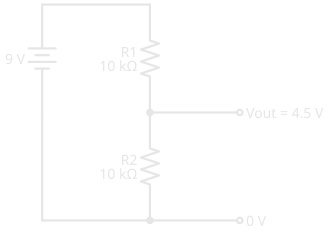
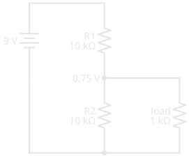
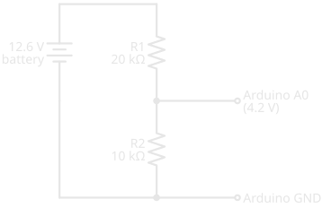
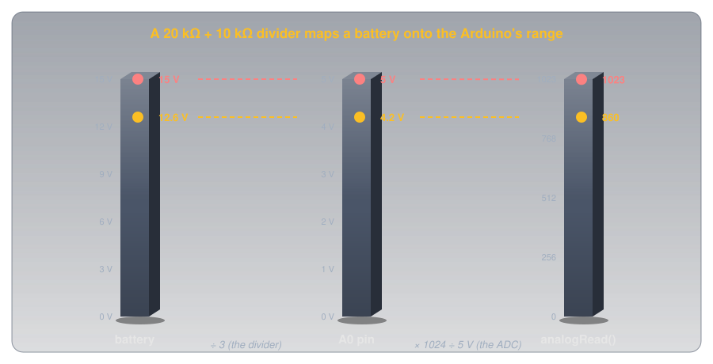

# Voltage Dividers

!!! abstract "Beginner"
    This article is in the **Circuit Foundations** topic. It builds on [Ohm's Law and Power](ohms_law.md) and [Series and Parallel Circuits](series_and_parallel.md). No other prior knowledge required.

Connect two 10 kΩ resistors in series across a 9 V battery and the point between them sits at exactly 4.5 V. A multimeter confirms it. Now connect a small 1 kΩ load to that point, expecting it to get 4.5 V, and the reading drops to 0.75 V. Nothing is broken and no part has changed value.

Two ideas explain both readings:

1. **Resistors in series share the supply voltage in proportion to their resistance.** The same current flows through both, so the bigger resistor takes the bigger share, and the point between them gives a fixed fraction of the supply. That circuit is a **voltage divider**.
2. **Seen from its output, a divider is a smaller battery with a resistor in series.** Anything connected to the output draws current through that hidden resistor, and the voltage sags. A light load barely moves it, and a heavy one drags it down.

The first idea gives the 4.5 V. The second gives the 0.75 V, worked out in the second half.

---

## Idea One: The Same Current, Shared Voltage

[Series and Parallel Circuits](series_and_parallel.md) showed that resistors in series carry the same current, and that their voltages add up to the supply. A voltage divider is just that circuit with a wire taken from the point between the resistors.

<figure markdown>
  { width="420" }
  <figcaption>R1 on top, R2 on the bottom, and the output from the point between them.</figcaption>
</figure>

Ohm's law gives the current through both resistors, and then the voltage across R2, which is the output:

\[ I = \frac{V_{\text{in}}}{R_1 + R_2} \qquad V_{\text{out}} = I \times R_2 \]

Put the two together and the current cancels out:

\[ V_{\text{out}} = V_{\text{in}} \times \frac{R_2}{R_1 + R_2} \]

That's the **voltage divider formula**. R2 over the total is the fraction of the supply that appears at the output. With two 10 kΩ resistors the fraction is 10 ÷ 20, one half, and 9 V × ½ = 4.5 V.

<figure markdown>
  { width="760" }
  <figcaption>Each resistor's block is as tall as its share of the 9 V. The output is wherever the two meet.</figcaption>
</figure>

???+ info "Definition: Voltage Divider"
    Two (or more) resistors in series across a supply, with an output taken from a point between them. Unloaded, the output is the supply times the bottom resistance over the total. The top resistor is conventionally called R1 and the bottom one, the one the output is measured across, R2.

### Only the Ratio Sets the Voltage

The formula has no units in its fraction: it only cares about the ratio. A 1 kΩ pair, a 10 kΩ pair, and a 100 kΩ pair all give 4.5 V from 9 V. What the values do set is the current, and that current flows all the time, whether or not anything is using the output.

<figure markdown>
  { width="760" }
  <figcaption>The same 4.5 V output from all three. The difference is how much current, and battery, each one burns doing it.</figcaption>
</figure>

Large values waste less, which matters on a battery. Small values hold up better when something is connected to the output, which is the second idea. Choosing a divider is a trade-off between the two.

### Designing One

Designing a divider is the formula run backwards: choose the ratio from the voltages, then choose the total resistance from how much current you can spare.

Say a 9 V supply needs to become 3 V. The output should be a third of the input, so R2 must be a third of the total and R1 the other two-thirds: R1 = 2 × R2. A total of about 30 kΩ draws 0.3 mA, so R1 = 20 kΩ and R2 = 10 kΩ, both standard values:

\[ V_{\text{out}} = 9\ \text{V} \times \frac{10\ \text{k}\Omega}{20\ \text{k}\Omega + 10\ \text{k}\Omega} = 3\ \text{V} \]

When the exact ratio doesn't land on standard values, pick the nearest pair and check the result with the formula. Resistor [tolerance](resistance.md) moves the output too: two 5% resistors can each be off in opposite directions, so precise dividers use 1% metal film parts ([Resistor Types](resistor_types.md) compares them).

---

## Idea Two: What the Output Sees

Here's the hook's puzzle. A 1 kΩ load connected to the output sits **in parallel with R2**: current that reached the junction now has two paths to the bottom rail. Two resistors in parallel give less resistance than either one, so the bottom half of the divider shrinks:

\[ R_2 \parallel R_L = \frac{10\ \text{k}\Omega \times 1\ \text{k}\Omega}{10\ \text{k}\Omega + 1\ \text{k}\Omega} \approx 909\ \Omega \]

<figure markdown>
  { width="460" }
  <figcaption>The load joins R2, and the pair takes a much smaller share of the supply.</figcaption>
</figure>

The divider is now 10 kΩ over 909 Ω, and the formula gives the new output:

\[ V_{\text{out}} = 9\ \text{V} \times \frac{909\ \Omega}{10{,}000\ \Omega + 909\ \Omega} \approx 0.75\ \text{V} \]

### A Smaller Battery Behind a Resistor

Redoing the parallel arithmetic for every load gets tedious, and there's a shortcut that also explains *why* the output sags. From the output's point of view, any divider behaves exactly like a smaller battery with a single resistor in series:

- **The battery's voltage** is the divider's unloaded output: 4.5 V here.
- **The resistor** is R1 and R2 **in parallel**: 10 kΩ ∥ 10 kΩ = 5 kΩ here. This is the divider's **output resistance**.

<figure markdown>
  { width="760" }
  <figcaption>Any two-resistor divider reduces to this pair. Engineers call it the Thévenin equivalent.</figcaption>
</figure>

Connect a load and it forms a new divider with that hidden 5 kΩ. For the 1 kΩ load:

\[ V_{\text{out}} = 4.5\ \text{V} \times \frac{1\ \text{k}\Omega}{5\ \text{k}\Omega + 1\ \text{k}\Omega} = 0.75\ \text{V} \]

Same answer, one line. This simplification is called the **Thévenin equivalent**, after the French telegraph engineer Léon Charles Thévenin, and it works for any circuit built from resistors and sources, not just dividers.

### The Puzzle, Solved

The 1 kΩ load is a fifth of the divider's 5 kΩ output resistance, so most of the 4.5 V is lost across that hidden resistor and only 0.75 V reaches the load. The divider was fine. It just can't push enough current through its own resistance to feed a load that heavy.

The curve below shows the same divider feeding every load from 100 Ω to 10 MΩ.

<figure markdown>
  { width="760" }
  <figcaption>The heavier the load (the further left), the further the output falls below 4.5 V.</figcaption>
</figure>

That gives the working rule: **a load at least 10 times the divider's output resistance keeps the output within about 10% of its unloaded value, and 100 times keeps it within 1%.**

### Why You Can't Power Things From a Divider

The rule rules out using a divider as a power supply. Take a 5 V circuit that draws 50 mA, a typical figure for a small microcontroller board with a few LEDs lit: it looks like a load of about 100 Ω. To hold 5 V within 10% for that, the divider's output resistance would have to be about 11 Ω, which means resistors like 20 Ω over 25 Ω. That pair passes 0.2 A from a 9 V supply and turns 1.8 W into heat around the clock, several times the 0.25 W the circuit itself uses, and the voltage would still wander as the circuit's current changed.

Dropping a supply voltage to power something is the job of a **voltage regulator**, which adjusts itself to hold its output steady whatever the load draws. Dividers are for **signals**: sensing, scaling, and setting reference levels, where the load draws almost nothing.

---

## Measuring a Divider

A multimeter is a load too, which makes it a good way to see idea two in action. On its volts setting, a typical digital multimeter has an input resistance of about 10 MΩ: the [Fluke 114–117 specifications](https://media.fluke.com/ce54d963-3be9-4e70-8a3e-b1060070fdfd_original%20file.pdf) give more than 10 MΩ for DC volts.

- On a **10 kΩ + 10 kΩ** divider (5 kΩ output resistance), 10 MΩ is 2,000 times larger, and the meter reads 4.498 V: indistinguishable from 4.5 V.
- On a **1 MΩ + 1 MΩ** divider (500 kΩ output resistance), the meter is only 20 times larger. It reads 4.29 V, almost 5% low, and the error is the meter's, not the circuit's.

So when a reading from a high-value divider looks low, check whether the meter itself is loading it before suspecting a part. To measure a divider, [measure voltage](voltage.md#measuring-voltage) from the output to the bottom rail with the circuit powered, and [measure each resistor](resistance.md#measuring-resistance) with it unpowered and lifted from the circuit if the reading disagrees with the formula.

---

## Where You'll Find Them

Once you know the shape, voltage dividers turn up everywhere, usually doing one of four jobs.

<div class="grid cards" markdown>

-   **Adjustable voltage: the potentiometer**

    ---

    A [potentiometer](resistor_types.md) is a divider whose ratio you set by turning a shaft: the wiper splits one resistive track into R1 and R2. Volume and brightness knobs work this way.

-   **Turning resistance into voltage: sensors**

    ---

    A thermistor or light-dependent resistor changes resistance, which a microcontroller can't read directly. Put it in a divider with a fixed resistor and its changes become a voltage. [Temperature Sensors](temperature_sensors.md) describes reading a thermistor this way.

-   **Scaling a voltage down: monitors**

    ---

    A battery, a solar panel, or a car's electrical system runs higher than a microcontroller's input can take. A divider scales it into range. The worked example below builds one.

-   **Setting a regulator's output**

    ---

    Adjustable regulators read their own output through a divider. The LM317's output is 1.25 V × (1 + R2 ÷ R1), plus a small correction for the 50 µA its adjust pin draws ([Texas Instruments LM317 datasheet](https://www.ti.com/lit/ds/symlink/lm317.pdf)), so changing one resistor sets the voltage.

</div>

### Worked Example: A Battery Monitor

An Arduino Uno's analog pins measure 0 to 5 V ([Reading an Analog Sensor](analog_input.md) shows how). A 12 V lead-acid battery reads about 12.6 V when fully charged ([Cells and Batteries](batteries.md) explains why) and higher while it's on a charger, so it has to be scaled down before it reaches a pin, with some headroom.

Designing for 15 V in and 5 V out gives a ratio of one third, and the same 20 kΩ over 10 kΩ pair from earlier:

<figure markdown>
  { width="460" }
  <figcaption>One third of the battery voltage reaches A0. The divider's bottom must share the Arduino's ground.</figcaption>
</figure>

Three checks make it a good design:

1. **Range:** 15 V × ⅓ = 5 V at most, the top of the pin's range, and a full 12.6 V gives 4.2 V.
2. **Output resistance:** 20 kΩ ∥ 10 kΩ ≈ 6.7 kΩ. The ATmega328P chip on the Uno is "optimized for analog signals with an output impedance of approximately 10 kΩ or less" ([ATmega328P datasheet](https://ww1.microchip.com/downloads/aemDocuments/documents/MCU08/ProductDocuments/DataSheets/ATmega48A-PA-88A-PA-168A-PA-328-P-DS-DS40002061B.pdf), section 24.6.1). Above that, the chip needs longer to charge its internal sampling capacitor, and readings become less accurate.
3. **Drain:** 12.6 V ÷ 30 kΩ = 0.42 mA, about 10 mAh a day: nothing to a car battery.

<figure markdown>
  { width="760" }
  <figcaption>Two conversions: the divider divides by three, and the analog-to-digital converter turns volts into a number.</figcaption>
</figure>

The sketch undoes both conversions to report the battery voltage:

``` cpp title="Read a 12 V battery through a 3:1 divider" linenums="1"
const int sensePin = A0;
const float dividerRatio = 3.0; // (1)!

void setup() {
  Serial.begin(9600);
}

void loop() {
  int raw = analogRead(sensePin); // (2)!
  float pinVolts = (raw / 1024.0) * 5.0; // (3)!
  float batteryVolts = pinVolts * dividerRatio; // (4)!

  Serial.print("Battery: ");
  Serial.print(batteryVolts);
  Serial.println(" V");

  delay(1000);
}
```

1. (R1 + R2) ÷ R2 = 30 kΩ ÷ 10 kΩ. Measure the two resistors and use their real ratio for a more accurate reading.
2. A whole number from 0 to 1023. A 4.2 V pin gives about 860.
3. The same conversion as [Reading an Analog Sensor](analog_input.md): steps to volts at the pin.
4. Undo the divider: 860 steps → 4.20 V at the pin → 12.6 V at the battery.

### Hands-On: A Potentiometer on A0

The quickest divider to experiment with is a potentiometer. Connect a 10 kΩ pot's outer legs to the Arduino's 5V and GND pins and its middle leg (the wiper) to A0, then upload the sketch above with `dividerRatio` set to `1.0`. Turning the shaft sweeps the Serial Monitor's reading from 0 to 5 V.

Its output resistance changes as you turn it: zero at either end, and largest in the middle, where the two halves are 5 kΩ ∥ 5 kΩ = 2.5 kΩ. That's comfortably under the 10 kΩ the chip wants, which is why 10 kΩ pots are the usual choice for Arduino inputs.

---

## Safety: When a Divider Fails

A divider connected to a higher voltage than its load can survive is only as safe as its resistors. In the battery monitor, the top resistor is the only thing standing between 12.6 V and a pin rated to an absolute maximum of 0.5 V above the chip's supply, 5.5 V on an Uno ([ATmega328P datasheet](https://ww1.microchip.com/downloads/aemDocuments/documents/MCU08/ProductDocuments/DataSheets/ATmega48A-PA-88A-PA-168A-PA-328-P-DS-DS40002061B.pdf), Absolute Maximum Ratings).

!!! warning "A Wiring Slip Puts the Full Voltage on the Pin"
    If R1 is shorted, skipped, or the wires to A0 and the battery are swapped, the pin sees the whole battery voltage with nothing to limit the current, and the microcontroller can be destroyed. If R2 comes loose, the pin is fed through R1 alone and rises above the chip's supply, held down only by its internal protection diodes. Check the wiring with the battery disconnected, and measure the divider's output with a multimeter before connecting it to the Arduino.

!!! danger "Never Use a Homemade Divider on Mains"
    Dividing household mains voltage down to measure it gives no isolation: every part of the circuit, including the "low-voltage" side, can be at a lethal voltage relative to ground. Measuring mains takes purpose-built, isolated sensors and a meter rated for it. Keep divider experiments to batteries and low-voltage DC supplies.

---

## Practice

??? question "1. Unloaded Output"

    A 12 V supply feeds R1 = 3.3 kΩ over R2 = 1 kΩ. What's the output with nothing attached?

    ??? tip "Solution"
        \[ V_{\text{out}} = 12\ \text{V} \times \frac{1\ \text{k}\Omega}{3.3\ \text{k}\Omega + 1\ \text{k}\Omega} \approx 2.79\ \text{V} \]

        The output is always the bottom resistor over the total: 1 out of 4.3.

??? question "2. Designing a Divider"

    You need 3.3 V from a 5 V signal, using standard resistor values and drawing about 1 mA or less. Which pair would you choose?

    ??? tip "Solution"
        The output needs to be 3.3 ÷ 5 = 0.66 of the input, very close to two thirds, so R1 should be half of R2. R1 = 1 kΩ and R2 = 2 kΩ gives:

        \[ 5\ \text{V} \times \frac{2\ \text{k}\Omega}{1\ \text{k}\Omega + 2\ \text{k}\Omega} \approx 3.33\ \text{V} \]

        and draws 5 V ÷ 3 kΩ ≈ 1.7 mA. To draw less, scale both up: 10 kΩ and 20 kΩ give the same 3.33 V at about 0.17 mA. This pair is the classic way to bring a 5 V signal down for a 3.3 V chip's input.

??? question "3. A Loaded Divider"

    A 9 V supply feeds two 10 kΩ resistors, and a 20 kΩ load is connected to the output. What does the output read?

    ??? tip "Solution"
        The divider looks like 4.5 V behind 10 kΩ ∥ 10 kΩ = 5 kΩ. The load forms a new divider with that 5 kΩ:

        \[ V_{\text{out}} = 4.5\ \text{V} \times \frac{20\ \text{k}\Omega}{5\ \text{k}\Omega + 20\ \text{k}\Omega} = 3.6\ \text{V} \]

        The load is only 4 times the output resistance, so the output sags 20%.

??? question "4. The Meter That Lies"

    Two 1 MΩ resistors divide 9 V. Your meter, with a 10 MΩ input, reads 4.29 V instead of 4.5 V. Is a resistor out of tolerance?

    ??? tip "Solution"
        Probably not. The divider's output resistance is 1 MΩ ∥ 1 MΩ = 500 kΩ, and the meter's 10 MΩ forms a new divider with it:

        \[ 4.5\ \text{V} \times \frac{10\ \text{M}\Omega}{0.5\ \text{M}\Omega + 10\ \text{M}\Omega} \approx 4.29\ \text{V} \]

        That's exactly the reading. The meter is loading the circuit. Measure each resistor out of circuit to be sure.

??? question "5. Reading the Battery Monitor"

    The battery monitor (20 kΩ over 10 kΩ) returns a raw `analogRead()` value of 700. What's the battery voltage, and is it healthy?

    ??? tip "Solution"
        Steps to pin volts, then undo the divider:

        \[ \frac{700}{1024} \times 5\ \text{V} \approx 3.42\ \text{V} \qquad 3.42\ \text{V} \times 3 \approx 10.25\ \text{V} \]

        A 12 V lead-acid battery at about 10.3 V under no load is deeply discharged, well below the roughly 12.6 V of a full one.

??? question "6. Why Not Power an Arduino From One?"

    Someone proposes powering a 5 V board that draws about 50 mA from a 9 V battery through a divider. Explain in a sentence or two what goes wrong, and what to use instead.

    ??? tip "Solution"
        The board looks like a load of about 100 Ω, so the divider's output resistance would have to be around 10 Ω for the voltage to hold, which wastes more power in the resistors than the board uses (about 1.8 W for a 20 Ω over 25 Ω pair), and the voltage still changes as the board's current does. A voltage regulator holds the output steady regardless of the load and is the right part for supplying power.

---

## Quick Recap

<div class="grid cards two-col" markdown>

-   **Vout = Vin × R2 ÷ (R1 + R2)**

    ---

    Series resistors share the supply in proportion to their resistance. The output is the bottom resistor's share.

-   **The ratio sets the voltage**

    ---

    The values set the current that flows all the time. Larger values waste less; smaller values hold up better under load.

-   **A load joins R2**

    ---

    Anything on the output is in parallel with the bottom resistor, so it pulls the output down.

-   **A battery behind a resistor**

    ---

    From the output, a divider is its unloaded voltage behind R1 ∥ R2. That's the Thévenin equivalent.

-   **10× and 100×**

    ---

    A load 10 times the output resistance sags about 10%. A load 100 times it sags about 1%.

-   **Signals, not power**

    ---

    Dividers scale and sense. Supplying a lower voltage to a circuit is a regulator's job.

-   **Keep it under 10 kΩ for an Arduino**

    ---

    The ATmega328P's analog input wants a source resistance of 10 kΩ or less.

-   **The top resistor is a safety part**

    ---

    Lose it and the full input voltage reaches whatever is on the output.

</div>

---

## What's Next

Resistors share voltage instantly and forever. **[Capacitors](capacitors.md)** add time to the picture: put one where R2 is, and the output takes a predictable while to rise, which is how circuits make delays, smooth power, and flash a camera.

---

## Further Reading

**Datasheets**

- [ATmega328P Datasheet (PDF)](https://ww1.microchip.com/downloads/aemDocuments/documents/MCU08/ProductDocuments/DataSheets/ATmega48A-PA-88A-PA-168A-PA-328-P-DS-DS40002061B.pdf) — section 24.6.1 on analog input source impedance, and the absolute maximum pin voltage
- [Texas Instruments LM317 Datasheet (PDF)](https://www.ti.com/lit/ds/symlink/lm317.pdf) — the adjustable regulator whose output is set by a voltage divider
- [Fluke 114, 115, 116, and 117 Specifications (PDF)](https://media.fluke.com/ce54d963-3be9-4e70-8a3e-b1060070fdfd_original%20file.pdf) — the 10 MΩ DC-volts input resistance used in the meter-loading example

**Deep Dives**

- [Voltage Divider — Wikipedia](https://en.wikipedia.org/wiki/Voltage_divider) — the general form, including dividers made from capacitors and inductors
- [Thévenin's Theorem — Wikipedia](https://en.wikipedia.org/wiki/Th%C3%A9venin%27s_theorem) — the battery-behind-a-resistor simplification, for any circuit

**Related Articles**

- [Series and Parallel Circuits](series_and_parallel.md) — the series and parallel rules this article is built from
- [Resistor Types and Potentiometers](resistor_types.md) — the potentiometer as an adjustable divider, and tolerance
- [Reading an Analog Sensor](analog_input.md) — how the Arduino turns the divider's output into a number
- [Temperature Sensors](temperature_sensors.md) — a thermistor in a divider
