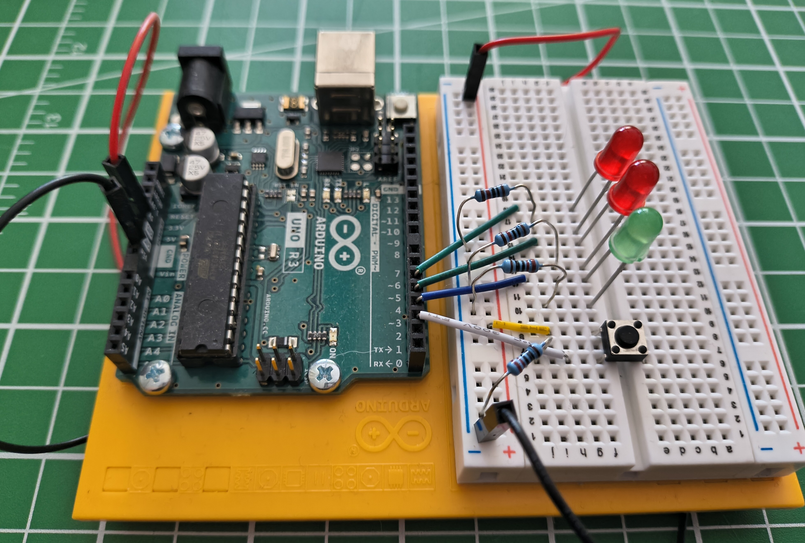
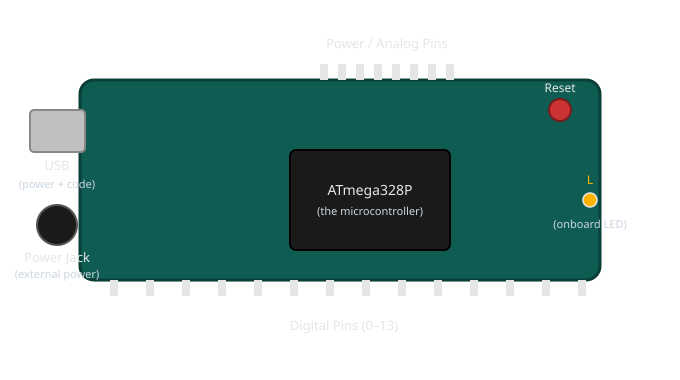

# What Is an Arduino?

!!! abstract "Beginner"
    This article opens the **Microcontrollers** topic. No prior electronics or coding knowledge is assumed — this is where both begin.

You've likely heard the name before — Arduino comes up constantly around blinking LEDs, robots, and home automation projects. But "Arduino" gets used loosely, for a board, a piece of software, and a whole ecosystem all at once, and no one stops to untangle which is which.

This article does exactly that: what's physically on the board, what a "microcontroller" actually is, and — because every article from here on shows you real code — how to read the handful of lines every Arduino program starts with, piece by piece.

---

## The Board Itself

<figure markdown>
  { width="600" }
  <figcaption>An Arduino Uno — the rectangular board on the left, connected to a breadboard circuit. Everything in this article is about the board itself, before anything is wired to it.</figcaption>
</figure>

Take the breadboard and wiring away, and what's left is the board on its own: a small rectangular circuit board, a bit bigger than a credit card, with a USB port along one edge and two rows of metal pin sockets along the front and back. That board is an **Arduino Uno** — one specific, widely-used model in the Arduino family, and the one every article on this site uses.

<figure markdown>
  { width="600" }
  <figcaption>A simplified, not-to-scale diagram of what's on the board — the real layout is denser, but every part shown here is really there.</figcaption>
</figure>

- **The USB port** — plugs into your computer for two jobs at once: it powers the board, and it's the path your code travels down to get onto the chip.
- **The power jack** — an alternative to USB when the board needs to run away from a computer, powered by a wall adapter or battery instead.
- **The reset button** — restarts whatever program is currently on the board, from the very beginning.
- **The onboard LED**, labelled `L` — a small light built into the board itself, wired to one specific pin. It's useful precisely because it needs no wiring: [Blink an LED](blink_an_led.md) uses it as the very first test that a program has made it onto the board at all.
- **The pin headers** — the rows of small sockets along the edges. These are what a wire from a breadboard plugs into, and they're the subject of the next article, [Digital Pins](digital_io.md).
- **The chip in the middle** — the small black rectangle mounted near the center of the board. This is the part that actually matters, and everything else on the board exists to support it.

!!! tip "Finding a specific pin on the real board"
    Every pin socket has its number or label printed right on the board next to it — tiny white text in the plastic silkscreen layer, easy to miss until you know to look. When an article says "pin 3," don't count sockets from the end: look for the little `3` printed beside one of them. The digital pins are numbered `0` through `13` along one edge; the analog pins are labelled `A0` through `A5` on another; `GND` appears more than once, since any ground pin works the same as any other.

---

## What That Chip Actually Is

The chip in the middle is a **microcontroller** — on the Uno, a specific chip called the `ATmega328P`. The word sounds intimidating; what it does is not. A microcontroller is a genuinely tiny, self-contained computer: it has a processor, a small amount of memory, and nothing else — no screen, no operating system, no way to run more than one thing at a time.

Think of a wind-up music box. Wind it, and it plays exactly one tune, start to finish, the same way every time — there's no menu, no other song it could play instead, just the one thing it's built to do. A microcontroller works the same way: you load exactly one program onto it, and from the moment it powers on, that's the only thing it does, forever, until you load something different.

That single-mindedness is a feature, not a limitation. A traffic light, a microwave's keypad, the thermostat on your wall — none of them need to multitask or run a dozen apps. They need to do one job, reliably, for years. A microcontroller is built for exactly that job, and an Arduino Uno is a microcontroller with just enough surrounding hardware — the USB port, the power jack, the pin headers — to make it easy to work with while you're learning.

---

## The Program Has a Name: A Sketch

The program you load onto an Arduino has its own name: a **sketch**. It's an ordinary text file full of code — nothing mysterious about the word, it's simply what Arduino's own tools call a program written for the board.

That code is written in a real, general-purpose programming language: **C++**. Arduino didn't invent its own language — it uses C++ with a small set of ready-made functions layered on top (`pinMode`, `digitalWrite`, and the others you'll meet in [Digital Pins](digital_io.md)), so you get a real language's full power without needing to know all of it on day one.

---

## Reading Your First Sketch

Here is the smallest complete sketch you can write — it does nothing yet, but every sketch you'll ever see, no matter how complex, has this exact shape:

``` cpp title="The smallest possible sketch" linenums="1"
void setup() {

}

void loop() {

}
```

It looks like almost nothing, which makes it the perfect place to learn what every piece of punctuation is doing before any actual instructions get added.

- **`setup` and `loop` are functions** — a function is simply a named, self-contained block of instructions. `setup` is the name of one; `loop` is the name of the other. You'll write more functions of your own later, but every sketch starts with exactly these two, and their names are fixed — the tools that build your sketch look for them by these exact names.
- **The parentheses `()`** — every function has a pair of parentheses right after its name. This is where you'd list any information the function needs to do its job. `setup` and `loop` don't need any, so theirs are empty — but the parentheses are still required, empty or not.
- **The curly braces `{ }`** — everything a function does goes between its opening `{` and closing `}`. Right now both are empty, which is exactly why this sketch does nothing: there's nothing between the braces yet.
- **`void`** — some functions hand back an answer when they finish (a calculation's result, for instance); others just *do* something and hand nothing back. `void` in front of a function's name means "this one just does something — don't expect an answer from it." `setup` and `loop` are both `void` for exactly that reason.

That's the entire punctuation vocabulary of a sketch's skeleton. Everything else you'll learn is about what goes *inside* the braces.

### Why Two Functions, and Why These Two

`setup` and `loop` aren't just two functions among many — they're the two the Arduino core always runs, automatically, in a fixed pattern:

- **`setup()` runs exactly once** — the instant the board powers on, or the moment you press reset. Anything that only needs to happen one time — like telling a pin whether it's an input or an output — goes here.
- **`loop()` runs immediately after `setup()` finishes — and then keeps running, over and over, without stopping**, for as long as the board has power. Anything the program needs to keep doing — checking a button, blinking a light — goes here.

You never call `setup()` or `loop()` yourself anywhere in your code. The board calls them for you, in that order, automatically — which is exactly why they have to be named precisely `setup` and `loop`, with nothing spelled differently.

Add one real instruction and the pattern still holds. Here's `digital_io.md`'s LED example again, now that every symbol in it has a name:

``` cpp title="Light an LED on pin 3" linenums="1"
void setup() {
  pinMode(3, OUTPUT);      // pin 3 will drive the LED
}

void loop() {
  digitalWrite(3, HIGH);   // 5V on pin 3 — LED on
}
```

`pinMode(3, OUTPUT)` and `digitalWrite(3, HIGH)` are function calls too — this time, functions Arduino already wrote for you, each doing one specific job, each taking the information inside its parentheses (which pin, and what to set it to) to know exactly what to do. Notice each instruction line ends with a semicolon `;` — the same job a period does at the end of a sentence, marking "this instruction is complete." Leave it off and the sketch won't build at all.

!!! info "You'll see `// comments` in every code example"
    Text after `//` on a line is a **comment** — a note left for a human reader, completely ignored by the board. `pinMode(3, OUTPUT);      // pin 3 will drive the LED` runs exactly the same with or without that comment; it's there purely to explain the line to you.

---

## Practice

??? question "1. Spot the missing piece"

    A beginner types this and it won't build:

    ``` cpp
    void setup() {
      pinMode(3, OUTPUT)
    }

    void loop() {

    }
    ```

    What's missing?

    ??? tip "Solution"

        A **semicolon**. `pinMode(3, OUTPUT)` needs to end with `;`, like every instruction inside a function's braces. As written, the tools building the sketch can't tell where that instruction ends.

??? question "2. Which one, and why?"

    You want a pin to be configured as an output exactly once, and you want the program to keep checking a button for as long as the board has power. Which function does each belong in?

    ??? tip "Solution"

        Configuring the pin (`pinMode(...)`) is a one-time setup step, so it belongs in `setup()`. Checking the button is something that has to keep happening, so it belongs in `loop()` — which runs forever once `setup()` finishes.

??? question "3. void or not?"

    Would you expect a function that calculates and returns the sum of two numbers to be declared `void`?

    ??? tip "Solution"

        No. `void` means "hands nothing back." A function whose entire purpose is to return a sum has an answer to give back to whatever called it — so it would be declared with the type of that answer instead of `void`. You won't need to write one of these yet, but recognising why `setup` and `loop` are `void` (they perform an action; they don't calculate an answer) is the useful part.

---

## Quick Recap

<div class="grid cards two-col" markdown>

-   **The Board**

    ---

    A USB port (power + code), a power jack, a reset button, pin headers along the edges, and a microcontroller chip — the part that actually runs your program.

-   **The Microcontroller**

    ---

    A tiny, dedicated computer: no operating system, no multitasking — just the one program you loaded, running forever from power-on.

-   **The Sketch**

    ---

    An Arduino program, written in **C++**. Its code is text; the tools that build it are covered in [arduino-cli](tools/arduino_cli.md).

-   **The Skeleton**

    ---

    Every sketch has `void setup() { }` and `void loop() { }`. `setup` runs once; `loop` runs forever after it. Functions, parentheses, braces, and semicolons are the punctuation everything else builds on.

</div>

---

## What's Next

You know what's on the board and what a sketch's bare structure means. **[Digital Pins](digital_io.md)** puts that structure to work — driving an LED and reading a button through the pin headers you just learned to identify.

---

## Further Reading

**Official Documentation**

- [Arduino — Introduction](https://docs.arduino.cc/learn/starting-guide/getting-started-arduino/) — Arduino's own overview of the board and the ecosystem around it
- [Arduino Language Reference](https://docs.arduino.cc/language-reference/) — every function available inside a sketch, organised by category

**Related Articles**

- [Digital Pins](digital_io.md) — putting the board's pin headers to work, driving an LED and reading a button
- [arduino-cli](tools/arduino_cli.md) — how a sketch actually gets from a text file on your computer onto the chip
