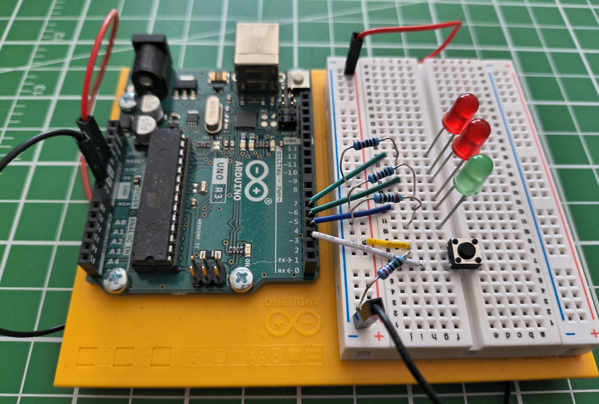

# What Is an Arduino?

!!! abstract "Beginner"
    This article opens the **Microcontrollers** topic. No prior electronics or coding knowledge is assumed: this is where both begin.

The name comes up constantly around blinking LEDs, robots, and home automation projects, and it gets used loosely: for a board, a piece of software, and a whole ecosystem, often in the same sentence.

This article untangles them: what's physically on the board, what a microcontroller actually is, and, because every article from here on shows real code, how to read the few lines every Arduino program starts with.

---

## The Board Itself

<figure markdown>
  { width="600" }
  <figcaption>An Arduino Uno: the rectangular board on the left, connected to a breadboard circuit. This article is about the board itself, before anything is wired to it.</figcaption>
</figure>

Take the breadboard and wiring away, and what's left is the board on its own: a small rectangular circuit board, a bit bigger than a credit card, with a USB port along one edge and two rows of metal pin sockets along the front and back. That board is an **Arduino Uno**, the most widely used model in the Arduino family and the one every article on this site uses.

<figure markdown>
  { width="600" }
  <figcaption>A simplified diagram of the board: the real layout is denser, but every part shown is really there, in the place it really sits.</figcaption>
</figure>

- **The USB port** does two jobs at once: it powers the board, and it's the path your code travels to reach the chip.
- **The power jack** runs the board away from a computer, from a wall adapter or a battery.
- **The reset button** restarts the program on the board from the beginning.
- **The onboard LED**, labelled `L`, is a small light wired to pin 13. Because it needs no wiring, [Blink an LED](blink_an_led.md) uses it as the first test that a program has reached the board at all.
- **The pin headers** are the rows of sockets along the edges, where breadboard wires plug in. They're the subject of the next article, [Digital Pins](digital_io.md).
- **The chip** near the corner is the part that actually matters. Everything else on the board exists to support it.

!!! tip "Finding a specific pin on the real board"
    Every pin socket has its number or label printed beside it in tiny white text (the silkscreen), easy to miss until you know to look. When an article says "pin 3," don't count sockets from the end: look for the little `3`. The digital pins are numbered `0` through `13` along one edge; the analog pins are labelled `A0` through `A5` on another; `GND` appears more than once, since any ground pin works the same as any other.

---

## What That Chip Actually Is

That chip is a **microcontroller**, on the Uno a part called the `ATmega328P`. The word sounds intimidating; the idea isn't. A microcontroller is a tiny, self-contained computer on one chip: a processor, a little memory (32 KB for programs, 2 KB for working data), and the pins that connect it to the outside world. It has no screen, no operating system, and runs exactly one program.

Think of a wind-up music box. Wind it, and it plays one tune, the same way every time, with no menu and no other song to choose. A microcontroller works the same way: you load one program onto it, and from the moment it powers on that's all it does, until you load something different.

That single-mindedness is the point. A traffic light, a microwave's keypad, and a wall thermostat don't need to run a dozen apps; they need to do one job reliably for years. An Arduino Uno is a microcontroller with just enough hardware around it (the USB port, the power jack, the pin headers) to make it easy to learn on.

---

## The Program Has a Name: A Sketch

Arduino calls the program you load onto the board a **sketch**. It's an ordinary text file of code.

That code is **C++**, a real, general-purpose programming language. Arduino didn't invent a language of its own: it adds a small set of ready-made functions on top of C++ (`pinMode`, `digitalWrite`, and the others you'll meet in [Digital Pins](digital_io.md)), so you get a real language's full power without needing to know all of it on day one.

---

## Reading Your First Sketch

Here is the smallest complete sketch. It does nothing yet, but every sketch, however complex, has this shape:

``` cpp title="The smallest possible sketch" linenums="1"
void setup() {

}

void loop() {

}
```

It looks like almost nothing, which makes it the perfect place to learn what every piece of punctuation is doing before any actual instructions get added.

- **`setup` and `loop` are functions**: named, self-contained blocks of instructions. Every sketch has exactly these two, and the names are fixed, because the tools that build the sketch look for them by name.
- **The parentheses `()`** follow every function name and hold any information the function needs. `setup` and `loop` need none, so theirs are empty, but the parentheses are still required.
- **The curly braces `{ }`** hold everything the function does. Both are empty here, which is why this sketch does nothing.
- **`void`** means the function does something but hands back no answer. Some functions return a result (a calculation, for instance); `setup` and `loop` only act, so both are `void`.

That's the entire punctuation vocabulary of a sketch's skeleton. Everything else you'll learn is about what goes *inside* the braces.

### Why Two Functions, and Why These Two

The Arduino core runs these two functions automatically, in a fixed pattern:

- **`setup()` runs exactly once**, when the board powers on or you press reset. One-time jobs, like telling a pin whether it's an input or an output, go here.
- **`loop()` runs as soon as `setup()` finishes, then again and again** for as long as the board has power. Anything the program keeps doing, like checking a button or blinking a light, goes here.

You never call `setup()` or `loop()` yourself; the board calls them for you, which is why the names must be spelled exactly.

Add one real instruction and the pattern holds. This is the LED example from [Digital Pins](digital_io.md):

``` cpp title="Light an LED on pin 3" linenums="1"
void setup() {
  pinMode(3, OUTPUT);      // pin 3 will drive the LED
}

void loop() {
  digitalWrite(3, HIGH);   // 5V on pin 3 — LED on
}
```

`pinMode(3, OUTPUT)` and `digitalWrite(3, HIGH)` are function calls too: functions Arduino has already written, each told by the values in its parentheses which pin to act on and what to do. Each instruction ends with a semicolon `;`, which does the job of a full stop: "this instruction is complete." Leave one off and the sketch won't build.

!!! tip "You'll see `// comments` in every code example"
    Text after `//` on a line is a **comment**: a note for a human reader that the board ignores completely. `pinMode(3, OUTPUT);      // pin 3 will drive the LED` runs exactly the same with or without that comment; it's there purely to explain the line to you.

---

## Practice

??? question "1. Spot the missing piece"

    A beginner types this and it won't build:

    ``` cpp
    void setup() {
      pinMode(3, OUTPUT)
    }

    void loop() {

    }
    ```

    What's missing?

    ??? tip "Solution"

        A **semicolon**. `pinMode(3, OUTPUT)` needs to end with `;`, like every instruction inside a function's braces. As written, the tools building the sketch can't tell where that instruction ends.

??? question "2. Which one, and why?"

    You want a pin to be configured as an output exactly once, and you want the program to keep checking a button for as long as the board has power. Which function does each belong in?

    ??? tip "Solution"

        Configuring the pin (`pinMode(...)`) is a one-time setup step, so it belongs in `setup()`. Checking the button is something that has to keep happening, so it belongs in `loop()` — which runs forever once `setup()` finishes.

??? question "3. void or not?"

    Would you expect a function that calculates and returns the sum of two numbers to be declared `void`?

    ??? tip "Solution"

        No. `void` means "hands nothing back." A function whose entire purpose is to return a sum has an answer to give back to whatever called it — so it would be declared with the type of that answer instead of `void`. You won't need to write one of these yet, but recognising why `setup` and `loop` are `void` (they perform an action; they don't calculate an answer) is the useful part.

---

## Quick Recap

<div class="grid cards two-col" markdown>

-   **The Board**

    ---

    A USB port (power + code), a power jack, a reset button, pin headers along the edges, and a microcontroller chip — the part that actually runs your program.

-   **The Microcontroller**

    ---

    A tiny, dedicated computer: no operating system, no multitasking — just the one program you loaded, running forever from power-on.

-   **The Sketch**

    ---

    An Arduino program, written in **C++**. Its code is text; the tools that build it are covered in [arduino-cli](tools/arduino_cli.md).

-   **The Skeleton**

    ---

    Every sketch has `void setup() { }` and `void loop() { }`. `setup` runs once; `loop` runs forever after it. Functions, parentheses, braces, and semicolons are the punctuation everything else builds on.

</div>

---

## What's Next

You know what's on the board and what a sketch's bare structure means. **[Digital Pins](digital_io.md)** puts that structure to work — driving an LED and reading a button through the pin headers you just learned to identify.

---

## Further Reading

**Official Documentation**

- [Arduino — Introduction](https://docs.arduino.cc/learn/starting-guide/getting-started-arduino/) — Arduino's own overview of the board and the ecosystem around it
- [Arduino Language Reference](https://docs.arduino.cc/language-reference/) — every function available inside a sketch, organised by category

**Related Articles**

- [Digital Pins](digital_io.md) — putting the board's pin headers to work, driving an LED and reading a button
- [arduino-cli](tools/arduino_cli.md) — how a sketch actually gets from a text file on your computer onto the chip
