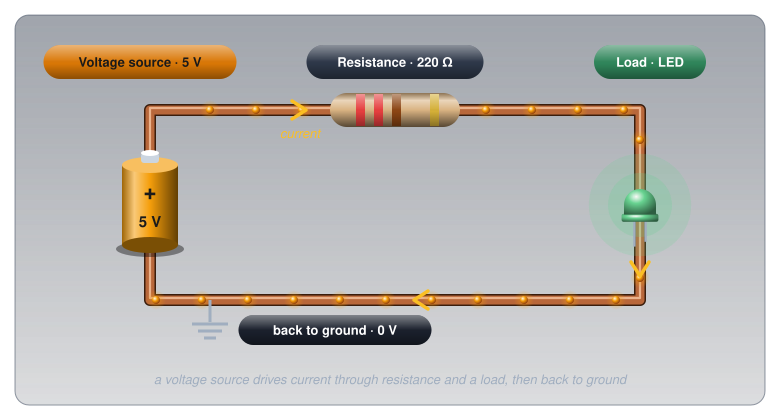

# What Is Electricity?

!!! abstract "Beginner"
    The big picture of **Circuit Foundations** on one page. No prior knowledge required. Each section is a short summary that links to a full article when you want the whole story.

Pick up any USB charger and read the label. It says something like `5V ⎓ 2A`. Two numbers, and between them they describe almost everything electricity does: the **5V** is how hard the charger pushes, and the **2A** is how much charge it can deliver. Add the third idea, **resistance**, what stands in the way, and you have the whole foundation of electronics.

<figure markdown>
  { width="720" }
  <figcaption>Every circuit is a loop: a source pushes, resistance limits, the load does the work, and the current returns.</figcaption>
</figure>

---

## Voltage: The Force

The 5V on the charger is there whether anything is plugged in or not: it's the push waiting to drive charge around a circuit.

???+ info "Definition: Voltage"

    **Voltage** is the energy given to each unit of charge, measured between two points. One volt is one joule of energy per coulomb of charge. **Unit:** volts (V).

Voltage also goes by **potential difference**, by **electromotive force** (EMF) for the voltage a source produces, and, informally, by **electrical pressure**. Two ideas matter most. Voltage is *energy per charge*, so a 1.5 V cell gives each bit of charge the same push whether it's a tiny AAA or a big D cell. And voltage only exists *between two points*: every circuit picks a reference called ground (0 V) and measures everything else from it. A AA cell is 1.5 V, USB is 5 V, a car battery about 12.6 V, and a Canadian wall outlet 120 V.

**Go deeper:** [Voltage](voltage.md) explains why a bird on a power line is safe, what's inside a battery's voltage, and how to measure it.

---

## Current: What Actually Flows

Plug something into the charger and current flows. The 2A on the label is the *most* the charger can supply; a phone takes only what it needs, perhaps 1.5A when flat and a few hundred milliamps when nearly full.

???+ info "Definition: Current"

    **Current** is the rate at which charge flows past a point: one ampere is one coulomb per second. **Unit:** amperes (A), or milliamperes (mA) for small currents. An LED typically draws about 20 mA.

Current is never used up: the same current flows all the way around a loop. What the components take from it is energy, which is the job voltage describes.

**Go deeper:** [Current](current.md) shows why two meters on either side of an LED read the same, which way current really flows, and why current is what hurts.

---

## Resistance: What Limits the Flow

So what decides how much current actually flows? The resistance of whatever is connected.

???+ info "Definition: Resistance"

    **Resistance** is how strongly something opposes current. One ohm lets one volt push one amp. **Unit:** ohms (Ω).

Resistance comes from electrons colliding with the atoms in a material, and it depends on the material, its length, its thickness, and its temperature. A copper wire is close to 0 Ω, hobby resistors run from about 100 Ω to 10 kΩ, and an open circuit (a break in the path) is effectively infinite. The flip side, **conductance**, measures how easily current flows instead.

**Go deeper:** [Conductors, Insulators, and Semiconductors](conductors_and_insulators.md) explains why copper conducts at all, and [Resistance and Conductance](resistance.md) covers wire gauges, tolerance, and why a long extension cord gets warm.

---

## Ohm's Law: How They Connect

Voltage, current, and resistance are locked together by one equation, written with **V** for voltage, **I** for current (from the French *intensité du courant*), and **R** for resistance:

\[ V = I \times R \]

Know any two and the third follows. A 9 V battery across a 470 Ω resistor drives 9 ÷ 470 ≈ 19 mA. It also explains the charger label: the 2A is a ceiling, and the device's own resistance decides how much of it actually flows.

**Go deeper:** [Ohm's Law and Power](ohms_law.md) works through all three forms, sizes an LED resistor properly, and shows where the law stops holding (a cold light bulb reads 10 Ω on a meter but 144 Ω when lit).

---

## Power: The Rate of Energy Delivery

Voltage, current, and resistance describe the state of a circuit. Power describes what it's *doing*: how fast it turns electrical energy into heat, light, or motion.

???+ info "Definition: Power"

    **Power** is the rate of energy delivery: one watt is one joule per second. For any part, \( P = V \times I \). **Unit:** watts (W).

The charger: 5 V × 2 A = **10 W**, which is what "10 W charger" means on the box. Energy that isn't doing useful work becomes heat, which is why every component carries a power rating, and why exceeding it burns parts.

**Go deeper:** [Ohm's Law and Power](ohms_law.md#idea-two-power) covers power ratings, why power lines run at 735,000 V, and the kilowatt-hour.

---

## Safety: Where the Numbers Matter

The same three quantities explain how electricity injures people. Voltage pushes, but current is what does the damage, and how much current a given voltage can push through someone depends on the resistance of their skin.

!!! danger "Mains Voltage Is Lethal"
    A Canadian wall outlet supplies 120 V AC, and some appliances use 240 V. The US National Institute for Occupational Safety and Health (NIOSH) notes that 20 mA through the body can be fatal. Circuit breakers protect the wiring, not people: they don't trip until far more current flows than it takes to stop a heart. Never connect mains voltage to a breadboard; use batteries or USB for all prototyping.

Body resistance is the key variable. NIOSH puts dry skin around 100,000 Ω and wet skin as low as 1,000 Ω. Run both through Ohm's Law at 120 V:

\[ I_{\text{dry}} = \frac{120\text{ V}}{100{,}000\ \Omega} = 1.2\text{ mA} \quad \text{(barely perceptible)} \]

\[ I_{\text{wet}} = \frac{120\text{ V}}{1{,}000\ \Omega} = 120\text{ mA} \quad \text{(above the 100 mA threshold for heart fibrillation)} \]

Same wire, same voltage, a hundred times the current. The path matters too: current across the chest is what stops a heart, which is why electricians keep one hand away from live work. The 3.3 V, 5 V, and 9 V used throughout this site can't push a dangerous current through skin; the habits that matter are checking wiring before powering up, and leaving mains strictly alone. [Current](current.md#safety-current-is-what-hurts) lists the full set of NIOSH thresholds.

---

## Practice

??? question "1. Reading a Charger Label"

    A laptop charger is labelled `Output: 20V ⎓ 3.25A`. What's the most power it can deliver, and what does each number mean?

    ??? tip "Solution"
        \[ P = V \times I = 20\text{ V} \times 3.25\text{ A} = 65\text{ W} \]

        The 20 V is the push the charger supplies; the 3.25 A is the most current it can deliver. The laptop draws what it needs up to that limit, and together they give the "65 W" printed on the box.

??? question "2. Why Do Lithium Batteries Catch Fire When Shorted?"

    A lithium cell (the kind in a phone or power bank) is 3.7 V. Shorted through a wire of 0.05 Ω, roughly how much current flows? Why is that so much more dangerous than shorting an alkaline AA cell?

    ??? tip "Solution"
        Ignoring the cell's own internal resistance, which in a lithium cell is very small:

        \[ I = \frac{V}{R} = \frac{3.7\text{ V}}{0.05\ \Omega} = 74\text{ A} \]

        An alkaline AA's own internal resistance (150 to 300 mΩ, from Energizer's datasheet) limits its short to roughly 5 to 10 A ([Open Circuits, Short Circuits, and Fuses](open_short_fuses.md#what-a-short-circuit-really-is)). A lithium cell can deliver many times that, and all of that energy becomes heat inside the cell in seconds, enough to start the reaction that makes lithium cells vent flame. That's why shorted or punctured lithium batteries catch fire, and why [Cells and Batteries](batteries.md#safety-lithium-ion-needs-respect) treats them with extra care.

Each of the full articles linked above ends with its own set of practice problems.

---

## Quick Recap

-   **V: Voltage**

    ---

    The push: energy per coulomb, in **volts**. Always measured between two points.

-   **I: Current**

    ---

    The flow: coulombs per second, in **amperes**. Never used up around a loop.

-   **R: Resistance**

    ---

    What limits the flow, in **ohms**. Set by material, length, thickness, and temperature.

-   **P: Power**

    ---

    The rate of energy delivery, in **watts**. \( P = V \times I \), and \( V = I \times R \) ties the rest together.

---

## What's Next

The deep dives start with the units themselves: **[Metric Prefixes and Units](metric_prefixes.md)** makes milliamps, kilohms, and megahertz second nature, then [Voltage](voltage.md) begins the full Circuit Foundations path.

---

## Further Reading

**The Full Articles**

- [Conductors, Insulators, and Semiconductors](conductors_and_insulators.md) — why some materials conduct and others don't
- [Voltage](voltage.md), [Current](current.md), and [Resistance and Conductance](resistance.md) — each idea from this page in depth
- [Ohm's Law and Power](ohms_law.md) — the equation that ties them together, and the heat that follows
- [Open Circuits, Short Circuits, and Fuses](open_short_fuses.md) — what happens when a circuit goes wrong

**Fundamentals Elsewhere**

- [Voltage, Current, Resistance, and Ohm's Law — SparkFun](https://learn.sparkfun.com/tutorials/voltage-current-resistance-and-ohms-law) — the same ground from a different angle
- [Ohm's Law — The Physics Classroom](https://www.physicsclassroom.com/class/circuits/Lesson-3/Ohm-s-Law) — worked examples on V = IR

**Safety**

- [Worker Deaths by Electrocution (NIOSH Publication 98-131)](https://stacks.cdc.gov/view/cdc/6385/cdc_6385_DS1.pdf) — the body resistance and current thresholds used on this page
